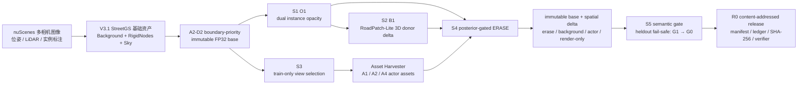
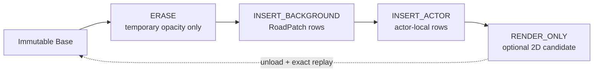

<div align="center">

# Motion-Proj

### Evidence-Calibrated Temporal Delta Assets for Editable Driving World Simulation

**从多相机驾驶日志到对象感知、道路可修复、编辑可回滚且可逐文件复验的神经场景资产**

[](docs/RESEARCH_STATUS.md)


[](docs/WS_V33_R0_INTEGRATION.md)

[方法总览](#方法总览) · [实验结果](#实验结果) · [完整链路](#完整链路) · [快速开始](#快速开始) · [复现与证据](#复现与证据) · [研究边界](#研究边界)

</div>

---

Motion-Proj 是一个面向驾驶世界模型的研究代码库。当前主线 **WorldSim V4 / EviDelta-GS** 正在把已冻结的
V3.3 单场景可维护资产升级为 30-scene nuScenes、冻结 KITTI cross-domain、scene-level 统计的 paper-first 系统。
V4 保持 V3.3/StreetGS base immutable，将对象归属、几何支持、来源真实性、不确定性和时序记忆统一成 evidence
state，再由 Bayes risk repair router 与连续时间可逆 delta 完成编辑。

当前 P0 已冻结方法/数据/baseline/指标/test-freeze 合同，D0 已从 850 个官方候选中结果前冻结 30-scene nuScenes
cohort，并完成两 scene preprocess smoke；D1 adapter 合同已实现，但真实 KITTI 公共路径缺失，保持外部 blocked。
尚未启动新方法训练。计划与证据见
[`WORLDSIM_V4_EVIDELTA_GS_PLAN.md`](docs/WORLDSIM_V4_EVIDELTA_GS_PLAN.md)、
[`WS_V4_P0_SCOPE.md`](docs/WS_V4_P0_SCOPE.md) 和
[`WS_V4_D0_NUSCENES_COHORT.md`](docs/WS_V4_D0_NUSCENES_COHORT.md)、
[`KITTI_LAYOUT_AUDIT.md`](docs/KITTI_LAYOUT_AUDIT.md)。

V4 的只读起点 **WorldSim V3.3** 建立在 DriveStudio/StreetGS 3D Gaussian Splatting 基线之上，将对象语义、
道路几何修复、生成式 actor 资产与可逆编辑组织为一条可审计的神经资产链：

```text
D2 immutable 3DGS base
  → O1 dual instance opacity
  → B1 RoadPatch-Lite
  → high-support A4 auto-4view actor
  → posterior-gated spatial delta
  → S5 G0 raw-3D fail-safe
  → content-addressed exact release
```

与“直接修改并另存一份 checkpoint”的编辑方式不同，Motion-Proj 保持基础资产不可变，把擦除、背景插入、actor
插入和渲染后处理记录为带来源信息的 spatial delta；每个 overlay 都能独立启用、卸载和逐哈希回滚。

> [!NOTE]
> 仓库名称保留了早期 *Dynamics Projection Distillation* 研究线；当前生产研究主线自 WorldSim V3.1 起转向
> 可编辑驾驶 3DGS。早期 auditor/projector/distillation 组件仍保留在仓库中，当前执行授权以
> [`docs/RESEARCH_STATUS.md`](docs/RESEARCH_STATUS.md) 为准。

## V4 当前路线

```text
V3.3 immutable base
  → Evidence-Calibrated Gaussian Field
  → Evidence-Prioritized Delta Compiler
  → SE(3) B-Spline Temporal Delta
  → nuScenes 6 dev + 6 val + 18 test
  → frozen KITTI cross-domain confirmation
  → image + temporal + geometry + engineering + scene statistics
```

P0 的关键事实：起始 HEAD=`2108430`；V3.3 `e6663e1` 已在 `main` 历史中；单卡资源门通过；
`/root/autodl-pub/KITTI` 当前缺失并记录为 `blocked_local_dataset_missing`，项目不会自动下载替代。

## 核心亮点

- **对象感知 3DGS**：在不修改 RGB opacity 和基础 checkpoint 的前提下学习双路 instance opacity；heldout
  boundary F1 从 `0.068960` 提升到 `0.336158`，IoU 从 `0.063253` 提升到 `0.330727`。
- **3D-native 道路修复**：RoadPatch-Lite 只从原生静态 Background Gaussian 中检索可见、低残差 donor，生成
  `104` 行确定性 delta；静态 LiDAR MAE 从 `0.895636 m` 降至 `0.890384 m`。
- **自动多视角 actor 资产**：训练帧内自动选择 1/2/4-view 输入，冻结选择的 A4 在 heldout 上取得
  `+0.023490` IoU 和 `+0.059889` boundary F1；不合格的 boundary actor 自动 `ABSTAIN`。
- **可维护 spatial delta**：`base → ERASE → INSERT_BACKGROUND → INSERT_ACTOR → RENDER_ONLY`，不删除 base
  Gaussian，不复制完整 checkpoint；5 个视角 × 4 个 overlay stack 实现 `20/20` 卸载后渲染 SHA exact。
- **语义安全回退**：semantic-gated G1 在 development 上改善，但因一个 heldout 视角越过 contact gate 被拒绝；
  production 自动回退到 G0 raw 3D，删除结果 `5/5` semantic mass/fraction delta 为 `0/0`。
- **内容寻址交付**：最终 release 含 `76` 个文件、`18,432,994` payload bytes、`39` 份 JSON evidence，完整
  checkpoint copy=`0`；目录和 archive 均可由 standalone verifier 离线复验。

## 方法总览



### 1. 对象场：dual instance opacity

S1 从冻结的 SAM2.1 mask、3D Rigid core 与 identity 三元组出发，为 `1,309,868` 个 Gaussian 建立独立的
instance field。优化只更新共享 instance logit，不让 base means、scales、quaternions、SH、RGB opacity 进入
optimizer。最终 O1 field 为 `5,882,296` bytes，并以固定 ZIP entry 顺序、timestamp、权限和压缩参数写出。

### 2. 道路修复：RoadPatch-Lite

S2 在 `1,205,164` 个原生 Background rows 中筛出 `702,506` 个 eligible rows，构建 `15,591` 个
1/2/4 m patches，其中 `822` 个通过 geometry、visibility 与 separation 门禁。修复只持久化真实 3D donor 的行级
delta；generated donor=`0`，基础 checkpoint 在候选挂载、渲染和卸载前后保持 SHA exact。

### 3. Actor 资产：自动 1/2/4-view 选择

S3 的 selector 只读取 train frames，并排除 `19` 个 heldout 与 `10` 个 reserved development frames。候选分数由
area、mask、sharpness、D2 visibility、occlusion、truncation、yaw、time 和 camera coverage 共同决定。高支持 actor
选择 A4 auto-4view，导入后为 `99,241` 个 Gaussian；boundary actor 因 retention gate 失败而不覆盖原生资产。

### 4. 编辑状态：immutable base + spatial delta



S4 的 authoring state 不复制或删除基础行。ERASE 仅创建临时 opacity parameter，并由 S1 instance posterior 的
MAP 边界决定 Background 擦除集合；Background/actor insert 逐行保留来源、父 delta、point ID 与 rigid index。

### 5. 渲染安全与内容寻址发布

S5 只允许 2D residual 作用于 actor boundary、ground contact 和 shadow/seam support，far weight=`0`，residual
cap=`12/255`。若任一 heldout 视角越过冻结门，production 使用 raw 3D render。R0 再对所有 canonical input 的
path、bytes、SHA-256、schema、terminal 和 decision 做 fail-closed 验证，输出 deterministic archive 与独立 verifier。

## 实验结果

所有下表均来自冻结的 canonical run。`↑/↓` 表示更优方向；“通过”表示满足预注册门禁，不等于在每个指标上全面支配。

### V3.3 主结果

| 阶段 | 对比 | 关键提升 | 代价或限制 | 裁决 |
|---|---|---|---|---|
| S1 Object Field | O0 → O1 | boundary F1 `+387.47%`；IoU `+422.87%`；NBD `-27.37%`；FP mass `-30.77%` | FN mass `0.061278 → 0.109356` | `O1 selected`，限定为 boundary/precision breakthrough |
| S2 Road Repair | B0 → B1 | static PSNR `+0.002865 dB`；static LiDAR MAE `-0.005252 m` | heldout PSNR `-0.084031 dB`；LPIPS `+0.001861` | 全部冻结门通过，`B1 selected` |
| S3 Actor Asset | A0 → A4 heldout | IoU `+0.023490`；boundary F1 `+0.059889` | PSNR `-0.015760 dB`；LPIPS `+0.008527` | high-support 通过；boundary `ABSTAIN` |
| S4 Spatial Delta | all-hard → posterior-gated | outside L1 `0.821965 → 0.225349`；erase coverage=`0.999741` | 只覆盖冻结 high-support edit | posterior-gated 通过，`20/20` rollback exact |
| S5 Semantic Render | G1 → G0 fallback | production delete `5/5` semantic delta=`0/0` | G1 在 heldout contact 上 `+0.422686 > +0.25` | `G1 rejected`，production=`G0_raw_3d` |
| R0 Integration | selected chain | 4/4 success criteria；76-file release；directory/archive verifier passed | scene-0230 + 冻结视角 + 单 RTX 3090 | overall=`v33_supported` |

### S1：对象边界与语义质量（heldout）

| Metric | O0 Base | O1 Dual Opacity | 变化 |
|---|---:|---:|---:|
| Boundary F1 ↑ | 0.068960 | **0.336158** | **+387.47%** |
| IoU ↑ | 0.063253 | **0.330727** | **+422.87%** |
| Normalized Boundary Distance ↓ | 0.144958 | **0.105280** | **-27.37%** |
| False-positive Semantic Mass ↓ | 0.900308 | **0.623276** | **-30.77%** |
| False-negative Semantic Mass ↓ | **0.061278** | 0.109356 | 退化，正式保留为负结果 |

### S2：RoadPatch-Lite（heldout）

| Metric | B0 Base | B1 RoadPatch | Δ | Frozen Gate |
|---|---:|---:|---:|---:|
| PSNR ↑ | 28.157155 | 28.073124 | -0.084031 dB | ≥ -0.10 dB |
| SSIM ↑ | 0.871450 | 0.870542 | -0.000908 | ≥ -0.005 |
| LPIPS ↓ | 0.149666 | 0.151527 | +0.001861 | ≤ +0.01 |
| Static PSNR ↑ | — | — | **+0.002865 dB** | pass |
| Static LiDAR MAE ↓ | 0.895636 m | **0.890384 m** | **-0.005252 m** | pass |

RoadPatch-Lite 与 V3.2 Telea 使用不同 base、空间语义和评测协议，因此二者结论是
`not_directly_ranked`；B1 相对 B0 的结果不能写成与 Telea 的 head-to-head 胜出。

### S3：自动多视角 actor（high-support heldout）

| Metric | A0 Native | A4 Auto-4view | Δ |
|---|---:|---:|---:|
| IoU ↑ | 0.704974 | **0.728464** | **+0.023490** |
| Boundary F1 ↑ | 0.505017 | **0.564906** | **+0.059889** |
| PSNR ↑ | **17.025697 dB** | 17.009936 dB | -0.015761 dB |
| LPIPS ↓ | **0.094170** | 0.102697 | +0.008527 |

更多视图不自动意味着更好：boundary actor 的 A4 相对 native 将 IoU/F1 从
`0.666562/0.555343` 降至 `0.624832/0.492141`，因此生产决策为
`ABSTAIN_GENERATED_OVERRIDE`，且没有读取 boundary heldout 来重新选臂。

### V3.1/V3.2 关键历史结果

| 里程碑 | 结果 | 正式边界 |
|---|---|---|
| V3.1 A0 三场景 StreetGS | scene-0230/0242/0255 global PSNR=`24.934/29.107/25.230 dB` | 三场景描述性基线，不是大规模 benchmark |
| V3.1 A2 D2 boundary-priority | boundary-band PSNR `25.770024 → 26.171399`，SSIM `.821572 → .828868`，LPIPS `.048382 → .044568` | global 指标轻微退化；D1/D2=`tradeoff_non_dominated` |
| V3.2 S1 Semantic Lift | `398` masks，`334` accepted，heldout leak=`0` | identity 三元组必须 exact；旧 identity-invalid r5 已作废 |
| V3.2 S2 Background Inpaint | `1,896` generated rows；四路 heldout PSNR/SSIM/LPIPS Δ=`-0.022958/-0.000528/+0.000301` | unseen RGB 不等于 geometry/GT |
| V3.2 S3 Actor Harvest | 2-view actor IoU/PSNR/LPIPS=`0.733945/16.671399/0.094894` | 生成背面只声明 completeness/consistency |
| V3.2 R0 Storage | mixed checkpoint 减少 `146,922,064` bytes（`25.363333%`）；三视角 source→mixed PSNR=`67.24–68.43 dB` | 证明存储等价，不代表 render/FPS/VRAM 加速 |

## 完整链路

### 当前 WorldSim V3.3

| Stage | 输入 | 核心操作 | 主要输出 | Canonical Evidence |
|---|---|---|---|---|
| P0 Source Audit | V3.2 frozen assets + 10 third-party sources | source/license/weight/hardware 审计 | exact source ledger | [`WS_V33_P0_SOTA_AUDIT.md`](docs/WS_V33_P0_SOTA_AUDIT.md) |
| S1 Object-Aware GS | D2 base + SAM2.1 masks + actor identity | O0/O1/O3 development；冻结 O1 formal | deterministic instance field | [`WS_V33_S1_OBJECT_AWARE_GS.md`](docs/WS_V33_S1_OBJECT_AWARE_GS.md) |
| S2 RoadPatch | D2 native Background + S1 delete support | 1/2/4 m 3D donor index + bounded delta | 104-row RoadPatch delta | [`WS_V33_S2_ROADPATCH_INPAINT.md`](docs/WS_V33_S2_ROADPATCH_INPAINT.md) |
| S3 View Selection | train-only actor observations + D2 renders | A1/A2/A4 auto selection + Asset Harvester | 99,241-row A4 actor asset | [`WS_V33_S3_ASSET_VIEW_SELECTION.md`](docs/WS_V33_S3_ASSET_VIEW_SELECTION.md) |
| S4 Spatial Delta | O1 + B1 + A4 + immutable base | posterior-gated erase/insert/rollback | 4,007,120-byte delta package | [`WS_V33_S4_SPATIAL_DELTA.md`](docs/WS_V33_S4_SPATIAL_DELTA.md) |
| S5 Semantic Render | five frozen views + Harmonizer + SAM2 | development selection → heldout confirmation | G0 production + G1 negative result | [`WS_V33_S5_SEMANTIC_RENDER.md`](docs/WS_V33_S5_SEMANTIC_RENDER.md) |
| R0 Integration | 44 canonical inputs | schema/hash/decision validation + deterministic archive | 76-file exact release | [`WS_V33_R0_INTEGRATION.md`](docs/WS_V33_R0_INTEGRATION.md) |

### 研究演进

| 路线 | 研究问题 | 最终状态 |
|---|---|---|
| V1 Dynamic Reconstruction | 动态驾驶场景重建与基础资产准备 | 历史冻结 |
| V2 Dynamic Editing Diagnostics | actor 真值、投影、局部指标与三场景压力协议 | M0–M4 done；M5 部分证据冻结 |
| V3/V3.1 WorldSim | StreetGS 基线、校准消融、actor-aware densification、局部精修、存储/分块 | `none_plan_complete` |
| V3.2 Semantic Repair | SAM2 semantic lift、3D background completion、actor harvest、harmonizer | `none_plan_complete` |
| **V3.3 Object Maintenance** | dual opacity、RoadPatch、auto-view actor、spatial delta、semantic fail-safe | **`v33_supported`** |

## 代码结构

| 路径 | 作用 |
|---|---|
| [`motion_proj/worldsim_v33/`](motion_proj/worldsim_v33/) | instance field/render、RoadPatch、view selection、spatial delta、semantic gate、integration release |
| [`motion_proj/worldsim_v3/`](motion_proj/worldsim_v3/) | calibration、LiDAR provenance、Gaussian ancestry、actor quota/boundary residual、precision/chunk package |
| [`motion_proj/resim/`](motion_proj/resim/) | WorldState、actor registry、typed render、轨迹与场景编辑 |
| [`motion_proj/dynamic_editing_v2/`](motion_proj/dynamic_editing_v2/) | actor identity、2D/3D projection 与局部/压力评测设施 |
| [`motion_proj/auditor/`](motion_proj/auditor/) | optical flow、ego-flow、depth、3D box/track motion state |
| [`motion_proj/projector/`](motion_proj/projector/) | dynamics energy、support mask、smoothing、warping/projection |
| [`motion_proj/cache/`](motion_proj/cache/) | projection cache writer/reader 与构建 CLI |
| [`motion_proj/train/`](motion_proj/train/) | LoRA/SVD projection-distillation 训练链 |
| [`configs/worldsim_v33/`](configs/worldsim_v33/) | V3.3 冻结协议和 fail-closed gate |
| [`scripts/`](scripts/) | 审计、构建、运行、finalize 与集成入口 |
| [`tests/`](tests/) | 单测、schema/contract 测试与研究回归 |
| [`docs/`](docs/) | 状态、计划、实验台账、失败账本与阶段报告 |

## 快速开始

### 1. 克隆仓库

```bash
git clone https://github.com/yunlongdeng123/Motion-Proj.git
cd Motion-Proj
```

### 2. 激活研究环境

当前 canonical 环境位于 AutoDL 数据盘；不要执行 `conda init`：

```bash
source /root/miniconda3/etc/profile.d/conda.sh
conda activate /root/autodl-tmp/envs/motionproj
python -m pip install -e . --no-deps
```

`requirements.lock.txt` 含当前机器的 CUDA wheel 和本地 file URL，是环境指纹，不是跨机器通用安装清单。新机器请先读
[`docs/ENVIRONMENT.md`](docs/ENVIRONMENT.md)、[`docs/THIRD_PARTY.md`](docs/THIRD_PARTY.md) 与
[`docs/MACHINE_MIGRATION.md`](docs/MACHINE_MIGRATION.md)，再按 GPU/CUDA 组合恢复依赖和第三方资产。

### 3. 运行核心回归

```bash
PYTHONPATH=. pytest -q \
  tests/test_worldsim_v33_*.py \
  tests/test_worldsim_v32_*.py
```

完整测试：

```bash
PYTHONPATH=. pytest -q
```

### 4. 查看冻结协议与入口

| Stage | Config | Entrypoint |
|---|---|---|
| P0 | [`p0_sources_v1.yaml`](configs/worldsim_v33/p0_sources_v1.yaml) | [`audit_worldsim_v33_sources.py`](scripts/audit_worldsim_v33_sources.py) |
| S1 | [`s1_instance_field_v1.yaml`](configs/worldsim_v33/s1_instance_field_v1.yaml) | [`run_worldsim_v33_s1.sh`](scripts/run_worldsim_v33_s1.sh) |
| S2 | [`s2_roadpatch_v1.yaml`](configs/worldsim_v33/s2_roadpatch_v1.yaml) | [`run_worldsim_v33_s2_roadpatch.py`](scripts/run_worldsim_v33_s2_roadpatch.py) |
| S3 | [`s3_viewselect_v1.yaml`](configs/worldsim_v33/s3_viewselect_v1.yaml) | [`prepare_worldsim_v33_s3_view_selection.py`](scripts/prepare_worldsim_v33_s3_view_selection.py) |
| S4 | [`s4_spatial_delta_v1.yaml`](configs/worldsim_v33/s4_spatial_delta_v1.yaml) | [`run_worldsim_v33_s4.sh`](scripts/run_worldsim_v33_s4.sh) |
| S5 | [`s5_semantic_gate_v1.yaml`](configs/worldsim_v33/s5_semantic_gate_v1.yaml) | [`run_worldsim_v33_s5.sh`](scripts/run_worldsim_v33_s5.sh) |
| R0 | [`r0_integration_v1.yaml`](configs/worldsim_v33/r0_integration_v1.yaml) | [`run_worldsim_v33_r0_integration.py`](scripts/run_worldsim_v33_r0_integration.py) |

> [!IMPORTANT]
> Formal run 依赖不纳入 Git 的 nuScenes、checkpoint、第三方权重和 canonical manifest。不要复用已有 run 目录，也不要
> 从 README 直接启动新实验；先检查 [`docs/RESEARCH_STATUS.md`](docs/RESEARCH_STATUS.md) 的当前授权，并为每次运行
> 使用新的、不可复用的确定性 run ID。

## 复现与证据

Motion-Proj 将“代码能运行”和“研究结论成立”分开管理：

1. **协议冻结**：每个 stage 的 config 固定 split、seed、阈值、heldout 读取时机和资源上限。
2. **不可复用 run**：失败、阻塞和拒绝的 terminal 不覆盖；修复后创建新 run。
3. **输入不可变**：checkpoint、registry、mask、source snapshot 和第三方 commit 均记录 bytes/SHA-256。
4. **Fail-closed schema**：类型、枚举、shape、identity 和 manifest 不匹配时立即停止，不做静默兼容。
5. **确定性资产**：NPZ/ZIP/archive 固定顺序、timestamp、权限和压缩参数，支持跨 run byte-exact。
6. **结论边界**：正结果、trade-off、研究拒绝、工程阻塞与未评测项分别登记。

权威事实源：

- [Research Status](docs/RESEARCH_STATUS.md)：当前终态与唯一执行授权入口；
- [Experiments](docs/EXPERIMENTS.md)：canonical run、指标、资源和 SHA 台账；
- [Research Failures](docs/RESEARCH_FAILURES.md)：负结果、防重复结论与合法复开条件；
- [V3.3 Plan](docs/DYNAMIC_DRIVING_WORLDSIM_MODEL_PLAN_V3_3.md)：任务注册表和预注册门禁；
- [Artifact Retention](docs/ARTIFACT_RETENTION.md)：大型资产、release 和清理边界；
- [Third Party](docs/THIRD_PARTY.md)：上游 source、commit、license、权重与运行状态。

## 研究边界

当前 `v33_supported` 结论严格限定为 **scene-0230 主链、冻结确认视角和单张 RTX 3090**：

- 不证明 scene-0242/0255 的完整 V3.3 transfer，也不构成跨数据集泛化结论；
- generated actor 的未观测背面只声明 completeness/consistency，不是真值外观；
- RoadPatch-Lite 尚未与 V3.2 Telea 在 matched 协议下直接排名；
- S5 使用非相邻五视图，temporal consistency 未评测；
- deterministic replay、回滚和内容寻址不等于闭环安全、传感器真实性或实时系统性能；
- SAM3.1、Inpaint360GS、R3D2 和 LiDAR-EVS 的权重/硬件/官方运行合同阻塞，不是方法质量失败；
- 当前没有新的执行授权；LiDAR-EVS 只保留为 conditional future audit。

## 当前状态

| Item | Status |
|---|---|
| WorldSim V4 P0 / D0 | `done / done` |
| nuScenes cohort | `6 development + 6 validation + 18 frozen test` |
| D0 canonical cohort SHA | `eda9f684...44578` |
| KITTI D1 | `blocked_local_dataset_missing`；禁止下载 |
| Next authorized task | `B0 matched baselines / unified evaluator` |
| V3.3 frozen baseline | `v33_supported`；canonical assets read-only |

## Citation 与许可

论文与正式 BibTeX 尚未发布。现阶段如在研究中使用本项目，请引用仓库 URL，并在论文公开后更新为正式引用。

本仓库当前未提供顶层统一许可证；第三方代码、模型和数据分别受各自许可约束。请在分发或商用前检查
[`docs/THIRD_PARTY.md`](docs/THIRD_PARTY.md) 以及各上游项目条款。

---

<div align="center">

**Motion-Proj · Auditable neural assets for editable driving worlds**

</div>
