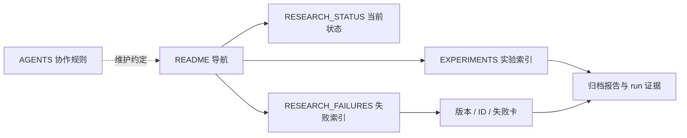

# 文档导航

| 内容 | 唯一入口 | 维护方式 |
|---|---|---|
| 当前阶段、阻塞与执行范围 | [RESEARCH_STATUS](RESEARCH_STATUS.md) | 替换当前快照 |
| task/run 与结果位置 | [EXPERIMENTS](EXPERIMENTS.md) | 每项实验一条索引 |
| 跨版本失败和证据边界 | [RESEARCH_FAILURES](RESEARCH_FAILURES.md) | ID 卡与生成目录 |
| 协作规则 | [AGENTS](../AGENTS.md) | 规则变化时更新 |
| 研究规划原则 | [Scaling law](../auto-research_scaling_law.md) | 遵循用户修订 |
| V7.4 报告、计划和旧状态 | [V7.4 归档](archive/2026-09/v74-0920/README.md) | 冻结历史 |
| 更早版本和资产恢复 | [归档总目录](archive/README.md) | 按需恢复 |
| 环境与迁移 | [环境](ENVIRONMENT.md)、[迁移](MACHINE_MIGRATION.md)、[第三方](THIRD_PARTY.md) | 按实际环境更新 |

同一段进展不再复制到多个文件。历史失败分片保留原文和行号；旧引用路径通过 [迁移表](archive/2026-09/v74-0920/PATH_MAP.json) 或既有归档入口定位。
