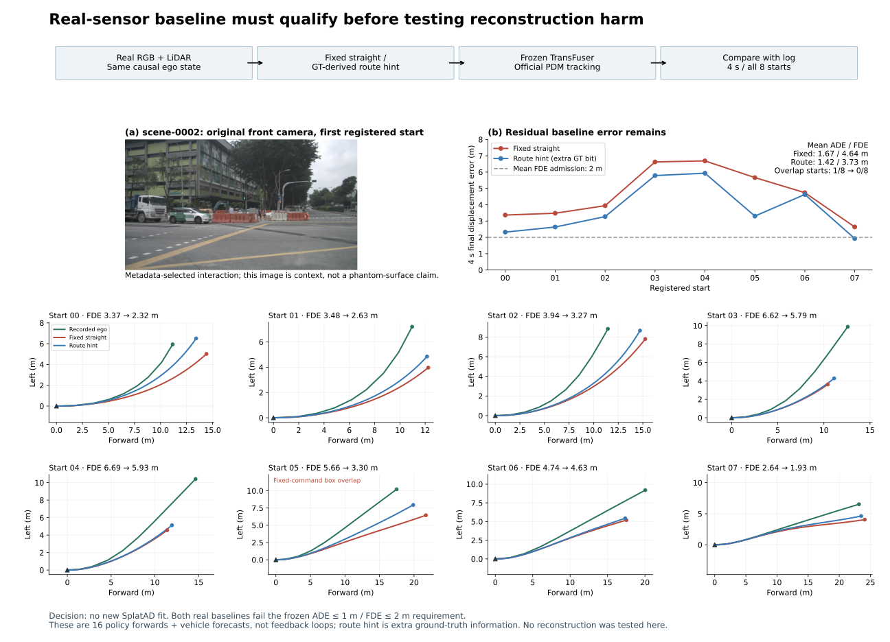
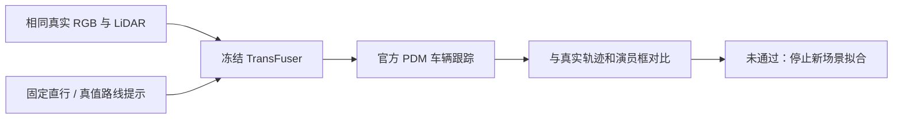

# 新来源真实驾驶基线：一次路线控制后仍未准入

**结论：不启动 scene-0002 的 SplatAD 拟合。** 真实传感器上的固定直行基线平均 ADE/FDE 为 1.667/4.642 米；加入一次冻结的路线提示后为 1.422/3.727 米，八起点框交叠从 1 次降为 0。两者均未通过实验前规定的平均 ADE≤1 米、FDE≤2 米、无交叠条件。这是规划基线的适配限制，不能当作重建坏例。

## 冻结范围与来源

task/run：`WS-SIM-FRESH-NATIVE-01 / 20260915-r1`。先在挂载数据 shard 的 scene-0001…0100 有限窗口中做元数据筛查，排除已曝光仿真/主图场景所在的整个日志；按场景和时间顺序选择，最多六个不同日志，不为凑数放宽标准。要求足够未来评价窗口、初始速度 2–15m/s、前方 4–30m 且侧向±6m 内的车辆/行人至少八个 LiDAR 点、九关键帧持续存在、记录车体间距0.8–5m，并出现可观测的相对横向变化或减速。

只有 scene-0002 满足条件，日志 `6b6513e6c8384cec88775cae30b78c0e`，初始索引3。目标车辆初始前向4.04m、侧向−5.89m、687个点，记录最小框间距3.15m。完整六相机和LiDAR的1770个原始文件已提取，缺失0。此处“新来源”仅表示此前本轮仿真/主图未评价；它在官方 nuScenes `train` 集中，**不是模型训练未见或封存确认集**。

八个评价起点对应原始索引3…10。策略只接当前真实传感器与由当前/过去两个相机记录计算的速度、加速度、角速度。PDM 初始转角使用相同车辆轴距的自行车关系，评价参考完整覆盖4秒；这些修正均发生在首次基线推理前。旧实验不重跑，缺少角速度字段的旧输入仍沿用零初值。

## 一次普通路线控制

作者提供的 NAVSIM/HUGSIM 客户端 `hugsim/dataparser.py` 固定设置 `command[1]=1`，忽略传入路线，而本日志持续左转。第一次失败结果落盘后，只增加一次预先固定的输入控制：沿记录的空间路线向前20m，以相对侧向偏移±2.5m决定左/直/右；八起点均得到左转。无备选阈值、无最佳指令搜索。

这条提示从记录真值路线导出，属于**额外路线信息**。未来速度、数值轨迹、演员框和传感器仍不进入策略；不能把该条件称为纯视觉同信息优势。输入传感器、权重、状态、预处理和车辆执行均保持配对。原始失败准入文件完整保留，另写路线控制结果。

| 起点 | 固定 ADE(m) | 路线 ADE(m) | 固定 FDE(m) | 路线 FDE(m) | 交叠 |
|---|---:|---:|---:|---:|---:|
| 00 | 1.375 | 1.139 | 3.368 | 2.323 | 0 → 0 |
| 01 | 0.990 | 0.782 | 3.480 | 2.635 | 0 → 0 |
| 02 | 1.893 | 1.734 | 3.943 | 3.274 | 0 → 0 |
| 03 | 2.080 | 1.855 | 6.622 | 5.788 | 0 → 0 |
| 04 | 2.464 | 2.228 | 6.686 | 5.931 | 0 → 0 |
| 05 | 2.044 | 1.387 | 5.663 | 3.304 | 1 → 0 |
| 06 | 1.578 | 1.547 | 4.739 | 4.630 | 0 → 0 |
| 07 | 0.915 | 0.701 | 2.638 | 1.928 | 0 → 0 |
| 平均 / 次数 | 1.667 | 1.422 | 4.642 | 3.727 | 1/8 → 0/8 |

两次条件下，记录自车用相同车辆参数重放均无框交叠。这里的交叠只是演员框几何诊断，未计算地图合法性、事故责任或完整 PDM 分数。16次策略前向及16次4秒车辆预测不是传感器反馈闭环；没有新几何推理或重建干预。

## 下一条接口与停止规则

停止本来源的 TransFuser 指令/阈值试探与昂贵场景拟合。BridgeSim 的代码核查发现其 `pdm_closed_adapter.py` 自称 PDM-lite、使用特权状态和自定义规则；runtime ray LiDAR 入口是二维射线，另有可选 PointCloudLidar，尚未验证其重建资产读出。不能将其直接当作原版 PDM-Closed 与物理3D首交的实测。[作者代码](https://github.com/VAIL-UCLA/BridgeSim)

下一步只准备一个原生 nuScenes 规划器：官方 SparseDrive-S stage2，代码版本 `ec0225d4b7a2dd7e6ce10179a2b7660dcb74b2f1`，权重由作者 release 下载；SparseDriveV2 公开主线为 NAVSIM，本轮不并铺。六相机输入、标定、时序记忆、原生三秒路线提示和评价已冻结；两帧预热＋八个原评价起点，未运行模型。该原生路线提示仍来自真值，训练集重叠保持明示。CAN 采用因果消息；源码审查显示官方推理用自身预测状态，CAN字段主要为训练目标，不能宣称它在推理中起效。[SparseDrive 官方发布](https://github.com/swc-17/SparseDrive)，[SparseDriveV2 官方范围](https://github.com/swc-17/SparseDriveV2)

SparseDrive 的三秒原生轨迹指标将独立报告，不能与这里四秒 PDM 误差混排。先检验真实图像基线与输入契约，才决定重建传感器评价是否有意义。当前没有可晋级主论文的新增严重几何因果坏例；已有Ω局部定位恢复与普通删除同效的结论不变。

## 证据与执行

完整数字见 `FRESH_BASELINE_EVIDENCE.json`；远端 `/root/autodl-tmp/runs/worldsim_simimpact/WS-SIM-FRESH-NATIVE-01/20260915-r1` 保存两次注册、全16轨迹、输入、参考及准入结果。`docs/autoresearch/worldsim_simimpact/milestone9/evidence` 归档轻量证据；图以PNG/PDF/SVG三格式输出。

本轮新增16次策略/PDM配对，累计818；CenterPoint累计222、几何前向72、HUGSIM18＋SplatAD4次反馈闭环不变；新场景拟合0。单RTX3090，代码/权重准备正在继续，SparseDrive前向未计数。绘图已检查，所有八起点与摘要逐项对应。整体goal active；人工verdict=null；failure_ledger_delta=`V74-H2-F22`。
