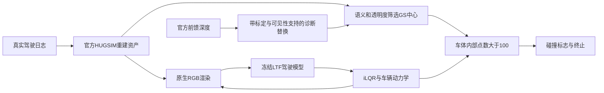

> 更新（2026-09-15）：后续195组LiDAR策略与官方车辆执行、深度通道更正见 [LiDAR影响实测](WORLDSIM_SIMULATION_LIDAR_IMPACT.md)。下面保留第一轮闭环记录；其中depth的旧“期望深度”泛称应以新报告的通道校准为准。

# 重建几何是否实质影响端到端仿真：第一轮实际结果

2026-09-15；task `WS-SIM-IMPACT-01`；run `20260915-r1`；研究继续，尚未确认自然前馈重建缺陷的仿真危害。人工 verdict=null。已运行18次HUGSIM/LTF闭环、24次官方前馈重建、540个记录位姿碰撞回放和57组同位姿几何/采样对照。

目前最强的实际发现是**碰撞表示的采样密度可以改变闭环终止和路线完成率**。它是原生仿真物理接口的敏感性证据，还不能证明VGGT系列普遍生成有害假表面。V74-H2-F13反例保留：旧0.323m车门案例在四官方主模型上已修复，共享低位置回波没有被确认为实体车身phantom。

## 组件与实际通路

F00为PNG/PDF/SVG组件图；F01展示真实RGB上下文、终止位姿BEV和计数；F02展示固定控制器预算的闭环结果。

来源：[HUGSIM](https://github.com/hyzhou404/HUGSIM) `62c690d3`；[LTF客户端](https://github.com/hyzhou404/NAVSIM) `ca0ca7e4`；[公开场景](https://huggingface.co/datasets/XDimLab/HUGSIM)；[LTF seed0](https://huggingface.co/autonomousvision/navsim_baselines/tree/main/ltf)。WorldEngine源码`10f4f2e0`已审查，未运行，不计入实验方法数。

冻结场景：公开资产按名称排序且有easy配置的前三个nuScenes场景0013/0038/0041，选取早于驾驶结果。plan_list为空，本轮是静态场景，不代表交互benchmark。接入使用官方渲染、LTF严格加载、特征构造、iLQR和HUGSimEnv.step；策略放GPU，每场初始输入与官方CPU路径最大轨迹差均小于1e-3m。

## 首回波通路实测

LTF读取前方三路RGB与车辆状态，LiDAR以零数组占位，latent配置覆盖输入LiDAR特征；不读取observation.depth。三个真实RGB场景中，把LiDAR输入特征从零改为全1，预测轨迹最大差均为**0**。这是输入依赖控制：单独改变首回波/期望深度且不改变RGB或状态，不会直接改变该配置的策略。不能外推为所有带LiDAR的仿真系统无影响。

HUGSIM静态碰撞使用语义标签>1且不为10、opacity>0.8的GS中心，车体内部点数>100即碰撞；动态碰撞使用宽长和轨迹构成的2D框；路面高度来自记录相机轨迹的近邻平面。均不是LiDAR首交。WorldEngine当前MTGS返回空lidars，仅是第二实现的接口事实。

## 原生闭环与强控制

540个记录位姿（每场180）未触发背景碰撞。完整策略执行后，官方50ms控制器时限下三个场景分别在4.25/14.25/12.50秒背景碰撞终止，路线完成27.51%/35.41%/35.04%。终止体积内143/179/146个GS中心全部标为terrain，距名义地面约0–0.56m；附近存在真实LiDAR。没有证明是凭空生成的硬表面。RGB/LiDAR叠图采用发布全局变换，精确帧对应仍在审计，不报告厘米级物理真值。

完全相同终止位姿下，每隔2点保留1点，计数为86/95/82；每隔4点保留1点，为35/42/38，均不再触发>100条件。RGB与位姿固定、保留点坐标未移动；这揭示采样密度依赖，不判定哪个碰撞标签符合真实物理。

独立运行受iLQR **50ms墙钟停止**影响。初始RGB和轨迹完全相同，相同seed的后续位姿仍可能不同，不能直接拿完成率归因于重建。增加了同算法、同100次迭代上限和1e-6收敛阈值、仅取消墙钟停止的诊断控制，单列为不同实时预算。

| 场景 | 所有碰撞点 | 每2点之一 | 每4点之一 |
|---|---|---|---|
| 0013 | 6.75s碰撞，45.53% | 7.00s碰撞，47.12% | 15.75s完成，101.53% |
| 0038 | 12.00s碰撞，35.24% | 12.25s碰撞，35.41% | 13.00s偏离记录路线，36.15% |
| 0041 | 22.50s完成，100.55% | 22.50s完成，100.55% | 22.50s完成，100.55% |

共同有效前缀的位置最大差全部为**0m**。0013由碰撞终止改为完成，0038改为路线偏离；0041是无影响反例。官方路线完成值可略大于100%，保留原值。该采样控制不是自然重建badcase，也不证明false-safe；已落实的是几何表示→碰撞读出→闭环终止的因果链。

离线评估另按官方closed_loop.py的post-step记录约定重跑，`official_post_eval.json`对应官方约定。初版pre-step诊断结果保留但不当原始官方指标。0041在线碰撞而离线NC仍为1；其NC评价未来规划轨迹，不直接采用执行碰撞标志，不能解读为本次驾驶未碰撞。

## 四模型执行与无效阴性

VGGT、用户指定公开镜像的Ω原始512、DVGT-1、Pi3X，各完成三场景×6/12图，共24次严格加载官方前向。BUILD为首两关键帧；六图为首帧环视，十二图加入下一帧。后六关键帧为QUERY，前向不加载它们。前向仅RGB，尺度诊断另列；无训练，不重跑旧主图任务。

48组替换覆盖4模型×3场景×2输入规模×原生度量/基线尺度或BUILD LiDAR全局尺度。适配器保留原生GS点数、语义、透明度，仅把首帧六图内被原生可见性支持的中心沿射线移至预测深度；未观测中心保留。带已知标定、原生可见性/语义和可选LiDAR锚点，属于**碰撞通道诊断适配器**，不是官方端到端前馈系统或同信息排名。

同位姿回放没有改变首次碰撞时刻。但覆盖审计发现：三个终止碰撞区域进入替换支持的原生中心均为**0**。这个阴性不能说明模型几何无害，因为干预没有触达目标。发布轨迹与原始关键帧的最近位姿最大平移差约0.4–0.7m；时间对应、BA改动与标定需分开核对，暂不解释点级LiDAR距离。

## 下一步与执行边界

优先核对发布资产与真实日志的帧对应和标定，确认可靠表面；使用真实观测覆盖物理查询区域，避免未覆盖的替换测试。之后在固定控制器预算、固定采样和碰撞规则下，让自然前馈误差进入实际消费的RGB/碰撞通道，保留无影响和恢复结果。采样控制或原生驾驶失败均不足以确认前馈重建危害。

18次运行、24次前向、48组替换已保存，不为找正例重跑全部任务。第二个完整仿真系统、自然几何缺陷的可重复闭环危害及独立物理碰撞参考仍未完成。目标保持active，本记录不是研究收口。

资源：单RTX3090 24GiB；cgroup14核/90GiB；剩余磁盘约130GiB。独立hugsim-impact环境复用torch2.4.1+cu118、CUDA11.8、Open3D CPU0.19（官方清单0.18）；Kornia0.6.12满足trajdata最低要求并避开已有CUDA12 FlashAttention污染。官方专用GS和tiny-cuda-nn已编译。资产经公开hf-mirror获取，官方资源身份与实际URL分别记录。安装失败属工程记录。

证据根：`/root/autodl-tmp/runs/worldsim_simimpact/WS-SIM-IMPACT-01/20260915-r1`。关键证据：registration、native_collision_replay、ltf_input_dependency、native_collision_audit、paired_collision_geometry、paired_control_audit、geometry_swap_protocol及各rollout的trace/summary。代码和小型结果进仓库，大资产保留仓库外。旧封存集未读、旧H2训练未启，无关机或调度。

failure_ledger_refs=V74-H2-F13、V74-F06、V6-F52；failure_ledger_delta=V74-H2-F14；人工verdict=null。
