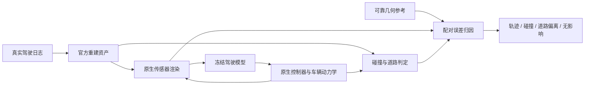

# 重建几何是否实质影响端到端仿真：执行记录

2026-09-15；task `WS-SIM-IMPACT-01`；run `20260915-r1`；状态：接通官方仿真运行环境，尚无闭环实验结论。人工 verdict=null。用户授权自主研究实际仿真后果，若首回波冲突没有实质影响，转查其他前馈重建的几何、物理 badcase。该目标不等同于再次完成局部射线分析。

前置证据：V74-H2-F13 已记录共享首回波冲突及其材料、参考归属、尺度和读出边界。旧 0.323m 车门案例在四官方主模型上已修复。上述现象不能直接外推为 false-safe 或闭环事故。当前研究保持这些反例，不恢复已关闭 H2 学习器。

选择与冻结：HUGSIM 官方公开场景档案中，按名称排列、同时有 easy 场景配置的前三个 nuScenes 场景：scene-0013、scene-0038、scene-0041。选取先于观察驾驶模型输出，不按重建错误选最大值。使用官方 LTF seed0 checkpoint，先运行官方资产基线。初始 easy 配置没有新增交通参与者；它检验静态场景，不能代表交互场景或完整 benchmark。后续才接入相同起点和驾驶模型下的实际重建缺陷替换；人工位移只作敏感性控制，不作自然 badcase。

运行资源：RTX3090 24GiB ×1；cgroup CPU 14核、内存90GiB；初始可用磁盘约139GiB。安装独立 `hugsim-impact` 环境，复用已有 torch2.4.1+cu118 文件与官方CUDA11.8工具链。权重和场景只取所需部分。普通下载在远端代理上发生多次 TLS/长响应中断，保留部分文件并切换已实测较快的本机 HTTPS 分块下载再 SCP。不是科学失败，也不为该问题增加 GPU。

| 实现 | 当前核实内容 | 对研究的含义 |
|---|---|---|
| [HUGSIM](https://github.com/hyzhou404/HUGSIM) `62c690d3` | 原生 Gym 环境、公开 GS 场景、控制器与闭环评估代码 | 首个实际运行对象；重建、渲染、物理判定需要分开追踪 |
| [HUGSIM LTF 客户端](https://github.com/hyzhou404/NAVSIM) `ca0ca7e4` | 使用前方三路 RGB、车辆状态；LiDAR 数据由零数组占位，latent配置覆盖该分支；未读取 observation.depth | 仅修改首次回波/期望深度且不改变 RGB/状态，没有通向该策略的输入路径；运行期仍要验证 |
| HUGSIM静态碰撞 | 语义非道路/人类/天空且 opacity>0.8 的 GS 中心点；ego体积内部点数>100即判碰撞 | 直接依赖点的位置、语义、透明度与数量；不是原生 LiDAR 首交，也不是三角网格碰撞 |
| HUGSIM动态碰撞 | 物体宽长及轨迹构成的2D矩形相交 | 物体细节几何错误不会自动改变碰撞框；需区分外观通路和框通路 |
| HUGSIM路面高度 | 由记录相机位姿近邻确定局部平面高度 | 不能把渲染深度缺陷当作车辆悬架/接触动力学错误 |
| [WorldEngine](https://github.com/OpenDriveLab/WorldEngine) `10f4f2e0` | 源码已下载；MTGS renderer返回空lidars并注明待实现；提供闭环脚本与公开checkpoint | 第二实现的接口审查；尚未运行，不算实验结果 |

上述结论来自实际源码，而非仅从论文标题推测。关键接口：HUGSIM `sim/hugsim_env/envs/hug_sim.py`、`sim/utils/score_calculator.py`、`gaussian_renderer/__init__.py`；LTF `hugsim/dataparser.py`、`navsim/agents/transfuser/transfuser_backbone.py`；WorldEngine `projects/SimEngine/worldengine/render/mtgs/mtgs.py`。

判定依据保留三个层次：传感器结果变化；冻结策略的轨迹/动作变化；原生动力学执行后的碰撞、路线完成和偏离。任何一层的无影响都应记录。只有出现自然缺陷、相同输入预算下的可靠参照、有效几何替换与可重复后果，才声称该缺陷对仿真有实质危害；测试脚本通过或一张差异图不构成这一结论。

当前证据根目录：`/root/autodl-tmp/runs/worldsim_simimpact/WS-SIM-IMPACT-01/20260915-r1`。`registration.json` 保存初始目标、输入角色、seed、资源和选场景规则；`scripts/` 保存接入代码；下载和安装日志保留所有真实故障。`run_native_baseline.py` 调用官方渲染、特征构造、LTF模型、iLQR与Gym step，新增运行记录；策略转GPU前对同一个输入与官方CPU路径比较。尚未有任何 rollout summary，不能宣称端到端验证完成。

failure_ledger_refs=V74-H2-F13、V74-F06、V6-F52；failure_ledger_delta=pending；旧封存集未打开，新模型训练未启动，无关机或自动调度。
