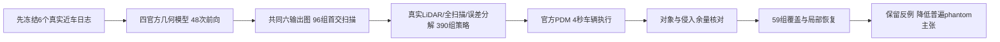

# 自然近车交互补证：发现路锥接触，但主要差距由观测范围解释

2026-09-15；WS-SIM-INTERACTION-01 / 20260915-r1；追加WS-SIM-INTERACTION-COVERAGE-01。这一轮有限补证完成，整体研究目标仍active，人工verdict=null。

**不能把结果写成“VGGT及其SOTA升级版普遍生成phantom，造成严重事故”。** 六个不同日志中，唯一新增的标注物交叠候选在0061，实际接触对象是路锥。全局尺度控制后7/8个完整重建扫描产生名义交叠，但真实LiDAR基线只留1.6厘米余量。恢复对照显示，主要差距来自相机视野外回波的缺失；直接更改路锥局部回波并不触发接触。两个Pi3X条件仍有残余，是一个来源、一个适配策略中的未解决信号，不是多模型、多日志的严重物理失效证明。

## 组件与本轮数量

累计仿真研究阶段：18次HUGSIM/LTF原生闭环、72次四官方几何模型前向、144组重建扫描、644组官方TransFuser推理与644组官方PDM非反应式车辆执行（195+390+59）。不能把PDM轨迹执行混称为644次随新位姿重渲染传感器的闭环。

图册新增F07真实场景、F08全部尺度控制结果、F09路锥接触与尺寸敏感性、F10覆盖/局部恢复。均有PNG/PDF/SVG。已有F03为传感器组件图；F04的公交车早交反例保留。

## 选择、输入和状态

本轮先按真实状态冻结六个不同nuScenes日志，排除初始0013/0038/0041的全部日志，再按场景名和时间顺序取首个满足条件的窗口。没有按模型误差排序，也没有保证选到危险遭遇。

| 场景 | 原始关键帧索引 | 前方车辆中心距离 | 过去观测速度 | 过去观测加速度 |
|---|---:|---:|---:|---:|
| 0004 | 2 | 18.80m | 4.34m/s | +0.22m/s² |
| 0028 | 3 | 21.79m | 6.01m/s | −0.83m/s² |
| 0045 | 14 | 24.30m | 5.62m/s | −1.31m/s² |
| 0061 | 25 | 10.20m | 3.73m/s | −0.50m/s² |
| 0073 | 24 | 23.54m | 2.20m/s | −1.53m/s² |
| 0094 | 29 | 24.06m | 4.28m/s | −1.09m/s² |

0073是横穿的挂车，不应把所有窗口都称为同车道跟车。入选条件是车辆中心4–25m、横向≤2m、至少5个LiDAR点、ego速度2–15m/s及未来4秒转向≤0.2rad。研究中的新来源不等于排除了模型训练重叠的独立FINAL。

126/126个指定RGB/LiDAR文件从公开本地数据包提取。四官方模型每个六或十二张RGB输入，共48次前向，strict checkpoint、BF16、seed7403；单RTX3090。十二图包含下一关键帧额外真实观测，属于离线场景重建条件，不是同一时刻在线输入预算。两条件均只输出共同首六张点图进入读出，后续参考不进入几何模型。

新批策略运行前，依据官方NAVSIM输入约定补齐速度与加速度：由当前及之前两帧ego位姿作后向差分，不用未来状态；修正记录明确当时尚无策略输出。初始三场景的旧零加速度/前向速度结果保留，不能跨这两批直接作同状态排名。策略seed20260915、严格加载官方TransFuser seed0、latent=False、FP32，官方Pacifica/LQR/运动学自行车，4秒/0.1秒；所有干预共享RGB和状态。

来源：[NAVSIM官方输入说明](https://github.com/autonomousvision/navsim/blob/main/docs/agents.md)、[官方策略权重](https://huggingface.co/autonomousvision/navsim_baselines/tree/main/transfuser)、[实际HUGSIM NAVSIM客户端](https://github.com/hyzhou404/NAVSIM)。仍为nuScenes适配、非原生训练域NAVSIM benchmark；没有完整地图合规、at-fault、反应式交通和新位姿传感器重规划。

## 整批结果与唯一新增候选

96组扫描=6日志×4模型×6/12图×原生或BUILD全局尺度。各有full/early-only/late-only/missing-only，加6真实扫描，共390组策略及车辆执行。

| 尺度协议/输入 | 数量 | 新增演员框交叠，相对真实LiDAR |
|---|---:|---:|
| 原生尺度 full | 48 | 6 |
| 原生尺度 early-only | 48 | 0 |
| 原生尺度 late-only | 48 | 1 |
| 原生尺度 missing-only | 48 | 8 |
| BUILD尺度 full | 48 | 7 |
| BUILD尺度 early-only | 48 | 2 |
| BUILD尺度 late-only | 48 | 4 |
| BUILD尺度 missing-only | 48 | 8 |

所有新增交叠均来自0061，不能把多个模型/输入条件当作多个独立事故。0028的真实LiDAR基线已经交叠，全部65条件也交叠，不归因于重建。其他四个新场景没有新增交叠。所有记录ego在同一车辆约定下均无交叠。

BUILD尺度full的执行末端变化中位0.279m、最大1.486m；相对记录轨迹的ADE变化中位+0.0155m，范围−0.3812至+0.0925m。ADE改善与名义接触标签变化可能同时发生，不能只看总误差，也不能单用二值标签宣称严重事故。

0061最近参考物体为道路施工路锥，非白车。真实LiDAR策略执行最小有符号余量+0.0162m，记录ego为+0.4949m。八个完整重建扫描在名义Pacifica车体下，最小余量如下：

| 模型 | 6图 | 12图 |
|---|---:|---:|
| DVGT-1 | −0.0803m | −0.1482m |
| VGGT | +0.0094m | −0.0617m |
| Ω原始512 | −0.0898m | −0.3216m |
| Pi3X | −0.6602m | −0.5892m |

负值是记录二维矩形之间的最小分离平移深度，不是实际车身刚体穿入路锥实体的高精度真值。车辆轮廓每边缩小0.1m后，仍有DVGT-1十二图、Ω十二图、Pi3X六/十二图交叠；但每边扩大0.1m，真实LiDAR基线也会交叠。故名义“安全→不安全”标签依赖尺寸约定。没有碰撞动力学、碰撞后反应或严重车辆事故证据。

## 一次恢复对照：观测范围解释了主要差距

在唯一候选0061上追加59组官方策略与PDM执行。所有恢复都是oracle真实LiDAR额外信息诊断，不能当作同预算方法改进；相机FOV只保证投影进入图像，不保证无遮挡可见。

真实扫描25908束，其中19678束在六相机FOV内，6230束在外。八条件共同缺失6386束，其中5866束在FOV外、520束在内。近处路锥框共61个参考回波。

| 条件 | 发生路锥交叠 |
|---|---:|
| 完整真实LiDAR基线 | 0/1 |
| 真实LiDAR仅保留相机FOV内 | 1/1 |
| 真实LiDAR删去八条件共同缺失束 | 1/1 |
| 完整重建扫描（主批） | 7/8 |
| GT只删除模型在FOV内的缺失束 | 0/8 |
| GT只删除模型在FOV外的缺失束 | 8/8 |
| 完整重建＋恢复FOV外缺失束 | 2/8 |
| 完整重建＋恢复FOV内缺失束 | 6/8 |
| 完整重建＋恢复所有缺失束 | 2/8 |
| GT只采用路锥局部的模型错误 | 0/8 |
| 完整重建＋恢复路锥局部回波 | 7/8 |

真实LiDAR重复基线的8个预测轨迹点最大差为0。结果支持：主要接触差距与相机/激光观测范围不同有关；局部路锥深度或缺失并未独立解释接触。不能要求仅RGB模型无条件补出未观测区域的唯一真实LiDAR，再把缺失称为SOTA本质缺陷。

恢复全部缺失后仍交叠的两个条件都是Pi3X六/十二图；这是需要保留的残余。它来自同一日志、同一适配策略、近边界基线，尚不能支持多模型共性严重失效，也不能忽略来写“全部都由覆盖解释”。

## 本轮推进判定

按冻结的有限补证停止条件，**降低“稀疏前馈几何/phantom普遍导致严重仿真事故”的立论优先级**。这一轮没有形成可直接进入V8.2的共同严重失败定义；不以更极端合成删点、更多诊断版本或训练来维持原claim。

目前可防守的发现是：仿真输入误差、驾驶轨迹误差和物理事故不是同一层证据；相机与LiDAR覆盖预算、深度读出语义、碰撞表示与车辆轮廓约定都能解释貌似严重的信号。初始公交车82/84早交且执行改善的反例、四个新日志无新增交叠、0028真实基线自身失败及Pi3X残余全部保留。

整体用户目标仍未全部完成：尚缺完整原生LiDAR新位姿闭环、可靠物理接触参考，以及前馈几何缺陷在多个来源上造成严重后果的确认。后续研究需针对实际消费几何的传感器/物理接口开展新的有限发现，不能把当前工程接通或路锥名义接触当成完成，更不能将它包装为主方法必要性。

证据根：/root/autodl-tmp/runs/worldsim_simimpact/WS-SIM-INTERACTION-01/20260915-r1；小型证据docs/autoresearch/worldsim_simimpact/milestone3；代码scripts/worldsim_simimpact。本轮无训练、未读旧AV2封存质量、无关机或自动调度。failure_ledger_delta=V74-H2-F16；人工verdict=null。
