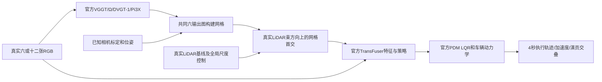

# 重建几何是否实质影响仿真：LiDAR 策略与官方车辆模型实测

2026-09-15；WS-SIM-IMPACT-01 / 20260915-r1；子实验 WS-SIM-LIDAR-01。目标 active，人工 verdict=null。当前没有确认自然前馈几何缺陷造成严重仿真危害；不能写“VGGT 及 SOTA 普遍导致事故/false-safe”。

本轮增加 **195 次官方 RGB+LiDAR TransFuser 推理和195组官方 NAVSIM PDMSimulator 车辆执行**。三场景均无新增标注演员交叠。普通全局尺度控制后，24组完整重建扫描引起的执行轨迹 ADE 变化为 −0.0738 至 +0.0949m；最大4秒末端变化1.1398m。改变了传感器与行为，不等于已经造成严重危害。此前18次HUGSIM/LTF真实闭环及其采样对照保留，不能与本轮非反应式4秒执行混计为完整传感器闭环。

## 实际组件与信息通路

F03提供PNG/PDF/SVG组件图；F04展示实际RGB→回波提前→BEV特征→车辆执行；F05保留整个初始场景分母与普通控制；F06展示独立深度接口标定。全局定尺度引入BUILD LiDAR，必须标为“视觉＋度量锚点”诊断，不进入纯视觉同信息排名。

官方来源：[NAVSIM agents](https://github.com/autonomousvision/navsim/blob/main/docs/agents.md)、[TransFuser seed0 checkpoint](https://huggingface.co/autonomousvision/navsim_baselines/tree/main/transfuser)、[本次使用的HUGSIM NAVSIM客户端](https://github.com/hyzhou404/NAVSIM)、[HUGSIM](https://github.com/hyzhou404/HUGSIM)。实际源码及本地修改路径见运行记录；checkpoint严格加载，latent=False，FP32，seed20260915。该策略在nuPlan/NAVSIM训练，本轮nuScenes输入通过HUGSIM客户端适配，存在域差异，不称为原生nuScenes SOTA基准结果。

## 同输入控制如何执行

固定0013/0038/0041三个初始场景，四官方几何模型已有24次前向全部复用。六图/十二图都只读取共同的首六输出图。已知标定将预测相机深度转为世界几何，规则三角化采用边长≤max(0.15m, 0.05×最小深度)，Open3D求首交。VGGT/Ω采用相机基线尺度、DVGT-1/Pi3X采用已审计坐标契约；另报一个同BUILD LiDAR中位数标量。无模型训练。

测量束来自同一时刻真实BUILD LiDAR，范围1–80m；每束固定原点和方向，几何首交产生重建扫描。不模拟束发散、强度、回波丢失模型；未返回束从点云中缺失。它是同时间发现诊断，**不是独立QUERY验证**。相机异步、动态物体与视角可见性仍限制物理归因，框内参考点不自动等于不透明车身。

48个扫描条件=4模型×3场景×2输入规模×2尺度协议。每个扫描形成full、early-only、late-only、missing-only四类策略输入，再加3个真实扫描基线，共195组。后三类是oracle混合：只改指定误差类型，其他束保留真实LiDAR；有额外信息，只用于因果分解。每组RGB、状态和官方特征构造固定。early/late阈值0.2m。

策略输出8个0.5秒轨迹点，经官方transform_trajectory及PDMSimulator执行为4秒/0.1秒状态。使用官方Pacifica参数、LQR和运动学自行车；演员框仅在相邻标注均存在同一实例时插值。标注框几何交叠是独立诊断，不是完整PDM总分、地图合规或at-fault碰撞。无随新位姿重渲染传感器和策略重规划，因此不能称为完整反应式闭环。

## 结果：传感器误差明显，严重下游后果尚未出现

真实LiDAR基线的执行ADE分别为0.581、2.032、1.959m，说明域适配下策略自身已有误差。195组执行均未与记录演员框交叠；记录ego在同一Pacifica约定下也没有交叠。缺少完整静态障碍物真值，因此这里不声称“所有物理碰撞均为零”。

未尺度控制时最大执行末端变化约1.995m。普通尺度控制后的24组完整扫描中，最大末端变化1.140m，但相对记录轨迹的ADE仅变化−0.074至+0.095m；改善与退化均存在。不能把2米轨迹变化直接变成“2米规划危害”，更不能用提前返回代替false-safe证据。

F04的0013公交车案例：Ω原始512/六图/BUILD尺度控制，84个真实回波位于公交车标注框内（框边放宽0.1m），其中82个早于参考0.2m；示意射线按这些早交误差的中位数选取，提前约1.50m。全部重建扫描进入策略后，4秒执行末端相对真实LiDAR输入移动1.137m，无新增演员交叠；执行ADE由0.581m降为0.525m。面板中的公交车射线用于解释传感器误差，不能把整个扫描的行为变化单独归于该公交车。该案例保留为“清楚的传感器变化、未证明危害”的反例。

## 必须更正：官方深度通道不等于物理首回波

安装的官方HUGSIM_splat rendering.py在RGB+ED+S模式追加深度通道，但后续仅对ED/RGB+ED模式归一化。HUGSIM选择RGB+ED+S并将通道3当作depth。因此当前通道实际是**累计不透明度加权深度**，没有除以累计不透明度alpha，不能直接叫期望深度。

独立GPU单高斯实验：高斯中心固定10m，opacity=0.2/0.5/0.9时，原始通道分别1.988/4.970/8.946；除以像素alpha后均约10m，与官方RGB+ED归一化模式一致。把这种读出变小称为“模型在2m生成真实表面”是错误解释；即使归一化期望深度也仍不是物理首交。

这更正了旧诊断中的深度语义。早期使用原始通道的PnP/深度可见性测量不能支持精确几何结论；归一化后重跑了36视图PnP，许多侧视图仍缺足够连续表面匹配，且以GS深度为3D参考，不是独立物理真值。旧HUGSIM/LTF的RGB闭环与采样控制仍有效，因为未修改RGB，LTF不消费该深度通道。本轮LiDAR网格首交也没有使用该GS深度。

## 有限后续与停止条件

WS-SIM-INTERACTION-01 / 20260915-r1已在读模型结果前冻结6个不同nuScenes日志：0004、0028、0045、0061、0073、0094。排除初始三场景的全部日志，按场景名和时间顺序取第一个符合条件的窗口；要求前车中心4–25m、横向绝对值≤2m、至少5个LiDAR点，ego速度2–15m/s、未来4秒转向≤0.2rad。六或十二张BUILD RGB、共同六输出图、尺度和下游协议保持。冻结选择只基于真实状态和标注，不按模型误差排序；这是本仿真实验新来源，不宣称无训练重叠的独立最终集。

这一批仅检查自然近车交互是否暴露有意义的差距。如果普通尺度控制后仍没有可重复危害，降低“首回波→严重仿真危害”的立论优先级，不继续加大合成扰动。尚未完成完整LiDAR传感器重规划闭环、独立物理碰撞参考和自然前馈缺陷的严重后果确认。整个研究目标保持active。

运行根：/root/autodl-tmp/runs/worldsim_simimpact/WS-SIM-IMPACT-01/20260915-r1；新批运行根同父目录WS-SIM-INTERACTION-01/20260915-r1。代码scripts/worldsim_simimpact，证据docs/autoresearch/worldsim_simimpact/milestone2。单RTX3090，无训练，无封存AV2质量访问，无关机或自动调度。failure_ledger_delta=V74-H2-F15；人工verdict=null。
