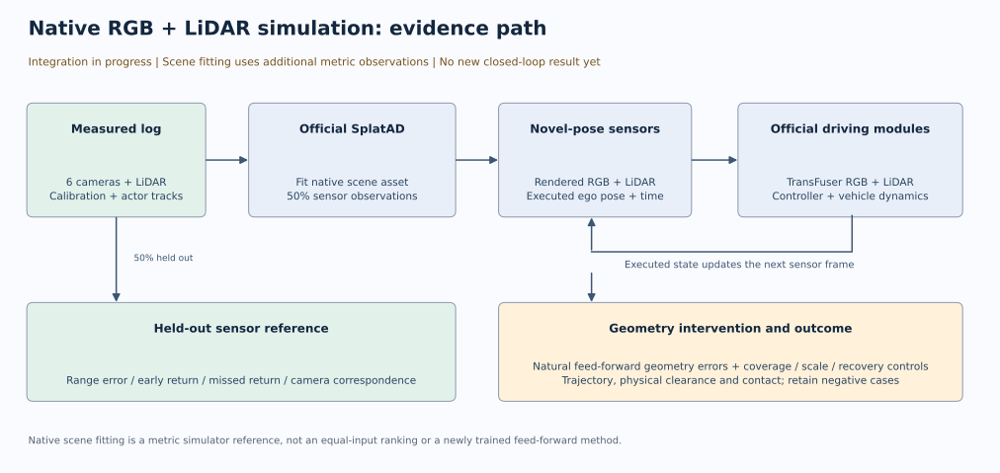

# 原生 RGB＋LiDAR 仿真推进记录

当前正在接入官方 SplatAD，以便相机和 LiDAR 都能根据车辆实际执行后的新位姿重新渲染。两个完整场景的数据已提取，原生 CUDA 后端已编译，已知距离的 LiDAR 通道检查已通过。首个场景已稳定拟合至第 10,000 步并保存阶段 checkpoint；第 8,000 步的固定 4 帧 LiDAR、6 个相机留出验证已完成。尚无新位姿传感器闭环结果。这里的步数为本次记录快照，拟合仍在继续。

## 实验范围

任务 `WS-SIM-NATIVE-LIDAR-01`，运行 `20260915-r1`，种子 `20260915`，单 RTX 3090 24 GB。

先运行 `scene-0004`，它是已完成交互批次按名称排序的第一个普通场景；只有在首个场景的传感器质量和资源成本可接受后，才拟合 `scene-0061`。后者是上轮唯一新增名义接触来源。二者均为已曝光的发现资料，不能当作独立确认集。

完整日志共 3,449 个相机和 LiDAR 文件，提取成功且无缺失。采用官方 LINSPACE 划分，50% 传感器观测参与拟合，50% 留出评价。全日志标定和演员轨迹属于额外信息；这项场景拟合提供度量仿真参照，不能与少量 RGB 的前馈模型混成相同信息预算排名。

场景拟合使用官方 SplatAD 的 30,001 步预算和原生模型、优化配置。图像和 LiDAR 缓存在 CPU，缓存工作线程为 6；仅使用本地 TensorBoard，关闭 FID。保留深度、漏回波、图像对应和后续车辆执行检查。旧 H2 学习器保持关闭。

## 首个实际测量结果

官方 LiDAR CUDA 后端编译完成，耗时 228.61 秒。在中心距离为 10 米的单 Gaussian 解析场景上：

| 不透明度 | 原始深度通道（m） | 官方另一点云分支的 median depth（m） |
|---|---:|---:|
| 0.2 | 1.9744 | 10.0000 |
| 0.5 | 4.9361 | 10.0000 |
| 0.9 | 8.8850 | 10.0000 |

原始深度是按透明度累计的通道。官方 `point_cloud` 使用原始深度，另一个 `median_point_cloud` 使用 median depth；后者在未达到累计透明度 0.5 时采用归一化深度后备值。两条路径都结合预测 ray-drop 筛选。后续同时保留这两条原生读出，不能把 median 分支称为唯一官方点云协议，也不能依据首回波定义预先挑选结果。这个解析检查确认了通道约定，不能算作真实场景中的 phantom，也不能把 Gaussian 中心称为不透明表面真值。

运行前已修正 PyTorch 2.4 对 `backend=eager` 不接受 `mode` 参数的兼容问题；只去掉该无效编译选项，模型与损失保持。首步失败的 `native-r1` 没有完成优化步，稳定拟合使用 `native-r2`。官方 `depth_median_l2` 为**平方误差的中位数**，单位是 m²，不能把日志值直接写成米；最终将导出真实射线误差分布。

## 留出传感器接口验证

任务 `WS-SIM-NATIVE-SENSOR-VALIDATION-01` 使用固定第 8,000 步 checkpoint，先在 194 帧留出 LiDAR 中均匀选择索引 0、64、128、193，并选择每个相机最早的留出图；选择发生在渲染之前。10 个传感器输出全部导出，两套原生点云均保留。不是最终拟合质量统计，也不是下游坏例筛选。

| 留出扫描时间（s） | Raw 距离绝对误差中位数（m） | Median 分支距离绝对误差中位数（m） | Raw 距离 MAE（m） | Median 分支距离 MAE（m） |
|---|---:|---:|---:|---:|
| 0.094 | 0.126 | 0.128 | 1.136 | 1.116 |
| 6.544 | 0.121 | 0.138 | 0.972 | 0.983 |
| 12.994 | 0.121 | 0.112 | 0.861 | 0.820 |
| 19.443 | 0.205 | 0.221 | 1.315 | 1.316 |

这些距离误差在全部有效真实返回方向上计算，独立于预测是否丢弃回波；预测漏回波和额外返回另存，不能以预测丢弃困难点来改善误差分母。中位误差约 0.11–0.22 m，但存在较长误差尾部，暂不能称为可靠真值资产。前向相机真实图与渲染图已目视检查，六相机 PSNR 为 21.54–25.86 dB；外观数值仅用于检查接入，不作为研究目标。

渲染使用官方采样方向、有效位置及运动补偿。保存原始和渲染后的扫描时间数组，按独立副本执行，避免官方原位时间居中跨条件累积。它仍属于已知位姿的原生留出验证，不能称为完整新位姿扫描或闭环执行。

## 当前结论不变

上轮六日志和覆盖恢复实验没有确认普遍 phantom 导致严重事故。真实基线距路锥仅约 1.6 cm，主要差距由相机与 LiDAR 的观测范围差异解释。两个 Pi3X 残余的有限因果审计已经完成，普通右前路面网格修复均未恢复，不晋级主方法动机。完整的新位姿 RGB＋LiDAR 循环、自然几何干预以及可靠的物理后果仍待执行。

本阶段先建立原生基线，再检查自然前馈几何替换的影响，保留尺度、覆盖与恢复对照。所有新增碰撞表述都必须区分标注框交叠、实际物理间距及严重后果。人工 verdict 保持 null，整体研究目标 active。

## 版本与复现入口

- [官方 SplatAD / NeuRAD Studio](https://github.com/georghess/neurad-studio)，版本 `8ba9b5116b8a2822a80c64f63a4ae64c5871aa68`。
- [官方 SplatAD CUDA](https://github.com/carlinds/splatad)，版本 `6e31ad766d39e0c33f9034a2ed772d51364b2343`。
- [官方依赖 Viser 分支](https://github.com/atonderski/viser)，版本 `57142e42df8edd4de33fd60a08d6bb6c35970aa1`。

远端资产根目录：`/root/autodl-tmp/runs/worldsim_simimpact/WS-SIM-NATIVE-LIDAR-01/20260915-r1`。独立环境：`/root/autodl-tmp/envs/splatad-impact`。当前复用 PyTorch 2.4.1＋CUDA 11.8 与 NumPy 1.26.4；AV2、Numba、OpenCV 的环境版本与仓库旧锁定值不同，将随最终结果记录。未用到的其他数据集、导出器和在线记录服务不计为已复现功能。

VGGT-Ω 使用用户指定的 [512 镜像权重](https://huggingface.co/1kaiser/vggt-omega-jax/blob/main/vggt_omega_1b_512.pt)，文件已完整存在，官方结构 strict 加载和跨场景推理已完成；它不是 416 reproduce 权重。
