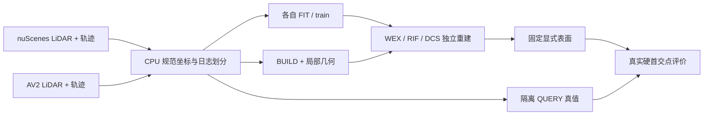

# V74 P0 完成与有卡开机交接

日期：2026-09-10。P0 文档、磁盘与现有 FIT/DEV CPU 数据准备完成，未进行 V74 方法训练或质量评价。
V74 分支从 V73 最终 01af4739 建立；文档 d6bea861、存储 463ef199 已 push；数据执行基线 463ef199。



## 文档与存储

76 份不再是主线的顶层文档移入 `docs/archive/2026-09/pre-v74/`；旧 AGENTS、README、状态/实验台账有历史快照。统一失败账本保留原事实，顶部换成 V74 当前入口。主计划修订为两个数据集各自训练/评价，旧跨域结果保留为历史。
已删除 4105 个列明的缓存/旧帧目标，实际释放 **131.802 GiB**，P0 最终准备时可用 **194.126 GiB**。按组保留 340 个代表帧，关键 checkpoint、固定表面、原始 LiDAR/RGB、轨迹、指标、模型与环境保留。
重建旧逐帧分析可能需要重新推理和恢复旧依赖。目录大小之和与实际空闲空间差分开记录。路径/大小/理由/恢复方式在 [清理计划](autoresearch/worldsim_v74/p0/storage_plan.json)，实际结果在 [清理回执](autoresearch/worldsim_v74/p0/storage_result.json)。

## 已准备的数据

| 数据集/角色 | 日志 | 对象 | 有 BUILD | 缺 BUILD | 无自有 QUERY 返回 |
|---|---:|---:|---:|---:|---:|
| nuscenes FIT | 20 | 414 | 371 | 43 | 83 |
| nuscenes DEV | 5 | 75 | 67 | 8 | 23 |
| av2 FIT | 17 | 807 | 764 | 43 | 96 |
| av2 DEV | 3 | 129 | 114 | 15 | 23 |

数据目录：`/root/autodl-tmp/data/worldsim_v74/p0_r1/`。共 1425 对象，实际文件约 **534.23 MiB**（含几何和索引）；不复制 RGB。
每对象 `build.npz`/`build_metadata.json` 仅含构建观测，`query_rays.npz` 只有原点/方向/时间及帧边界，`query_truth.npz` 由评价器单独读取。FIT 的时间留出可用于训练监督；DEV/FINAL 的 QUERY 禁止进入对象求解器。原字段和真实射线定义沿用 V73。
`build_geometry.npz` 保存 min(16,N) kNN、局部协方差/右手基和朝对应 BUILD 传感器原点的法向。1071391 个构建点中 1071227 有可估计法向、164 退化点显式记无效；法向只是输入估计，不是完整表面真值。
nuScenes 延续单扫描时刻近似；AV2 延续逐返回纳秒时刻。归属是框+.1m且排除重叠的代理，首返回后未知，不虚构 no-return。

固定 probe：5 nuScenes DEV 日志 + AV2 旧 20 日志按 ID 最先 3 条；按 BUILD 点数排序三层，每层首末取样。真实得到 **43 个有 BUILD 对象/8 日志**，另有 **23 个缺 BUILD 合同对象**；11 个 probe 对象无自有 QUERY 返回。部分日志不足 6 个可用对象，保留实际数而不增窗或按效果替换。全量对象始终在 index 中。[队列](autoresearch/worldsim_v74/p0/probe_cohort.json)、[逐日志可用量](autoresearch/worldsim_v74/p0/probe_availability.json)。

AV2 另外固定 **10 个新 FINAL 日志、100 个原始文件、65.79 MiB**；全部下载，未打开原始标注/LiDAR 数值，未运行测试。路径 `/root/autodl-tmp/data/worldsim_v74/av2_final_raw/`；名单/精确时间见 `configs/worldsim_v74/av2_final.json`。其规范坐标导出属于方法冻结后的最终确认准备，当前状态为 raw_ready。
nuScenes 暂无可证明全新未曝光的 FINAL 日志，当前已就绪的是域内训练/开发；**不能宣称两数据集独立最终确认已经完成或数据都已齐备**。不把旧 FIT/DEV 改名为盲测。

## 卡点方案与实际验证

nuScenes [官方说明](https://www.nuscenes.org/nuscenes) 和 [test 标注边界](https://www.nuscenes.org/object-detection) 表明不能直接用官方 test 补齐本任务已知对象轨迹。结合既有曝光角色，保留该缺口，继续现有域内开发。
AV2 [官方 Sensor 说明](https://argoverse.github.io/user-guide/datasets/sensor.html) 与 [逐文件下载](https://argoverse.github.io/user-guide/getting_started.html) 用于新 FINAL：只下载固定 LiDAR 窗口、标定、轨迹和标注，不下载全套相机。
PyTorch [官方 mmap 加载说明](https://docs.pytorch.org/tutorials/recipes/recipes/module_load_state_dict_tips.html) 迁移到已有逐对象 .pt，解决当前 2 GiB 内存无法加载数 GB 拼包的问题。
[NKSR 官方实现](https://github.com/nv-tlabs/NKSR) / [CPU 使用说明](https://github.com/nv-tlabs/NKSR/blob/public/NKSR-USAGE.md) 是后续稀疏重建强基线的接入参考；P0 只准备其可能需要的 BUILD 法向，未声称已复现 NKSR 或取得收益。
实际分离导出 15.04s、峰值 0.375 GiB；最终几何预处理 20.50s、峰值 0.097 GiB。仅做一次两数据集+空对象字段往返核对，QUERY 数值与原缓存一致，求解/查询接口隔离；[核对结果](autoresearch/worldsim_v74/p0/data_roundtrip.json)。没有模型 smoke、回归或 V74 新分数。

## 有卡开机后的入口

当前 cgroup 0.5 CPU/2 GiB，GPU 不可访问。P0 全部 CPU 任务结束、最终 push 成功并确认无其他科研进程后执行 shutdown；实际执行时间/回执保存于本次任务本地 outputs，避免把准备状态写成已关机事实。
用户有卡开机后，先读 `RESEARCH_STATUS.md`、`RESEARCH_FAILURES.md`、`EXPERIMENTS.md` 与 V74 主计划，再开展 A/B/C 独立机制算例、各自强控制及同队列真实检验。主 seed=7401、确认 seed=7402；每数据集独立 FIT，epsilon_obs 在 FIT 定标，主输出≤4096面。当前没有 SURVIVORS/NO_SURVIVOR 裁决。

```bash
cd /root/autodl-tmp/motion_proj
git switch research/worldsim-v7.4-method-tournament
# 现有数据可直接加载，无需重跑预处理。
/root/autodl-tmp/envs/motionproj/bin/python -c 'from motion_proj.worldsim_v74.data import load_build'
```

预处理入口 `scripts/prepare_worldsim_v74_data.py` 接收新的 `--output` 目录；`prepare_worldsim_v74_geometry.py --data <目录>` 只读 BUILD；`prepare_worldsim_v74_av2_final.py --download` 复用已固定身份和已有文件。不要直接运行 V73 GPU launcher。
下一阶段按实际候选和强基线测资源，不把低配 CPU 实例当方法算力上限。V73 30分钟自动跟进仍 PAUSED，本次未创建新的自动化。
