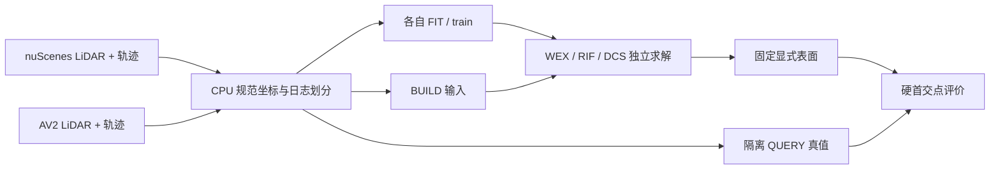

# V74 P0 与 GPU 交接

日期：2026-09-10；状态：running；基线 `01af4739`。
目标：完成文档归档、释放无关大文件、两数据集 CPU 预处理。P0 没有训练结果、候选裁决或论文方法成功结论。

## 当前已完成与限制

- 从 V73 最终分支建 V74；AGENTS 与导航已统一，旧执行文档移入 archive/2026-09/pre-v74，历史失败事实保留。
- 数据盘初始约 638/700 GiB。具体清理路径和实际空间差将在存储任务完成后填写。
- 当前 cgroup 仅 0.5 CPU/2 GiB，GPU 不可访问；使用逐对象 CPU 处理，不读大 RGB 拼包。
- 现有 nuScenes 日志有历史角色，不能宣称新独立 FINAL。AV2 旧 20 日志按 ID 拆 FIT/DEV，另外预留新 FINAL，完成后填写实际 ID/数量。

## 卡点检索与迁移

nuScenes [官方数据说明](https://www.nuscenes.org/nuscenes) 与 [官方标注边界](https://www.nuscenes.org/object-detection) 表明官方 test 不提供本任务可直接使用的对象标注。项目旧角色覆盖全部 trainval 日志；保留既有 FIT/DEV，严格 FINAL 不造身份。
AV2 [官方数据集](https://www.argoverse.org/av2.html) 和 [下载文档](https://argoverse.github.io/user-guide/getting_started.html) 提供 Sensor 的公开日志与逐文件下载；为 V74 新 FINAL 只准备需要的 LiDAR、标定、轨迹与标注，不下载全套 RGB。
[NKSR 官方实现](https://github.com/nv-tlabs/NKSR) 与 [使用说明](https://github.com/nv-tlabs/NKSR/blob/public/NKSR-USAGE.md) 提供稀疏重建及 CPU 使用路径；后续外部基线可据实适配，当前没有运行 NKSR 或取得收益。

## 后续交接

CPU 数据/存储任务尚未完成，未执行 shutdown。完成时补充真实计数、输出目录、验证结果与 push 状态，再确认无任务并关机。
GPU 阶段先读取主计划和三本总账，再实现三候选与必要控制；不得直接运行旧 V73 launcher。nuScenes 与 AV2 自身训练/评价，主 seed=7401、第二 seed=7402。

## P0 存储里程碑已完成（2026-09-10）

WS-V74-P0-STORAGE-01 done；执行基线 d6bea861。删除 4105 个已列明目标，实际释放 131.802 GiB，完成时可用 194.487 GiB。
包括 5 处冻结视觉前缀和退役 V6 传感器重渲染帧/旧 dense logits；按 run/组保留 340 个代表文件。原始数据、V73 checkpoint/表面/射线/指标、环境和模型保留。
恢复旧逐帧分析可能需要重新推理或恢复历史依赖；不把缓存清理解释成无成本完整复现。精确路径/大小/恢复方式：docs/autoresearch/worldsim_v74/p0/storage_plan.json；实际删除和空间差：storage_result.json。
failure_ledger_delta=none（未新增科学失败）；V74-F01/F02 继续。CPU 数据预处理 running，尚未关机。
