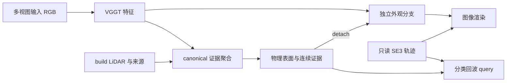

# WorldSim V7.2 Recovery：从 V7/V7.1 正结果构建 EAS-VGGT

日期：2026-09-07；文档任务 `WS-V72-E0-EAS-VGGT-REPLAN-01`，状态 `done`；实现 E1–E5 均为 `pending`。仓库事实基线 `debe8697`，历史科学证据基线 `1913ab0e`。本计划按用户最新方向重写；新模型尚未实现、没有新的训练或测试结果。

当前执行入口以 [RESEARCH_STATUS.md](RESEARCH_STATUS.md) 文首为准。本计划替代 `WORLDSIM_V7_2_TASK_FIRST_OCCUPANCY_OR_NEURAL_LIDAR_PLAN.md`、`WORLDSIM_V7_2_TASK_FIRST_PLAN.md` 和 `WORLDSIM_V7_2_RESEARCH_FIRST_RECOVERY_PLAN.md` 的路线安排。旧 A/B 选路、R1–R7 队列及其整体完成判据退役；历史实验、数据和负结果保留。对应纠偏为统一账本 `V71-F65`。

## 1. 问题定义与这次纠偏

**EAS-VGGT 要研究的是：如何将多视图视觉几何特征与有来源的稀疏观测，学习为可复用的 Actor 表面状态，使物理查询、图像外观和刚体运动各有明确参数归属，并在留出观测及轨迹编辑中保持可解释、可检验的行为。**

输入默认沿用项目已经具备的同步多视图 RGB、build LiDAR、标定、Actor 身份/框及已知刚体轨迹；训练目标来自隔离的观测。部署只读取输入窗口和 build 证据。这个版本是有标定、有 Actor 轨迹和稀疏 LiDAR 的视觉几何学习系统，暂不声称纯视觉、无标注跟踪或未来轨迹预测。连续时间轨迹由给定姿态插值，不能把插值称为预测。

输出为每个 Actor 的 `PhysicalSurface + ContinuousEvidence + AppearanceState`，以及只读的 `ActorPose(t)`；背景有单独 owner。一个场景组合这些对象以支持图像渲染、Actor 条件回波查询和刚体轨迹编辑。完整场景应用通过对象组合逐步展开，不要求先补齐所有不可见表面。

| 维度 | 旧 V7.2 / 上版 recovery 的安排 | 本计划的安排 |
|---|---|---|
| 主要研究对象 | 补全后的点云或完整神经 LiDAR 扫描 | 有证据、可编辑且物理与外观分工明确的 Actor 状态 |
| V7/V7.1 的作用 | G2 对照、失败约束、接口资产 | 方法起点：compiler、M8、M39、M22/M28、M49 |
| 学习增量 | AdaPoinTr 微调、外部渲染器接入 | VGGT 特征到 canonical EAS 的物理/证据学习及独立外观分支 |
| 外部论文迁移 | 补全模型与 LiDAR 渲染器决定主线 | 迁移特征融合、时序学习与渲染部件，服务三条已有机制 |
| 评价中心 | CD/F-score 与 full-scan 指标选路 | 同几何回波、外观干预不影响物理、轨迹组合与视觉质量联合评价 |
| 收口条件 | 单候选或缺 B 结果触发总体关闭 | 每个假设有独立证据状态；缺实验继续执行，失败先研究再迁移 |

旧路线的主要错误是目标发生漂移，不能仅归因为 A1 loss 不好或 B 基线不够。补一个 NKSR/LiDAR-RT 也不能自动纠正这个问题。AdaPoinTr/LiDAR4D 的已有结果仍可作补充对照，但不作为 EAS-VGGT 的初始化、必需依赖或推进门槛。

## 2. 正结果继承表：保留什么、还缺什么

以下数值来自现有账本及论文的 canonical 摘录，不是本轮重跑。不同算子、cohort 的绝对 early/hit 不跨行比较。

| 资产 | 已有正证据 | 继承方式 | 必须保留的边界 |
|---|---|---|---|
| V7 SceneIR / HARP-3D | Actor canonical 融合、逐 ray/frame 来源、KEEP/PROJECT/COMPLETE/UNKNOWN；matched-ray PROJECT 不落入该观测的 pre-hit free interval | 作为 EAS 输入合同和观测证据编译器；身份、轨迹和 UNKNOWN 语义保留 | 只对匹配观测成立；P20/P22/P23 已揭示 target-nearest 代理会低估真正 early，不能恢复成全表面安全证书 |
| V7 三维几何 | P2 在 433 Actors 上 CD `0.254→0.168m`、precision `79.59→97.67%`，Actor retention `100%` | 证明 canonical 观测处理和来源约束有价值，保留 compiler 基线 | 是当时 AV2 编译协议；不当作 EAS-VGGT 独立泛化结果，也不以 precision 代替首回波正确率 |
| V7.1 M7/M8 表面学习 | M8：66 dev Actors，CD `237.67→231.46mm`，literal hit `47.67→50.43%`；hazard early `27.80→26.37%`；相对 M7，moving frame-distance 再降 `7.01mm` | M8 为物理起点，保留固定 observed anchors、局部 child set 与逐帧覆盖监督；M7 为权衡参考 | dev 已暴露；M8 clear early `21.56→22.39%`，且 hazard 不优于 M7；不是简单基线的普遍支配者 |
| V7.1 M39 分类回波 | 固定 M8 几何，unit→learned categorical：all early `18.19→17.67%`，hit `62.28→64.46%`；hazard early `−0.62pp`、hit `+2.32pp` | 保留 M35/M38 训练出的证据头与 M39 reader 作为可回退端点；优先学习图像提供的证据增量 | 只是源域机制证据；M43 AV2 hit `+5.89pp`，early `+0.23pp`，hazard early `+0.54pp`，跨传感器 early 改善未成立 |
| M22/M28 刚体与所有权 | 12 Actors / 36 Actor-frames，5,791 物理 Gaussians；逆变换 query 残差 `3.40e−14`，刚体距离残差 `1.24e−14m`；物理接口不接受 visual state | 直接继承 `PhysicalActorField` / `ActorPose` 类型边界与 canonical inverse query | M28 是接口/理论实现，M22 是数值组合验证；都不是新轨迹预测能力或重建精度增益 |
| M25/M27 外观学习 | 只优化外观可提升画质且物理保持固定；M25 footprint PSNR `15.86→16.94dB`，M27 分层外观到 `17.73dB` | 继承分支隔离及外观独立扩容；让视觉头学习足够的专属 primitives | 与原 StreetGS `25.35dB` 仍有差距；M27 使用已暴露视图。309 物理载体并不够承担完整外观 |
| M49 连续测度分析 | 99,208 rays 上得到有限衰减精确恒等式；能解释降低 child 权重为什么反而增加前方概率 | 作为 reader/训练损失设计依据及归因工具 | 不能把“降权”叫作单调变安全；分析所用 GT 边界不能输入推理策略 |
| V7.2 数据与 I/O | 3,882 个 keyframe LiDAR 已物化；干净 dev 为 4 logs / 501 Actors；输入与 targets 分开、曝光记录、密度匹配已有实现 | 保留 source dispatch、ActorBundleV2、角色门控、G0/G1 简单基线与有限读取流程 | 尚未证明这些 logs 的 RGB 多相机素材及 VGGT 特征缓存已齐全；数据前置工作需要补这一部分 |

直接证据入口：`paper/results/eas_evidence.json`、`paper/results/results_macros.tex`、`paper/sections/supp_v7_restored.tex`、`paper/sections/05_experiments_appendix.tex`；run 以 [EXPERIMENTS.md](EXPERIMENTS.md) 的稳定 task ID 查找。关键 canonical：

- M8：`run://worldsim_v71/WS-V71-M8-TEMPORAL-FRAME-COVERAGE-01/20260904T202000Z__m8-temporal-frame-s71110-r2`。
- M39：`run://worldsim_v71/WS-V71-M39-CATEGORICAL-AUTHORITY-COMPOSITION-01/20260905T070000Z__m39-categorical-authority-r1`。
- M22：`run://worldsim_v71/WS-V71-M22-SE3-DYNAMIC-STATIC-COMPOSITION-01/20260904T161000Z__m22-se3-composition-r2`。
- M49：`run://worldsim_v71/WS-V71-M49-VISIBILITY-SIGN-BOUNDARY-01/20260905T121500Z__m49-visibility-sign-boundary-r1`。

## 3. EAS-VGGT 方法：三条机制与一个真正的学习接口

### 3.1 VGGT 到 canonical EAS 的接口

第一实现使用官方 VGGT 冻结 aggregator；只读取输入窗口图像。通过标定和每帧 Actor pose，将 canonical anchor/child 投影到各输入图像，采样 patch features，并附带时间差、视线、producer provenance 和支持度。使用小型跨观测 attention 聚合到每个 primitive；无有效投影时保留 evidence-only 路径及缺失标记，不能删 Actor。

**学习发生在跨观测融合、物理残差头和证据头，不只是给旧 EAS 换一个名字。** 首轮锁住 M8 几何，仅比较 VGGT 是否改善证据；第二步才开放物理残差学习，分辨几何和 reader 的贡献。新分支使用零初始化输出残差连接旧 checkpoint，初始函数保留旧模型，随后由监督学习偏离；不根据评测结果逐 Actor 选择旧/新输出。

默认利用已有标定作几何对齐；VGGT 相机/点图只作为可选辅助输入或一致性特征。若使用其预测点图，必须先用 build-only 静态标定约束估计尺度和坐标变换；动态 Actor 不能当静态对应点对齐。仅冻结骨干不能消除 pose/gauge 错误。VGGT 的 depth/point confidence 是模型输出特征，不直接解释成 occupied probability 或校准后的认识不确定性。

### 3.2 物理与外观解耦

状态定义为

\[
S_i=(P_i,E_i,A_i),\quad P_i=\{\mu_j,\Sigma_j\},\quad E_i=\{m_{Fj},m_{Oj},m_{Uj},s_j\},\quad T_i(t)\in SE(3).
\]

`s_j` 保存支持次数、来源和冲突统计，不把 softmax 熵本身当作可校准 epistemic uncertainty。物理分支用几何、逐帧和观测证据监督；外观分支接收 detached physical carrier 及冻结视觉特征，独立拥有颜色、opacity、视觉残差几何和 densification。visual-only primitives 永不进入物理 query。

| 参数组 | 可接受的训练信号 | 部署消费者 |
|---|---|---|
| VGGT 冻结骨干 | 首轮无梯度；后续若解冻，单独的 physical adapter 仅收物理监督 | 特征生产 |
| 物理 geometry head | set/plane/scale/frame；需要时加入已辨明作用的物理 ray loss | 物理表面、detached 外观条件 |
| evidence head | soft F/O/U 观测目标、概率回波目标；与 geometry 分阶段 | 条件回波 reader 与证据输出 |
| appearance head / visual primitives | RGB 重建损失，只在外观子图反传 | 图像 rasterizer |
| Actor pose、背景 owner | 首轮只读；不通过 RGB 偷改 Actor 的物理轨迹 | 刚体放置与独立背景渲染 |

物理非干扰条件为 `∂Q_phys/∂θ_app = 0`，还要排除共享可学习 backbone、optimizer 参数交叉、普通 dict 子模型漏冻及缓存别名。仅对 `P` 调一次 `detach()` 不足以证明整个系统隔离（`V71-F28`）。允许视觉分支有自己的可学习几何，解决 M24–M27 的容量缺口；这与放开 physical centers/scale 的 RGB 梯度不同。

### 3.3 连续证据与分类回波测度

延续 F/O/U 的连续 soft target，允许不同观测同时提供 FREE 与 OCCUPIED 投票；未被观察不等于 FREE。保留支持量和来源，避免把 1 次与 100 次观察压成相同的不可区分输入。首轮不新增 Dirichlet/DS 理论主张，先验证这些信息的实际作用。

给定 ray 在 Actor box 内的有序深度 bins，沿用 M39：

\[
q_{kj}=\frac{m_{Oj}\kappa_j(o+d_kv)}{\sum_{a,b}m_{Ob}\kappa_b(o+d_av)},\quad
p_k=\sum_jq_{kj},\quad \widehat d=\operatorname{median}(p).
\]

这是**条件于 box 内存在回波的深度分类测度**；不是 semantic 类别分类，也不是 opacity、体密度、完整扫描 no-return 概率或 literal 最小交点。分母无支持时输出显式 `unsupported`，不能用数值 epsilon 伪造确定回波。保留所有 ray/Actor 的评价分母，unsupported 数量另报。若未来增加 no-return 头，需要真实 firing/mask 标签及独立任务说明，不能把 UNKNOWN 或正回波 cache 的空洞当真值。

M49 的有限衰减恒等式直接继承：

\[
F_v(b)-F(b)=\frac{(1-v)r_j\,[F(b)-C_j(b)]}{1-(1-v)r_j},\qquad 0<v<1.
\]

它表明单个或一族成分降权是否减少 early 取决于相对 CDF，不能仅依据低 confidence 全局抑制 children。训练阶段可使用 target 边界；部署不读取 target-defined `b`。第一轮保留 M39 的固定核、离散网格与 median，不同时调尺度、bin、家族总质量和算子。

这里有两项独立假设：**VGGT 能提供 producer 手工特征之外的有效证据；完整连续证据能在冲突、稀疏/遮挡条件下提供单标量没有的收益或可靠性信息。** 后者尚未成立，V7.2 W0–W4 必须作为反证约束，而非丢弃三态方向或预先认定它有收益。

尤其是 reader 仅消费 `m_O` 时，F/O/U 本身不增加该 reader 相对 scalar 的函数表达能力。可能的增量来自观测监督、跨帧信息和可靠性输出，必须用 T1 验证；不能把同一个 scalar 换成三个 logits 就宣称新的物理能力。

### 3.4 SE(3) 刚体轨迹等变性

物理查询延用 canonical inverse query：

\[
Q_{i,t}(x)=Q_i(T_i(t)^{-1}x),\qquad Q_{gT}(gx)=Q_T(x).
\]

非各向同性表面应满足 `μ_world=Rμ+t`、`Σ_world=RΣRᵀ`。射线也做同一个刚体变换时，距离参数及回波分布不变；这是全局坐标变换等变性。只移动 Actor、固定传感器时，回波必须随物体相对位置改变，不能要求 invariant。图像渲染还依赖视角/光照，不宣称视觉网络天然具有精确 SE(3) 等变性。

连续轨迹采用给定姿态间的 SO(3) 插值与平移插值，先复用现有 trajectory module。验证平移、旋转、两者组合及多 Actor 独立运动；真实时间插值帧可与留出观测比较。人工编辑轨迹主要验证解析一致性和状态归属，没有对应实测扫描时只报告合成干预，不冒充真实 counterfactual GT。

## 4. 论文与开源迁移：围绕机制选择

2026-09-07 已核对以下一手来源。论文方法、开源实现、本机运行、同协议增益分别登记；本轮未安装或运行新的 VGGT 模型。

| 来源 | 经核对的相关机制 | EAS-VGGT 的具体迁移 | 对标边界 |
|---|---|---|---|
| [VGGT 官方模型](https://github.com/facebookresearch/vggt/blob/main/vggt/models/vggt.py) / [训练说明](https://github.com/facebookresearch/vggt/blob/main/training/README.md) | aggregator 与相机/深度/点图/跟踪 heads 分开；训练支持冻结 aggregator、梯度累积 | 冻结视觉特征 + 小型 EAS 融合/head；通过 projection/cache 降低重复 backbone 开销 | 不从“支持冻结”推断单卡成本或驾驶数据增益；E1 实测 |
| [DynamicVGGT](https://arxiv.org/html/2603.08254v1) | 当前/未来 point maps、并行运动注意力、scene-flow 监督的 Gaussian velocity、分阶段学习 | 借鉴跨帧特征融合和分阶段保留几何先验；本项目通过已知 Actor canonical 关系聚合 | 原文强调点运动/4D 重建；EAS-VGGT 强调物理/外观归属与证据测度。完整权重及本机复现未核实，不放进必需队列 |
| [Gau-Occ](https://arxiv.org/abs/2603.22852) | completion diffuser 初始化 Gaussian anchors，几何对齐的图像语义融合 | 只迁移“在 primitive 上采样并融合多相机特征”的思路；EAS 的 anchors 来自已有 compiler/M8 | occupancy 与条件回波任务不同；不继承先全局补全才能工作的依赖 |
| [Street Gaussians 官方代码](https://github.com/zju3dv/street_gaussians) + 本地 M22–M28 | 动态对象/静态背景 Gaussian 渲染部件，项目已有实际接入 | 复用 rasterizer、对象关联和轨迹接口；外观有独立容量 | 原生配置和本项目物理隔离版本按输入/训练预算比较，不能把不同数据的论文 PSNR 横比 |

本计划对 EAS-VGGT 的方法组合与实验安排是基于这些来源和本地结果提出的研究设计，并非外部论文已经证明的结论。

## 5. 实验设计：逐项解释新增收益

### 5.1 核心对照矩阵

| 实验 | 必需对照 | 保持一致的量 | 回答的问题 / 主要输出 |
|---|---|---|---|
| T1：视觉证据增量 | M8+原 M39；M8+等容量 scalar；M8+VGGT scalar；M8+VGGT F/O/U；同融合结构的图像特征置乱控制 | 固定 M8 几何、bins、reader、build 信息、训练预算；scalar/F/O/U 参数量近似匹配并实报 | VGGT 是否提供有效信息；报告 early/hit、depth NLL/Brier、MAE 和支持分层；F/O/U 是否超出 scalar |
| T2：物理学习增量 | 原 M8；VGGT 几何头+旧证据；固定 M8+新证据；VGGT 几何头+新证据；G0/G1 作为几何参照 | 同点数预算/采样规则、输入观测、监督；新几何输入旧 head 时特征 schema 和来源须一致 | geometry 与 evidence 的 2×2 归因，避免把密度或读出变化写成几何贡献；CD/F-score/frame-distance 与 literal 回波分表 |
| T3：物理/外观解耦 | 共享物理/视觉载体并允许 RGB 改几何的受控基线；隔离但同容量；隔离且视觉独立扩容；原生 StreetGS 外观参考 | 从同一快照起步，匹配 RGB views/steps；同容量组匹配参数和 primitive 数，扩容成本另报 | 固定证据下增加 RGB steps、改变纹理/颜色、调整视觉容量时，物理状态/query 漂移与画质变化；报告 footprint PSNR/SSIM/LPIPS |
| T4：刚体轨迹 | canonical inverse query；显式 world-space transform 的参考实现；可选逐点运动表达对照 | 同一物理状态、姿态和 rays；不用重新训练来验证坐标恒等式 | 全局坐标变换残差、pairwise rigid residual、轨迹插值留出误差、单 Actor 编辑对其他 owner 的影响 |
| T5：场景与外域 | 冻结 EAS-VGGT 与对应 EAS/视觉基线；全部 Actors+独立背景 | 相同输入窗口/轨迹/视图/传感器；先 source 冻结，再外域评测 | 同一状态支持多帧图像与物理查询；以 logs 为独立单位的稳定性和跨传感器边界 |

T1 的置乱控制在各自数据角色内用同一固定规则打乱 Actor–图像特征关联，训练和评测保持规则一致，绝不混入 final 角色。若图像模态在 matched cohort 中缺失，先报告缺失覆盖及原因，整体结果保留全部 eligible Actors 的 evidence-only fallback；额外的可用图像子集用于配对机制分析，不能静默删困难样本。

除了 EAS 必需对照，保留 **VGGT 特征 + 常规 Gaussian/标量头** 的同输入同预算基线，用于判断 typed state/证据组合是否超过一般视觉特征收益。训练/监督完全不同的 DynamicVGGT、Gau-Occ、LiDAR4D 只能列 related-work/task comparison；有可用官方实现且能做公平比较时再增加完整复现，不能用其论文数值占据实测行。

### 5.2 指标与晋级原则

首轮主要物理终点固定为同几何 categorical 的 `hazard early` 与 `all hit`，同时完整报告 all/hazard/clear 三组。geometry 表使用 literal 算子，reader 表使用 categorical 算子，字段分开。NLL 下降不能替代 early/hit；UNKNOWN coverage 不能靠删除 Actor 获得。F/O/U 监督另报 soft-label CE/Brier 和按支持量/冲突程度的校准，不把回波 Brier 与证据 Brier 混成一个分数。

开发晋级采用联合方向：相对对应 EAS 对照，hazard early 不增且 all hit 不降，至少一项改善；all/clear 不能隐藏实质退化。实质非劣容限、effect size 和固定迭代预算在 E1 数据清单完成后、E2 首次 quality read 前落入实验 config；不套用旧 CD 的 D1 选路门。独立确认使用 log-level 配对区间和逐 log 表；3/4 个日志只能支持有限确认，不能以数十万 rays 伪造大样本显著性。

结构正确与科学收益分别判定：非干扰/SE(3) 恒等式通过只能证明系统行为；学习增益和视觉可用性还需 T1–T3。若 F/O/U 没有超出 scalar，保留这一负结果并缩小证据主张，再分析新的可辨别信息；若某个 head 失败，保留旧端点、定位失败并研究迁移，不把 EAS-VGGT 整体宣布完成。

完整场景中不能直接取多个 Actor 条件 median 的最小值就声称得到了物理正确的全扫描概率分布。初版明确提供各 Actor 的条件 query，场景空间一致性用独立 deterministic surface baseline 检查；概率遮挡/no-return 合成有真实监督后单独建模，不作为本轮模型起步前置。

## 6. 数据、I/O 与单卡推进

复用现有 `ActorBundleV2` 的 target-free 边界、raw/processed source dispatch 和 data-role inventory。增加 `image_evidence` sidecar：sample/camera/timestamp、原始/缩放裁剪尺寸、内参、外参、Actor pose、有效投影掩码、backbone revision 与 feature schema。先按元数据列出实际 RGB 文件需求和缺失项；现有 LiDAR I/O 已完成不代表相机 I/O 已完成。

同一输入窗口一次 VGGT forward，跨 Actor 复用；优先缓存投影采样后的 primitive features 和必要的时间/相机索引，而不是常驻所有全分辨率 dense tokens。冻结 backbone 缓存按 scene/window 顺序流式写入数据盘，FP16 保存、训练时分块读和预取。验证是否使用未来输入帧由任务定义决定：离线重建可使用声明的窗口，任何未来预测评价不能读取未来 RGB、LiDAR 或目标轨迹。

当前历史数据角色不洗白：593 train / 66 legacy dev 属于已暴露机制数据；4 个新 dev logs 也已经用于 A1；3 个原 route-select logs 只提取 LiDAR、未读 quality；3 个 source-test candidates 尚未打开；本地 80 个 AV2 logs 已暴露，剩余候选不等于已准备好的 test。旧角色名称与 token 保持，E5 前建立新的用途映射并冻结，不为凑数量重分配已暴露数据。新 RGB/backbone 也纳入日志依赖与公开预训练数据来源审计；来源不明时明确限制独立性主张。

RTX 3090 24GB 的起步预算为 4–8 张输入图像/窗口、逐窗口 backbone 推理、缓存后批量训练轻量 heads，参数随 E1 的显存/吞吐实测确定。记录实际 cgroup RAM、GPU peak、GPU utilization、samples/s 和 I/O wait；不能用宿主 `free` 代替容器配额。预算是起点，不宣称已经测通。按显存自适应 batch、AMP、gradient accumulation，尽量让 GPU 在工作；重 backbone、训练和渲染重任务串行，CPU 解码/下一批预取与 GPU 重叠。

## 7. 可执行阶段与产物

| ID / 状态 | 工作与直接接入点 | 交付 / 完成条件 |
|---|---|---|
| E0 `done` | 本次正结果审计、论文检索、路线重设；统一账本 `V71-F65` | 本计划、最新 status/failure/experiment/README；仅文档交付 |
| E1 `pending`：`WS-V72-E1-VGGT-EVIDENCE-IO-01` | 核对 M8/M39 checkpoint 与 `worldsim_v71/authority_contract.py`；在新 `worldsim_v72/eas_vggt/` 接 VGGT producer 与 image sidecar | metadata 需求清单、实际 RGB 覆盖、build-only 特征缓存、小批量 forward、一次所有权/坐标检查、成本；不重跑整套历史 benchmark |
| E2 `pending`：`WS-V72-E2-LEARNED-VISUAL-EVIDENCE-01` | 复用 `run_worldsim_v71_m39_categorical_authority_composition.py` 的 reader 逻辑，新模块隔离实现融合和证据头；先 T1 后 T2 | EAS-VGGT 物理/证据 checkpoint，匹配简单解释的表格；训练完成不自动等于晋级 |
| E3 `pending`：`WS-V72-E3-DECOUPLED-APPEARANCE-01` | 复用 M24–M27 rasterizer/视图与独立 appearance siblings；实现 T3 | 真正能渲染的双分支模型、干预前后物理不变证据、画质/容量/成本表；不以纯接口检查代替可用画质 |
| E4 `pending`：`WS-V72-E4-RIGID-TRAJECTORY-01` | 复用 M22/M28 和现有 pose interpolation，完成 T4、至少一个多 Actor 场景组合 | 连续时间刚体编辑、图像与条件 query 演示、解析及真实留出结果分开；固定传感器时回波应正确变化 |
| E5 `pending`：`WS-V72-E5-FROZEN-CONFIRMATION-01` | 冻结候选和协议后，以现有未读角色做有限 source 确认；再选择未暴露外域 logs | 同协议基线/消融、逐 log 稳定性、外域 trade-off、复现说明与论文图表；未完成项有明确状态和后续 |

E2/E3 可复用同一 feature cache；E4 的接口实现不必等待模型超过某个 CD 阈值，能够与学习阶段交错推进。旧 `decide_worldsim_v72_d1.py` 不再参与 E1–E5 决策；修复旧 A/B 决策器不作为新主线的前置任务。新模块路径均为计划，不能因本文列出名字就登记“已实现”。

## 8. 失败继承与卡点处理

| 已有记录 | 对新计划的实质约束 | 有机制差异的下一步 |
|---|---|---|
| `V71-F23/F24`：可学习 field 补偿几何恶化、scale 膨胀 | 不能用 ray loss 收敛证明物理表面更好 | 先固定 M8 学证据，再单独开放物理头；保留原生几何与逐帧监督 |
| `V71-F35/F36/F40/F41/F42`：证据/幅值捷径及归一化风险 | 联合 categorical NLL 或分族守恒本身不是解法 | 引入新的视觉观测信息并保留 scalar/等容量控制；首轮不重复家族权重修补 |
| `V71-F47` + M49：降权也能增 early | confidence/visibility 衰减不能当安全后处理 | 固定测度、报告责任分解，训练/分析与推理所用信息分开 |
| `V71-F43/F52`：跨域 early 失败、混算子字段 | 保留有效外域负结果；不重复错误基线比较 | operator 命名空间与新日志依赖隔离；后续真实同协议确认 |
| `V71-F25/F28`：float32 世界坐标伪残差、漏冻子模型 | 不能只看 outer module 或 world-space cdist | inverse query + 显式参数所有权；一次有针对性的回归验证 |
| M24–M27 / `V71-F10`：sidecar 不等于学习内生、视觉容量不足 | “接到 renderer”不能算完成；不强迫一个 primitive 集兼任两种职责 | 独立 appearance geometry/容量，matched-capacity 消融及真实渲染 |
| V7.2 D0 W0–W4、density outcome note | 三态尚无稳定超 scalar 增益；密度混杂存在 | 同几何视觉证据实验、冲突/支持量分析和匹配密度几何表 |
| `V71-F54/F60/F62`：来源分派、旧 sidecar 索引和缺 payload | 缺原始数据不等于模型失败 | 复用恢复映射，RGB 先按 metadata 明确需求；不默默 clip 或删 Actor |
| `V71-F63/F64/F65`：A1 失败、缺实验误判、方向漂移 | 外部补全候选失败不关闭 EAS 主线；不能以排队更多外部模型替代问题定义 | 三机制为研究边界；缺失/工程阻塞/科学拒绝分开；按新证据做有依据恢复 |

每个新的实质卡点：先查相关顶会论文、官方仓库/文档及有证据的 issue，记录“问题→来源→可迁移部件→当前约束→最小辨别实验→结果”；然后实施可行方案。VGGT 长窗口显存问题优先官方冻结/累积/分块；动态对齐问题优先 canonical 特征聚合与 DynamicVGGT 的时序学习思路；外观容量问题优先独立视觉表示；证据不增益先定位是否缺信息、来源错配或算子问题。已有精确根因可以复用，不机械重复搜索，不无限 sweep、不放宽旧阈值。

只有外部权限或确实新增资源才需要用户介入，其他可执行工作继续。只做与改动风险相称的验证：文档一致性检查一次；新接口最小 forward/梯度/坐标检查；学习阶段做有信息量的对照，避免不断审计却不进入实验。

## 9. 本轮状态与整体完成的含义

本轮完成 E0：新计划与当前入口同步；未启动 EAS-VGGT 训练、未安装新 backbone、未读新的 target quality，也未触发 shutdown。旧正/负结果和 PDF 保存原样；`paper/` 为 V7.1 EAS 证据稿，`paper_v72/` 为旧外部补全路线技术报告，两者都不是已完成的 EAS-VGGT 论文。

下一实质工作为 E1 的 RGB/projection/feature-cache 接入，然后 E2 同几何视觉证据学习。EAS-VGGT 的代码、三机制实验、场景应用、独立确认及文档交付全部处理完才复核用户的整体关机条件；计划写完、一次候选失败或某个部分完成都不满足该条件。
