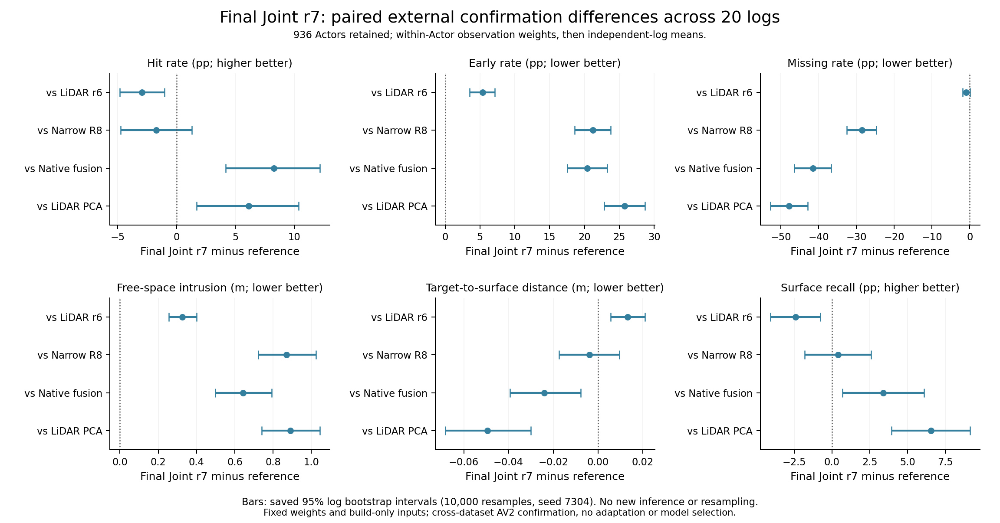

# V7.3 最终结果：固定联合对照与跨域确认

最终固定AV2跨域确认失败：Joint r7相对匹配LiDAR r6的hit−2.9419pp、early+5.3637pp、free+.325997m、target→surface距离+.013259m、recall−2.4204pp，五项95%日志配对区间均排除0且方向更差；free在20/20日志变差。miss−.9625pp的区间[−1.9366,+.0576]pp跨0，不构成可靠改善或等效。开发5日志hit+10.5363pp等正结果仍成立，但未通过20个独立AV2日志的跨数据集确认。本轮V7.3联合方法的可泛化物理表面主张实验失败/未获支持，不外推所有视觉基座无用。 固定场景评价进行中，随后报告与仓库收尾关机。

## 最终Joint r7开发结果

最终开发对照r7−r6显示联合几何增益：hit+10.5363pp（95%日志配对区间[+6.4624,+14.6212]pp，5/5改善），miss−4.3793pp（[−9.3948,−.2924]pp，4/5），测量→表面distance−.079399m（[−.187384,−.009326]m，4/5）。early−1.5225pp（[−5.7790,+2.7510]pp）、free+.042022m（[−.000489,+.069738]m）、recall+8.4288pp（[−.7072,+23.9799]pp）三项区间跨0。free四日志变差，不能用不显著掩盖其风险，也不能把此结果归类为Joint≈LiDAR或全部失败。该结果仅支持开发几何与正确首返回有增量；下述独立AV2确认已否定本轮跨域联合增益。

WS-V73-Q-V2-01/20260909T131000Z__open-charts-joint-first-surface-s7304-r7，训练code185bc728，30轮11130实际更新/0跳步/0恢复，489 initial/final完整。75 DEV/5日志，23无owned/8空对象保留；hit/early/miss/free/distance/recall=.496040/.214590/.161786/.279829/.093915/.808715。wall20249.418502s（5.625h）、GPU10.223834GiB、RSS34.127140GiB，744冻结前缀视图；可训练DPT32654562/Query1706413，DPT首project最大变化.005171027。原生辅助173972测量/轮，measurement-weighted Huber .845831→.486418m；几何通路有效不等于所有物理指标改善。

| 方法 | hit | early | miss | free (m) | distance (m) | recall |
|---|---:|---:|---:|---:|---:|---:|
| 最终Joint r7 | 0.496040 | 0.214590 | 0.161786 | 0.279829 | 0.093915 | 0.808715 |
| 匹配LiDAR r6 | 0.390677 | 0.229815 | 0.205579 | 0.237807 | 0.173315 | 0.724428 |
| 闭合Joint r1 | 0.284584 | 0.269437 | 0.302179 | 0.179303 | 0.188367 | 0.594776 |
| 窄片LiDAR R8 | 0.310028 | 0.055909 | 0.568336 | 0.034320 | 0.229553 | 0.719452 |

### r7 − first_surface_r6

| 指标 | 差值 | 95%日志区间 | 改善日志 |
|---|---:|---:|---:|
| hit (pp) | +10.536328 | [+6.462386, +14.621212] | 5/5 |
| early (pp) | -1.522530 | [-5.778995, +2.750959] | 3/5 |
| miss (pp) | -4.379282 | [-9.394751, -0.292384] | 4/5 |
| free (m) | +0.042022 | [-0.000489, +0.069738] | 1/5 |
| distance (m) | -0.079399 | [-0.187384, -0.009326] | 4/5 |
| recall@.2m (pp) | +8.428781 | [-0.707206, +23.979900] | 3/5 |

### r7 − closed_joint_r1

| 指标 | 差值 | 95%日志区间 | 改善日志 |
|---|---:|---:|---:|
| hit (pp) | +21.145585 | [+12.782797, +30.062628] | 5/5 |
| early (pp) | -5.484736 | [-14.301585, +2.465802] | 3/5 |
| miss (pp) | -14.039279 | [-18.419384, -10.013937] | 5/5 |
| free (m) | +0.100526 | [-0.010051, +0.231317] | 1/5 |
| distance (m) | -0.094452 | [-0.139853, -0.070119] | 5/5 |
| recall@.2m (pp) | +21.393989 | [+15.431888, +30.068193] | 5/5 |

### r7 − lidar_r8

| 指标 | 差值 | 95%日志区间 | 改善日志 |
|---|---:|---:|---:|
| hit (pp) | +18.601202 | [+13.673443, +22.629498] | 5/5 |
| early (pp) | +15.868010 | [+6.734055, +27.130864] | 0/5 |
| miss (pp) | -40.655025 | [-53.016646, -28.293404] | 5/5 |
| free (m) | +0.245509 | [+0.077581, +0.475802] | 0/5 |
| distance (m) | -0.135638 | [-0.308923, -0.013106] | 4/5 |
| recall@.2m (pp) | +8.926332 | [+1.648816, +17.762746] | 4/5 |

Joint新增原生种子、DPT多尺度特征、build-depth辅助项，比较整条系统增量，不是纯视觉特征因果隔离。同表面和物理目标、相同FIT/full_track/30轮预算；训练时长不同。开发5日志已参与多轮结构选择，不冒称全新确认。

训练首面数179962→186091/轮，miss吸引44201→38072；首面项.584286→.453181m、miss项1.760630→1.320796m。DPT梯度中位数447.8159→193.2195，Query34.8176→26.8733，均为变化采样过程量。FIT20日志曾用于监督，不能作独立泛化证据。

## 最终独立AV2确认

证据docs/autoresearch/worldsim_v73/final_confirmation/{analysis,models}.json及配对图；run WS-V73-FINAL-CONFIRMATION-01/20260909T135000Z__fixed-r7-r6-external20-r1，执行code6499d34d，全部五方法936对象/20日志/0优化更新。878 ready、58缺输入、119无owned heldout对象均保留；含221移动>2m/s、108运动未知、556 build<100对象。模型/尺度/配置固定在读取外部质量之前，未按AV2再训练、调参或挑场景。

最终固定AV2跨域确认失败：Joint r7相对匹配LiDAR r6的hit−2.9419pp、early+5.3637pp、free+.325997m、target→surface距离+.013259m、recall−2.4204pp，五项95%日志配对区间均排除0且方向更差；free在20/20日志变差。miss−.9625pp的区间[−1.9366,+.0576]pp跨0，不构成可靠改善或等效。开发5日志hit+10.5363pp等正结果仍成立，但未通过20个独立AV2日志的跨数据集确认。本轮V7.3联合方法的可泛化物理表面主张实验失败/未获支持，不外推所有视觉基座无用。

| 方法 | hit (%) | early (%) | miss (%) | free (m) | target→surface (m) | recall (%) |
|---|---:|---:|---:|---:|---:|---:|
| joint_r7 | 36.36411 | 31.24463 | 14.09236 | 0.98799 | 0.12243 | 82.47716 |
| lidar_r6 | 39.30597 | 25.88088 | 15.05485 | 0.66199 | 0.10917 | 84.89752 |
| lidar_r8 | 38.09307 | 10.01218 | 42.66139 | 0.11732 | 0.12630 | 82.06882 |
| native_fusion | 28.08955 | 10.86753 | 55.55180 | 0.34542 | 0.14638 | 79.09344 |
| lidar_pca | 30.21880 | 5.50130 | 61.91889 | 0.09831 | 0.17192 | 75.93295 |

### Joint r7 − lidar_r6

| 指标 | 差值 | 95%日志配对区间 | 改善日志 |
|---|---:|---:|---:|
| hit (pp) | -2.941859 | [-4.799452, -1.011212] | 5/20 |
| early (pp) | +5.363747 | [+3.504482, +7.152947] | 2/20 |
| miss (pp) | -0.962489 | [-1.936584, +0.057642] | 13/20 |
| free (m) | +0.325997 | [+0.254292, +0.400425] | 0/20 |
| target→surface (m) | +0.013259 | [+0.005615, +0.020966] | 5/20 |
| recall@.2m (pp) | -2.420367 | [-4.078012, -0.772483] | 6/20 |

### Joint r7 − lidar_r8

| 指标 | 差值 | 95%日志配对区间 | 改善日志 |
|---|---:|---:|---:|
| hit (pp) | -1.728963 | [-4.749776, +1.299673] | 8/20 |
| early (pp) | +21.232448 | [+18.619331, +23.780034] | 0/20 |
| miss (pp) | -28.569031 | [-32.502077, -24.780016] | 20/20 |
| free (m) | +0.870670 | [+0.721358, +1.024894] | 0/20 |
| target→surface (m) | -0.003865 | [-0.017437, +0.009558] | 10/20 |
| recall@.2m (pp) | +0.408339 | [-1.813609, +2.582524] | 10/20 |

### Joint r7 − native_fusion

| 指标 | 差值 | 95%日志配对区间 | 改善日志 |
|---|---:|---:|---:|
| hit (pp) | +8.274564 | [+4.180202, +12.157926] | 15/20 |
| early (pp) | +20.377095 | [+17.519687, +23.240465] | 0/20 |
| miss (pp) | -41.459435 | [-46.449055, -36.705091] | 20/20 |
| free (m) | +0.642562 | [+0.497876, +0.791740] | 0/20 |
| target→surface (m) | -0.023944 | [-0.039367, -0.007723] | 14/20 |
| recall@.2m (pp) | +3.383713 | [+0.681959, +6.070877] | 14/20 |

### Joint r7 − lidar_pca

| 指标 | 差值 | 95%日志配对区间 | 改善日志 |
|---|---:|---:|---:|
| hit (pp) | +6.145312 | [+1.694140, +10.349112] | 16/20 |
| early (pp) | +25.743330 | [+22.842957, +28.668741] | 0/20 |
| miss (pp) | -47.826523 | [-52.802125, -42.950231] | 20/20 |
| free (m) | +0.889678 | [+0.740346, +1.043657] | 0/20 |
| target→surface (m) | -0.049485 | [-0.068339, -0.030029] | 16/20 |
| recall@.2m (pp) | +6.544207 | [+3.940373, +9.123389] | 18/20 |

相对R8，Joint大幅减少missing，却显著增加early/free，hit与距离/recall增量不确定；相对native融合/PCA，覆盖与hit提升也伴随更严重early/free。故不能挑选较弱基线或只报告missing，将最终方法包装为全面胜出。距离为稀疏测量到表面的单向、条件指标，不是完整真值Chamfer；UNKNOWN不作FREE。

## 失败解释与结论边界

已证实的失败表现是跨域联合增量反转及early/free冲突；开发取证表明规则局部片也会错误延伸并遮挡后方正确支持，严重sliver并非这些early面的解释。域差异、视图/标定嵌入与米制对齐残差、局部视觉对应污染、支持域外扩是可能机制，未做因果隔离，不能写成已定位唯一根因。Joint同时改变native种子、可训练DPT特征及build-depth辅助项，故不是纯视觉特征消融。无OOM或资源阻断，不能用算力不足解释本次负结果。

构造性监督和首面监督确实改变了表面并产生开发收益，不是冻结外挂无梯度试验。训练DPT的真实几何梯度、实际参数更新和资源记录见上文及ray_support/open_joint_check_r1.json。开发反复选择的5日志无法代替独立证据；AV2的相机体系/运动和数据分布不同，结果证明当前方法未能跨域确认，不证明同分布未见nuScenes日志必然失败。已有开发取证不能冒充AV2因果取证，未根据新日志再选模型。

论文中witness orthogonal算子仅为CPU数值原型，learned support domain/end-to-end训练未验证，不属于固定r7方法，不作为最终成功证据。后续方案仅留为讨论，本轮不继续试验。

## 固定场景与交付状态

已于2026-09-09 21:25:58 UTC启动登记的固定场景确认，WS-V73-FINAL-SCENE-01/20260909T135000Z__fixed-r7-r6-external20-r1，code65854c27、shell PID175098、controller_logs/final_scene_r1.log。只组合现有表面与固定build背景，CPU评价，无新候选或训练；等完整结果再收口F04。论文任务65854c27已完成且其渲染/分析进程退出；由本任务将外部和场景结果整合进paper/main.pdf。完成文档/push、暂停调度、确认所有任务退出后shutdown。
