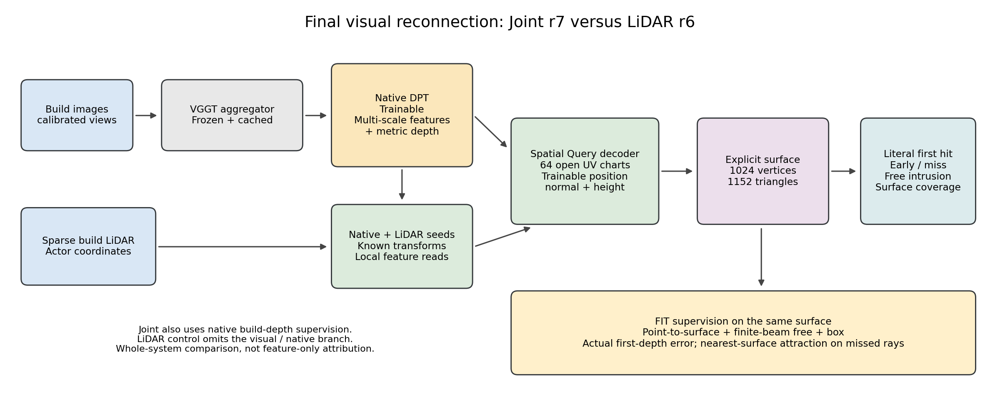
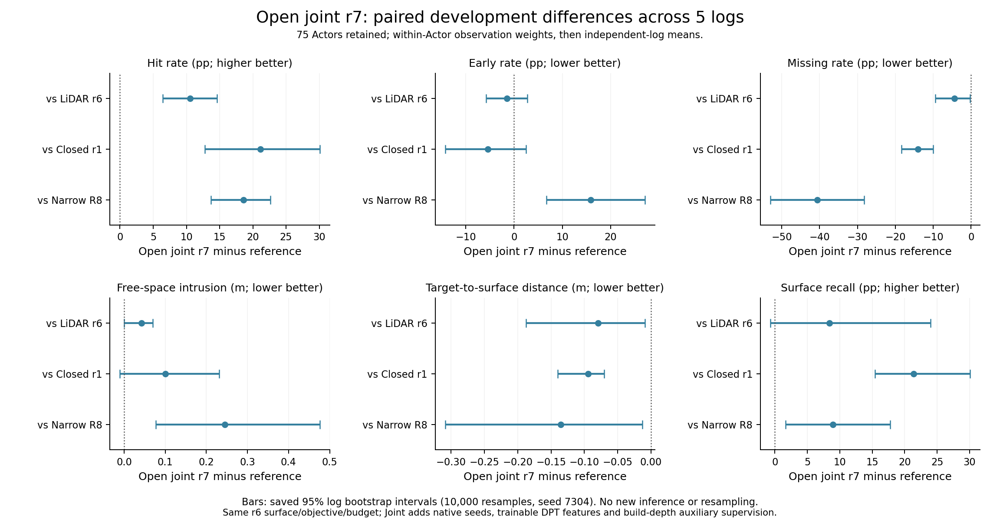
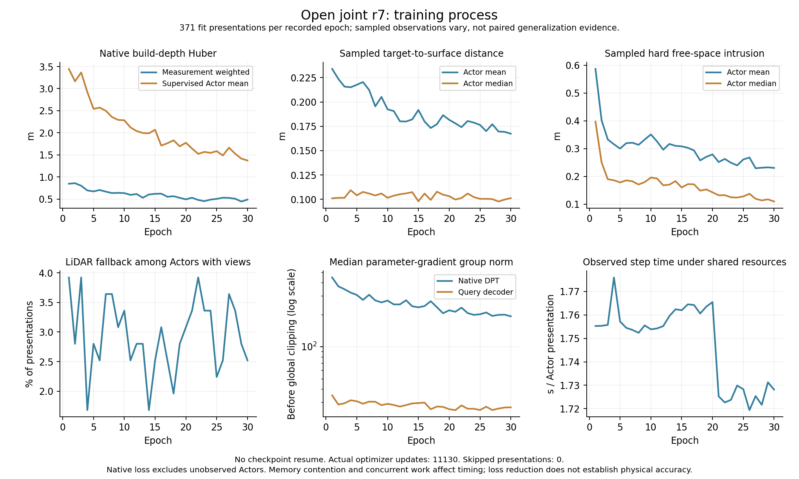

# V7.3 最终结果：固定联合对照与跨域确认

当前：开发r7已收口，外部固定确认进行中，完整跨域结果pending。此文档由原自动研究任务维护；paper/main.pdf由并行论文任务维护。

## 最终Joint r7开发结果

最终开发对照r7−r6显示联合几何增益：hit+10.5363pp（95%日志配对区间[+6.4624,+14.6212]pp，5/5改善），miss−4.3793pp（[−9.3948,−.2924]pp，4/5），测量→表面distance−.079399m（[−.187384,−.009326]m，4/5）。early−1.5225pp（[−5.7790,+2.7510]pp）、free+.042022m（[−.000489,+.069738]m）、recall+8.4288pp（[−.7072,+23.9799]pp）三项区间跨0。free四日志变差，不能用不显著掩盖其风险，也不能把此结果归类为Joint≈LiDAR或全部失败。当前仅支持联合通路对开发几何与正确首返回有增量；完整物理主张和跨域泛化尚待固定确认。

WS-V73-Q-V2-01/20260909T131000Z__open-charts-joint-first-surface-s7304-r7，训练code185bc728，30轮11130实际更新/0跳步/0恢复，489 initial/final完整。75 DEV/5日志，23无owned/8空对象保留；hit/early/miss/free/distance/recall=.496040/.214590/.161786/.279829/.093915/.808715。wall20249.418502s（5.625h）、GPU10.223834GiB、RSS34.127140GiB，744冻结前缀视图；可训练DPT32654562/Query1706413，DPT首project最大变化.005171027。原生辅助173972测量/轮，measurement-weighted Huber .845831→.486418m；几何通路有效不等于所有物理指标改善。

| 方法 | hit | early | miss | free (m) | distance (m) | recall |
|---|---:|---:|---:|---:|---:|---:|
| 最终Joint r7 | 0.496040 | 0.214590 | 0.161786 | 0.279829 | 0.093915 | 0.808715 |
| 匹配LiDAR r6 | 0.390677 | 0.229815 | 0.205579 | 0.237807 | 0.173315 | 0.724428 |
| 闭合Joint r1 | 0.284584 | 0.269437 | 0.302179 | 0.179303 | 0.188367 | 0.594776 |
| 窄片LiDAR R8 | 0.310028 | 0.055909 | 0.568336 | 0.034320 | 0.229553 | 0.719452 |

### r7 − first_surface_r6

| 指标 | 差值 | 95%日志区间 | 改善日志 |
|---|---:|---:|---:|
| hit (pp) | +10.536328 | [+6.462386, +14.621212] | 5/5 |
| early (pp) | -1.522530 | [-5.778995, +2.750959] | 3/5 |
| miss (pp) | -4.379282 | [-9.394751, -0.292384] | 4/5 |
| free (m) | +0.042022 | [-0.000489, +0.069738] | 1/5 |
| distance (m) | -0.079399 | [-0.187384, -0.009326] | 4/5 |
| recall@.2m (pp) | +8.428781 | [-0.707206, +23.979900] | 3/5 |

### r7 − closed_joint_r1

| 指标 | 差值 | 95%日志区间 | 改善日志 |
|---|---:|---:|---:|
| hit (pp) | +21.145585 | [+12.782797, +30.062628] | 5/5 |
| early (pp) | -5.484736 | [-14.301585, +2.465802] | 3/5 |
| miss (pp) | -14.039279 | [-18.419384, -10.013937] | 5/5 |
| free (m) | +0.100526 | [-0.010051, +0.231317] | 1/5 |
| distance (m) | -0.094452 | [-0.139853, -0.070119] | 5/5 |
| recall@.2m (pp) | +21.393989 | [+15.431888, +30.068193] | 5/5 |

### r7 − lidar_r8

| 指标 | 差值 | 95%日志区间 | 改善日志 |
|---|---:|---:|---:|
| hit (pp) | +18.601202 | [+13.673443, +22.629498] | 5/5 |
| early (pp) | +15.868010 | [+6.734055, +27.130864] | 0/5 |
| miss (pp) | -40.655025 | [-53.016646, -28.293404] | 5/5 |
| free (m) | +0.245509 | [+0.077581, +0.475802] | 0/5 |
| distance (m) | -0.135638 | [-0.308923, -0.013106] | 4/5 |
| recall@.2m (pp) | +8.926332 | [+1.648816, +17.762746] | 4/5 |

Joint新增原生种子、DPT多尺度特征、build-depth辅助项，比较整条系统增量，不是纯视觉特征因果隔离。同表面和物理目标、相同FIT/full_track/30轮预算；训练时长不同。开发5日志已参与多轮结构选择，不冒称全新确认。

训练首面数179962→186091/轮，miss吸引44201→38072；首面项.584286→.453181m、miss项1.760630→1.320796m。DPT梯度中位数447.8159→193.2195，Query34.8176→26.8733，均为变化采样过程量。FIT20日志曾用于监督，不能作独立泛化证据。

r7汇总已由并行论文任务执行一次（/root/autodl-tmp/paper_r7_summary.log），本任务复用归档，不重复汇总/训练。模型与确认方案已固定：按登记的FINAL-CONFIRMATION-01/20260909T135000Z__fixed-r7-r6-external20-r1顺序运行r7/r6/R8/native融合/PCA，随后同固定背景场景评价；不根据新日志调参或再启动候选。当前20新日志的模型质量仍未读取，确认待启动。跨域和背景问题作为结果边界，不能预先宣布论文主假设全部成功。

另有用户正在进行的“更新WorldSim论文与失败切片可视化”任务，负责paper/和paper_forensics，已发送共享文件协调信息；保留其未提交文件，不代为stage/覆盖。它的Blender任务仍运行，最终shutdown必须等待其渲染/论文任务完成以及所有训练/评价/数据任务退出。当前任务继续负责最终确认及三本台账，最终push后再关机，不恢复无限扩展。

## 固定20日志确认已启动，论文取证协同（2026-09-09 19:04 UTC）

WS-V73-FINAL-CONFIRMATION-01/20260909T135000Z__fixed-r7-r6-external20-r1已于19:03:26 UTC启动，执行code6499d34d、shell PID169169。19:04:35快照Joint r7已完成68/936对象，allocated峰值5.437806GiB；r6/R8/native融合/PCA待顺序执行，0优化更新。外部模型质量评价现已开始，不能再写“20日志质量未读取”；配置已于开发阶段固定，禁止根据外部结果更改。完整五方法后收口Actor日志配对，再一次固定背景场景确认；当前无完整跨域结论。证据final_confirmation/started.json及run/manifest.json，日志controller_logs/final_confirmation_r1.log。

并行论文任务明确负责paper/、paper_forensics和自己的脚本，未修改本任务台账，也不会启动确认。已核实其取证summary/manifest：原75 DEV/11886 owned束，六方法AdaPoinTr、VGGT-native、R8、r3、r4、r6，不含最终r7；q=三边平方和/(4√3面积)，early面q>10计数全部0。r4/r6约94.7%/91.0%的日志等权early贡献来自“连通片至少有一个build端点在.2m内”的片。此支持定义不证明整个片正确，也不证明没有任何形变；不能将错误默认归因细长面或无支持浮片。按build支持剪连通片使r4 miss20.3879%→26.2698%、r6 20.5579%→27.4044%，并不能保住原覆盖。基于heldout删除early面是oracle诊断，未改部署输出或训练，不拿它作为模型成绩。证据paper_forensics/20260909T184200Z__saved-surface-oracles-r1/{summary,manifest}.json，已存在诊断不再重跑。

r7开发已显示hit/miss/distance增益而free风险仍在，保持完整结论，不宣布整个联合主线失败或物理问题已解决。论文的可视化和新算子原型归并行任务，其原型不是本次固定r7权重的方法，也不是新确认候选。Blender仍CPU渲染；最终shutdown需所有训练/确认/数据及论文渲染任务结束并完成push，当前不关机。

三本台账/最终结果报告同步，failure_ledger_delta=update V73-F02 with existing forensic evidence; no new failure ID。F03/F04/F05/F09边界仍按证据保留，下一V73-F10；每30分钟跟进至最终收尾。

---
