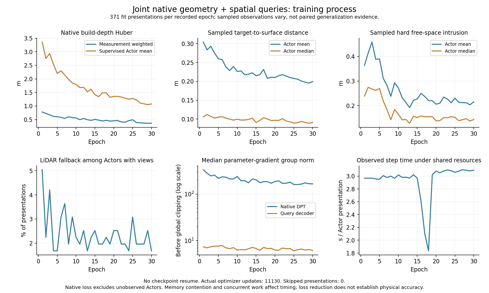
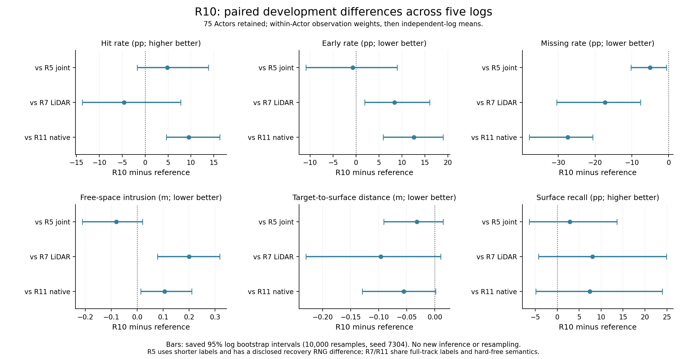

# V7.3：同全轨迹监督的原生几何控制

截至2026-09-08 14:30 UTC，R10联合模型与R11原生强控制均完成30轮和最终评价。R10比R11有更多硬hit、更少missing，但early/free也更差，不能据覆盖均值宣称主假设成立。R12有限宽束联合模型已启动，R14同目标原生控制继续运行；三角对照尚未收口，完整V7.3未完成。

## 对照定义

共同数据是完整489 Actor的population，旧输入路径中371 FIT参与训练、67 development可预测，51零build LiDAR对象保留缺失。两项都从M1r3初始化，读取全24视图/744份冻结前缀；仅FIT使用既定full_track几何标签，模型输入仍只有build图像/LiDAR/标定/已知轨迹，development没有梯度。

共同目标为target→surface覆盖＋0.5 hard range free＋0.05 box envelope＋1.0 build native像素深度，event关闭；seed7304、AdamW lr1e-5、目标30轮。native depth使用当前相机像素的真实build LiDAR，独立于预测框内候选，保留F06修复。相机、轨迹、build尺度只读。

| 方法 | 实际run与进程 | 可训练通路 | 物理表面 |
|---|---|---|---|
| R10 joint | `20260907T233000Z__population-joint-full-track-s7304-r10`；code26a7e509，done，PID53472已退出 | DPT32654562＋query1670517参数 | 局部空间查询生成的位置/法向/片形状 |
| R11 native_only | `20260907T233000Z__population-native-only-full-track-s7304-r11`；code9541ac7d，done | DPT32654562参数，query冻结 | native＋LiDAR中心的PCA曲面片 |

以上均位于`WS-V73-M2-GLOBAL-ACTOR-01`。日志分别为`/root/autodl-tmp/controller_logs/v73_population_joint_r10.log`、`v73_population_native_r11.log`。当前observed allocated峰值分别10.213784/2.346402GiB；训练期间共享GPU，不能用各自allocated峰值相加代替某时刻实际总显存。

R11原生深度在正确相机曝光和Actor轨迹下回投规范坐标，融合原build LiDAR和512个native FPS支持，使用min(build,1024)+512中心、0.06m PCA片。PCA邻域/方向每步重算但本步停止梯度；所选native中心的真实位置梯度回传DPT。无相机或无有效几何/native数据梯度时，保留相应LiDAR读出，呈现不虚报为optimizer更新。

query模块在R11仅提供固定grid/数量定义，无逐点MLP或局部交互；DPT内部多层多尺度解码仍完整。训练每步重新解码，绝不跨优化步缓存DPT输出。只有一次固定权重的初始化/最终no-grad评价可按scene/view共享深度；冻结聚合前缀继续共享。不减少视图、分辨率或原始观测。

## R10完成：覆盖与硬首表面仍有冲突（2026-09-08 14:30 UTC）

R10完成30轮、11130次Actor呈现及11130次真实更新，零跳步、零恢复；489对象最终记录和412133346字节`latest.pt`均保存，PID53472已退出。可训练DPT32654562＋Query1670517参数，native_project相对M1r3最大变化.005422188；wall33811.146305s（9.392h）、allocated峰值10.213784GiB、RSS峰值34.030704GiB。全部744份冻结前缀/每窗口24视图保留。只缓存完全冻结前缀，DPT与Query实际反向；没有据此宣称上层聚合器LoRA已训练。

| 过程量 | 第1轮 | 第30轮 |
|---|---:|---:|
| 实际更新 / 371呈现 | 371 | 371 |
| 有相机 / native有监督呈现 | 357 / 346 | 357 / 346 |
| native测量加权Huber（m） | 0.781005 | 0.365007 |
| native有监督Actor平均Huber（m） | 3.354427 | 1.076657 |
| 采样target→surface平均距离（m） | 0.304005 | 0.199457 |
| 采样hard free平均侵入（m） | 0.363581 | 0.215236 |
| 有相机但native支持为空 | 18 | 6 |
| DPT梯度范数中位数，裁剪前 | 331.386047 | 164.867477 |
| Query梯度范数中位数，裁剪前 | 7.387202 | 6.176600 |

每轮native测量173972点，14个无相机对象仍通过LiDAR/Query路径更新。采样目标与原束随步变化，上表是优化过程，不是固定集合配对或泛化证据。共享GPU的wall也不是独占吞吐；R11无梯度呈现跳步，二者同轮数不等于同实际更新数或FLOPs。

完整开发75 Actor/5日志，23对象没有owned返回仍保留，8个零LiDAR对象为空表面；52对象可评价owned返回。指标先在Actor内按真实观测归并，再在日志内平均Actor，最后日志等权。hit/early/miss都是原始归属束的字面首交点结果，表中三列未列出late，不能要求三者相加为1。free使用全部原始near-box束，不只使用归属返回；单向distance不是对称Chamfer，也不等同完整表面精度。

| 方法 | hit | early | miss | free（m） | 单向distance（m） | recall@.2m |
|---|---:|---:|---:|---:|---:|---:|
| R10初始化 | 0.221164 | 0.122749 | 0.511425 | 0.302697 | 0.156341 | 0.791305 |
| **R10 joint/full_track/hard free** | 0.271463 | 0.202637 | 0.326175 | 0.271026 | 0.113193 | 0.826047 |
| R11 native/full_track/hard free | 0.176111 | 0.076432 | 0.600949 | 0.164965 | 0.168504 | 0.751499 |
| R5 joint/短窗/hard free | 0.222773 | 0.209807 | 0.377094 | 0.351717 | 0.145289 | 0.797126 |
| R7 LiDAR/full_track/hard free | 0.317549 | 0.118390 | 0.498974 | 0.071575 | 0.209524 | 0.745468 |
| R9 LiDAR/full_track/beam+event | 0.324688 | 0.060060 | 0.545686 | 0.038543 | 0.227363 | 0.724665 |
| LiDAR PCA | 0.212448 | 0.043527 | 0.734104 | 0.017708 | 0.304790 | 0.654182 |

### 与同目标原生控制R11配对

| 指标 | R10−对照 | 95%日志配对区间 | 改善日志数 |
|---|---:|---:|---:|
| hit，百分点 | +9.535 | [+4.616, +16.268] | 5/5 |
| early，百分点 | +12.620 | [+5.904, +18.968] | 0/5 |
| miss，百分点 | -27.477 | [-37.927, -20.665] | 5/5 |
| free，m | +0.106062 | [+0.013990, +0.209804] | 1/5 |
| 单向distance，m | -0.055311 | [-0.129487, +0.001635] | 4/5 |
| recall，百分点 | +7.455 | [-4.861, +23.965] | 3/5 |

Query在5个开发日志都提高hit并降低missing，同时5日志early都变差、free也整体增大。距离和召回的平均值有利，但5日志区间跨0，不能把均值改善称为稳定的表面准确性优势。此比较包含位置生成、法向/片形状和相互作用的整体变化，不能单独归因于attention；同容量pointwise控制仍未完成。

### 与同full_track LiDAR控制R7配对

| 指标 | R10−对照 | 95%日志配对区间 | 改善日志数 |
|---|---:|---:|---:|
| hit，百分点 | -4.609 | [-13.684, +7.766] | 1/5 |
| early，百分点 | +8.425 | [+1.889, +16.084] | 1/5 |
| miss，百分点 | -17.280 | [-30.451, -7.635] | 5/5 |
| free，m | +0.199452 | [+0.077589, +0.317941] | 1/5 |
| 单向distance，m | -0.096331 | [-0.230190, +0.010344] | 3/5 |
| recall，百分点 | +8.058 | [-4.243, +24.882] | 3/5 |

R10降低missing，但early与free显著增加；hit均值较低且区间跨0。视觉联合路径尚未超过这个同监督控制的物理表现。R9含beam+event，不是同目标架构控制：R10−R9的hit−5.322pp [−13.844,+5.424]pp，free+.232484m [+.116828,+.348139]m，故也不能声称主假设成立。

### 扩大FIT标签与初始化比较

| 指标 | R10−对照 | 95%日志配对区间 | 改善日志数 |
|---|---:|---:|---:|
| hit，百分点 | +4.869 | [-1.708, +13.789] | 3/5 |
| early，百分点 | -0.717 | [-10.925, +9.004] | 3/5 |
| miss，百分点 | -5.092 | [-10.279, -0.610] | 4/5 |
| free，m | -0.080691 | [-0.211371, +0.020145] | 3/5 |
| 单向distance，m | -0.032096 | [-0.090876, +0.014648] | 3/5 |
| recall，百分点 | +2.892 | [-6.377, +13.611] | 3/5 |

相对R5，full_track联合训练的missing降低5.092pp且配对区间不跨0，其余所列指标区间跨0。R5原始第22轮退出后从epoch21恢复，旧checkpoint缺完整RNG，标签范围之外仍有已披露的恢复执行差异；不作严格相同随机轨迹的单因素结论。

R10相对自身初始化：hit+5.030pp [−1.704,+12.700]pp、early+7.989pp [+3.598,+12.380]pp、miss−18.525pp [−23.644,−14.488]pp、free−.031671m [−.080433,+.017091]m、distance−.043148m [−.117521,+.005908]m、recall+3.474pp [−6.143,+15.310]pp。不能用“训练后有更多返回”代替正确首表面。

所有95%区间复用一次5日志配对bootstrap，10000次、seed7304；只作为当前开发日志的不确定性描述，不是独立确认。图直接读取已保存区间，没有新推理或重采样。

### FIT与移动子集的解释边界

FIT完整414对象/20日志、43个空表面：hit.245192→.298358，early.204163→.234043，miss.419341→.282319，free.340482→.338203m，distance.119997→.099024m、recall.837446→.857173。hit差+5.317pp [+1.204,+9.729]pp，distance差−.020973m [−.035910,−.006866]m；这些评价时刻已包含于full_track FIT标签，不是泛化结果。

移动子集由输入元数据速度>2m/s定义：9 Actor/2日志，3个无owned返回、1个空表面；实际6个有owned对象、6657条返回。R10日志均值hit.630446、early.091776、miss.115946、free.085736m、distance.054255m、recall.960494。这个看似很高的hit受极小分母强烈影响：日志`ddc03471df3e4c9bb9663629a4097743`只有scene-0359的Actor `c07f236adcb84696b308aa744c835461`一条owned返回（16条near-box束），R10由其他模型的early/missing变成hit1.0；日志等权赋予它一半权重。另一日志`ca6d14b008ed4e0bb6b1eaaedadbd6c1`有6656条owned返回，R10 hit.260892，相对R5仅+.046668，相对R7反而−.093788。不能把两日志总体的大幅改善当作稳定动态重建证据，也不为消除这个现象事后删样本或更改主聚合。每Actor/日志分母完整保留，后续独立日志仍需实际验证。

R10的`failure_ledger_delta=update V73-F02 evidence; no new failure ID`。结合已完成固定表面诊断，覆盖与正确沿束支持仍须分开；R12/R14尚未完成，未提前收口三角。保持可训练基座/显式表面/物理约束；若finite-beam比较仍保留冲突，按revision5优先改变Query surface parameterization，再分别评估near-surface certified-free与局部对应一致性，不混改当前训练。

证据：`docs/autoresearch/worldsim_v73/m2/global/population_joint_r10_summary.json`、`population_joint_r10_analysis.json`、`population_joint_r10_training.json`；run中checkpoint、完整train.jsonl与owner_surface.pt保留。训练code26a7e509，本次汇总基于1dad4dd8后的工作树，只消费保存结果。20新日志模型质量仍未读取。

## R11真实训练与资源

30轮11130次Actor呈现、10550次optimizer更新、580次无梯度跳步，涉及22个Actor；其中420次来自14个无相机Actor，160次来自有相机但无框内native支持、退回固定LiDAR的情况。全部跳步记录均无native build对应，DPT/query梯度范数均为0。旧日志没有显式`skip_reason`字段，通用摘要中的该字段全0不能解释为没有跳步。

完整DPT的32654562参数参与训练，query可训练参数为0；native_project相对M1r3最大变化0.005223576。wall30855.513131s（8.571h）、GPU allocated峰值2.346402GiB、RSS峰值34.607677GiB；共享GPU下的wall不是独占吞吐，无恢复、无OOM。所有489对象最终均保留记录，51零LiDAR对象保持缺失。

| 过程量 | 第1轮 | 第30轮 |
|---|---:|---:|
| 实际更新 / 371呈现 | 351 | 352 |
| 有相机 / native有监督呈现 | 357 / 346 | 357 / 346 |
| native测量加权Huber（m） | 0.859150 | 0.361852 |
| native有监督Actor平均Huber（m） | 3.411858 | 1.068846 |
| 采样target→surface平均距离（m） | 0.301641 | 0.229765 |
| 采样hard free平均侵入（m） | 0.121494 | 0.131002 |
| 有相机但native支持为空 | 16 | 5 |
| DPT梯度范数中位数，裁剪前 | 300.158264 | 149.705505 |

每轮native测量173972点；query梯度始终为0。采样射线和目标随训练变化，表中过程均值不是同一组射线的配对泛化评价。过程图直接读取完整训练日志，按native_only模式标注，不套用R5的epoch21恢复叙事。

## R11物理评价

指标先按Actor/日志归并，日志等权。surface distance为单向target→surface距离，不能称为对称Chamfer；空表面保留miss与recall分母，条件距离缺失。下表为75个开发Actor、5个独立日志；初始和最终均有8个空表面。

| 方法 | hit | early | miss | free（m） | 单向distance（m） | recall@.2m |
|---|---:|---:|---:|---:|---:|---:|
| R11初始化 | .227771 | .091551 | .573543 | .150304 | .162474 | .781294 |
| R11最终 | .176111 | .076432 | .600949 | .164965 | .168504 | .751499 |
| LiDAR PCA | .212448 | .043527 | .734104 | .017708 | .304790 | .654182 |
| R7 LiDAR/full_track/hard free | .317549 | .118390 | .498974 | .071575 | .209524 | .745468 |
| R9 LiDAR/full_track/beam+event | .324688 | .060060 | .545686 | .038543 | .227363 | .724665 |
| R5 joint/短窗/hard free | .222773 | .209807 | .377094 | .351717 | .145289 | .797126 |

同run最终减初始化的95%区间由5日志配对bootstrap获得，10000次、seed7304；正负方向按列解释，不以大量射线冒充独立样本量。

| 指标 | 配对差值 | 95%区间 | 改善日志数 |
|---|---:|---:|---:|
| hit，百分点 | −5.166 | [−10.920, −1.125] | 0/5 |
| early，百分点 | −1.512 | [−2.872, −0.660] | 5/5 |
| miss，百分点 | +2.741 | [−2.697, +8.178] | 2/5 |
| free，m | +.014661 | [−.006742, +.031388] | 1/5 |
| 单向distance，m | +.006030 | [−.006994, +.028313] | 4/5 |
| recall，百分点 | −2.979 | [−8.339, +1.135] | 3/5 |

旧native_fusion对额外5个零LiDAR开发对象产生表面，而R11保持这些对象缺失，故其条件距离均值.175425m与R11初始化.162474m不是同分母。对共同ready67对象，初始化和旧融合的所有指标一致；距离比较必须取共同可评价对象，不能直接混减两个无条件表格均值。

R11−R7的hit−14.144pp、95%[−18.582,−8.623]pp，miss+10.197pp、[+4.691,+16.870]pp；没有超过同full_track LiDAR强控制。R11−R9的free+.126422m、[+.046265,+.199240]m，但R9含beam/event目标，不能视为纯架构差异。相对R5，R11的early/free改善而miss增加22.386pp，[+13.711,+35.555]pp；R5标签较短，此处不能替代与R10的匹配比较。

FIT完整414对象/20日志：hit.230922→.253677，配对+2.276pp、[+.925,+3.701]pp，16/20日志改善；early.121261→.084194，−3.707pp、[−6.431,−1.301]pp，16/20改善；free.141084→.146142m，distance.127989→.121995m、recall.808731→.816866。FIT读数在full_track训练标签范围内，不能当泛化证据。

moving仅9对象/2日志、1个空表面：最终hit.092571、early.032221、miss.678701、free.037033m、distance.120863m、recall.884831；初始化hit.090155、early.099170、free.208179m、distance.080574m、recall.952421。样本有限，不能据此宣称动态形状恢复成功。

证据：`docs/autoresearch/worldsim_v73/m2/global/population_native_r11_summary.json`、`population_native_r11_analysis.json`和`population_native_r11_training.json`。原始run保留checkpoint、train.jsonl和全部owner_surface.pt。

## 比较与尚未完成的结论

R10−R5主要回答FIT标签由短窗扩大为full_track的问题；R10−R7是同full_track下视觉联合路径与LiDAR路径比较；R10−R11比较query生成通路与认真训练的原生头/融合控制。最后一对同时改变位置生成及法向/片形状参数化，不能把差异自动归因为空间attention；完整population同容量pointwise控制仍未运行。

R5本身在覆盖改善时出现early/free退化，已在`WORLDSIM_V7_3_JOINT_R5_RESULTS.md`记录；这既不能替代当前R10/R11比较，也不能推导所有视觉几何适配失败。R5原第22轮意外退出只保留第21轮状态，107个未保存更新留原日志；恢复完成有效11130更新，旧checkpoint缺完整RNG的执行差异已披露，不声称逐比特连续。

R12登记`20260908T050000Z__population-joint-full-track-beam-range-s7304-r12`，从与R10相同的M1r3/seed初始化，仅改变free为`beam_tube_range`、width.03m/resolution32；full_track/native1/free.5/event0/30轮不变。R14登记`20260908T100000Z__population-native-full-track-beam-range-s7304-r14`，同样只将R11的free改为该有限宽束目标，复用同输入的R11初始化及原PCA，重新训练而非恢复。R14已于登记bf04ef32之后启动，PID68108；R10结束后R12于14:13 UTC以code dc6fe427/PID81766启动。14:15 UTC首轮已见DPT与Query真实梯度，allocated峰值10.228380GiB，无OOM；两者当前继续训练，无自动GPU队列。

R11新增V73-F09：本配置训练拟合改善却在开发硬hit上退化，观测污染、共享参数漂移、支持/PCA读出及目标语义的归因尚未完成。卡点先核对[LoRA3D ICLR2025官方项目](https://520xyxyzq.github.io/lora3d/)与[CAPA官方项目](https://research.nvidia.com/labs/dvl/projects/capa/)：两者的场景适配/稀疏测量校准是迁移参考，不证明本项目当前失败原因。R10/R11已完成，继续完成R12/R14同目标比较；若Query覆盖/物理冲突持续，按revision5优先改Query表面参数化，之后再依据独立证据判断DPT适配范围、build场景校准或其他机制；保留CAPA R2既有负结果，不直接重跑、不用confidence逃避free、不否定全部视觉几何适配。

visual-only的R13已完成一轮41次实际更新、DPT/query真实反向，专项结果已归档EMPTY_INPUTS报告；这仅确认新输入训练能执行，不是完整训练或质量成功。R10/R11已完成、R12/R14仍运行，四项均保留原cohort。输入条件扩大、物理目标变化与空间机制分别解释，见`WORLDSIM_V7_3_COMPARISON_PROTOCOLS.md`。新20日志质量确认仍未读取。

原生解码路径依据：[VGGT官方训练说明](https://github.com/facebookresearch/vggt/blob/main/training/README.md)和[DPT实现](https://github.com/facebookresearch/vggt/blob/main/vggt/heads/dpt_head.py)。微调DPT是强控制的既定工作，本身不作为新贡献。
