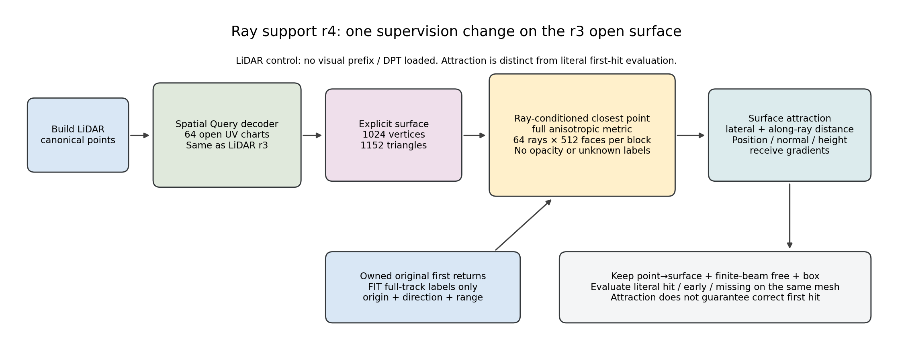
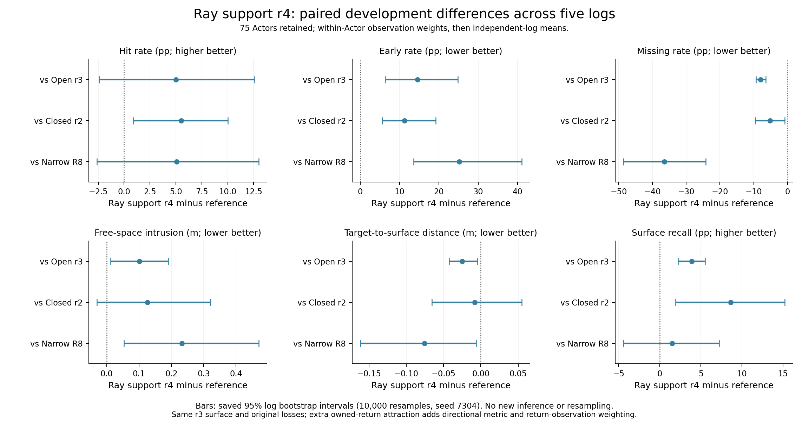
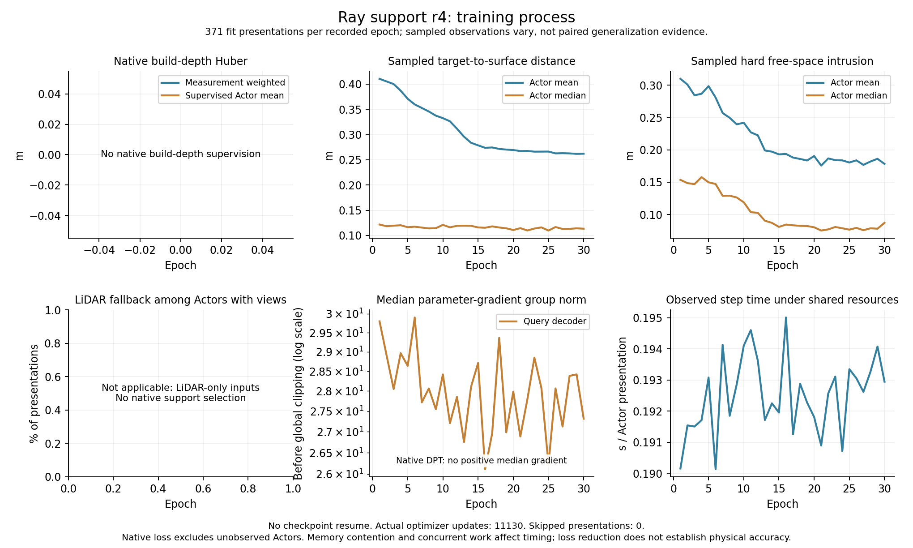
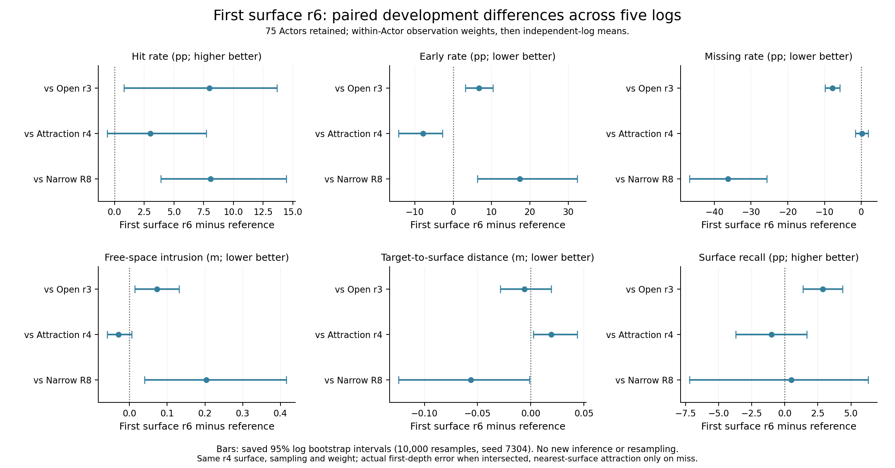
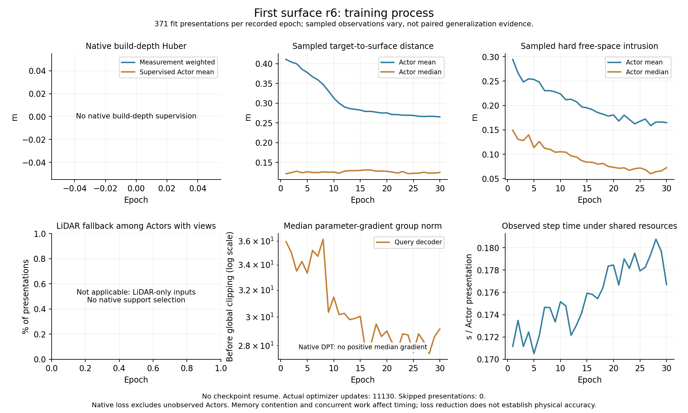

# 射线条件的显式曲面吸引

**最新（2026-09-09 11:14 UTC）：固定分解已完成，下一项优先首个可见表面监督。** 新增early主要落在后方已有正确支持的类别；paper已更新，详见文末。

**当前（2026-09-09 11:06 UTC）：r4 done，覆盖改善伴随early/free恶化，非胜出方法。** 完整区间与下一固定判别见文末；下方running为历史。

**当前（2026-09-09 06:44 UTC）：必要检查done，r4正式训练running。** code28ac577a/PID123769，完整489 initial done，第1/30轮10实际更新/0跳步；最终质量pending，完整执行证据见文末。下方登记时的pending为历史。

2026-09-09 06:37 UTC。实现与独立对照登记，检查和正式质量结果pending；基于r3结果提交8b012af1。任务WS-V73-Q-V2-01，run `20260909T063700Z__open-charts-lidar-ray-support-s7304-r4`。

r3开放chart与闭合LiDAR r2没有建立共同优势，对R8仍是missing下降/free侵入增加。根据用户策略二，保持同一开放chart，只新增真实返回条件的方向吸引；不扩大基座或near-boundary free。现有欧氏target→surface本来有位置梯度，这里检验加入射线方向后，正确沿束支持能否改善，不把所有miss都归因于没有梯度。

## 明确的目标及反传

对归属本Actor的原始首返回，读入只读的原点o、单位方向d、沿束距离r，目标x*=o+rd。对实际三角面上的x，令δ=x−x*，δ∥=d(dᵀδ)，δ⊥=δ−δ∥：

`L_ray = mean_r min_(x in generated triangles) || alpha*delta_perp + delta_parallel ||_2`。

固定alpha=20/3，等价于沿束.2m与横向.03m的相对权重；数值沿用当前优化尺度，它不是标定后的测量噪声，也不认证一个.03m占据圆盘。目标单位米，外层权重1，没有增加可学习置信度、opacity、截断饱和、UNKNOWN标签或positive thickness。完整目标为原coverage + .5*finite_beam_free + .05*box_envelope + 1*L_ray；native/event权重仍0。

实现`motion_proj/worldsim_v73/ray_support.py`：对每条射线，将目标平移到原点并按该方向线性拉伸空间，在每个三角形的面内部及三条边求精确最近点。双层分块64条射线×512面，不保存全射线×全部面反向图。选择最优面及最优重心权重时no_grad，随后重建原空间最近点，仅对这个最优距离向顶点反传；在离散选择不切换处使用包络定理。**重心权重须在完整各向异性度量中求最优**，不能仅按投影选择却任意忽略沿束项的权重导数。单位射线由原数据产生、只读，不重学位姿/轨迹。

这是ray-conditioned coverage候选，不是新first-event概率模型。对于非空曲面，未命中束仍能把已有面拉向真实返回；空网格不会因这个loss凭空生面。它也不保证投影面积、正面朝向、无chart重叠、首交点正确或连续排序梯度。更贴近target的后面可能被选中，前方错误面仍由原free约束；最终必须读同一真实三角面、原硬首交点，不能用最近target的面替换物理输出。

## 监督与对照协议

每个FIT step从原full_track `training_rays` 的 `positive_actor` 中独立抽最多1024条；只用原始首返回/既有归属，不把后方被遮Actor当首返回。既有归属是已知盒与membership代理，不能宣称精确分割或已解决逐点时间误差。旧coverage从去重后的端点抽最多1024，free仍从原全near-box束抽最多512，旧两项采样/权重/时段不变。新项按返回观测计数，重复位置的不同观测可能保留：因此**同时增加方向信息与返回观测加权的监督项**，不是相同样本上的纯度量消融；若有收益再拆分这两种来源。

额外抽样使用独立CUDA Generator seed7305，不消耗旧coverage/free的全局RNG；generator状态写入每轮checkpoint并在resume还原。正式r4从fresh seed7304开始，30轮预期11130实际更新，AdamW1e-5/global clip1。与r3相同64chart/4×4/固定尺寸scale.15、1024顶点1152面、LiDAR-only、371ready FIT/67ready DEV；完整414FIT/75DEV/51不可用保留。重新评价实际initial，最终只收口一次，对照r3为主要单因素问题，并附闭合r2/R8。

训练/评估输入只读build；FIT full_track额外时刻是损失标签，DEV无优化。5原DEV日志配对六指标，空预测和无owned分母保持；20新日志质量未读。raw JSONL记录新项米值、横向/沿束距离、可用/抽样owned数；这些随step抽样变化的值不作泛化证明。单GPU低资源仅是这个LiDAR对照的成本，不能代表联合基础模型成本或宣称视觉通路已训练。

## 一手依据及本机边界

[SoftRas，ICCV2019](https://openaccess.thecvf.com/content_ICCV_2019/html/Liu_Soft_Rasterizer_A_Differentiable_Renderer_for_Image-Based_3D_Reasoning_ICCV_2019_paper.html)及[官方函数接口](https://raw.githubusercontent.com/ShichenLiu/SoftRas/master/soft_renderer/functional/soft_rasterize.py)给出距离型软光栅化，说明轮廓之外也可通过距离获得梯度；本候选不复制其概率alpha聚合，也不把软像素解释成真实激光首返回。[DRC，CVPR2017作者页](https://shubhtuls.github.io/drc/)研究可微射线一致性，借鉴观测沿束语义，不引入其体占据表示。这两个来源不证明本各向异性最近面目标最优，也不构成同任务复现或论文新颖性证据。

一次必要检查入口`scripts/check_worldsim_v73_ray_support.sh`：离轴miss三角上比较原截断event的零梯度、新项的非零梯度/下降方向；alpha=1与已有欧氏最近面相符，并在非切换点检查一个坐标的有限差分。再用元数据首个ready FIT Actor，检验新项对位置/法向/高度的实际梯度和一次联合更新，不重复旧factory或其他回归。检查权重不用于正式训练。

正式入口`scripts/run_worldsim_v73_ray_support_r4.sh`。检查结果和实际运行状态另记，当前pending；收口入口`scripts/summarize_worldsim_v73_ray_support_r4.sh`，仅完整final结束后运行一次。若没有共同物理/覆盖收益，依据保存支持分解决定几何/沿束约束下一项，不进行alpha/weight网格，也不回到upper/DINOv3/full FT。

failure_ledger_refs=[V73-F01,V73-F02,V73-F03,V73-F04,V73-F05,V73-F06,V73-F09]；failure_ledger_delta=none at registration。旧风险保持，未证实解决F03，下一V73-F10；三本台账与计划同步，小步push、30分钟ACTIVE、完成不关机。

## 实际执行

代码28ac577a的一次检查done：离轴未命中三角的原event NLL=28、位置梯度0；新ray项3.333333→3.311111m，横向.500000→.496667m，梯度范数4.714045。alpha=1欧氏最近点误差0，非切换坐标有限差分误差1.56e−10。真实首个ready FIT（scene-0626/055e6afb9b1143a68f69a181b7f266e4）5条owned返回，新项.010925m，ray-only法向/高度/位置梯度1.181130/.568250/25.316832；联合一次更新最大顶点变化.007960m。2.273089s、GPU.087677GiB、RSS1.410324GiB。未读取DEV/新日志，检查不等于质量提升、不能解除F03；不复用检查权重。

WS-V73-Q-V2-01/20260909T063700Z__open-charts-lidar-ray-support-s7304-r4已于06:43:05 UTC fresh启动，code28ac577a/PID123769。06:44:44快照完整489对象initial done、第1/30轮、10实际更新/10呈现/0跳步，已记录有效ray监督；GPU峰值当时.195063GiB，盘余67GiB，无资源短缺。30轮预期11130更新，未完成；不把initial或训练采样loss当最终收益。

同r3开放表示、原coverage/finite-beam/box和数据/优化器不变，新项权重1、横向比例20/3、最多1024 owned束，独立CUDA RNG7305另存/恢复。首个正式step的原coverage1.536066m/free.656263m与r3首步一致；新项7.765499m参与真实反传。此单步一致不是全训练等价性证明。无DPT或视觉前缀，20新日志质量未读；upper/DINOv3/full FT和near-boundary free继续后置。

证据autoresearch/worldsim_v73/ray_support/{path_check_r1,r4_started,r4_started_manifest}.json，定义与组件图见WORLDSIM_V7_3_RAY_SUPPORT.md。完整final后仅运行一次summarize_worldsim_v73_ray_support_r4.sh，对照r3为主并附r2/R8；本次尚未收口r4。failure_ledger_refs=[V73-F01,V73-F02,V73-F03,V73-F04,V73-F05,V73-F06,V73-F09]；failure_ledger_delta=none，旧风险仍active、下一V73-F10。三本台账/计划/报告同步push，30分钟ACTIVE、完成不关机。

---

## r4完整结果（2026-09-09 11:06 UTC）

r4射线条件吸引改善了测量附近覆盖，但加重物理冲突。相对同表示r3，miss−7.9868pp、distance−.025294m、recall+3.8844pp，三项95%日志配对区间均不跨0；同时early+14.5768pp、free+.101371m，区间也不跨0。hit+4.9934pp区间[−2.3967,+12.6030]pp跨0，不能宣称正确首交点已可靠改善。r4不作为共同覆盖/物理胜出方法，不把这个结果外推为所有constructive监督无效。

任务WS-V73-Q-V2-01，run20260909T063700Z__open-charts-lidar-ray-support-s7304-r4，训练code28ac577a，30轮11130实际更新/0跳步/0恢复，完整489 initial/final done；汇总仅执行一次。75 DEV/5日志，23无owned/8空保留；hit/early/miss/free/distance/recall=.360696/.307967/.203879/.266536/.154133/.734597。wall2331.936524s（38.87min）、GPU allocated .210189GiB、RSS1.930431GiB、checkpoint12049071字节；无DPT/图像前缀。20新日志质量未读。

| 方法 | hit | early | miss | free (m) | distance (m) | recall@.2m |
|---|---:|---:|---:|---:|---:|---:|
| 射线吸引r4 | 0.360696 | 0.307967 | 0.203879 | 0.266536 | 0.154133 | 0.734597 |
| 开放chart r3 | 0.310762 | 0.162199 | 0.283747 | 0.165166 | 0.179427 | 0.695753 |
| 闭合LiDAR r2 | 0.305489 | 0.194901 | 0.255388 | 0.140523 | 0.162366 | 0.648249 |
| 旧窄片R8 | 0.310028 | 0.055909 | 0.568336 | 0.034320 | 0.229553 | 0.719452 |

### 对照同表示r3

| 指标 | r4−对照 | 95%日志配对区间 | 改善日志 |
|---|---:|---:|---:|
| hit (pp) | +4.993430 | [-2.396686, +12.602990] | 4/5 |
| early (pp) | +14.576799 | [+6.434591, +24.780500] | 0/5 |
| miss (pp) | -7.986792 | [-9.354536, -6.446227] | 5/5 |
| free (m) | +0.101371 | [+0.012651, +0.190090] | 1/5 |
| 测量→表面 (m) | -0.025294 | [-0.042421, -0.004651] | 4/5 |
| recall@.2m (pp) | +3.884411 | [+2.234210, +5.515151] | 5/5 |

### 对照闭合LiDAR r2

| 指标 | r4−对照 | 95%日志配对区间 | 改善日志 |
|---|---:|---:|---:|
| hit (pp) | +5.520714 | [+0.908813, +9.996858] | 4/5 |
| early (pp) | +11.306581 | [+5.660683, +19.176930] | 0/5 |
| miss (pp) | -5.150903 | [-9.498411, -0.803395] | 4/5 |
| free (m) | +0.126013 | [-0.029530, +0.320526] | 2/5 |
| 测量→表面 (m) | -0.008233 | [-0.065709, +0.054790] | 3/5 |
| recall@.2m (pp) | +8.634808 | [+1.934296, +15.217723] | 4/5 |

### 对照旧窄片R8

| 指标 | r4−对照 | 95%日志配对区间 | 改善日志 |
|---|---:|---:|---:|
| hit (pp) | +5.066834 | [-2.608931, +12.981105] | 4/5 |
| early (pp) | +25.205727 | [+13.588517, +41.029589] | 0/5 |
| miss (pp) | -36.445677 | [-48.676461, -24.214894] | 5/5 |
| free (m) | +0.232216 | [+0.053512, +0.469820] | 0/5 |
| 测量→表面 (m) | -0.075420 | [-0.161949, -0.006542] | 4/5 |
| recall@.2m (pp) | +1.514487 | [-4.458751, +7.245029] | 3/5 |

训练过程的ray项均值1.807623→1.012918m，横向距离.251593→.130846m、沿束绝对距离.366765→.305871m；coverage .410470→.262036m、hard free .309972→.178250m。每轮抽224163条owned返回，Query梯度中位数29.800581→27.316797，均是随机过程量，不作为固定配对泛化结论。完整414 FIT日志均值hit/early/miss/free/distance/recall=.457606/.304668/.117380/.287443/.097345/.863192；full_track已用作监督，不称独立验证。

最近面吸引允许选择后方目标附近面，这是目标定义边界；当前总指标还不能证明新增early主要来自遮挡后方正确面，不能提前归因。新项还改变返回加权和有效几何项强度，收益不是纯方向度量因果。主汇总只运行一次，原run与归档failure_delta同步，图已检查。V73-F02补充证据仍active，无新失败ID，F03不因解析miss梯度解除。

### 后续判别

下一步登记固定表面支持分解WS-V73-M2-SURFACE-SUPPORT-01/20260909T110600Z__open-charts-r3-ray-r4-support-r5（pending）：只读r3/r4保存三角面和原75 DEV束，按已有八类区分early且后方有正确支持、early且只有邻近支持、early且无正确/邻近支持；不重新神经推理、不改曲面或将后交点替代首返回。此前Q-v2诊断不能代替新参数化的这次判别。结果用于决定应加强首表面归属还是支持位置/方向/范围，不进行alpha/weight网格，也不直接把最近面吸引接回视觉基座。

已核实[Point2Mesh官方main](https://raw.githubusercontent.com/ranahanocka/point2mesh/master/main.py)和[BeamGapLoss实现](https://raw.githubusercontent.com/ranahanocka/point2mesh/master/models/losses.py)：其预计算离散投影目标，拉动面中心，按早期迭代调度与Chamfer/法向项切换；这不是本任务原始首返回的遮挡归属监督，不能原样复制并声称修复first-hit。优先复用现有显式首面读出，结合固定支持分解制定下一候选；仍须区分有梯度、几何更近、首返回正确三件事。

## 固定支持分解与下一项（11:14 UTC）

固定r3/r4支持分解done，code20b47943；task WS-V73-M2-SURFACE-SUPPORT-01/run20260909T110600Z__open-charts-r3-ray-r4-support-r5。75原DEV/5日志、11886条owned heldout束，23无owned与8空保留；只读保存三角面，0次神经推理/优化，.478369s、RSS.628590GiB。按Actor归一再日志等权，any正确沿束支持39.0399%→58.3205%，其中early且后方有正确面7.9637%→22.2508%，增加14.2872pp；early且无后方正确面8.2562%→8.5458%，仅增加.2896pp。两类增加合计为总early增加14.5768pp。

| 沿束类别 | r3（%） | r4（%） |
|---|---:|---:|
| 首交点正确 | 31.076189 | 36.069618 |
| early且后方有正确交点 | 7.963677 | 22.250845 |
| early，无正确交点但有邻近面 | 5.195606 | 5.672694 |
| early，无正确交点或邻近面 | 3.060587 | 2.873129 |
| late但有邻近面 | 18.053092 | 7.457530 |
| late，无邻近面 | 6.276133 | 5.288259 |
| miss但有邻近面 | 7.286723 | 2.009010 |
| miss，无邻近面 | 21.087993 | 18.378914 |

当前额外early的聚合增量主要落在“早面挡住后方正确支持”类别，因此下一候选优先绑定字面首面：有交点时监督实际首面深度，无交点时保留距离吸引。该候选尚未实现/训练；离散可见性切换、近切面位置梯度及对其他束的冲突需一次必要检查，不预先声称连续性或成功。不是删除早面、把它透明化或将后交点替换为物理输出；不做loss权重网格、不默认解冻upper。这里是类别聚合变化，不是逐射线转移表，更不是归因因果证明。

原始计数r3 early2317/其中later正确873，r4 early3176/其中later正确1424；这些是原始束汇总，不与上表日志等权率混用。0.2m带宽和1e-4m数值深度合并保持原定义，深度层数不等于拓扑片数；没有修改表面或重推理。

阶段paper已更新为interim r4：11页、18个完成方法的主表，新增r4−r3完整配对表与开放曲面/射线吸引组件图，修正Q-v2“质量pending”旧叙述，纳入联合对照、局部形变与此次支持分解。LaTeX编译成功，无overfull/编译warning；已检查关键页面和图表。表格读取远端完整证据生成，无新推理：本地首次导出缺少旧R11归档，因此转在远端生成表格再编译，没有重跑R11实验。不是arXiv投稿或研究完成，20新日志质量未读。

failure_ledger_delta=update V73-F02 evidence; no new failure ID。

## 首面监督 r6 登记（2026-09-09 12:30 UTC）

在r4同开放曲面/数据/优化预算下，仅将ray-support-kind切为first_surface：owned原始返回有字面交点时使用实际最前面距离的绝对误差，miss时使用r4各向异性最近面吸引，按全部采样owned束平均。前面由几何顺序选择，目标不选择后面；无opacity/删面/UNKNOWN标签。离散轮廓切换与近切面大梯度仍存在，沿用原全局clip1。first_surface统计区分首面数与miss数，lateral/parallel统计仅针对miss，不能与r4全束统计直接混比。

登记WS-V73-Q-V2-01/20260909T123000Z__open-charts-lidar-first-surface-s7304-r6，pending。64chart/1024顶点/1152面，LiDAR-only、full_track、seed7304 fresh、独立ray RNG7305、30轮11130预期更新；coverage+.5finite-beam(.03m/res32)+.05box+1ray，event/native0，最多1024owned。完整489 initial/final及75 DEV/5日志，20新日志未读。本次先一次必要梯度检查，再正式启动；不复用检查权重。r5是固定支持诊断，不是训练编号缺失。

主比较r6−r4及r6−r3；完成后选定表面/监督并重新接可训练视觉几何通路做最终Joint/LiDAR对照，不无限扩展。用户最终收尾安排保持：最终证据与报告/三本台账push成功、暂停调度、确认无任务后shutdown。现阶段不关机。failure_ledger_refs=[V73-F02,V73-F03,V73-F04]，failure_ledger_delta=none at registration，旧风险未解除。

---

## r6首面梯度检查完成并启动（2026-09-09 12:33 UTC）

代码d1c22ebe的一次检查done：早面距1m、后面正好位于测量2m时，首面项为1m，梯度只作用早面（.612372），后面梯度0；一次局部步后.999625m，有限差分误差9.46e−12。miss项与r4相同且梯度4.714045；近切面梯度612.372742，轮廓切换loss从1到0，证明这些不连续性/放大量仍在，不能声称已解决。真实首个ready FIT五条owned束均有首面，新项.416071m，normal/height/position梯度2.429358/.036763/40.152752；联合一次优化后顶点最大变化.008665m。检查2.259955s、GPU.087645GiB、RSS1.426708GiB，不使用DEV或新日志，也不复用检查权重。

WS-V73-Q-V2-01/20260909T123000Z__open-charts-lidar-first-surface-s7304-r6已于12:31:39 UTC fresh启动，PID154801，训练code d1c22ebe。12:33:26快照：489 initial完整，第1/30轮，81次实际更新/0跳步，峰值GPU.205304GiB。首正式步包含302条首面、722条miss吸引；原coverage/free随机采样保持独立于ray RNG。不把训练loss作为最终质量。完整final后仅运行一次scripts/summarize_worldsim_v73_first_surface_r6.sh，r6−r4/r3/R8六项日志配对指标；r6当前质量pending。

接下来的有限收尾：依据完整r6与既有开放曲面对照选定监督；在相同Actor/cohort、显式曲面、原几何目标、30轮/seed/优化器设置下，重新接现有可训练DPT多尺度几何通路。优先复用Q-v2原联合路径（native种子与native测量辅助项），明确这是整条联合系统增量而非纯视觉特征因果分离；不新增upper/DINOv3/full FT。只缓存完全冻结aggregator，DPT每步重算并接受表面梯度。最终配置选择后在20个保留日志确认，不继续按确认结果调参。Joint无可靠增益就报告核心假设失败/未获支持，完成报告与台账push、停止调度并确认无任务后shutdown。

证据ray_support/first_surface_check_r1.json、r6_started{,_manifest}.json。failure_ledger_refs=[V73-F02,V73-F03,V73-F04]，failure_ledger_delta=none，检查不解除风险；无资源不足。每30分钟跟进，当前不关机。

---

## r6完整结果与最终Joint登记

r6相对r4的early下降7.8152pp（95%日志配对区间[−14.2862,−2.8201]pp），五日志均改善；但distance增加.019181m（[+.002470,+.043629]m），五日志均变差。hit+2.9980pp、miss+.1699pp、free−.028730m、recall−1.0169pp的区间均跨0。相对r3，hit+7.9915pp、miss−7.8169pp、recall+2.8675pp改善，同时early+6.7616pp、free+.072641m恶化，这五项区间均不跨0；distance区间跨0。r6不是共同覆盖/物理胜出方法，不能把miss不显著变化当保持等效。

WS-V73-Q-V2-01/20260909T123000Z__open-charts-lidar-first-surface-s7304-r6，训练code d1c22ebe，30轮11130更新/0跳步/0恢复，489 initial/final complete；主汇总只执行一次。DEV75/5日志，23无owned/8空保留；hit/early/miss/free/distance/recall=.390677/.229815/.205579/.237807/.173315/.724428。wall2139.057728s（35.65min）、GPU.210189GiB、RSS1.933098GiB，无DPT/图像前缀；20新日志未读。

| 方法 | hit | early | miss | free (m) | distance (m) | recall |
|---|---:|---:|---:|---:|---:|---:|
| 首面r6 | 0.390677 | 0.229815 | 0.205579 | 0.237807 | 0.173315 | 0.724428 |
| 吸引r4 | 0.360696 | 0.307967 | 0.203879 | 0.266536 | 0.154133 | 0.734597 |
| 开放r3 | 0.310762 | 0.162199 | 0.283747 | 0.165166 | 0.179427 | 0.695753 |
| 窄片R8 | 0.310028 | 0.055909 | 0.568336 | 0.034320 | 0.229553 | 0.719452 |

### r6 − ray_support_r4

| 指标 | 差值 | 95%区间 | 改善日志 |
|---|---:|---:|---:|
| hit (pp) | +2.998039 | [-0.601759, +7.719700] | 3/5 |
| early (pp) | -7.815187 | [-14.286183, -2.820068] | 5/5 |
| miss (pp) | +0.169934 | [-1.544695, +1.884564] | 2/5 |
| free (m) | -0.028730 | [-0.058628, +0.005809] | 4/5 |
| distance (m) | +0.019181 | [+0.002470, +0.043629] | 0/5 |
| recall@.2m (pp) | -1.016937 | [-3.717172, +1.672988] | 2/5 |

### r6 − open_charts_r3

| 指标 | 差值 | 95%区间 | 改善日志 |
|---|---:|---:|---:|
| hit (pp) | +7.991469 | [+0.780141, +13.664350] | 4/5 |
| early (pp) | +6.761612 | [+3.195354, +10.327871] | 0/5 |
| miss (pp) | -7.816858 | [-9.835112, -5.842916] | 5/5 |
| free (m) | +0.072641 | [+0.013819, +0.131463] | 1/5 |
| distance (m) | -0.006113 | [-0.028697, +0.019214] | 3/5 |
| recall@.2m (pp) | +2.867475 | [+1.367842, +4.367107] | 5/5 |

### r6 − lidar_r8

| 指标 | 差值 | 95%区间 | 改善日志 |
|---|---:|---:|---:|
| hit (pp) | +8.064873 | [+3.904776, +14.441937] | 5/5 |
| early (pp) | +17.390539 | [+6.326261, +32.341075] | 0/5 |
| miss (pp) | -36.275743 | [-46.791897, -25.759589] | 5/5 |
| free (m) | +0.203487 | [+0.040030, +0.415322] | 0/5 |
| distance (m) | -0.056239 | [-0.124437, -0.001173] | 4/5 |
| recall@.2m (pp) | +0.497550 | [-7.212122, +6.302669] | 4/5 |

训练每轮224163条owned束；首面监督153529→161815条，miss吸引70634→62348条。训练均值首面误差.479230→.431779m、miss吸引3.505257→2.058346m，采样和命中集合变化，不是固定配对评价。

固定r6开放chart和首面/miss目标用于最终Joint重接：此选择依据其相对r4明确early改善、相对r3更多hit/更少miss，同时保留tradeoff，并非宣称其全面最优。最终run登记WS-V73-Q-V2-01/20260909T131000Z__open-charts-joint-first-surface-s7304-r7（pending），mode joint、native_surface种子、native-data-weight=1（同原Q-v2联合路径）；64chart/.15/4×4，原coverage+.5beam(.03/res32)+.05box+1first_surface，ray1024/ratio20÷3/RNG7305，event0；相同FIT/cohort/full_track/seed7304/30轮/AdamW1e−5/clip1。fresh M1 DPT初始化，不从r6续训，不新增upper或更换基座。

最终主对照r7−r6：视觉数据、原生种子、DPT多尺度特征与原生build测量辅助项为整条联合通路差异，不能称纯feature因果试验或严格相同总loss。表面/物理损失、Actor数据和更新预算相同，分别报告计算成本；视觉辅助只用相同build侧LiDAR，不引入新heldout监督。一次真实FIT检查单独确认几何损失→DPT与各层特征梯度，辅助深度梯度不冒充几何梯度；通过后正式启动，检查权重不用。

不根据r7中途DEV调配置或挑epoch；完整30轮后收口，固定最终Joint/LiDAR到20保留新日志，无再适配或按确认结果调参。报告所有六项硬表面/射线指标与日志不确定性，保留缺输入对象。若无可信联合收益，明确V7.3假设失败/未获支持并区分原因与推测；如有收益，主张限于实际几何和物理证据，未解决场景边界仍公开。最终报告含组件图、三本台账push成功后停止调度、确认所有任务退出，再shutdown。
