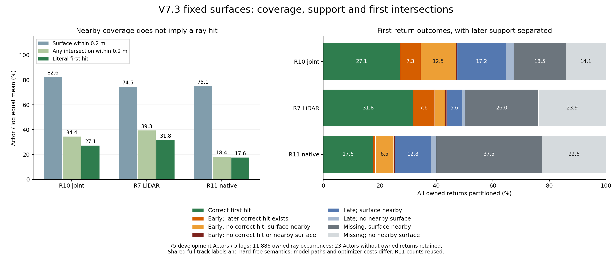

# V7.3：近邻覆盖为何没有成为正确首交点

当前r2同监督诊断已完成（2026-09-08 15:20 UTC），下文给出R10/R7与复用R11的结果。此前r1固定表面诊断也已完成：`WS-V73-M2-SURFACE-SUPPORT-01/20260908T120000Z__development-fixed-surfaces-r1`，代码866ed28f。CPU计算1.050194s、峰值RSS0.633244GiB，PID78078已退出。未训练或重新神经推理，未删除或修改表面。

先前r1显示，R5的错误不全是“前面多了一层，后面已有正确表面”：日志等权的early为20.98%，其中9.04个百分点存在后方正确交点，11.75个百分点没有正确沿束交点但测量附近已有表面，另0.19个百分点两者都没有。近邻覆盖与沿束支持之间的差距必须单独处理，不能仅靠调整遮挡读出兑现现有coverage。

## 实际组件与本次读取位置

本次读取图中已保存的canonical Actor surface，再用原始heldout束做三类查询：字面首交点、所有沿束交点、测量端点到表面的无符号距离。R11的表面来自同图下方的native＋LiDAR PCA控制。没有把新边界损失或新attention模块画成已实现部分。

## 数据与判别定义

覆盖原population全部75个development Actor、5日志、11886个明确归属Actor的原始heldout首返回。23对象没有owned返回，保留零分母记录；三种方法各8个空表面，相关归属束记missing。原始点/射线、标定和时刻保持。无owned返回的对象不凭空填物理准确率。

字面hit为首交点在观测距离±0.2m内；early、late分别早于/晚于此范围；missing没有交点。另判别同一束上是否有任意交点落入该范围，以及观测端点到显式三角面的无符号最近距离是否≤0.2m。后二者只是支持诊断，不能代替首返回，也不能成为透明化错误表面的依据。

沿用[Open3D官方RaycastingScene接口](https://www.open3d.org/docs/release/python_api/open3d.t.geometry.RaycastingScene.html)：cast_rays读首交点，list_intersections列出交点，compute_distance读取无符号距离。当前表面不保证闭合，不使用依赖内外定义的occupancy/signed distance。相邻深度差≤1e-4m合并为数值重合；深度层数不是严格拓扑片数，重合面交点也不一定全部列出。

统计将各Actor的heldout帧汇合后按其owned束归一，再日志内Actor等权、日志等权。以下为这一路径的描述性百分比，不能把11886束当11886个独立样本；原始计数和全部Actor/帧/日志分别归档。本轮的首hit/early与已有主指标一致至浮点误差，但仍保留主表原计算来源。R5、R9、R11训练条件不同，这不是匹配消融或新日志确认。

## 当前r2：同full_track/hard-free条件下的支持差异

新run `20260908T151000Z__development-full-track-fixed-surfaces-r2`，执行代码6920c120，CPU0.788708s、RSS峰值0.631866GiB，已正常退出。只对新加入的R10/R7最终表面执行原有读取；R11逐Actor/帧计数与统计直接复用r1。三者训练标签、原输入cohort及hard-free语义相同，但模型路径、可训练参数与实际optimizer成本不同，不能单独归因于某个attention模块。完整75对象/5日志/11886 owned返回的范围不变。

| 日志等权统计 | R10 joint | R7 LiDAR | R11 native |
|---|---:|---:|---:|
| 测量端点距表面≤0.2m（%） | 82.605 | 74.547 | 75.150 |
| 任意沿束交点在正确范围（%） | 34.447 | 39.338 | 18.392 |
| 字面首交点正确（%） | 27.146 | 31.755 | 17.611 |
| 表面邻近，但无正确沿束交点（%） | 48.158 | 35.209 | 56.758 |
| 至少两个数值分离深度层（%） | 52.017 | 44.467 | 16.132 |
| 至少两个返回容差前违规层（%） | 10.832 | 8.267 | 1.812 |
| 每条owned束的平均数值深度层 | 2.400 | 3.798 | 0.642 |

R10−R7的“邻近但无正确沿束交点”增加12.949个百分点，5日志全都增加。其近邻覆盖均值提高8.058pp，任意正确沿束支持反而降低4.891pp；后者4日志降低、1日志提高。这个差距比“coverage没有完全转成hit”更具体：即使忽略第一层遮挡、查找所有后方交点，仍缺少正确沿束支持。这里的邻近判别只使用真实测量端点，不将未观测区域标FREE。

R10−R11则将任意正确沿束支持提高16.055pp，5日志均提高；“邻近但无正确交点”降低8.600pp，4日志降低、1日志提高。这说明Query确实产生了原生控制缺乏的沿束支持，不能把当前冲突解释为Query完全没有生成能力。R10−R11同时增加6.519pp“early且后方正确”，五日志均增加；需要同时处理新支持和第一表面污染。

| 日志等权统计 | R10 joint | R7 LiDAR | R11 native |
|---|---:|---:|---:|
| 正确首交点（%） | 27.146 | 31.755 | 17.611 |
| early，后方有正确交点（%） | 7.300 | 7.583 | 0.781 |
| early，无正确交点但表面邻近（%） | 12.458 | 3.611 | 6.460 |
| early，无正确交点且表面不邻近（%） | 0.505 | 0.645 | 0.402 |
| late，表面邻近（%） | 17.224 | 5.581 | 12.835 |
| late，表面不邻近（%） | 2.748 | 0.928 | 1.815 |
| missing，表面邻近（%） | 18.475 | 26.017 | 37.463 |
| missing，表面不邻近（%） | 14.142 | 23.880 | 22.632 |

R10比R7增加的early主要来自“没有正确交点、但测量附近有表面”：+8.848pp，五日志均增加；“early且后方正确”反而均值−.283pp（3增加/2降低），两者不可混为同一遮挡失败。R10的late且邻近也增加11.643pp，五日志均增加。上述都是固定表面上的分类差异，不是逐射线训练演化轨迹或唯一因果机制；本次没有新增bootstrap，逐日志差值完整归档，不以五个同向差值替代独立新日志验证。

R10原始1276条early中577条后方有正确交点、641条没有正确交点但表面邻近、58条两者皆无。原始总计与日志等权百分比分别保存，不能混算分母。多个违规层出现率R10为10.832%，比R7的8.267%略高；平均全部层数R10为2.400，反而低于R7的3.798。因此不将所有失败归结为“总层数过多”，数值层也不是拓扑组件计数。

这些分类只覆盖owned返回；主free评价使用全部原始near-box束，包含其他遮挡归属，所以本诊断不能完整解释主表的free米制差值，也没有解决背景拼接的F04。缺支持、片方向、位置、局部片形状/跨度与连接关系仍需三角收口后的参数化实验判别。near-surface certified-free可能给部分错误片新的位置梯度，但仅移走早片并不保证产生正确沿束支持；局部对应一致性也仍是独立待测因素。

本次failure_ledger_delta=update V73-F02 support evidence, no new failure ID；F03/F04不关闭。保持可训练几何基座＋显式表面＋物理约束，等待R12/R14最终结果，再按既定条件优先修改一个Query surface parameterization。本轮没有修改训练、引入新损失或读取20新日志质量。

证据：`docs/autoresearch/worldsim_v73/m2/global/surface_support_r2_summary.json`、`surface_support_r2_manifest.json`、`surface_support_matched_r2_analysis.json`，复用`surface_support_r1_summary.json`中的R11；脚本`compare_worldsim_v73_surface_support.py`只归并保存统计/逐日志差值，绘图脚本新增显式方法与协议标签参数。原r1图及默认调用保持，r2图已视觉核对。以下保留r1结果作为不同训练条件下的历史诊断。

## 历史r1：覆盖、支持与首返回

| 日志等权百分比 | R5 joint | R9 LiDAR-only | R11 native |
|---|---:|---:|---:|
| 测量端点距表面≤0.2m | 79.71 | 72.47 | 75.15 |
| 任意沿束交点在正确范围 | 31.31 | 36.00 | 18.39 |
| 字面首交点正确 | 22.28 | 32.47 | 17.61 |
| 表面邻近，但没有正确沿束交点 | 48.40 | 36.46 | 56.76 |
| 至少两个数值分离深度层 | 51.90 | 38.40 | 16.13 |
| 至少两个返回容差前的违规层 | 14.32 | 3.60 | 1.81 |

R5更高的近邻覆盖没有成为更多正确沿束支持；R11同样有明显差距，因此不能把这一现象单独归因为Query模块。多个深度层出现率与平均层数也不同：每条owned束的日志等权平均层数为R5 2.420、R9 3.570、R11 0.642；不能仅凭一个计数把失败归因为“Query产生更多层”。

| 所有owned返回的互斥分类（%） | R5 joint | R9 LiDAR-only | R11 native |
|---|---:|---:|---:|
| 正确首交点 | 22.28 | 32.47 | 17.61 |
| early，后方有正确交点 | 9.04 | 3.54 | 0.78 |
| early，无正确交点但表面邻近 | 11.75 | 1.49 | 6.46 |
| early，无正确交点且表面不邻近 | 0.19 | 0.98 | 0.40 |
| late，表面邻近 | 16.95 | 6.24 | 12.84 |
| late，表面不邻近 | 2.09 | 0.72 | 1.82 |
| missing，表面邻近 | 19.70 | 28.74 | 37.46 |
| missing，表面不邻近 | 18.01 | 25.83 | 22.63 |

图中部分小分量不标数字，表格完整保留，四舍五入之和可能略偏离100%。R5原始early为986束，其中416束后方有正确交点、522束无正确交点但表面邻近、48束两者皆无；这些原始比例不与上表日志等权比例混写。

## 对后续设计的影响

这是F02/F03/F04的新诊断证据，`failure_ledger_delta=none`，不新建失败编号、不宣称找到唯一根因或解决风险。现有支持的空间位置、片方向、局部形状/范围与连接关系值得在三角收口后判别；本诊断没有对其中任一因素作因果消融。

近表面certified-free项可能帮助某些被更早错误片遮挡的违规片获得梯度，但R5仍有大量“邻近而无正确沿束交点”，仅使早表面退出不保证恢复正确支持。保持coverage恢复路径，未知区域不标FREE，不能以删除表面或返回后方交点冒充物理改进。局部深度/遮挡对应增强的效果也仍未测量。

R10已完成，继续等待R12/R14，和R11锚点共同收口三角。若Query coverage/physics冲突持续，按计划revision5优先改一个表面参数化，再分开比较近边界监督和局部对应一致性；当前诊断不改变训练配置。20个新日志模型质量未读。

R12已经由静态脚本于14:13 UTC以code dc6fe427/PID81766启动；15:06 UTC第3轮，R14/PID68108第19轮。仍按原登记M1r3、full_track、旧cohort、30轮、native1、beam-free .5/.03m/res32、event0，没有自动GPU队列。

证据归档：`docs/autoresearch/worldsim_v73/m2/global/surface_support_r1_{summary,manifest}.json`，图`m2/V73_SURFACE_SUPPORT.{png,pdf}`，可重用分析/绘图脚本在`scripts/`。阶段论文r2仍作为10:30UTC历史快照，未把本次结果追写成当时已知。V7.3未完成，自动跟进每30分钟，shutdown=false。
