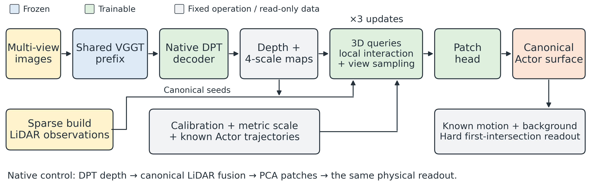
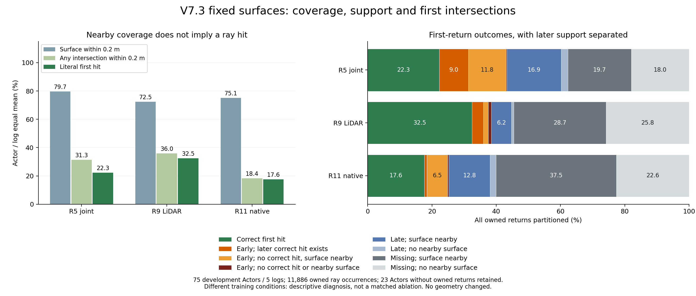

# V7.3：近邻覆盖为何没有成为正确首交点

固定表面诊断完成，2026-09-08；`WS-V73-M2-SURFACE-SUPPORT-01/20260908T120000Z__development-fixed-surfaces-r1`，代码866ed28f。CPU计算1.050194s、峰值RSS0.633244GiB，PID78078已退出。未训练或重新神经推理，未删除或修改表面。

R5的错误不全是“前面多了一层，后面已有正确表面”：日志等权的early为20.98%，其中9.04个百分点存在后方正确交点，11.75个百分点没有正确沿束交点但测量附近已有表面，另0.19个百分点两者都没有。近邻覆盖与沿束支持之间的差距必须单独处理，不能仅靠调整遮挡读出兑现现有coverage。

## 实际组件与本次读取位置

本次读取图中已保存的canonical Actor surface，再用原始heldout束做三类查询：字面首交点、所有沿束交点、测量端点到表面的无符号距离。R11的表面来自同图下方的native＋LiDAR PCA控制。没有把新边界损失或新attention模块画成已实现部分。

## 数据与判别定义

覆盖原population全部75个development Actor、5日志、11886个明确归属Actor的原始heldout首返回。23对象没有owned返回，保留零分母记录；三种方法各8个空表面，相关归属束记missing。原始点/射线、标定和时刻保持。无owned返回的对象不凭空填物理准确率。

字面hit为首交点在观测距离±0.2m内；early、late分别早于/晚于此范围；missing没有交点。另判别同一束上是否有任意交点落入该范围，以及观测端点到显式三角面的无符号最近距离是否≤0.2m。后二者只是支持诊断，不能代替首返回，也不能成为透明化错误表面的依据。

沿用[Open3D官方RaycastingScene接口](https://www.open3d.org/docs/release/python_api/open3d.t.geometry.RaycastingScene.html)：cast_rays读首交点，list_intersections列出交点，compute_distance读取无符号距离。当前表面不保证闭合，不使用依赖内外定义的occupancy/signed distance。相邻深度差≤1e-4m合并为数值重合；深度层数不是严格拓扑片数，重合面交点也不一定全部列出。

统计将各Actor的heldout帧汇合后按其owned束归一，再日志内Actor等权、日志等权。以下为这一路径的描述性百分比，不能把11886束当11886个独立样本；原始计数和全部Actor/帧/日志分别归档。本轮的首hit/early与已有主指标一致至浮点误差，但仍保留主表原计算来源。R5、R9、R11训练条件不同，这不是匹配消融或新日志确认。

## 覆盖、支持与首返回

| 日志等权百分比 | R5 joint | R9 LiDAR-only | R11 native |
|---|---:|---:|---:|
| 测量端点距表面≤0.2m | 79.71 | 72.47 | 75.15 |
| 任意沿束交点在正确范围 | 31.31 | 36.00 | 18.39 |
| 字面首交点正确 | 22.28 | 32.47 | 17.61 |
| 表面邻近，但没有正确沿束交点 | 48.40 | 36.46 | 56.76 |
| 至少两个数值分离深度层 | 51.90 | 38.40 | 16.13 |
| 至少两个返回容差前的违规层 | 14.32 | 3.60 | 1.81 |

R5更高的近邻覆盖没有成为更多正确沿束支持；R11同样有明显差距，因此不能把这一现象单独归因为Query模块。多个深度层出现率与平均层数也不同：每条owned束的日志等权平均层数为R5 2.420、R9 3.570、R11 0.642；不能仅凭一个计数把失败归因为“Query产生更多层”。

| 所有owned返回的互斥分类（%） | R5 joint | R9 LiDAR-only | R11 native |
|---|---:|---:|---:|
| 正确首交点 | 22.28 | 32.47 | 17.61 |
| early，后方有正确交点 | 9.04 | 3.54 | 0.78 |
| early，无正确交点但表面邻近 | 11.75 | 1.49 | 6.46 |
| early，无正确交点且表面不邻近 | 0.19 | 0.98 | 0.40 |
| late，表面邻近 | 16.95 | 6.24 | 12.84 |
| late，表面不邻近 | 2.09 | 0.72 | 1.82 |
| missing，表面邻近 | 19.70 | 28.74 | 37.46 |
| missing，表面不邻近 | 18.01 | 25.83 | 22.63 |

图中部分小分量不标数字，表格完整保留，四舍五入之和可能略偏离100%。R5原始early为986束，其中416束后方有正确交点、522束无正确交点但表面邻近、48束两者皆无；这些原始比例不与上表日志等权比例混写。

## 对后续设计的影响

这是F02/F03/F04的新诊断证据，`failure_ledger_delta=none`，不新建失败编号、不宣称找到唯一根因或解决风险。现有支持的空间位置、片方向、局部形状/范围与连接关系值得在三角收口后判别；本诊断没有对其中任一因素作因果消融。

近表面certified-free项可能帮助某些被更早错误片遮挡的违规片获得梯度，但R5仍有大量“邻近而无正确沿束交点”，仅使早表面退出不保证恢复正确支持。保持coverage恢复路径，未知区域不标FREE，不能以删除表面或返回后方交点冒充物理改进。局部深度/遮挡对应增强的效果也仍未测量。

继续等待R10/R12/R14三角与R11锚点。若Query coverage/physics冲突持续，按计划revision5优先改一个表面参数化，再分开比较近边界监督和局部对应一致性；当前诊断不改变训练配置。20个新日志模型质量未读。

R12静态启动脚本已备好于`/root/autodl-tmp/controller_logs/launch_joint_beam_r12.sh`，仍按原登记M1r3、full_track、旧cohort、30轮、native1、beam-free .5/.03m/res32、event0。仅在R10完成并释放完整Query资源后由后续跟进启动；没有自动GPU队列。

证据归档：`docs/autoresearch/worldsim_v73/m2/global/surface_support_r1_{summary,manifest}.json`，图`m2/V73_SURFACE_SUPPORT.{png,pdf}`，可重用分析/绘图脚本在`scripts/`。阶段论文r2仍作为10:30UTC历史快照，未把本次结果追写成当时已知。V7.3未完成，自动跟进每30分钟，shutdown=false。
