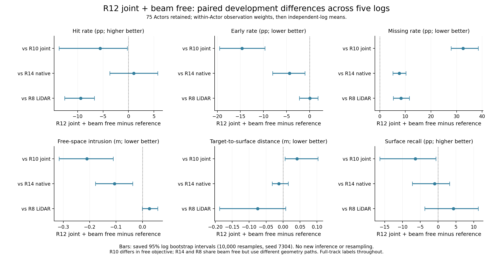
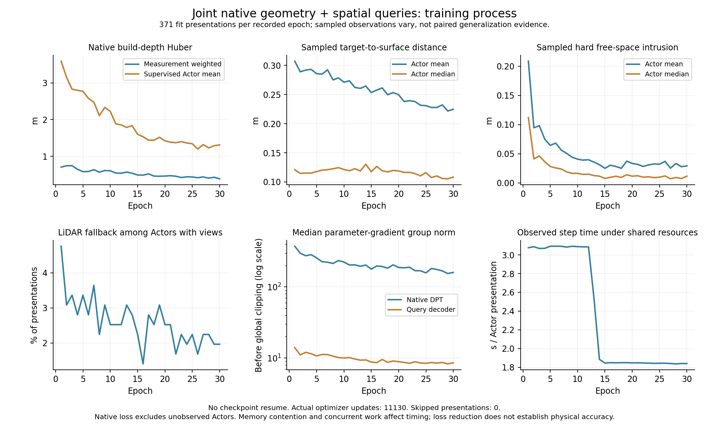

# V7.3 三角收口与 R12 完整结果

2026-09-08 22:05 UTC。R10/R12/R14三角及R11锚点已收口。R12相对R10降低early与自由空间侵入，但增加miss、降低hit与召回；并未同时恢复物理质量与覆盖。相对同beam的R14，R12 free更低、miss更高，hit/距离/召回区间跨0。相对同beam LiDAR控制R8，R12在全部5开发日志降低hit、增加miss。转入Q-v2显式表面参数化研究，保留可训练DPT与物理监督；不继续单纯loss网格，也不退回native-only。

## 已完成训练与架构

`WS-V73-M2-GLOBAL-ACTOR-01/20260908T050000Z__population-joint-full-track-beam-range-s7304-r12`，训练code dc6fe427，分析基于d9637d0e。30轮/11130实际更新、零跳步、零恢复；完整489对象最终评价结束，PID81766退出。M1r3 fresh初始化、seed7304、原371 FIT/67 DEV可用输入，51不可用对象保留。744份冻结前缀对应每窗口24视图；32654562个原生DPT参数与1670517个Query参数可训练，上层聚合器仍冻结。

R12仅将R10的hard range free改为beam_tube_range，width .03m/resolution32；native1/free.5/event0、full_track FIT标签与30轮不变。Q-v2尚未进入此比较。wall27059.008429s（7.516h，含评价）、allocated峰值10.235226GiB、RSS34.104195GiB，native_project最大变化.005098347。训练耗时受R14并行与结束影响，不能据此声称算法更快。

## 完整开发结果

| 方法 | hit | early | miss | free (m) | 单向distance (m) | recall@.2m |
|---|---:|---:|---:|---:|---:|---:|
| R10 joint/hard | 0.271463 | 0.202637 | 0.326175 | 0.271026 | 0.113193 | 0.826047 |
| R12 joint/beam | 0.215934 | 0.056423 | 0.651456 | 0.060573 | 0.154347 | 0.762202 |
| R14 native/beam | 0.205563 | 0.099932 | 0.575200 | 0.166419 | 0.166946 | 0.771985 |
| R8 LiDAR/beam | 0.310028 | 0.055909 | 0.568336 | 0.034320 | 0.229553 | 0.719452 |
| joint共同初始化 | 0.221164 | 0.122749 | 0.511425 | 0.302697 | 0.156341 | 0.791305 |
| LiDAR PCA | 0.212448 | 0.043527 | 0.734104 | 0.017708 | 0.304790 | 0.654182 |

比例列均为0–1。75 Actor/5独立日志全部保留，23无owned返回、8空表面；R12 LiDAR fallback 8。每Actor按真实束/点权重，日志内Actor平均，再独立日志等权。free评价使用全部near-box原始首返回束，hit/miss不丢弃缺失；单向测量→表面距离不能替代完整表面精度或对称Chamfer。20个新日志质量仍未读。

## R12−R10：同Query，只改变free目标

| 指标 | R12−对照 | 95%日志配对区间 | 改善日志数 |
|---|---:|---:|---:|
| hit (pp) | -5.552918 | [-13.634669, -0.239450] | 1/5 |
| early (pp) | -14.621366 | [-19.532036, -9.687573] | 5/5 |
| miss (pp) | +32.528065 | [+27.866975, +38.475836] | 0/5 |
| free (m) | -0.210453 | [-0.315461, -0.110354] | 5/5 |
| target→surface (m) | +0.041154 | [+0.005544, +0.102787] | 0/5 |
| recall@.2m (pp) | -6.384507 | [-16.381604, -0.629165] | 1/5 |

early和free在5/5日志改善；miss在5/5增加，hit在4/5下降，target→surface在5/5变差。recall的所谓1个改善日志仅为+1.24e-9的浮点量，不能解释为实质改善。降低侵入伴随支持缺失增加，不能将free改善单独写成重建成功，也不把结果预设为所有Query都失败。几何位移、片旋转、收缩或支持后退各自的贡献仍需定位，不凭总指标指定唯一根因。

## R12−R14：同beam，Query与原生融合通路

| 指标 | R12−对照 | 95%日志配对区间 | 改善日志数 |
|---|---:|---:|---:|
| hit (pp) | +1.037078 | [-3.661150, +5.735306] | 3/5 |
| early (pp) | -4.350856 | [-7.985862, -0.992242] | 4/5 |
| miss (pp) | +7.625603 | [+5.121536, +10.203468] | 0/5 |
| free (m) | -0.105845 | [-0.177679, -0.036656] | 4/5 |
| target→surface (m) | -0.012599 | [-0.031807, +0.015037] | 4/5 |
| recall@.2m (pp) | -0.978334 | [-7.259905, +3.228070] | 3/5 |

Query平均hit+1.037pp，但区间跨0；free−.105845m与early−4.351pp的区间不跨0，同时miss+7.626pp且5日志都增加。该比较包含生成通路/参数化/容量，不是单独attention消融。R14−R11的六项区间全部跨0，复用已保存R14分析，不重复bootstrap；详见[原生对照](WORLDSIM_V7_3_MATCHED_NATIVE_CONTROL.md)。不能宣称beam对所有通路有效，也不能将覆盖/物理冲突唯一归于Query。

## R12−R8：同beam，与LiDAR生成控制

| 指标 | R12−对照 | 95%日志配对区间 | 改善日志数 |
|---|---:|---:|---:|
| hit (pp) | -9.409414 | [-12.540208, -6.704691] | 0/5 |
| early (pp) | +0.051352 | [-2.191252, +1.815131] | 1/5 |
| miss (pp) | +8.311989 | [+5.322164, +11.592456] | 0/5 |
| free (m) | +0.026254 | [-0.000237, +0.057598] | 1/5 |
| target→surface (m) | -0.075207 | [-0.187466, +0.007771] | 3/5 |
| recall@.2m (pp) | +4.274981 | [-3.721019, +11.268682] | 4/5 |

hit−9.409pp、miss+8.312pp，均在5日志同方向且区间不跨0。early、free、距离、recall区间跨0；不把free均值+.026254m写成显著退化，也不把召回均值+4.275pp写成可靠优势。视觉联合通路尚未超越同目标的LiDAR控制；该通路比较不是仅视觉token的因果检验。

## 初始化、FIT与训练过程

相对共同初始化，R12 early−6.633pp、free−.242124m，区间不跨0；miss+14.003pp亦不跨0，hit−.523pp、距离−.001994m、recall−2.910pp均跨0。首事件权重为0，不能写成联合模型首事件目标已验证。

| 过程量 | 第1轮 | 第30轮 |
|---|---:|---:|
| 真实更新 | 371 | 371 |
| native测量加权Huber (m) | .707176 | .388714 |
| native有监督Actor平均Huber (m) | 3.590748 | 1.311016 |
| 采样coverage (m) | .307158 | .224648 |
| 采样hard free (m) | .208722 | .029032 |
| 采样beam目标 (m) | .207202 | .028474 |
| 有视图但native支持fallback | 17 | 7 |
| DPT裁剪前梯度中位数 | 374.583801 | 160.223450 |
| Query裁剪前梯度中位数 | 13.991126 | 8.557787 |

每轮346个有native测量的Actor、173972点；14个无相机Actor保留LiDAR路径且正常Query更新。过程损失下降不等于固定观测或开发泛化提升。

FIT最终hit/early/miss/free/distance/recall为.269072/.047431/.612011/.041092/.127853/.801617（414对象/20日志）。full_track包含FIT评价时刻标签，不能作为泛化结果。移动DEV仍9 Actor/2日志、3无owned/1空表面；hit .122691、miss .768534、recall .888962；其中一日志仅1条owned返回，不能支持稳健动态优势，也不事后删除。

## 决策与证据

更新V73-F02证据，F03/F04/F06/F09保持，未新增失败ID。条件决策已触发：Q-v2优先检验有共享几何支持的表面参数化，避免仅靠独立小片退出束来换取低free；保留原生DPT适配。先核对一手参数化实现再落地，near-boundary监督、局部对应一致性、上层LoRA分别作为后续因素。固定拓扑或连接本身不保证无折叠、无自交或物理正确。

证据：`m2/global/population_joint_r12_{summary,manifest,analysis,training}.json`、本页两张结果图，完整原始日志/checkpoint/表面留在原run。汇总入口`scripts/summarize_worldsim_v73_joint_r12.sh`已运行一次，10000次seed7304日志bootstrap保存，图仅读保存区间并已视觉核对；未重复模型推理或旧基线。30分钟跟进ACTIVE，服务器继续运行，不因三角完成关机。
