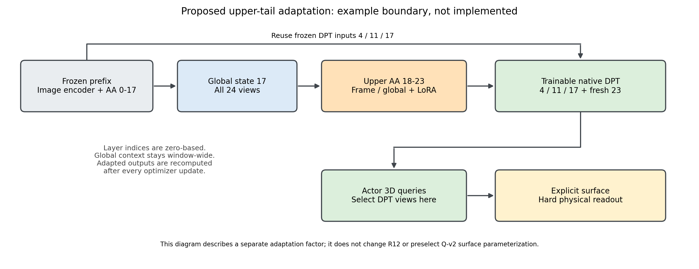

# V7.3：上层跨视图适配的接口与资源边界

2026-09-08。这是后续适配因素的源码准备，尚未实现、训练或测量峰值，也没有替三角比较选定Q-v2表面。R14相对同beam LiDAR控制也出现覆盖较高而physics较差，故不能把错误唯一归到Query曲面片；先完成R12，再按计划revision6分别检验表面与表示。

## 可以复用的是适配位置之前的状态

本机VGGT和[官方aggregator](https://raw.githubusercontent.com/facebookresearch/vggt/main/vggt/models/aggregator.py)均按frame/global顺序运行，DPT输入为第4/11/17/23组的frame与global结果拼接。举例只适配18–23这6组时，可用第17组拼接的后1024通道恢复global状态，复用第4/11/17组DPT输入，重新计算第18–23组及最终第23组拼接。此为源码推导，未做数值恢复实验；不将旧第23组最终缓存冒充已适配输出。若从第12组开始，17/23都需重算，缓存边界相应前移。

本项目`NativeGeometryPyramid`目前按Actor选择已完成全窗口聚合的视图，这对冻结结果是合法读取。但迁移到可训练上层时，必须先恢复完整24视图及原有顺序/尺寸/特殊token/位置编码，再做global attention；之后才可为Actor裁取DPT输入和几何特征。先裁Actor可见视图再聚合会改变上下文，不能算保持原信息的执行优化。图中边界只是一个可实现例子，不是正式层范围或rank决策。

本轮仅CPU读取原M1r3的`scene-0450_03.pt`：4层形状均为`[1,1,1301,2048]`、dtype为FP32、patch_start为5。M1缓存写入直接保存aggregator结果，没有额外投影；不能因当时启用BF16 autocast就假定缓存也是BF16。保留现有值精度作为起点，不为了显存静默改变缓存精度。证据见`autoresearch/worldsim_v73/m2/global/upper_tail_metadata_r1.json`。

## 梯度路径与执行组织

拟采用正常可训练的上层前向，冻结原权重、只在选定projection加入LoRA；从第一处适配到DPT/Query/表面的整条路径保留梯度。其间原参数冻结的FFN/归一化也不能包在no_grad中切断输入梯度。DPT和Query继续训练，build直接深度与统一硬物理读出保留，标定/轨迹/米制尺度保持原只读定义。

本机以及官方aggregator在training模式使用`use_reentrant=False`的checkpoint；[PyTorch 2.4.1源码](https://raw.githubusercontent.com/pytorch/pytorch/v2.4.1/torch/utils/checkpoint.py)说明这一版本不要求缓存输入本身requires_grad。沿用非重入重算即可让冻结输入上的新参数接收梯度，无需给整个早期编码器制造梯度。首个真实训练步骤就地确认新参数/几何的实际梯度与资源，不另建反复smoke或门控。

按当前每Actor一次optimizer更新的组织，上层权重更新后必须重算整个窗口的上层结果，不能像冻结前缀一样跨步共享。若为吞吐改为同窗口多Actor共用一次前向后合并loss，会改变更新频率和梯度权重，应单独披露实际预算，不能无声替换成“同样30轮”。冻结早期权重可留CPU或不驻留GPU；训练只需当前上层模块、DPT、Query及其优化器状态。

## 资源估算不是峰值实测

当前378×672、patch14、24视图：每视图1296个图像token加5个特殊token，全局序列31224，隐藏维1024、16头。以下是算术量，不是已申请显存：

| 对象 | 理论量 |
|---|---:|
| 单份全窗口1024维状态，FP32 | 121.969 MiB |
| 4份frame/global拼接DPT输入，FP32 | 975.750 MiB |
| 同两项若采用BF16，仅作对照 | 60.984 / 487.875 MiB |
| 显式16头全局attention score，BF16 | 29.055 GiB |
| 同score若FP32 | 58.111 GiB |
| 最后6组frame/global的qkv LoRA，假设rank8 | 393216参数 |
| 上项再加入projection LoRA | 589824参数 |

权重文件元数据确认第18组frame/global的qkv为3072×1024，projection为1024×1024；只读shape，没有加载完整模型或做GPU计算。LoRA数字不含完整DPT/Query，也不含冻结上层权重和激活。

本机[attention实现](https://raw.githubusercontent.com/facebookresearch/vggt/main/vggt/layers/attention.py)调用SDPA。PyTorch 2.4.1会依输入选择实现，不能把调用名等同于一定用了FlashAttention；其[官方接口源码](https://raw.githubusercontent.com/pytorch/pytorch/v2.4.1/torch/nn/functional.py)提供选择fused后端及解释不兼容原因的入口。29/58GiB是显式score的反例预算，绝非该提案已经OOM；高效attention和checkpoint能减少中间存储，但不消除全局计算和反向开销。首个实际运行若遇不兼容，先按官方后端条件修复等价执行，不裁掉视图；只有实际仍无法继续才走资源不足出口。

## 当前结论

上层有限适配具备明确的源码接入点，而且不必重算完全冻结的早期部分；还没有证据证明它能改善本任务或单卡能承受完整训练。当前最需要避免的两个实现错误是：把Actor视图子集当原全窗口上下文，以及跨optimizer步缓存已适配上层输出。两者都可能让一个看似“上层LoRA”的实验回答错误的问题。

R12仍在原配置运行，三角未完成。表面参数化与上层适配分开作为研究因素；不同时混入新cohort、event或新基座后只归因于LoRA。关联V73-F01/F02/F03/F06/F09，failure_ledger_delta=none。当前只完成官方/本机源码核对、一次CPU元数据读取、算术估算及提案组件图，无新训练/评价run、无环境/权重下载、无测试，20新日志质量未读。
