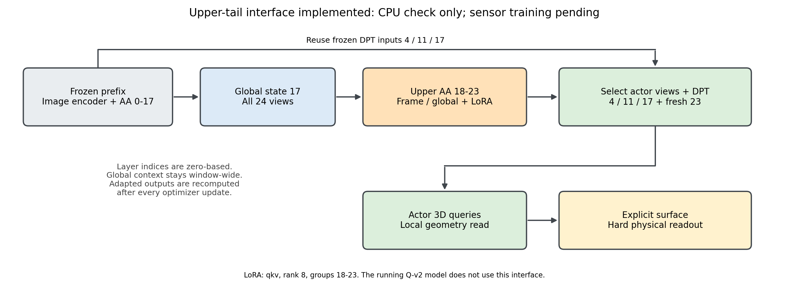

# V7.3：上层跨视图适配的接口与资源边界

**当前（2026-09-09 04:40 UTC）：upper正式训练继续pending，暂停扩展。** Q-v2 r1−r2未显示明确联合收益，early更差且其余五项区间跨0。按用户策略二先推进表面表示和constructive ray监督，不因本接口存在而启动LoRA/DINOv3/full FT；以下实现准备不是训练结果。

**最新用户决策（2026-09-09 01:47 UTC）：先等Q-v2完整结果。** r1正在第17/30轮；结果前不启动或继续扩展upper LoRA等新候选。joint明确帮助时研究open/structured surface、constructive ray-support与独立upper PEFT；几乎无帮助时优先表面表示与constructive ray supervision，停止向DINOv3/full FT投入。near-boundary free后置；闭合/UNKNOWN与局部collapse/stretch仍是待判别风险。依据与不确定性处理见[计划revision7第18节](WORLDSIM_V7_3_RESEARCH_PLAN.md)，下方准备代码和历史结果不覆盖该决定。

2026-09-09 01:24 UTC。上层LoRA已接入可选训练、checkpoint恢复和固定推理入口；尚未启动正式上层训练，完整24视图传感器反传与GPU峰值待实测。此前CPU交替/梯度检查和本轮保存恢复/真实前缀构造检查均通过，各自证据边界见下文。三角比较已收口，Q-v2共享网格联合r1正在运行，同网格LiDAR r2已完成。两者均未使用本接口；不得把既有结果称为上层适配结果。

## 可以复用的是适配位置之前的状态

本机VGGT和[官方aggregator](https://raw.githubusercontent.com/facebookresearch/vggt/main/vggt/models/aggregator.py)均按frame/global顺序运行，DPT输入为第4/11/17/23组的frame与global结果拼接。当前接口只适配18–23这6组，以第17组拼接的后1024通道恢复global状态，复用第4/11/17组DPT输入，重新计算第18–23组及最终第23组拼接。已用小型随机模型对照官方交替处理函数，尚未做真实24视图预训练输出的数值恢复；不将旧第23组最终缓存冒充已适配输出。若以后从第12组开始，17/23都需重算，缓存边界相应前移。

本项目原`NativeGeometryPyramid`按Actor选择已完成全窗口聚合的视图，这对冻结结果是合法读取。新`FrozenUpperPrefix`按窗口原顺序保留全部视图的4/11/17层CPU值；`UpperAdaptedGeometryPyramid`先重算完整窗口的上层，再选择Actor的DPT输入。特殊token和位置编码保持官方定义，未减少24视图。图示边界与默认rank8已经实现，正式训练配置仍待登记。

前次准备阶段CPU读取原M1r3的`scene-0450_03.pt`：4层形状均为`[1,1,1301,2048]`、dtype为FP32、patch_start为5。M1缓存写入直接保存aggregator结果，没有额外投影；不能因当时启用BF16 autocast就假定缓存也是BF16。新接口保留现有缓存值精度，只在计算时启用原BF16 autocast；同文件中的旧23层不作为适配输入使用。元数据证据见`autoresearch/worldsim_v73/m2/global/upper_tail_metadata_r1.json`。

## 梯度路径与执行组织

`motion_proj/worldsim_v73/upper_aggregation.py`采用官方12个frame/global Block，加载18–23组真实权重后冻结原参数，在qkv加入LoRA。低秩A采用Kaiming初始化、B为零、缩放alpha/rank，依据[微软LoRA参考实现](https://raw.githubusercontent.com/microsoft/LoRA/main/loralib/layers.py)；不做train/eval权重合并。其间冻结的原projection、FFN/归一化仍正常传递输入梯度。适配到DPT/Query/表面的完整路径已经提供接口，传感器端到端梯度尚未实测；正式接入时DPT和Query继续训练，保留build直接深度、统一硬物理读出与只读标定/轨迹/尺度。

本机以及官方aggregator在training模式使用`use_reentrant=False`的checkpoint；[PyTorch 2.4.1源码](https://raw.githubusercontent.com/pytorch/pytorch/v2.4.1/torch/utils/checkpoint.py)说明这一版本不要求缓存输入本身requires_grad。沿用非重入重算即可让冻结输入上的新参数接收梯度，无需给整个早期编码器制造梯度。首个真实训练步骤就地确认新参数/几何的实际梯度与资源，不另建反复smoke或门控。

按当前每Actor一次optimizer更新的组织，上层权重更新后必须重算整个窗口的上层结果，不能像冻结前缀一样跨步共享。若为吞吐改为同窗口多Actor共用一次前向后合并loss，会改变更新频率和梯度权重，应单独披露实际预算，不能无声替换成“同样30轮”。冻结早期权重可留CPU或不驻留GPU；训练只需当前上层模块、DPT、Query及其优化器状态。

## 资源估算不是峰值实测

当前378×672、patch14、24视图：每视图1296个图像token加5个特殊token，全局序列31224，隐藏维1024、16头。以下是算术量，不是已申请显存：

| 对象 | 理论量 |
|---|---:|
| 单份全窗口1024维状态，FP32 | 121.969 MiB |
| 4份frame/global拼接DPT输入，FP32 | 975.750 MiB |
| 同两项若采用BF16，仅作对照 | 60.984 / 487.875 MiB |
| 显式16头全局attention score，BF16 | 29.055 GiB |
| 同score若FP32 | 58.111 GiB |
| 最后6组frame/global的qkv LoRA，假设rank8 | 393216参数 |
| 上项再加入projection LoRA | 589824参数 |

权重文件元数据确认第18组frame/global的qkv为3072×1024，projection为1024×1024。本轮已在CPU加载全部12个尾部Block，实计冻结参数151182336、qkv LoRA参数393216；未加载早期编码器或做GPU计算。表中再适配projection的参数数目仍为算术量；该可选配置未运行。LoRA数字不含完整DPT/Query，也不含冻结上层权重和激活。

本机[attention实现](https://raw.githubusercontent.com/facebookresearch/vggt/main/vggt/layers/attention.py)调用SDPA。PyTorch 2.4.1会依输入选择实现，不能把调用名等同于一定用了FlashAttention；其[官方接口源码](https://raw.githubusercontent.com/pytorch/pytorch/v2.4.1/torch/nn/functional.py)提供选择fused后端及解释不兼容原因的入口。29/58GiB是显式score的反例预算，绝非该提案已经OOM；高效attention和checkpoint能减少中间存储，但不消除全局计算和反向开销。首个实际运行若遇不兼容，先按官方后端条件修复等价执行，不裁掉视图；只有实际仍无法继续才走资源不足出口。

## 一次CPU接口检查及其边界

命令：`/root/autodl-tmp/envs/motionproj/bin/python scripts/check_worldsim_v73_upper_tail_path.py`，seed7305。真实12个尾部Block权重只在CPU加载计数后释放；执行前向/反向的是3视图、每视图11个token、宽32、rank2的随机模型。参照来自官方`Aggregator._process_frame_attention`和`_process_global_attention`，验证交替顺序、非重入checkpoint及跨视图影响。没有读取DEV/新日志质量。

| 检查结果 | 数值 |
|---|---:|
| 对官方交替函数输出的最大差值 | 0 |
| 第一frame块LoRA B梯度范数 | 0.0004783543 |
| 最后global块LoRA B梯度范数 | 0.0002375138 |
| 一次合成SGD更新后输出最大变化 | 7.152557e-7 |
| 改变第三视图后第一视图输出最大变化 | 0.001531661 |
| 缓存输入requires_grad / 冻结原权重有梯度 | false / false |
| CPU脚本总耗时 / 进程峰值RSS | 1.779956 s / 1.508625 GiB |

B为零初始化，首步A梯度为零符合该参数化，不代表梯度路径断开。脚本首次遇到位置张量expand后非连续，官方global函数的view无法重排；按照[官方PositionGetter](https://raw.githubusercontent.com/facebookresearch/vggt/main/vggt/layers/rope.py)增加clone修复，随后重跑同一检查通过。首个错误保存在`upper_tail/interface_check_r1_attempt1.txt`，通过结果在`upper_tail/interface_check_r1.jsonl`（均位于`autoresearch/worldsim_v73/`）。这是未进入训练的接口修复，不是科学负结果，也不新增失败ID。

本次没有证明实际24视图的数值复原、DPT/Query的真实传感器loss反传、GPU可承受性或重建收益。上述00:40阶段尚未执行`UpperAdaptedGeometryPyramid`，也未接入训练入口。01:24已完成下节的入口接入与CPU构造；真实传感器前向/反传仍待首次正式运行就地记录，不重复此前小型梯度检查。

## 可选训练与固定推理入口（01:24 UTC）

`scripts/train_worldsim_v73_global_actors.py`新增`--upper-lora`，默认关闭；打开时从原窗口4/11/17缓存重算18–23组，再生成Actor的DPT输入。参数`--upper-rank 8 --upper-alpha 8`与原始`--upper-weights`来源进入config。数据、Query参数化、coverage/free/event、DPT辅助监督、每Actor更新与原学习率不由该选项改变。当前r1仍是bfc181b4启动的既有进程，没有开启或加载新入口。

优化器顺序为DPT、Query、LoRA，后者只加入requires_grad参数；冻结尾部原权重仍参与计算但没有Adam状态。依据[PyTorch 2.4.1优化器源码](https://raw.githubusercontent.com/pytorch/pytorch/v2.4.1/torch/optim/optimizer.py)，参数状态按保存顺序匹配，故resume不能静默换上层适配定义。checkpoint沿用模型/优化器/epoch/RNG和FIT顺序，另外保存`upper_config`和`upper_adapter`；原权重由已记录来源加载，避免重复保存冻结主体。这也遵循[官方LoRA保存与恢复流程](https://raw.githubusercontent.com/microsoft/LoRA/main/README.md)的原权重加适配参数分离方式。

`scripts/evaluate_worldsim_v73_fixed_actors.py`按checkpoint的`upper_lora`定义恢复同一尾部，保持全窗口上下文后再选择Actor视图，整个固定推理无梯度、无更新。旧checkpoint无该字段时仍使用原冻结聚合器路径。这个入口只做了代码接入，未用于20个新日志；后者继续留待方法选择完成。

每步记录`upper_lora`梯度组及`upper_context_views`，与Actor实际选取的`views`区分；summary保存LoRA可训练数、config与零初始化B的最终绝对幅值。`shared_frozen_prefix_views`记录实际图像视图数，不把窗口缓存个数当视图数。当前实现训练和评价均逐Actor重算上层，没有跨步适配缓存；初始/最终评价也会因此变慢。这是尚未测量的执行成本，不宣称相同30轮具有相同墙钟预算。

新增一次检查命令为`python scripts/check_worldsim_v73_upper_checkpoint.py --native-run <原M1r3> --output <仓库外记录路径>`。人为将首frame的LoRA B赋值1e-4后，保存1581418字节适配checkpoint，再加载真实原始尾部与adapter，所有适配参数恢复最大差0；没有优化器更新。原`scene-0015`的24视图只构造CPU前缀，4/11/17均为`[1,24,1301,2048]`，示例Actor选择[0,23]；第二Actor共享CPU前缀和DPT头，旧23层不使用。该脚本4.518705s，峰值RSS3.002346GiB；证据`autoresearch/worldsim_v73/upper_tail/checkpoint_check_r1.json`。

这项检查没有聚合/DPT/Query前向，没有证明Adam恢复或真实训练数值连续性，也不是GPU资源测量。训练/固定推理脚本仅做语法与调用路径审阅，端到端运行待正式实验。已有上层梯度脚本没有重复执行；未新增环境、权重下载或评价run。实现基于3c824f96，与台账同提交，failure_ledger_delta=none。

## 当前结论

上层有限适配的独立代码与CPU接口证据已具备，不必重算完全冻结的早期部分；还没有证据证明它能改善本任务或单卡能承受完整训练。代码保留全窗口上下文，每次调用重建适配输出，返回后模块清除对上一计算图的引用。按当前每Actor更新方式，完整上层每步都要重算；这项计算代价仍待实测。

Q-v2联合r1在01:15 UTC正在第15轮，继续原配置；LiDAR r2已显示更多交点未转化为正确首表面，详见Q-v2报告。先收口r1−r2，再选择下一项机制研究；表面参数化、对应一致性、认证free边界和上层适配分别解释，不混入新cohort/event/新基座后只归因于LoRA。关联V73-F01/F02/F03/F06/F09，failure_ledger_delta=none；没有新的正式训练/评价run或环境/权重下载。基础接口已提交3c824f96，本轮入口与新证据同提交；20新日志质量未读，30分钟跟进ACTIVE，完成不关机。
