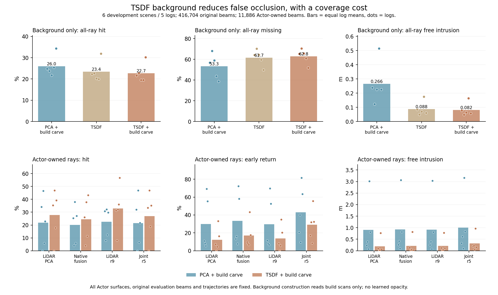

# V7.3：VDBFusion背景对照与场景首交点

2026-09-08。同一组build观测构建的TSDF背景明显减少了错误遮挡，同时降低了场景覆盖。换成同一个TSDF背景后，r5联合模型仍有更多错误前表面，F02与F04需分别处理。结果全部来自既有6开发场景/5日志，不是新20日志确认。

## 开源迁移与构建

读取[PRBonn VDBFusion官方实现](https://github.com/PRBonn/vdbfusion)后使用其0.1.6 Python wheel。官方[CITATION](https://raw.githubusercontent.com/PRBonn/vdbfusion/main/CITATION.cff)列明Sensors2022，DOI10.3390/s22031296，不是ICRA论文。复用CPU/Open3D环境，仅安装769.9kB wheel、无依赖升级。

TSDF固定0.1m体素、0.3m截断、space_carving=true、统一权重；输入为同一24个build扫描中的606366背景测量及各扫描的原传感器原点。与PCA背景相同，排除该时刻所有已知注释框+0.1m内点和采样LiDAR坐标abs(x),abs(y)<1m近点；不按模型质量筛选，不限制点数。已知轨迹、标定及扫描时刻处理保持原定义。

按官方[MarchingCubes源码](https://raw.githubusercontent.com/PRBonn/vdbfusion/main/src/vdbfusion/vdbfusion/MarchingCubes.cpp)，fill_holes=false要求网格单元8角都有观测权重；min_weight=0，不对已有观测再增加支持次数门槛。这样不会利用未知体素的默认正距离去闭合表面。排除动态端点的束不会通过默认积分贡献其自由前缀，故后续仍用既有全原build束one-pass雕刻。该处理不刻空原首回波后方，不修改heldout束或根据它们删面。

| 构建步骤 | run（task均为WS-V73-M4-SCENE-DATA-01） | 三角面 | CPU wall | 峰值RSS |
|---|---|---:|---:|---:|
| VDBFusion | 20260908T054000Z__development-vdbfusion-background-r4 | 727557 | 62.025s | 6.901GiB |
| 既定build雕刻 | 20260908T054000Z__development-vdbfusion-build-carved-r5 | 709776 | 31.669s | 6.737GiB |

构建代码061cef64，前者含体积文件共457MiB。雕刻排除17781片(2.444%)，build矛盾束12017→0，剩余build侵入距离和0；仅说明这些构建束，没有全场景正确性保证。原PCA雕刻前4850928片，表示规模差异属于背景方法对照，不是Actor密度控制。

## 固定背景的收益与覆盖代价

全部416704原始heldout首回波束保留，包括近传感器组；11886为cohort返回。统计在场景内按原束数加权，再场景/独立日志等权；bootstrap以5个日志为样本。背景代理、边界带仍是注释框代理，不是完整语义/表面真值。

| 仅背景 | 全束hit | 全束early | 全束miss | 全束free(m) | cohort early | cohort free(m) |
|---|---:|---:|---:|---:|---:|---:|
| PCA+build雕刻 | 26.020% | 10.678% | 53.279% | 0.265644 | 25.191% | 0.893276 |
| TSDF | 23.429% | 5.162% | 61.675% | 0.088021 | 6.404% | 0.179636 |
| TSDF+build雕刻 | 22.714% | 4.896% | 62.802% | 0.082163 | 5.839% | 0.166678 |

TSDF+雕刻相对PCA+雕刻：全束free−0.183481m、95%[−0.274646,−0.111157]；early−5.782pp [−8.896,−2.720]；miss+9.522pp [+5.340,+13.772]；hit−3.307pp [−4.795,−1.935]。五日志都减少free，也都降低hit并增加miss。因此不是无代价改善，不能只报告返回成功子集上的MAE下降。

仅背景在cohort返回上的early−19.352pp [−35.229,−3.475]、free−0.726597m [−1.527483,−0.149778]，五日志均下降。没有Actor表面的background_only在cohort上缺失本来就是预期，但整体背景覆盖下降仍需保留。

TSDF内部增加相同build雕刻的全束free差−0.005858m [−0.008609,−0.003324]、early−0.267pp [−0.402,−0.143]，同时hit−0.715pp [−1.267,−0.290]、miss+1.127pp [+0.544,+1.665]。表示变化与后续雕刻的影响分别可见，不能全部归给某一环节。

## 相同TSDF+雕刻背景下的Actor比较

固定已完成表面、Actor身份及轨迹，统一最近正距离硬读出；以下均为cohort原束。没有重训练、外观opacity或置信度重加权。

| Actor方法 | hit | early | miss | free(m) | 已返回MAE(m) |
|---|---:|---:|---:|---:|---:|
| LiDAR PCA | 27.833% | 12.247% | 57.210% | 0.189840 | 0.723945 |
| LiDAR r8 | 32.812% | 13.490% | 45.427% | 0.203285 | 0.747801 |
| LiDAR r9 | 32.872% | 13.768% | 44.601% | 0.208408 | 0.679943 |
| native fusion | 24.465% | 17.043% | 49.525% | 0.208454 | 0.864888 |
| CAPA r2 | 22.289% | 18.949% | 49.737% | 0.264063 | 1.148379 |
| AdaPoinTr r2 | 15.382% | 17.346% | 43.093% | 0.241416 | 1.373973 |
| joint r5 | 26.905% | 29.099% | 27.565% | 0.316813 | 1.000254 |

r5−r9：early+15.331pp [+7.145,+25.152]、free+0.108405m [+0.039898,+0.180905]，五日志都差；miss−17.036pp [−25.065,−9.008]；hit−5.967pp [−17.113,+5.874]。r5−native fusion：early+12.056pp [+5.436,+18.838]、free+0.108359m [+0.044972,+0.163334]，同样五日志都差。主联合模型仍未取得一致物理优势。

仅为r5换背景，cohort hit从21.407%到26.905%，差+5.498pp [+0.334,+10.663]；early从43.047%到29.099%，差−13.948pp [−24.603,−3.449]；free从1.007616到0.316813m，差−0.690803m [−1.477539,−0.149474]；miss增加4.386pp [+2.733,+6.242]。这是背景变化，不能计为r5架构收益。

移动组6657束、仅2日志：r5 hit17.248%、early52.840%、miss21.800%、free0.301967m；r9为10.607%/2.674%/78.733%/0.011671m。不同方法仍在新增支持与正确首交点间存在明显权衡，少量日志不承载普遍动态场景结论。

## 后续位置与证据

将TSDF+build雕刻保留为后续开发场景的主背景候选，PCA+build雕刻保留为固定敏感性对照；最终新日志确认须使用事先确定的共同背景。当前结果不支持为了减少侵入而不断降低背景覆盖，也不支持把Actor错误都归因于背景。R10/R11继续完成标签与原生头控制，R12检验有限宽束free；新20日志质量尚未执行，V7.3未完成，不关机。

场景task `WS-V73-M4-SCENE-COMPOSITION-01`，code be34e7fc：`20260908T054500Z__development-vdb-background-r8` CPU3.861s/RSS0.68997GiB；`20260908T054500Z__development-vdb-build-carved-r9` CPU3.833s/RSS0.68205GiB。全部CPU构建、读出及分析任务已结束，未新增训练队列。

证据位于`docs/autoresearch/worldsim_v73/m4/`：`vdb_background_r4_construction.json`、`vdb_background_r5_construction.json`、`vdb_scene_r8_summary.json`、`vdb_scene_r9_summary.json`、`vdb_scene_r9_vs_pca_background.json`、`vdb_scene_r9_joint_background_change.json`、`vdb_scene_r9_vs_uncarved.json`。保留逐日志值、原始分母和缺失率；原run保存全部逐束预测及原TSDF体积，足以回溯。
