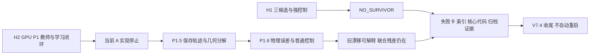

# V7.4 收尾：没有形成经过验证的主方法

2026-09-13；`WS-V74-CLOSEOUT-01`；用户明确结束 V7.4。状态 `CLOSED_WITHOUT_VALIDATED_MAIN_METHOD`。本次只整理研究结论、规划规则和仓库资产，没有新增实验。

| 阶段 | 已完成与最终边界 | 证据 |
|---|---|---|
| H1 WEX/RIF/DCS | WEX 未超出成熟控制；RIF/DCS 未形成要求的联合改善；NO_SURVIVOR | [H1 报告](WORLDSIM_V7_4_RESULTS.md)、[失败记录](WORLDSIM_V7_4_FAILURES.md) |
| H2 GPU P1 | 强 C1 能解决所测合成 failure；A 一次 DAgger 后自身闭环仍不足；停止当前实现 | [GPU 报告](WORLDSIM_V7_4_H2_GPU_P1_REPORT.md)、[F08](research_failures/entries/V74-H2-F08.md) |
| P1.5 | 薄结构首次退化主要为同片连续前移；不能预设 ownership switching 是病因 | [P1.5 报告](WORLDSIM_V7_4_H2_P15_FORENSICS_REPORT.md)、[F09](research_failures/entries/V74-H2-F09.md) |
| P1.6 | 普通法向控制恢复原70条对应 ray/step，但 A 自由空间退化、C2 有3条新的共享支撑 HIT→EARLY；仅部分解释 | [P1.6 报告](WORLDSIM_V7_4_H2_P16_DIAGNOSTIC_REPORT.md)、[F10](research_failures/entries/V74-H2-F10.md) |

H2 诊断使用已曝光的12个训练 FIT 任务，不能称独立测试。没有完成完整80例 A/C2 必要性比较、C4/C5、真实两域训练/测试和独立 FINAL；B/C 没有启动。H1 已执行的真实队列结果按其原角色保留。用户此前约 3/6 Weak Reject 的评价保持为历史人工复审，不新增评分，也不把诊断进展写成论文主方法进展。

关闭的是本版本投入及当前实现，不是全部 witness-native 科学假说。已排除“这批旧薄结构正例漂移必须靠新 first-hit dynamics 解决”的动机；尚未排除完整普通几何自由度控制。有限支撑与未覆盖观测残差可以作为未来 failure discovery 资产，不能直接充当新机制必要性证明。

后续规则已更新为：先发现真实 failure，建立强控制，再寻找有效解；一个主 method 确实有效后立即围绕证据组织 paper story，随后才考虑解决剩余问题的次要方法。具体见 [scaling law 第33条](../auto-research_scaling_law.md) 与 [F11](research_failures/entries/V74-H2-F11.md)。这项规则覆盖旧文档中将新对象、新术语或完整框架作为立项前提的表述。

保留核心代码、配置、报告、架构图、失败索引及关键摘要。逐对象/逐射线大表、渲染场景和可重建编译产物按本轮清理清单移出 Git；先存完整外部归档，再删除分支文件。原始研究 runs 与 P1.5/P1.6 失败资产继续保留。清理完成后登记体积、路径和恢复命令，推送后按已有授权检查无任务并关机。
