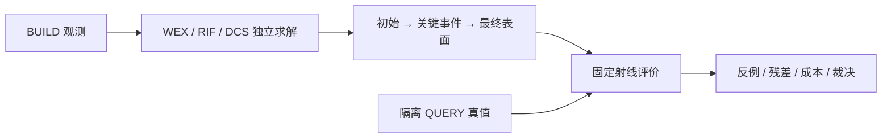

# V74 失败过程与反例

按用户 2026-09-10 最新研究计划记录详细事件；统一失败 ID、结论和历史仍由 [总失败账](RESEARCH_FAILURES.md) 索引。初始工程调试、科学失败、新颖性失败与证据不足分别记载。

当前尚无新科学失败。V74-F01：nuScenes 全新 FINAL 身份缺口仍 active；V74-F02：有卡恢复后 resource resolved。详细历史与证据链接见总失败账对应节。

每条后续失败记录：观察、受影响对象/射线、首次退化前后资产、配置/seed、约束残差、接受或拒绝理由、最近一手来源、迁移方案、实际执行结果、未证实解释、复开条件。没有做的实验不填结果。

## V74-F03：初始冲突关联遗漏自由段连接（已修复）

观察：解析 multiple_front_constraints_00 的原责任QP仅一条正见证显著违反，初版只查该正见证节点，遗漏经共享自由约束连到第二条责任的路径。r1 WEX5/20、MILP20/20，错误代码保存在原run/a_wex_initial.py。
迁移依据：[Learning LNS for MIPs](https://arxiv.org/abs/2107.10201) / [官方实现](https://github.com/google-deepmind/neural_lns) 表明通用邻域选择与成熟求解已有先例；这里修复计划原有约束超图连通性，不新增学习式搜索假设，也不将邻域搜索本身当原创。
修复：从冲突正节点加入相连 free 行的所有节点，固定/贪心/WEX控制共享同一关联。r2 条件20例 WEX20/20、贪心13/20、MILP20/20；原解析与修复结果全部保存。近似冲突仍不是不可行证书。
证据：runs/worldsim_v74/WS-V74-A-MECHANISM-01/20260910__domain-subsystem-r{1,2}-s7401，problem/domain/events逐例保存。只是80个线性域析取子系统，不冒称80个端到端几何案例；duplicate组实际只测候选重复及变量置换，尚未覆盖域值缩放。

## V74-F04：WEX 标准求解器替代与候选缺失风险（未裁决）

观察：解析问题标准MILP全部恢复可行，且比WEX快；FIT4对象两方法分别得到相同命中40/41、908/3195、74/74、1145/4208与相同面数738/1339/1200/1285。两密对象 G_empty2242/3009，WEX45.30/126.40s，对应MILP .884/2.471s。
当前解释：共享域对子集有用，但标准求解能解释当前收益；64个有限承载片在较密对象覆盖不足。BUILD拟合不是留出收益，不能因空自由违规就声称修复成功。未使用QUERY补候选、扩大半宽或换方法。
下一项有决策价值证据：相同固定43对象/8日志上的必要控制；不加C生片器救A。事件资产与实际约束统计保留在FIT pilot run，索引见方法结果摘要。资源可用，无OOM。

## V74-F05：C初始提议预算重复访问同一小队列（已修复）

观察：r1最多只访问前32个高需求锚点，20轮中每4轮回到原队列；在3195/4208点FIT对象，大量同值alpha令调度忽略其余锚点。源c_dcs_initial.py和pricing逐轮alpha/beta/anchors保留。
检索：[PointTriNet官方](https://github.com/nmwsharp/learned-triangulation) 的迭代局部提议机制，以及 [Template Pricing研究](https://arxiv.org/abs/2604.12070) 对退化与提议多样性的讨论。迁移仅修正原有预算的锚点遍历，不引入新模板定价算法或RL。全体控制共享完整队列轮转，仍固定20×8个提议，实际主问题只接受整数目标改善；无网络重训。
r1/r2均仅FIT四对象。r2提高密对象访问范围，但仍有大量缺支撑；没有因free=0宣称成功。C2是局部PointNet提议适配控制（普通残差锚点），C3是同完整网络无需求输入控制（保留全局锚点排序）；不是官方PointTriNet全模型复现。新方法若通过仍需更强原生外部对比。

## V74-F06：NKSR独立环境下载中断（处理中）

当前主环境Torch2.4.1+cu121，宿主nvcc11.8；采用独立nksr-v74环境与官方Torch2.4.1+cu118，避免覆盖方法实验环境。官方NKSR public源已取得，未宣称已运行。
官方wheel下载在121.3/857.6MB处ReadTimeout，默认15秒；检索 [pip超时接口](https://pip.pypa.io/en/stable/cli/pip/) 与 [PyTorch历史版本](https://pytorch.org/get-started/previous-versions/)，使用同官方地址curl续传、失败重试与180s超时。日志 third_party/wheels/{torch_download,torch_install}.log。当前不是资源不足，不关闭正在运行的方法任务。

## V74-F07：最近责任误用面遍历顺序（代码已改，正式A更正生成待完成）

最小反例：FIT scene-0471__203cea9260874ff78e5e200a866ef44f，ray23，观测23.8712349m，epsilon .174519874m；G集合的存储首值24.0206337m，真实最近23.7742405m。见 closest_responsibility_counterexample.json。
检索：[NVIDIA对遍历/最近交点顺序的说明](https://forums.developer.nvidia.com/t/why-are-some-of-my-any-hits-missed/288077/2)。本项目没有采用OptiX，该来源支持必须区分遍历顺序与距离顺序；迁移为每束G按真实t稳定排序，不改共同Möller–Trumbore的min首交点。
此为协议实现错误：A1必须固定最近正确候选责任，WEX/贪心与MILP采用同一候选顺序。真实A r1全部保留并由r2更正，不读r1 DEV质量；正在进行的三维机制中旧A也标为更正前，B/C不受影响。解析域子系统无空间距离，不受此排序错误影响。未加候选、改半宽或引入新机制。

## V74-F08：RIF显式松弛变量造成数值瓶颈（等价目标迁移）

观察：原FIT AV2 4208对象RIF396.16s，仅完成1轮细分，外层预算无法限制内部QP；对象scene-0911的粗层需要104143个额外松弛变量。两者都保留初始/每步场/真实残差，不以耗时冒称资源不够。
检索：[OSQP time_limit](https://osqp.org/docs/interfaces/solver_settings.html)、[SciPy L-BFGS-B](https://docs.scipy.org/doc/scipy/reference/optimize.minimize-lbfgsb.html)；结合当前显式二次松弛，使用精确代数消元：e=-Hc，s=max(mu-Fc,0)。新目标仍为0.5cᵀPc−c0ᵀc+5000(||Hc||²+||max(mu−Fc,0)||²)，改变数值变量规模，不改变物理合同。
对角缩放后用成熟L-BFGS-B及解析梯度，最大10000迭代，求解内回调检查剩余时间。显式约束残差改为解析恢复；primal_residual=0仅指已消元辅助等式恒等成立，必须结合H_residual/F_slack和stationarity看真实可行性/收敛，不能当物理认证。
一次两个FIT粗层对比复用原QP存档、不重跑原QP：小对象目标差2.80e−7，大对象新目标降低23.86036，未达原假定同解说明原数值求解不足。完整r2继续同四FIT对象和全部必要控制；原r1也保存。三维机制旧B结果将由同目标新数值版本替换，已完成C原样复用。
