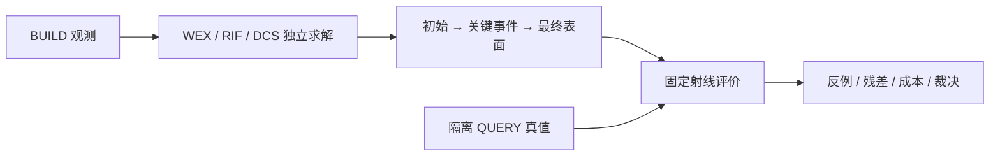

# V74 失败过程与反例

按用户 2026-09-10 最新研究计划记录详细事件；统一失败 ID、结论和历史仍由 [总失败账](RESEARCH_FAILURES.md) 索引。初始工程调试、科学失败、新颖性失败与证据不足分别记载。

当前尚无新科学失败。V74-F01：nuScenes 全新 FINAL 身份缺口仍 active；V74-F02：有卡恢复后 resource resolved。详细历史与证据链接见总失败账对应节。

每条后续失败记录：观察、受影响对象/射线、首次退化前后资产、配置/seed、约束残差、接受或拒绝理由、最近一手来源、迁移方案、实际执行结果、未证实解释、复开条件。没有做的实验不填结果。

## V74-F03：初始冲突关联遗漏自由段连接（已修复）

观察：解析 multiple_front_constraints_00 的原责任QP仅一条正见证显著违反，初版只查该正见证节点，遗漏经共享自由约束连到第二条责任的路径。r1 WEX5/20、MILP20/20，错误代码保存在原run/a_wex_initial.py。
迁移依据：[Learning LNS for MIPs](https://arxiv.org/abs/2107.10201) / [官方实现](https://github.com/google-deepmind/neural_lns) 表明通用邻域选择与成熟求解已有先例；这里修复计划原有约束超图连通性，不新增学习式搜索假设，也不将邻域搜索本身当原创。
修复：从冲突正节点加入相连 free 行的所有节点，固定/贪心/WEX控制共享同一关联。r2 条件20例 WEX20/20、贪心13/20、MILP20/20；原解析与修复结果全部保存。近似冲突仍不是不可行证书。
证据：runs/worldsim_v74/WS-V74-A-MECHANISM-01/20260910__domain-subsystem-r{1,2}-s7401，problem/domain/events逐例保存。只是80个线性域析取子系统，不冒称80个端到端几何案例；duplicate组实际只测候选重复及变量置换，尚未覆盖域值缩放。

## V74-F04：WEX 标准求解器替代与候选缺失风险（未裁决）

观察：解析问题标准MILP全部恢复可行，且比WEX快；FIT4对象两方法分别得到相同命中40/41、908/3195、74/74、1145/4208与相同面数738/1339/1200/1285。两密对象 G_empty2242/3009，WEX45.30/126.40s，对应MILP .884/2.471s。
当前解释：共享域对子集有用，但标准求解能解释当前收益；64个有限承载片在较密对象覆盖不足。BUILD拟合不是留出收益，不能因空自由违规就声称修复成功。未使用QUERY补候选、扩大半宽或换方法。
下一项有决策价值证据：相同固定43对象/8日志上的必要控制；不加C生片器救A。事件资产与实际约束统计保留在FIT pilot run，索引见方法结果摘要。资源可用，无OOM。
