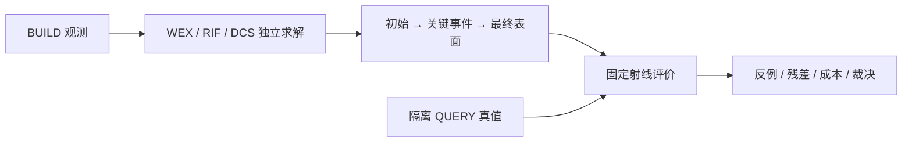

# V74 失败过程与反例

按用户 2026-09-10 最新研究计划记录详细事件；统一失败 ID、结论和历史仍由 [总失败账](RESEARCH_FAILURES.md) 索引。初始工程调试、科学失败、新颖性失败与证据不足分别记载。

当前尚无新科学失败。V74-F01：nuScenes 全新 FINAL 身份缺口仍 active；V74-F02：有卡恢复后 resource resolved。详细历史与证据链接见总失败账对应节。

每条后续失败记录：观察、受影响对象/射线、首次退化前后资产、配置/seed、约束残差、接受或拒绝理由、最近一手来源、迁移方案、实际执行结果、未证实解释、复开条件。没有做的实验不填结果。
