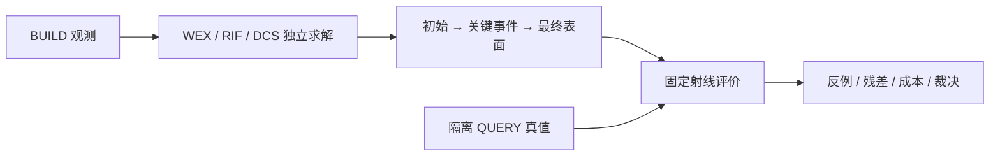

# V74 失败过程与反例

按用户 2026-09-10 最新研究计划记录详细事件；统一失败 ID、结论和历史仍由 [总失败账](RESEARCH_FAILURES.md) 索引。初始工程调试、科学失败、新颖性失败与证据不足分别记载。

初始开机阶段尚无新科学失败（历史状态，已由最终判定更新）。V74-F01：nuScenes 全新 FINAL 身份缺口仍 active；V74-F02：有卡恢复后 resource resolved。详细历史与证据链接见总失败账对应节。

每条后续失败记录：观察、受影响对象/射线、首次退化前后资产、配置/seed、约束残差、接受或拒绝理由、最近一手来源、迁移方案、实际执行结果、未证实解释、复开条件。没有做的实验不填结果。

## 最终分类与反例边界（2026-09-11）

NO_SURVIVOR。WEX=FAIL_NOVELTY；RIF/DCS=FAIL_SCIENCE。全部真实与完整3D机制已完成，旧节中“未裁决/下一项”是发生时记录。F04的解析WEX20/20对贪心13/20为正例，但MILP20/20且更快，完整真实组同表示控制解释收益。F10主域RIF均数值收敛而early保护失败；不能把求解器成功当几何可行。F09合成缺支撑hit有增益，但BUILD有用生片4.031%仅较强局部网络1.406%多2.625pp，未达15pp；真实普通生片/去需求控制未被战胜。860真实DCS事件eta=0，提议库最多1536面小于4096，容量需求机制没有被检验，不能写成有效或无效。

扩大字典80例均整数gap=0，缺支撑组仍平均5.8束未解释，有限候选最优不是连续几何不可能性证书。首次退化按已有事件中“自有QUERY命中净损失或新early”定义，before/after资产、射线ID、残差和接受/拒绝理由在 event_evidence 与 final/event_summary.json，属于事后诊断。最差对象视图和全日志汇总同时见 [最终报告](WORLDSIM_V7_4_RESULTS.md)。复查只针对既有假设；更改模型/预算需要新的研究范围，不能自动复活失败候选。

## V74-F11：NKSR 缺失层导出异常（已修复）

触发：原生probe43中8个1–17点稀疏对象，field.svh.grids[0]=None，而官方 extract_dual_mesh 直接访问 `_grid`。第一适配试图从0×3坐标建立空层，被底层“Cannot build empty grid”拒绝；r1/r2错误与对象列表保留。检索官方 [issue入口](https://github.com/nv-tlabs/NKSR/issues) 与 [导出源码](https://github.com/nv-tlabs/NKSR/blob/public/package/nksr/fields/base_field.py)，结合本地 SparseFeatureHierarchy 与 C++ dualCubeGraph 可知层序决定2^l步长，不能简单删除列表中的空层。

最终迁移：用官方 build_flattened_grid 在被子格覆盖的临时单格上删除全部体素，获得合法的空NanoVDB层，保留原层级位置/变换。没有把临时点交给网络、场或最终几何；返回前空层体素数为0。补丁在 third_party/patches/nksr_empty_meshing_levels.patch。其余learned field、ks权重、.1m体素与MISE1不变。只重跑8个错误对象，全部完成，面数40/25/446/516/171/80/105/1164；另35对象复用。一个此前合法空面继续保留，没有因为miss高而重建。

run=WS-V74-NKSR-REFERENCE-01/20260911__probe43-empty-native-r3；最终66对象评价=WS-V74-PROBE-EVALUATION-01/20260911__NKSR-probe66-empty-native-r3，ready零工程缺输出。真实中位面数nuScenes2097、AV25431.5，超面数/预训练信息仍单列。修复属于外部对照工程，不改变A/B/C裁决，也不是研究创新。

## V74-F03：初始冲突关联遗漏自由段连接（已修复）

观察：解析 multiple_front_constraints_00 的原责任QP仅一条正见证显著违反，初版只查该正见证节点，遗漏经共享自由约束连到第二条责任的路径。r1 WEX5/20、MILP20/20，错误代码保存在原run/a_wex_initial.py。
迁移依据：[Learning LNS for MIPs](https://arxiv.org/abs/2107.10201) / [官方实现](https://github.com/google-deepmind/neural_lns) 表明通用邻域选择与成熟求解已有先例；这里修复计划原有约束超图连通性，不新增学习式搜索假设，也不将邻域搜索本身当原创。
修复：从冲突正节点加入相连 free 行的所有节点，固定/贪心/WEX控制共享同一关联。r2 条件20例 WEX20/20、贪心13/20、MILP20/20；原解析与修复结果全部保存。近似冲突仍不是不可行证书。
证据：runs/worldsim_v74/WS-V74-A-MECHANISM-01/20260910__domain-subsystem-r{1,2}-s7401，problem/domain/events逐例保存。只是80个线性域析取子系统，不冒称80个端到端几何案例；duplicate组实际只测候选重复及变量置换，尚未覆盖域值缩放。

## V74-F04：WEX 标准求解器替代与候选缺失风险（未裁决）

观察：解析问题标准MILP全部恢复可行，且比WEX快；FIT4对象两方法分别得到相同命中40/41、908/3195、74/74、1145/4208与相同面数738/1339/1200/1285。两密对象 G_empty2242/3009，WEX45.30/126.40s，对应MILP .884/2.471s。
当前解释：共享域对子集有用，但标准求解能解释当前收益；64个有限承载片在较密对象覆盖不足。BUILD拟合不是留出收益，不能因空自由违规就声称修复成功。未使用QUERY补候选、扩大半宽或换方法。
下一项有决策价值证据：相同固定43对象/8日志上的必要控制；不加C生片器救A。事件资产与实际约束统计保留在FIT pilot run，索引见方法结果摘要。资源可用，无OOM。

## V74-F05：C初始提议预算重复访问同一小队列（已修复）

观察：r1最多只访问前32个高需求锚点，20轮中每4轮回到原队列；在3195/4208点FIT对象，大量同值alpha令调度忽略其余锚点。源c_dcs_initial.py和pricing逐轮alpha/beta/anchors保留。
检索：[PointTriNet官方](https://github.com/nmwsharp/learned-triangulation) 的迭代局部提议机制，以及 [Template Pricing研究](https://arxiv.org/abs/2604.12070) 对退化与提议多样性的讨论。迁移仅修正原有预算的锚点遍历，不引入新模板定价算法或RL。全体控制共享完整队列轮转，仍固定20×8个提议，实际主问题只接受整数目标改善；无网络重训。
r1/r2均仅FIT四对象。r2提高密对象访问范围，但仍有大量缺支撑；没有因free=0宣称成功。C2是局部PointNet提议适配控制（普通残差锚点），C3是同完整网络无需求输入控制（保留全局锚点排序）；不是官方PointTriNet全模型复现。新方法若通过仍需更强原生外部对比。

## V74-F06：NKSR独立环境下载中断（处理中）

当前主环境Torch2.4.1+cu121，宿主nvcc11.8；采用独立nksr-v74环境与官方Torch2.4.1+cu118，避免覆盖方法实验环境。官方NKSR public源已取得，未宣称已运行。
官方wheel下载在121.3/857.6MB处ReadTimeout，默认15秒；检索 [pip超时接口](https://pip.pypa.io/en/stable/cli/pip/) 与 [PyTorch历史版本](https://pytorch.org/get-started/previous-versions/)，使用同官方地址curl续传、失败重试与180s超时。日志 third_party/wheels/{torch_download,torch_install}.log。当前不是资源不足，不关闭正在运行的方法任务。

## V74-F07：最近责任误用面遍历顺序（代码已改，正式A更正生成待完成）

最小反例：FIT scene-0471__203cea9260874ff78e5e200a866ef44f，ray23，观测23.8712349m，epsilon .174519874m；G集合的存储首值24.0206337m，真实最近23.7742405m。见 closest_responsibility_counterexample.json。
检索：[NVIDIA对遍历/最近交点顺序的说明](https://forums.developer.nvidia.com/t/why-are-some-of-my-any-hits-missed/288077/2)。本项目没有采用OptiX，该来源支持必须区分遍历顺序与距离顺序；迁移为每束G按真实t稳定排序，不改共同Möller–Trumbore的min首交点。
此为协议实现错误：A1必须固定最近正确候选责任，WEX/贪心与MILP采用同一候选顺序。真实A r1全部保留并由r2更正，不读r1 DEV质量；正在进行的三维机制中旧A也标为更正前，B/C不受影响。解析域子系统无空间距离，不受此排序错误影响。未加候选、改半宽或引入新机制。

## V74-F08：RIF显式松弛变量造成数值瓶颈（等价目标迁移）

观察：原FIT AV2 4208对象RIF396.16s，仅完成1轮细分，外层预算无法限制内部QP；对象scene-0911的粗层需要104143个额外松弛变量。两者都保留初始/每步场/真实残差，不以耗时冒称资源不够。
检索：[OSQP time_limit](https://osqp.org/docs/interfaces/solver_settings.html)、[SciPy L-BFGS-B](https://docs.scipy.org/doc/scipy/reference/optimize.minimize-lbfgsb.html)；结合当前显式二次松弛，使用精确代数消元：e=-Hc，s=max(mu-Fc,0)。新目标仍为0.5cᵀPc−c0ᵀc+5000(||Hc||²+||max(mu−Fc,0)||²)，改变数值变量规模，不改变物理合同。
对角缩放后用成熟L-BFGS-B及解析梯度，最大10000迭代，求解内回调检查剩余时间。显式约束残差改为解析恢复；primal_residual=0仅指已消元辅助等式恒等成立，必须结合H_residual/F_slack和stationarity看真实可行性/收敛，不能当物理认证。
一次两个FIT粗层对比复用原QP存档、不重跑原QP：小对象目标差2.80e−7，大对象新目标降低23.86036，未达原假定同解说明原数值求解不足。完整r2继续同四FIT对象和全部必要控制；原r1也保存。三维机制旧B结果将由同目标新数值版本替换，已完成C原样复用。

## V74-F09：DCS的普通生片替代与留出支撑不足

状态：真实DEV筛选路径均未达标，机制/区间归因待收口；人工verdict未填。配置在ab3ca371登记冻结，此后不调需求教师、提议预算或片尺寸。
两个数据集分别FIT训练的full/no_demand checkpoint与43对象BUILD事件保存于WS-V74-C-FIT-TRAIN-01和WS-V74-C-REAL-01；所有初始、20步实际片/参数/对偶价格/整数接受或拒绝原因齐备。查询由独立evaluate_worldsim_v74_assets.py读取，未回流求解。
nuScenes相对C0命中+6.106pp，但相对C1−0.405pp、相对C3−0.301pp；early相比C1−1.439pp、free反而+0.004113m，说明减少提前返回频率不等于整体自由空间侵入更小。相对C1召回−2.528pp超保护底线。AV2相对C1命中−6.039pp且miss+8.380pp；相对C3命中−1.211pp，free+0.024576m。不能混合域掩盖差异，也不能仅报安全分数忽略支撑。
证据：docs/autoresearch/worldsim_v74/evaluation/c_dcs/{per_actor,summary,manifest,resources}.json；详细逐射线query_rays.npz与原surface_path在run目录。后续仅做已规定的几何生片有效性/强控制归因和三候选统一裁决，不用补丁续命。

### V74-F04 真实DEV追加证据（A排序更正后）

nuScenes WEX相对A1/A2主要指标差为0，相对A3 MILP命中−0.182pp；AV2约束控制同分。所有每日志/逐对象/逐射线证据与求解时间保存在evaluation/a_wex及WS-V74-A-REAL-01的r2，不以近似均值声称所有顶点位级相同。WEX没有新候选补齐能力，稀疏自由约束下固定责任已够用，密对象仍保留大量G_empty；这是当前表示/预算下标准替代与支持不足，并非证明所有共享交换数学对象都无意义。

### V74-F09 生片机制归因的来源与执行边界

[PointTriNet官方](https://nmwsharp.com/research/learned-triangulation/)使用局部PointNet提议和候选分类；当前C2是同邻域PointNet+标准整数主问题的控制，未冒称完整官方PointTriNet。[对偶稳定化](https://arxiv.org/abs/2405.11198)和[退化定价研究](https://arxiv.org/abs/2604.12070)提醒低约化成本/LP改进不等于新的有用支撑。接入点：对保存的每步parameters/anchors重新做同一真实八边形求交，记录能修复旧miss/late且不产生early的BUILD/QUERY生片率，并保存首次QUERY退化前后资产与射线ID。QUERY只用于事后取证，没有进入提议或选择。稳定化不是已实现组件，不用这些来源将负结果变成事后新方法。

## V74-F10：RIF的区间满足不延伸为留出几何安全

当前主域数值证据完整：25对象×4轮RIF均报告收敛，末层scaled stationarity最大4.45e−5，root_outside_domain=0、zero_tetra=0；16/25对象BUILD全正确且无提前。显式松弛的残差为场值单位，不是几何测距误差。AV2 18对象中RIF10对象BUILD物理满足，末层1对象到10000迭代上限；这部分不宣称充分收敛。
真实QUERY上RIF37.208%命中、14.840%early、20.379%miss、74.103%召回、free0.512m。B2普通同轮数细分30.608%命中、10.021%early、63.533%召回、free0.591m；RIF虽增加覆盖，early显著超非劣上限。B0采样命中37.794%、early9.684%；B1精确固定网格31.168%、early8.910%。因此问题不只是“更密就好”或“区间端点算错”，而是当前重建层没有将BUILD的局部几何保证变成足够好的留出表面。
检索[可见性增强重建](https://arxiv.org/abs/2202.01810)、[弱支持表面的可见性重建](https://pmc.ncbi.nlm.nih.gov/articles/PMC4897344/)及[NKSR官方](https://research.nvidia.com/labs/toronto-ai/NKSR/)。接入点为已有同信息外部先验/标准控制，以及初始—细分—最终的真实QUERY取证；不在冻结后额外增加可见性头、RGB、未知空间约束或修改权重。当前BUILD观察有限，未观测几何必须由表示/先验支持，不能从已测区间证明全空间安全。
保存：real_solver_status.json包含逐对象末层求解状态/完整events路径；event_evidence/b_rif保存首次退化前后表面、lost/gained/newearly射线ID；原npz包含全部场、四面体、约束端点、根残差。结论只针对本轮配置/表示预算；待统一机制报告后填筛选分类，人工verdict保持空。
