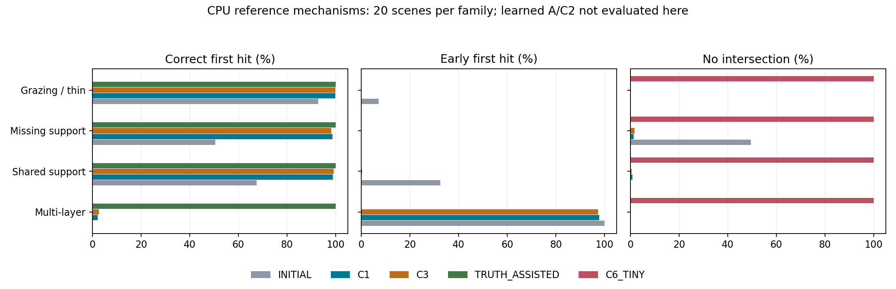
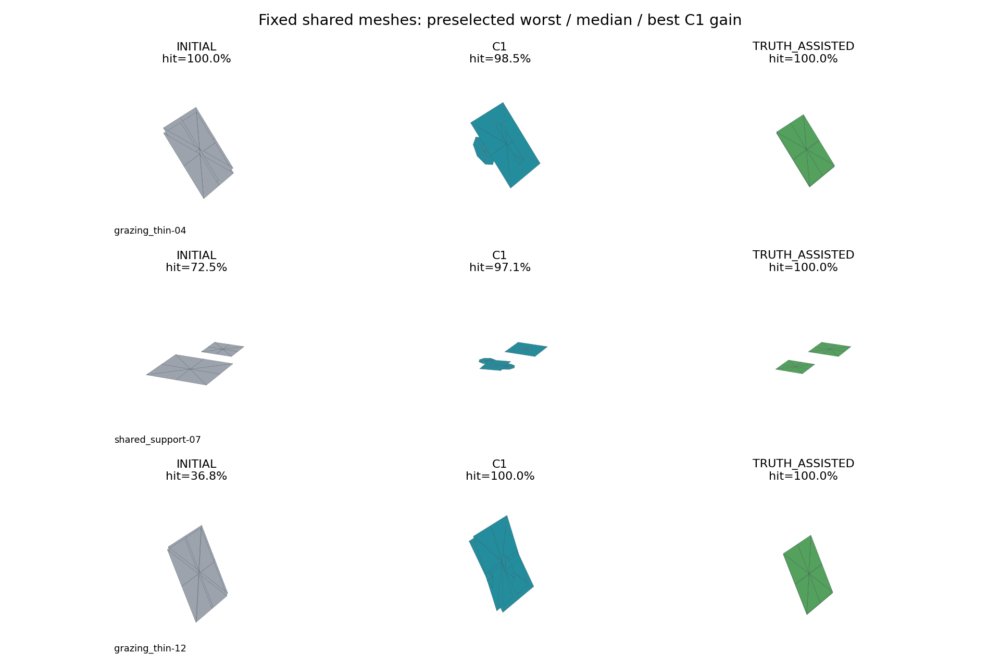

# V74 下半场：无卡阶段交接

**状态：CPU 准备完成，WAIT_GPU。** 按用户要求停止在有卡开机之前；尚未进行完整A的机制裁决、真实DEV比较或独立最终确认。V74上半场NO_SURVIVOR保持冻结，B/C未启用。

## 已完成的工作

| 项目 | 结果 | 证据 |
|---|---|---|
| 研究规则与主线 | 已将scaling law纳入AGENTS、方案/卡点/roadmap规则；独立H2分支从abbd431c建立 | [计算合同与9项前序差异](WORLDSIM_V7_4_H2_METHOD_CONTRACT.md) |
| 失败资产整理 | 14485行总账变为短入口、1084历史目录、80分片、分页版本表、8主题、最终裁决短卡和新失败模板 | [渐进读取入口](RESEARCH_FAILURES.md) |
| FIT 数据 | 1221对象保留身份，1204可成任务，2408帧块episode；17对象不足两帧；两域各自16/4与14/3日志 | [数据摘要](autoresearch/worldsim_v74_h2/fit_data_summary.json) |
| 共同初始化 | 2612份：2408 FIT任务 +204旧DEV对象；351份空输入表面保留；每对象最多64片、固定0.15m初始半径 | [初始化摘要](autoresearch/worldsim_v74_h2/initials_summary.json) |
| AV2 储备 | 10个原预留日志坐标/每返回时间/构建与查询分离完成；不评价方法质量，不进入训练 | [储备格式记录](autoresearch/worldsim_v74_h2/av2_reserve_summary.json) |
| E0与CPU控制 | 六种必要几何、观测歧义、有限库穷举、80完整3D构型×5资产，完整链与事件过程保存 | [机制摘要](autoresearch/worldsim_v74_h2/cpu/summary.json) |
| 连续学习能力 | 12新合成FIT任务，A/C2同信息单步拟合，全部只用CPU | [学习记录](autoresearch/worldsim_v74_h2/learnability/results.json) |
| NKSR预算资产 | 4FIT+43DEV共47份，23份原面数超4096；规范化后全部在预算内，原生空网格1份保留 | [预算适配记录](autoresearch/worldsim_v74_h2/nksr_budget/results.json) |
| 论文准备 | 任务、相关工作差异、评价合同、架构图和证据待办已写；没有填预测结果 | [论文骨架](WORLDSIM_V7_4_H2_PAPER_DRAFT.md) |

## 本轮CPU得到的证据边界

八半径表示通过已知方片组件构造达到六种必要构型的真值查询；这是已达到的能力，不是连续问题严格上界。组件很少，尚未触及512片容量压力，不能声称验证了容量管理。
两份世界在49条构建射线上完全一致，而后侧查询深度平均相差1米；这证明该构型的信息不可辨识，不否定统计先验。固定四状态事件库已穷举，最优只在该有限库成立。

80个构型，每类20，三组BUILD原点与三组不同QUERY原点。每组64目标射线加16较宽视场射线，真值来自整张真实表面的最近交点；命中分母只用自有正返回，自由侵入用全部有效测量。C1和C3均按同硬目标执行最多8×64事件评价。C3是有限束搜索，不是连续全局最优。

| 构型 | 初始 hit | C1 hit / early / miss | C3 hit / early / miss |
|---|---:|---|---|
| multilayer | 0.07% | 2.10% / 97.90% / 0.00% | 2.62% / 97.38% / 0.00% |
| shared_support | 67.50% | 98.84% / 0.14% / 0.94% | 99.21% / 0.29% / 0.50% |
| missing_support | 50.48% | 98.66% / 0.00% / 1.34% | 98.30% / 0.00% / 1.70% |
| grazing_thin | 92.85% | 99.85% / 0.00% / 0.07% | 99.93% / 0.00% / 0.07% |

这张表还没有A/C2学习式演化。C1/C3已解释共享支撑、补支撑和薄结构的大部分收益；后续A不能仅靠这些容易构型建立新颖性。多层遮挡残余大，不等于A已经解决，也不等于所有成熟优化都失败。
极小片在这些留出查询上hit=0、miss=100%，但欧氏表面召回仍约95–98%；这进一步说明单向点距离不能代替射线正确性。全部面积和双向采样几何指标保留；预测表面到真表面的面积错误是四点/三角形的固定采样估计，非连续精确面积。

展示按C1相对初始化的QUERY命中改善排序取最差/中位/最好，所有同一对象面采用共同视角和坐标范围；不是A成功图。逐候选接受代价、选中轨迹、首次留出退化前后表面以及所有查询链均保留于大资产目录。

## 学习能力与数值检查

| 模型 | 参数量 | 连续参数平均 RMSE | 初始 → 更新后 QUERY hit（这12个FIT任务） |
|---|---:|---:|---|
| A | 11950 | 0.00528 | 69.39% → 100.00% |
| C2 | 11918 | 0.01166 | 69.39% → 100.00% |

当前采用修复深度排序和特征截断后的r2；r1保留为工程修复前证据。
以上只是在12个已知匹配片的合成FIT任务上拟合单步位置/旋转/八半径更新；两个模型都能学到，不能据此声称显式顺序必要。没有覆盖完整出生/分裂策略、8步闭环、训练外泛化或真实域收敛。A/C2参数差仅32，C2获得全部深度和几何集合。初始化/目标/预测资产与学习曲线保存。

矩形二三角参考与八三角扇在80构型上无漏交分歧；SE(3)共同变换最大误差约5.3e-15米。非退化float32/64最大差约1.4e-06米、无漏交分歧；另构造的1e−10米边界外点在float32中舍入为闭边命中，已单列[V74-H2-F03](research_failures/entries/V74-H2-F03.md)。不同片相距1e−11米仍保留独立事件，共面没有孤立交点，t=0排除。固定5/10mm位移与0.5/1mrad方向误差只作同资产敏感性，未用来改主容差。

## 数据角色与仍未获得的证据

FIT按真实帧时间排序前半/后半及反向组成两个任务；部分对象实际可用帧少于六帧，以索引中的真实帧ID为准。A前向只读input，support点从A重算；B仅作为FIT监督。无正输入/无正监督分别记录，没有按模型误差排除。旧FIT已在历史中曝光，内部验证不能称独立确认。
现有43ready/66合同probe继续沿用，23缺BUILD与11无自有QUERY不被抹去；全部204旧DEV对象初始化不会改变probe身份。两域各自训练/验证，不要求A域训练B域泛化。
AV2预留10日志的原始值仅用于固定格式坐标转换，质量仍未打开；没有增加或替换日志来挑结果。nuScenes全新FINAL身份缺口仍在。储备不代表最终样本量充分，若P1/P2有正信号，按FIT日志差异与目标效应规划确认资源，独立质量打开前固定规则。

## 卡点处理与保留资产

[V74-H2-F01](research_failures/entries/V74-H2-F01.md)保留帧块数据可用性边界；[F02](research_failures/entries/V74-H2-F02.md)记录低配CPU迁移和路径修复；[F03](research_failures/entries/V74-H2-F03.md)记录有限精度边界；[F04](research_failures/entries/V74-H2-F04.md)记录NKSR重复顶点/退化面造成的简化停滞；[F05](research_failures/entries/V74-H2-F05.md)记录远层顺序和输入截断修复。实质卡点均有一手来源、迁移位置和结论范围，按scaling law区分工程、数值和科学。没有新的A科学失败或主创新成功结论。

远端数据在 `/root/autodl-tmp/data/worldsim_v74_h2/`；完整CPU机制、学习能力和NKSR原生适配尝试在 `/root/autodl-tmp/runs/worldsim_v74_h2/`。Git保存代码、配置、轻量指标和文档；大型NPZ/检查点不因索引push而被宣称完整远端备份。
无卡服务器cgroup为0.5CPU/2GiB；FIT转换约106.5秒、峰值59.5MiB，共同初始化约22.3秒。80机制在本地2个CPU工作进程约27.6秒；12任务A/C2当前r2学习约12.8秒；AV2格式转换迁移本地CPU约990秒；QEM最终47份约1秒。不同主机时间不混为同硬件速度基准。

## 有卡开机后的首要工作

1. 完成完整P1的A/C2事件学习与8步展开，保留同信息/表示/容量的C1/C3及C4/C5；先证明能学，再判方法必要性。
2. 只有P1满足计划条件才做nuScenes/AV2各自FIT训练与旧DEV联合筛查；不从上述CPU表直接晋级P2。
3. 正信号后才用确认seed、新日志和场景应用；失败按预定类别关闭，不自动打开B/C或用大基座救场。

停止状态见 [CPU交接判定](autoresearch/worldsim_v74_h2/cpu_phase_decision.json)。人工verdict留空，论文准备度维持计划约3/6。后续方案、卡点和roadmap均继续遵循 `auto-research_scaling_law.md`。

资源收口记录见 [进程与磁盘](autoresearch/worldsim_v74_h2/resource_closeout.json)；当前数据盘剩余约184.3 GiB。没有遗留研究worker，无卡实例保持当前状态，等待用户有卡开机。
