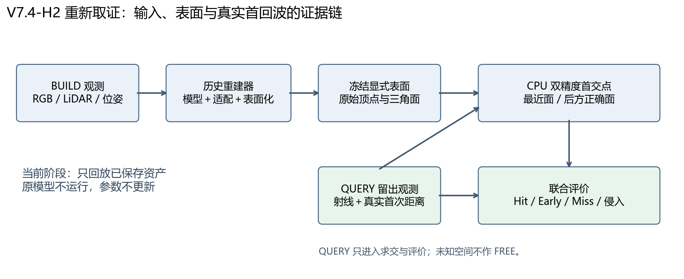
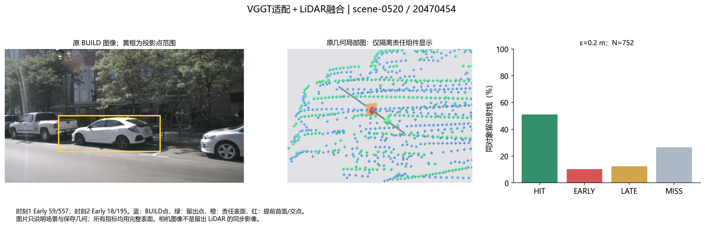
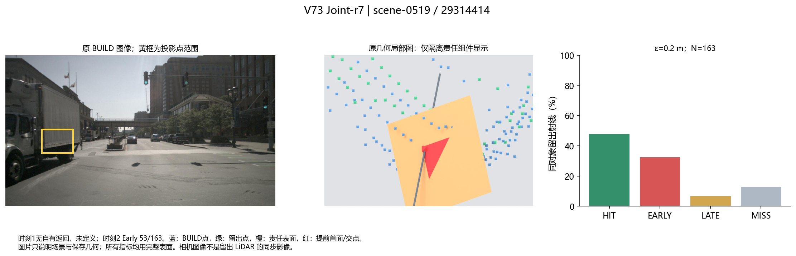
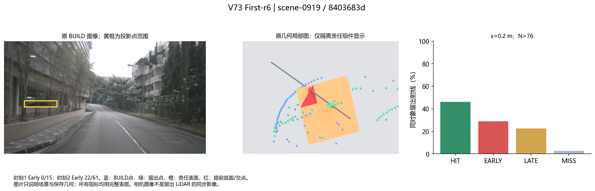
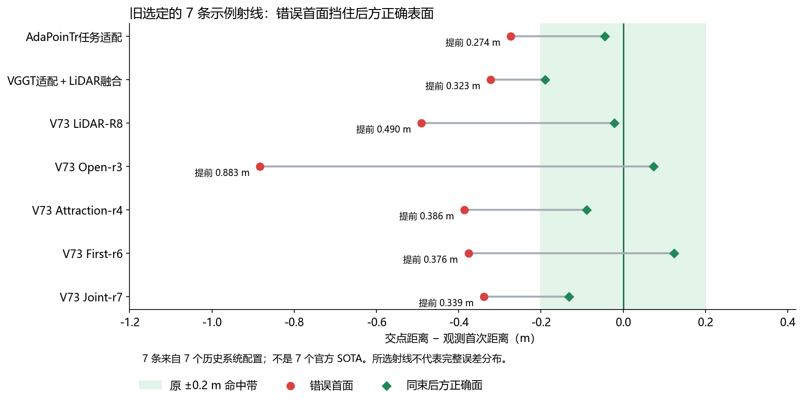
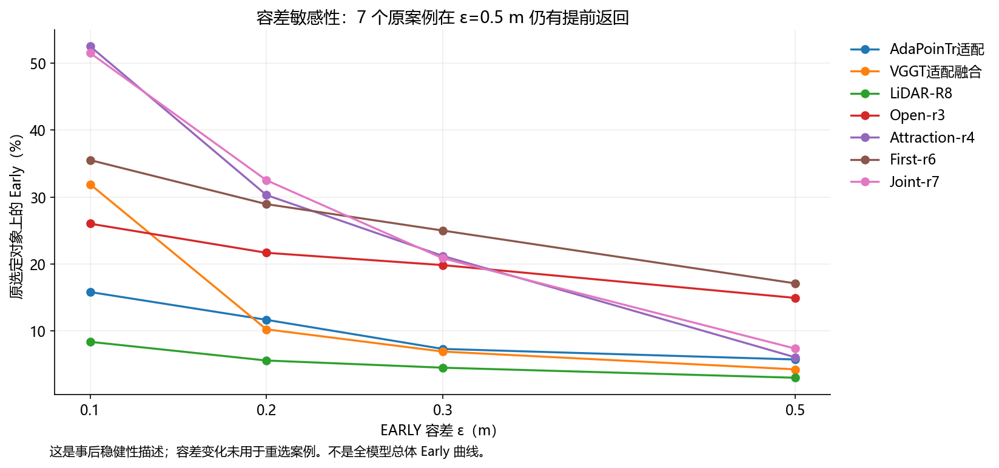
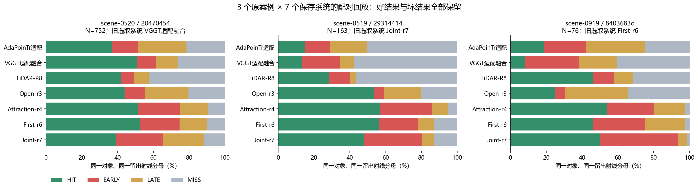
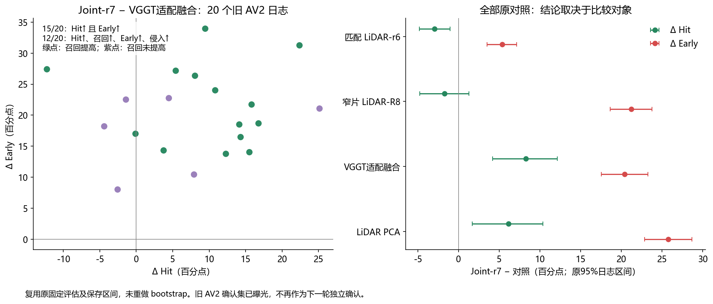

# V7.4-H2：首次回波 badcase 重新取证

2026-09-15；`WS-V74-H2-REDISCOVERY-01 / 20260915-cpu-r1`。已回到 `research/worldsim-v7.4-h2-generative-surface`；V8.1 分支保留。当前无 GPU，本轮新模型推理 0、训练更新 0；人工 verdict=null。

**有可复用且数值稳定的旧 badcase。最值得先复验的是 scene-0520 的白色轿车。现有证据支持“已有重建/适配系统的覆盖与真实首回波存在冲突”，尚不支持“官方 VGGT 及其后继 SOTA 普遍如此”。**

旧取证标签 `VGGT-native` 实际是 **M1r3 微调过的 VGGT DPT＋BUILD LiDAR 融合＋固定 PCA 小片**。本报告改用“VGGT适配融合”；不把它算成官方零样本 VGGT。Joint-r7、Open-r3、Attraction-r4、First-r6、LiDAR-R8 均为本项目研究系统。AdaPoinTr 使用官方网络经任务适配，仍有自定义表面读出。

## 1. 先把 claim 拆清楚

原始有效返回距离为 r，冻结表面最近交点为 t。沿用旧 ε=0.2 m：Hit 为 |t−r|≤ε；Early 为 t<r−ε；Late 为 t>r+ε；没有预测返回记 Miss。已观测自由段侵入量为 max(r−ε−t,0)，MISS 不凭空产生侵入。没有真实返回/有效发射合同的方向保持 UNKNOWN。

**Early/free-space intrusion 与 false-safe 不是同义词。** Early 是把已知自由空间过早占据；false-safe 需要另一个实际决策事件，例如真实障碍被判为可通行。旧 V6.7 实现也把 occupancy false-safe 定义为“预测非占据、实际占据”。本轮没有规划或占据接受决策，false-safe 结果未测。后方空间被前面遮住同样不能自动称 FREE。

需要分开证明两件事：①模型生成了与观测自由段冲突的几何；②一个明确补全/修复变化带来覆盖或 Hit 提升，同时增加侵入。单个模型有 Early 只能支持①。Hit 与 Early 的共同增加发生于同一对象/日志里的不同射线，不会发生于同一条射线的同一输出。

## 2. 已找到的主案例与保留边界

**主案例 A：scene-0520 / 204704542f8642dc8ab046ffbd70e0c5，白色轿车。** 1388 个 BUILD 点，752 条自有留出返回，两个独立留出时刻分别557/195条；归属歧义标记为0。轨迹平移速度代理0.225 m/s，近静止但不是严格静态证明。对应 VGGT适配融合结果：Hit384、Early77、Miss199；Early分别59/557和18/195。77条Early中37条沿同一束后方仍有正确交点；测量→表面 recall@0.2m为100%，仍不能保证真实首返回。

原先选定ray382的错误首面提前0.323m，后方确有正确交点；其责任三角形q≈1.155，属于规则三角形，责任连通组件附近也有BUILD点。不是靠“极细长三角形”或“完全没有任何BUILD支持的孤岛”解释该示例。组件有一点支持不代表整个支撑域可靠；还没有排除普通尺度、局部延伸、框归属和表面化误差。

**案例 B：scene-0519 / 29314414a33a4cb8b8385cb711c830ec，Joint-r7。** 163条返回中53条Early，28条Early后方有正确面；原选定ray41提前0.339m。它的两个留出时刻分母为0/163，速度代理4.382m/s，故保留为“后方正确面被挡”的几何示例，**不称为跨时刻稳定主案例**。它与案例A来自同一日志。

**案例 C：scene-0919 / 8403683d59554ee9b23122079c7f1237，First-r6。** 76条返回中22条Early，原ray54提前0.376m；是另一个日志，速度代理0.128m/s。但两个时刻Early为0/15、22/61，不能称两个时刻都失败。VGGT适配融合在同对象两个时刻为1/15、22/61，第一时刻样本很少。全部结果保留，不替换成更极端对象。

三个场景图使用原BUILD图像，仅依BUILD点投影数量选择上下文视图；不是对应QUERY LiDAR时刻的同步RGB。框是BUILD点投影范围，不是人工表面真值。旧Blender图只隔离责任组件便于观看；所有指标重新查询完整表面。蓝/绿八面体是测量标记，不能当成重建几何。

## 3. CPU 独立回放结果

保留旧规则选定的全部7个系统案例，不重挑ray。对原顶点/三角面实施独立 NumPy float64、双面 Möller–Trumbore 求交；7案例共8364条射线，另3个原对象×7个系统配对回放。全部 HIT/EARLY/MISS 计数与历史记录相同；有限返回掩码相同，Early且后方有正确面的掩码相同；首距与原Open3D float32的最大差约7.23微米。

| 历史系统 | 对象 | 返回分母 | Early@0.2m | Early@0.5m | 原示例提前/m |
|---|---|---:|---:|---:|---:|
| AdaPoinTr任务适配 | scene-0520/c800235d | 506 | 59 | 29 | 0.274 |
| VGGT适配＋LiDAR融合 | scene-0520/20470454 | 752 | 77 | 32 | 0.323 |
| V73 LiDAR-R8 | scene-0048/01215d63 | 466 | 26 | 14 | 0.490 |
| V73 Open-r3 | scene-0519/c32c9f21 | 6302 | 1366 | 941 | 0.883 |
| V73 Attraction-r4 | scene-0519/8e25ce82 | 99 | 30 | 6 | 0.386 |
| V73 First-r6 | scene-0919/8403683d | 76 | 22 | 13 | 0.376 |
| V73 Joint-r7 | scene-0519/29314414 | 163 | 53 | 12 | 0.339 |

这说明已保存几何的错误并非这次求交实现或恰好0.2m阈值制造。**“稳定”仅指回放一致、所示对象在宽容差下仍有残余，主案例A在两个时刻均有Early；不代表已独立重跑模型、跨seed复现或已确认唯一物理真值。** ε=0.5m下保留的是每对象的部分错误，不是7条原示例射线全都仍为Early。

在主案例A的同一组752条射线上，7个旧系统在两个时刻均有Early；同样保留较好的LiDAR-R8等结果。这7个配置共享数据、部分架构和表面读出，不能记作7个独立SOTA。图中各系统面数不同，属于同数据诊断而非等容量排名。

远端配额0.5 CPU/2GiB，独立回放wall 31.20s；在本地CPU另一次回放一致。读取2.2GB原图像包时使用mmap，未载入整包训练；未安装依赖。这里只需要保存资产，当前不需要GPU。

## 4. 群体证据是否支持原 claim

旧nuScenes DEV为75对象、5日志，52对象有自有留出返回、23无此类分母；每系统11886条自有返回。表中为原对象内、日志内、日志等权汇总，单位%。所有旧行保留，没有只聚合所选badcase。

| 系统 | Hit | Early | 测量→表面召回 | Early且同束有后方正确面 | 出现Early的日志 |
|---|---:|---:|---:|---:|---:|
| AdaPoinTr任务适配 | 14.291 | 8.539 | 84.603 | 1.139 | 5/5 |
| VGGT适配＋LiDAR融合 | 22.777 | 9.155 | 78.129 | 1.453 | 5/5 |
| V73 LiDAR-R8 | 31.003 | 5.591 | 71.945 | 3.377 | 4/5 |
| V73 Open-r3 | 31.076 | 16.220 | 69.575 | 7.964 | 5/5 |
| V73 Attraction-r4 | 36.070 | 30.797 | 73.460 | 22.251 | 5/5 |
| V73 First-r6 | 39.068 | 22.981 | 72.443 | 15.957 | 5/5 |
| V73 Joint-r7 | 49.604 | 21.459 | 80.872 | 12.363 | 5/5 |

旧AV2固定确认有936对象/20日志，878 ready、58缺输入、119无自有留出返回。原运行确为先固定模型后读取质量；现在它是已曝光的历史证据，不可重新命名为新FINAL。复用原保存的日志配对和95%区间，不重复bootstrap。

下表每行都是 Joint-r7 减去该对照；Hit/召回/Early为百分点，侵入为米：

| 对照 | ΔHit | Δ召回 | ΔEarly | Δ侵入/m | 同日志四项都增加 |
|---|---:|---:|---:|---:|---:|
| 匹配 LiDAR-r6 | -2.942 | -2.420 | +5.364 | +0.326 | 2/20 |
| 窄片 LiDAR-R8 | -1.729 | +0.408 | +21.232 | +0.871 | 6/20 |
| VGGT适配融合 | +8.275 | +3.384 | +20.377 | +0.643 | 12/20 |
| LiDAR PCA | +6.145 | +6.544 | +25.743 | +0.890 | 16/20 |

**最直接支持“补得更多、同时产生更早假面”的比较**是r7相对VGGT适配融合：Hit+8.275pp（原95%区间+4.180到+12.158）、召回+3.384pp（+0.682到+6.071）、Early+20.377pp（+17.520到+23.240）、侵入+0.643m（+0.498到+0.792）。15/20日志同为Hit↑/Early↑，12/20日志四项都增加。它支持本项目的系统级代价，不证明视觉token或某个单组件是唯一原因。

相对更匹配的LiDAR-r6，r7反而Hit−2.942pp、召回−2.420pp，Early/侵入增加。这是整体退化，不能写成提高Hit所必需的代价。必须保留这个强对照，不能只挑native融合/PCA一行。相对R8，平均Hit和召回差的区间跨0，也不能写成可靠提升。

另有成熟LiDAR重建参照NKSR：旧V74真实ready队列中，nuScenes Hit54.491%/Early14.381%，AV2 Hit66.425%/Early20.674%。这是独立重建家族的第一回波风险证据；输入是LiDAR、原生面数不同，不能计入“纯视觉VGGT后继”或同信息排名。旧RIF相对普通B2有Hit+6.599pp/Early+4.820pp，但RIF同样是本项目候选。

旧H2合成学习器的52条薄结构HIT→EARLY不再作为首选动机：普通BUILD法向校正已解释并修复其对应错误，且不能代表真实SOTA。当前回归的是数据与问题，不是自动恢复已关闭的ordered实现。

## 5. 官方模型的证据空缺

| 模型 | 已有资产/执行事实 | 能否支持本轮共同失效主张 |
|---|---|---|
| 官方VGGT-1B | V7.2原生诊断与V8.1原始点图存在；本轮未重新执行 | 未完成可靠留出自由段＋尺度/表面化控制。旧VGGT-native不等于它 |
| VGGT-Ω | 官方VGGT明确指向的后继；官方代码与checkpoint入口已核对 | 未执行；权重入口有访问申请，当前未确认已获权重权限 |
| Pi3X | 官方网络与本地5.1GB权重存在；旧V7.2有执行 | 旧单train窗口/证据头结果不是稳定表面badcase扫描 |
| MapAnything | 官方代码与本地4.6GB权重存在；旧V7.2有接口执行 | 无本claim的完整第一回波证据 |
| DVGT | 本地官方代码、权重；V8.1真实推理结果存在 | 未按本轮first-return协议评价；单后向相机的坐标合同问题仍需避开/核清 |
| DGGT | 本地官方代码与先前下载权重存在 | 尚无原生Gaussian/完整方法的第一回波结果；不能用VGGT深度代替 |
| VGGD | 官方仓库当前只有README/LICENSE，论文已公开 | 尚无可执行方法级结果，不记失败 |

VGGT-Ω是直接后继；Pi3X、MapAnything是并列视觉几何基座，DVGT/DGGT是驾驶方向的相关扩展，不全部称为VGGT的版本升级。推荐覆盖这些不同机制，**SOTA名称和论文分数都不能替代本地实测**。

一手来源核对日期2026-09-15：[VGGT官方](https://github.com/facebookresearch/vggt)、[VGGT-Ω官方](https://github.com/facebookresearch/vggt-omega)、[Pi3X官方](https://github.com/yyfz/Pi3)、[MapAnything官方](https://github.com/facebookresearch/map-anything)、[DVGT官方](https://github.com/wzzheng/DVGT)、[DGGT官方](https://github.com/xiaomi-research/dggt)、[VGGD官方](https://github.com/JHLin42in/VGGD)。Omega项目页出现晚于当前日期的更新文字，checkpoint选择以核对后的官方仓库说明为准；本轮未引用未来更新作为已执行事实。

## 6. 下一轮有限验证

具体方案见 [GPU接续计划](WORLDSIM_V7_4_H2_REDISCOVERY_GPU_HANDOFF.md)。先使用已曝光5日志建立原生读出与测量合同，每日志固定2个metadata中位窗口，保留本轮3个旧案例作为可视化追踪，不按新模型好坏换样本。官方VGGT、Pi3X、MapAnything、DVGT先做小批；Omega权重访问确认后纳入直接升级对照，DGGT作为Gaussian方法单列。

对每个模型分开记录原生深度/点图、尺度控制、显式表面读出；不能用任意PCA半径或把透明Gaussian直接变成不透明面来制造SOTA失败。先检查原生几何本身是否已侵入，再检验常规表面化是否新增问题。可选LiDAR尺度锚点属于“视觉＋度量锚点”诊断，只有BUILD信息；所有QUERY真值只用于评价。

需要覆盖误差与自由空间的联合曲线，而非“滤掉错误→成功”：固定普通置信过滤/局部几何控制，同时报告保留覆盖、Hit、Miss、Early和侵入；未知区域和无返回分母保留。自然补充观测能同时改善全部指标时记为正例。若普通尺度或表面化修正解释主要差距，关闭对应模型缺陷说法。

开发协议冻结后才另取新日志确认，先查训练集重叠；旧20日志与V8.1已读日志均不冒充独立新样本。10日志reserve本轮未读质量，是否适合新模型确认需先核对训练覆盖。归属/标定/动态误差不能用强措辞略过。多模型、多日志仍只支持“所测试模型范围内可重复”，不能证明所有SOTA必然失败。

## 7. 当前状态与可复现入口

本轮CPU工作完成：恢复7个旧案例、3组RGB上下文、21个匹配保存表面；独立回放、容差描述、完整旧20日志配对复核；15张科学图/旧渲染及证据JSON。没有新训练、新模型forward、自动任务或关机。

远端证据：`/root/autodl-tmp/runs/worldsim_v74_h2/WS-V74-H2-REDISCOVERY-01/20260915-cpu-r1`。复现：`CUDA_VISIBLE_DEVICES= OPENBLAS_NUM_THREADS=1 OMP_NUM_THREADS=1 /root/autodl-tmp/envs/motionproj/bin/python scripts/audit_worldsim_v74_first_return_rediscovery.py --root <上述目录>`。该命令只回放保存表面；不触发模型或下载。

旧主要run：`WS-V73-M2-GLOBAL-FUSION-01/20260907T203500Z__population-native-lidar-fusion-r2`；`WS-V73-Q-V2-01/20260909T131000Z__open-charts-joint-first-surface-s7304-r7`；`WS-V73-FINAL-CONFIRMATION-01/20260909T135000Z__fixed-r7-r6-external20-r1`。完整路径与每模型资产见本包evidence/paired_assets.json。原归档恢复清单、数值、两次回放记录可追溯，不重写历史。

failure_ledger_refs=V73-F02/F03/F04/F09、V74-F06、V74-H2-F11；failure_ledger_delta=V74-H2-F12。**当前可以进入官方模型小批验证，不能据此宣布广义共同失效已证实，也不启动新方法训练。**
