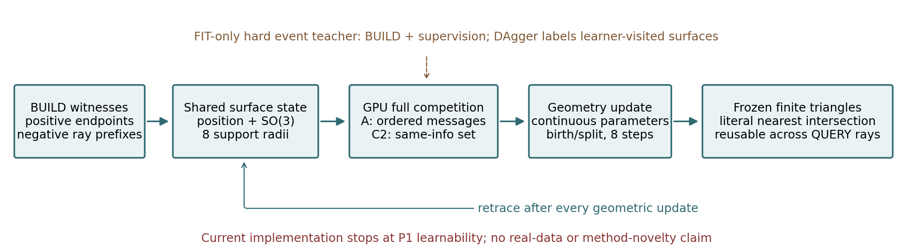
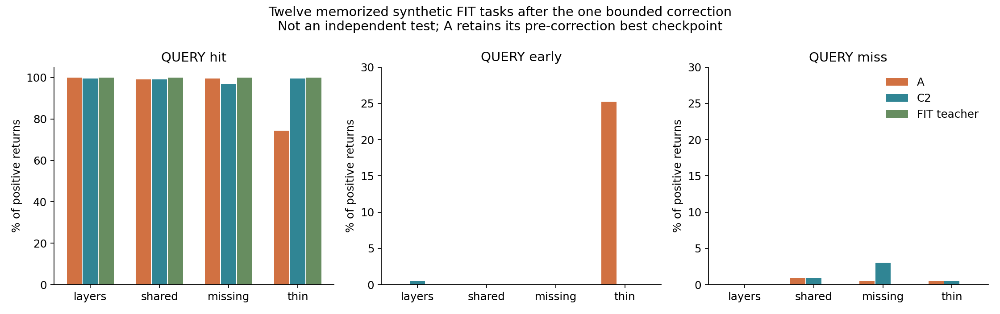
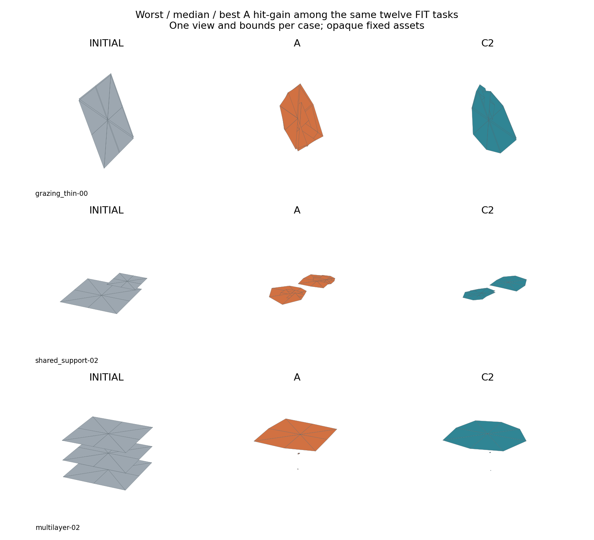

# V74-H2 计划1.1：GPU P1执行报告

2026-09-12。**当前状态：STOP_IMPLEMENTATION_OPTIMIZATION。** 当前A实现没有通过最小闭环学习能力，按计划6.4/16在一次明确优化修正后停止；不是资源不足，不是对witness-native科学假设或新颖性的终局裁决。P2与真实DEV/FINAL未进入，B/C未启用。

## 实际落地

按用户修订，把positive support与negative prefix按局部扇区送入共享表面的存在、支撑域和位置更新；全交点/支撑平面信息进入A有序链或C2同信息集合网络。输出全部活动片的连续位移、SO(3)旋转、八半径及同一簇授权出生/分裂事件；所有步都重算真实共享几何，没有独立ownership头、透明度或查询时重建。

GPU以float64批量判断实际八三角扇，网络float32。P1每例初始最多3片、每步最多新增1片，16个padding槽足够承载8步，物理预算仍为512片/4096面；未触及容量，不能宣称验证容量管理。后续若换真实对象，需按活动片扩槽/分块，不能直接把P1的16当真实数据上限。

训练先在教师几何轨迹上做八步共享权重/循环状态BPTT。教师硬代价使用合成FIT A+B，特征、共同出生簇和候选生成只读A；推理选事件并输出连续几何，B从不进入模型输入。连续监督是坐标更新回归，事件监督是硬候选代价排序；这不是处处可微的首面渲染器。完整几何导出与CPU三角查询用于记录真实质量。

普通C1有同八半径自由度、成对/块坐标缩放、位移、旋转、局部半径、细分及共同出生簇，不使用witness-domain投影。C3得到A同事件池，在每步64次硬代价总预算内作宽度4束搜索。另保留共同池贪心；早期文件中的C1_GPU标签指此额外参照，不能与C1_ORDINARY混淆。C3不是连续全局最优，也不保证优于使用不同普通候选的C1。

## 已完成实验与强控制

- 保留原CPU E0、80机制构型、几何/数据预处理和全部失败资产。
- 新合成80 FIT、20 FIT_VAL，各8步×64硬事件候选；FIT174211、FIT_VAL174311、原机制7411，角色区间在训练前分开。F06说明原seed+编号的重合风险。
- 80例普通C1、80例同池C3及80例共同池贪心，均在GPU执行，所有候选硬代价、束状态/路径与最终表面保存。
- A/C2各80任务第一轮训练，固定种子7411；宽度32，参数分别24271/24239。FIT验证最佳均在50epoch，200epoch时已进入验证平台/退化，保留早期/中间/末期权重。
- A/C2各12任务专门过拟合600epoch；再执行一次固定2轮、每轮200epoch的DAgger式优化修正。没有改网络、事件池、主物理指标、seed或loss系数网格。

以下是80例已曝光机制集的普通控制，**不是A/C2完整必要性主表**：

| 构型 | C1普通块搜索 hit / early / miss | C3共同池束搜索 hit / early / miss |
|---|---|---|
| multilayer | 99.05% / 0.72% / 0.22% | 93.44% / 6.12% / 0.44% |
| shared_support | 98.78% / 0.42% / 0.79% | 99.79% / 0.21% / 0.00% |
| missing_support | 98.23% / 0.00% / 1.77% | 98.52% / 0.00% / 1.48% |
| grazing_thin | 99.85% / 0.00% / 0.07% | 99.85% / 0.00% / 0.15% |

普通成对块更新已经把多层提前率压到约0.72%；这说明旧CPU弱局部搜索的残余不能作为A的创新证据。C3与共同池仍有残差，只界定本次有限候选/预算能力，不说明所有成熟优化已失败。

## 最小学习能力没有完成

12个固定合成FIT任务上，教师辅助可达到近乎完整正确；单步可拟合和教师轨迹上的参数误差下降，没有自动变成稳定的自身几何闭环。

| 构型 | A修正后所选资产 hit / early / miss | C2修正后所选资产 hit / early / miss |
|---|---|---|
| multilayer | 100.00% / 0.00% / 0.00% | 99.51% / 0.49% / 0.00% |
| shared_support | 99.06% / 0.00% / 0.94% | 99.05% / 0.00% / 0.95% |
| missing_support | 99.50% / 0.00% / 0.50% | 96.98% / 0.00% / 3.02% |
| grazing_thin | 74.25% / 25.26% / 0.50% | 99.50% / 0.00% / 0.50% |

这张表只含被专门训练过的12任务，不是独立测试。A多层与补支撑可修复，但薄结构平均hit74.25%、early25.26%；召回仍100%，所以单向几何召回掩盖了真实首面退化。C2在薄结构上更稳定，也不能据此宣称其真实域泛化成功。

检查了“keep事件却仍位移”的候选解释，三个薄结构例均未选择keep，故没有加入这个没有证据的修补。主要可观测现象是教师几何状态与学习器自身状态不同；故迁移[DAgger](https://proceedings.mlr.press/v15/ross11a.html)，在学习器访问的状态上由同一硬教师重新标注。固定两轮后，A所选闭环FIT代价仍为0.111329；C2由0.153933降至0.096031。A最佳权重仍为修正前版本，不能把“修正完成”写成“修正成功”。全部修正后权重与访问状态也保留。

这是对当前宽度32、连续坐标回归＋事件排序实现的优化限制。没有验证宽度64、所有等价几何监督方式或其他更强网络，也未证明网络数学上不能表示解。按当前计划停止规则，不继续新增第二轮修正、扩网络/换监督搜索或直接进入真实大训练。witness-native假设仍开放，但本实现不能为它提供方法证据。

图按12任务中A相对起点的hit改善取最差/中位/最好，同例同视角/坐标范围，表面不透明。所有初始、0–8步表面、实际后继链、事件分数、共同候选代价、首次退化位置均可回查。失败前后不是只剩一张截图。

## 资源、数值与保存位置

RTX3090 24GiB，14核/90GiB。GPU承担候选硬求交、代价教师、A/C2训练和闭环构建。主要完整任务墙钟：80+20教师约7.3s；80任务A/C2训练116.6s；12任务过拟合67.4s；固定修正73.5s。不同阶段含CPU资产保存，不等同纯GPU kernel耗时。

观测到训练PyTorch峰值分配约0.49GiB，采样GPU利用率约21%；小机制任务的网络和矩阵规模很小，资源不是当前阻碍。未把高GPU利用率当科学目标，未扩无效实验量填卡。未发生OOM、资源不足或需要加卡的情况。

初始几何GPU/CPU参考比较无漏交分歧，最大有限差约3.6e-15m；不外推为所有擦边/共面情况的全面证明，数值边界继承F03。F07的argsort接口错误与出生候选描述修正均在新训练前处理，旧日志与未完成尝试保留。

完整大资产：`/root/autodl-tmp/runs/worldsim_v74_h2/WS-V74-H2-GPU-P1-01/`（约562MiB）。轻量[run目录](autoresearch/worldsim_v74_h2/gpu_p1/run_registry.json)、[机器判定](autoresearch/worldsim_v74_h2/gpu_p1/decision.json)、[失败入口](RESEARCH_FAILURES.md)。Git保存代码、轻量结果与图；大资产仍在AutoDL数据盘，不把Git push当作大资产异地备份。

## 停止边界与这轮新知识

完整A/C2的80例必要性比较、C4/C5、真实nuScenes/AV2训练、独立日志和场景应用均未执行；原因是前置最小学习能力未满足，不能填成失败或已通过。没有形成FAIL_SCIENCE、FAIL_NOVELTY或H2全方法族NO_SURVIVOR结论。H1已冻结的NO_SURVIVOR是另一轮结果。

**本轮新知识：完整硬事件教师和较低的连续参数误差，仍不足以保证共享表面在自身八步轨迹上的首次回波稳定；当前序列实现的学习能力必须先于方法必要性裁决。** 普通成对块搜索已经消除许多旧局部更新的残差，后续不得再用弱局部搜索为新机制立论。

论文准备度维持约3/6，人工verdict=null。研究方案与卡点重规划继续遵循 [scaling law](../auto-research_scaling_law.md)；没有将更改叙事或更换方法名称作为继续训练的理由。

资源收口：[实际进程记录](autoresearch/worldsim_v74_h2/gpu_p1/resource_closeout.json)。无研究worker，未配置自动恢复；服务器仍为有卡开机，未发出shutdown。数据盘剩余约183.75GiB。

后续电源安排：用户已明确授权V74收口后关闭AutoDL。最新无任务检查完成，当前文档推送后执行shutdown；上文“仍开机”是执行该授权前的快照。见[关机前记录](autoresearch/worldsim_v74_h2/gpu_p1/shutdown_preparation.json)。
