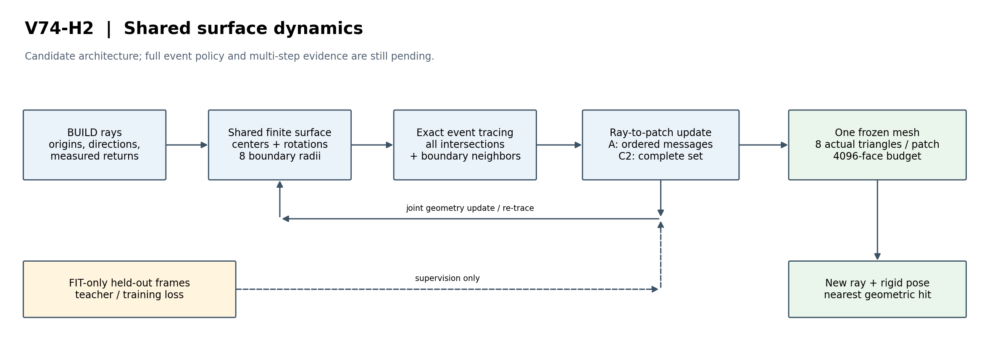

# GPU P1执行补充：计划1.1 / 2026-09-12

当前计算对象是witness-conditioned共享表面的局部支撑/位置与持续状态。正支撑和negative prefix按片内扇区聚合，完整平面/后继特征经A链或C2集合网络进入共享片节点，输出所有活动片的连续位移/旋转/八半径及公共出生/分裂事件。归属由硬几何查询产生，没有独立ownership头。

训练是固定教师几何轨迹上的八步循环状态BPTT，随后自身几何闭环。事件教师只读合成FIT A+B，前向与候选生成只读A。非处处可微，不把监督分类/连续回归称为精确几何梯度。原80任务第一轮暴露闭环偏移，按F08做一次DAgger式修正；不是主贡献。

C1_ORDINARY使用普通成对/块坐标位置、半径、旋转、细分和相同正见证簇出生，没有witness-domain投影。C3_BEAM和额外共同池贪心参照均获得A的完整事件池，排除只是候选设计/弱贪心的解释；C3总计每步64硬代价，宽度4，候选子集轮换，非连续全局最优。原controls-r1中的C1_GPU标签在当前解释为“共同池贪心”，不与C1_ORDINARY混淆。

GPU float64进行批量实际八三角扇判定，网络float32。P1最多初始3片+8新增，16个padding槽足够，不是把512片物理预算偷偷改为16。真实训练前须按实际活动片分块/扩槽。主比较仍用真实三角查询、0.2m指标；教师支撑的平面/径向距离只作为共同训练proxy。

当前不满足P2进入条件。以下2026-09-11合同与架构保留为CPU阶段基础。

# V74-H2：方法差异、任务合同与必要控制

状态：P0/CPU参照已实现；A 的完整学习式演化与方法级增量待P1。遵循 [主计划](WorldSim_V74_Second_Half_Generative_Surface_Plan.md) 与 [scaling law](../auto-research_scaling_law.md)。

唯一命题：相同信息/表示/容量下，竞争感知的共享位置与非均匀边界演化是否优于普通自适应优化和同信息集合更新，同时保住首交点命中与支撑。当前没有正面裁决。

| 最近前序 | 已有机制，不再主张原创 | 本轮待检验的差异 | 否定该差异的必要控制 |
|---|---|---|---|
| [2DGS](https://surfsplatting.github.io/) | 定向二维基元、透视射线求交 | 实际不透明八三角扇随共享竞争改变 | 同表示 C1/C2 已解释改善 |
| [LiDAR-RT](https://github.com/zju3dv/LiDAR-RT) | LiDAR 光追与累计响应 | 冻结表面的字面最近几何交点，不用累计读出 | 原生读出与物理资产诊断分别报告 |
| [DSS](https://arxiv.org/abs/1906.04173) | 表面位置/法向和可见性梯度 | 位置/非均匀边界结合实际多层后继 | 成熟边界优化与C1同样有效 |
| [Minimal Neural Atlas](https://arxiv.org/abs/2207.14782) | 可学习参数域 | 多条射线共同支撑需求进入持续演化 | 学习域或普通联合优化即可解释 |
| [SolidGS](https://arxiv.org/abs/2412.15400) | 更凝实核与几何一致性 | 固定不透明资产的联合留出指标 | 硬化本身已足够 |
| [SurfFill](https://linus-franke.com/surffill/) | LiDAR模糊区域的光度优化/增密 | 超过局部残差补全，保住其他视角的自由段 | 同出生候选的普通增密解释全部 |
| [3DSS](https://arxiv.org/abs/2605.05876) | 分层覆盖合成、可见性梯度与密度细化 | 不依赖透明层合成的真实首事件演化 | 同表示/信息的普通更新已有增量 |
| [TopoSurfel](https://arxiv.org/abs/2608.20687) | 网格引导 surfel 演化与密度控制 | 竞争关系是否提供额外必要信息 | 普通几何先验与优化解释全部 |
| [Point2Mesh](https://arxiv.org/abs/2005.11084) | 共享网络驱动整张几何变形 | 特定竞争更新机制的任务增量 | 共享网络自先验足够 |

以上是基于一手摘要/作者页面和内部实现的定位，非穷尽查重；2026新工作不自行推断接收状态。八半径、排序、重算、多步搜索和GRU单独均非创新。

内部最接近的DCS已具有八边形、学习生片和整数选择；WEX已涉及共享域与有限移动；RIF已使用构建约束。H2代码复用数据/查询语义，新的 `Surface` 的中心、SO(3)、八半径跨步骤持续改变，不能退化成只提议并挑片。

| 组件 | 当前实现及边界 |
|---|---|
| 表面 | 每片9顶点/8三角形；正半径星形域，实际三角形直接导出；主4096面/512片；16384只作共同容量诊断 |
| 查询 | PBRT式双面边函数，最近t>0；闭边，共面无孤立事件；只归并同片共享扇边，不合并不同几何片 |
| 竞争信息 | CSR保存全交点链；所有支撑平面邻域保存进入信息，无固定K截断；域外候选不充当真实命中 |
| A/C2 连续网络 | A沿深度后向GRU传递；C2获得同样完整集合和深度，可推断顺序；都聚合到同片后输出3位移/3旋转/8 log半径 |
| CPU C1/C3 | C1普通有限边界模式搜索；C3同硬目标有限束搜索。均有位移/旋转/独立半径/统一尺度/出生/分裂能力，每轮最多64候选，8步。它们不是连续全局最优 |
| 训练 | FIT帧块A为前向，B仅教师/损失。当前只做12个新合成FIT任务的单步已知连续目标拟合；完整事件策略、8步展开、C4/C5和真实训练尚未成立 |
| 推理 | 只读取固定表面、查询射线、已知刚体变换；不读测量深度，不按查询重建 |

正式必要控制为C1、C2，C3排除弱贪心解释；C4位置/边界分阶段，C5仅赢家是较弱机制消融，C6极小片是退化负控制。当前CPU C1/C3结果仅供选择充分强的后续比较，不拿它们的残余失败替A立论。

B保留条件备用：需先定位有限片/事件算子表示限制，并提出区别于[DVR](https://arxiv.org/abs/1912.07372)、[IDR](https://arxiv.org/abs/2003.09852)、[SDFDiff](https://arxiv.org/abs/1912.07109)、[可见性重参数化](https://rgl.epfl.ch/publications/Vicini2022SDF)的具体机制；简单根的隐式微分不是新颖性。当前E0已达必要构型，不触发B。C基础先验路线暂缓，不下载大基座。

成功目标沿用下半场计划：early至少−3pp，hit/miss非劣0.5pp，recall/any-correct非劣1pp，free降低max(0.01m,10%)；低风险控制按计划非劣线；nuScenes5DEV方向4/5，AV2逐日志列出。0.2m主评价固定。DEV未执行，不改阈值救结果。

GPU开机后首先补全完整P1的事件/8步学习与同信息控制，再决定是否进入P2，不能从CPU能力结果直接晋级真实训练。一次有证据的工程/优化修正可做，主科学/新颖性失败则关闭；B条件不成立时不启动B，更不启动C。

数值实现修订（V74-H2-F05）：完整平面深度用于排序，asinh只用于共同网络特征缩放，禁止以截断值代替真实事件顺序。单步学习证据采用continuous12-r2；完整事件/多步能力仍待P1。
