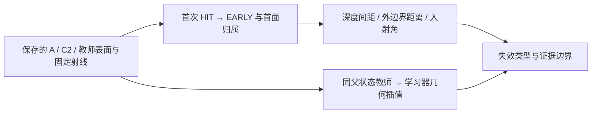

# V74-H2 P1.5：Switching-margin 失败审计定义

日期 2026-09-13；task `WS-V74-H2-P15-01`，run `switching-margin-r1`。这是分析前固定的描述性诊断，不是新方法立项、超参数搜索或独立测试。

输入：GPU P1 `20260912__A-dagger12-r1`、`C2-dagger12-r1` 的 step-0..8 与 query_chain；FIT 射线来自 `fit-teacher-r3/fit/*/supervision.npz`。12 任务、每类 3 个，均已参与训练；不做跨对象泛化 claim。完整事件记录保留，正文分母同时给任务数、正例射线数、转移数和首次退化的唯一射线数。

1. HIT/EARLY 沿用 epsilon=0.2m 和 positive_actor & ~ambiguous_owner；同一射线首次 HIT→EARLY 为主集，重复转移单列。HIT→HIT 为条件稳定对照，A/C2 固定相同对象/射线作配对描述。
2. m_t 为同一时刻前两个不同片的有效交点距离，只有一个交点时记录无后继，不填零。同片三角扇公共边重复交点沿用原 evaluator 合并。
3. m_Omega 为命中点到八段**外边界**的最小欧氏距离；不使用原径向残差冒充欧氏距离。同时计算入场遮挡片在前状态的平面交点到外边界距离及内外侧。
4. m_n=abs(n dot d)。记录旧首面、新首面和已有 challenger；MISS 没有 winner。
5. 明确分开：已有片 ownership flip、新生片介入、同 winner 深度越过 EARLY 阈值。不能将所有 HIT→EARLY 都解释成 ownership flip。
6. teacher→learner 首选**同一个 learner 父状态**、原 BUILD+FIT supervision、原 64 候选池的硬代价 argmin。只诊断不训练，teacher 是局部有限候选参考，不是假定全局正确真值。比较 teacher/learner 后状态都 HIT/EARLY 的条件；教师本身不正确单列。跨独立 teacher rollout 的同 slot 不自动视为同一片。
7. 连续插值只用于对应相同父片、相同拓扑/新增片来源的状态。中心线性、旋转 SO(3) 最短弧、半径 log 插值；不插值离散 active flag。拓扑不匹配记录排除原因，另做保持真实 learner 拓扑的 existing-patch 条件反事实，明确该条件参考不是完整教师解。
8. alpha 固定 0..1 的 1001 点，加 1e-4、3e-4；首个观测到的状态变化区间细分 16 次。记录第一次 winner 改变与第一次 EARLY 各自位置、中心位移 mm、边界顶点位移 mm、姿态差。有限扫描不证明不存在漏过的极窄变化区间，小 alpha 也不自动等于毫米误差。
9. 描述性尺度预先固定：深度间距 1/10/50mm，边界距离 1/5/10mm，incidence 0.01/0.05/0.1；同时给连续分布，不依据观测修改阈值。任务内多射线不当独立样本做总体显著性推断。

输出：逐射线转移、逐 alpha 查询、前后几何、教师事件/真实 learner 事件、首次变化 bracket、病例图和一张简单架构图；轻量结果进 Git，完整数组在 runs。若发现预想三种情形不覆盖观测，允许 mixed/insufficient，不强判 A/B/C 或 FAIL_NOVELTY。

科学边界：可见性边界引发几何查询不连续已有前序，不能把该现象本身当新颖性。参考 [Loubet et al., SIGGRAPH Asia 2019](https://rgl.epfl.ch/publications/Loubet2019Reparameterizing)、[Vicini et al., SIGGRAPH 2022 官方实现](https://github.com/rgl-epfl/differentiable-sdf-rendering)。迁移点仅是区分边界切换与连续深度变化，不接入渲染器或启动隐式方法。SO(3) 插值按 [SciPy rotation/Slerp](https://docs.scipy.org/doc/scipy/reference/generated/scipy.spatial.transform.Slerp.html) 的最短路径定义。

failure_ledger_refs: V74-H2-F03/F05/F08。人工复审约 3/6 Weak Reject 保持；本轮不产生正方法裁决。
