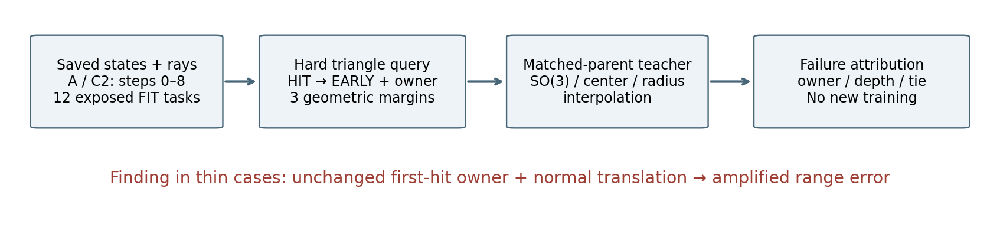
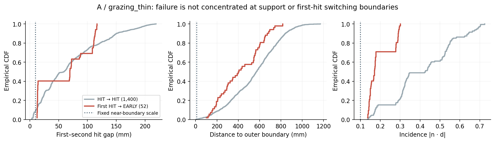
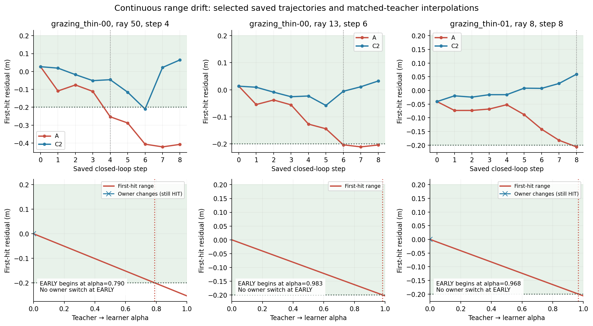
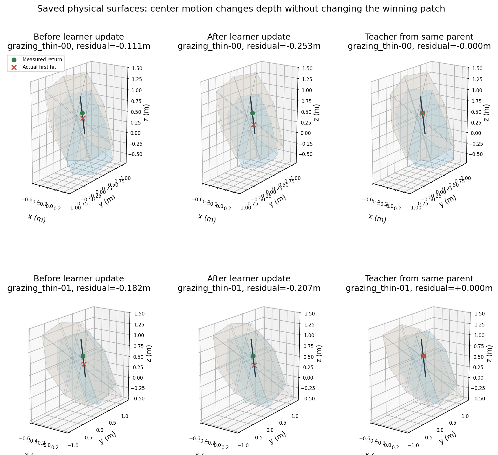

# V74-H2 P1.5：薄结构失败来自连续深度漂移

2026-09-13；`WS-V74-H2-P15-01 / 20260913__switching-margin-r1`。**P1.5 完成；当前 A ordered-chain 实现关闭，witness-native reconstruction operator 假设保持开放。论文准备度沿用用户复审：约 3/6 Weak Reject。** 本轮没有训练模型、扩大数据或立项新方法。

A 的薄结构 52 次首次 HIT→EARLY，**52 次前后首面归属均未变**。主解释是已有首面的连续法向漂移，经斜入射放大为深度误差。当前证据不支持将这轮薄结构失败归因于微小支撑边缘扰动导致的 ownership switch。



## 输入、定义与分母

分析复用 `GPU-P1-01/20260912__A-dagger12-r1`、`C2-dagger12-r1` 的全部 0–8 步资产；射线来自 `fit-teacher-r3/fit/*/supervision.npz`。**12 个训练任务、808 条正例射线，每个模型 108 状态；其中薄结构 3 任务、196 条正例射线。** 所有数据均已曝光，不能当独立测试或泛化证据。

主集为每条正例射线首次连续 HIT→EARLY，沿用 0.2m 容差与原归属掩码。也保留重复转移、全部 HIT→HIT 对照和最终状态；本次未出现重复 HIT→EARLY。不同片交点不合并，单交点没有第二交点的 margin 记缺失。片编号只在同一条 append-only 轨迹、或同父状态下对应。

| 模型 / 构型 | 首次 HIT→EARLY 射线 | 同首面连续深度变化 | 已有片换首面 | 新生片换首面 |
|---|---:|---:|---:|---:|
| A / 薄结构 | 52 | 52 | 0 | 0 |
| A / 多层 | 1 | 0 | 1 | 0 |
| C2 / 薄结构 | 12 | 12 | 0 | 0 |
| C2 / 多层 | 5 | 0 | 5 | 0 |
| A/C2 / 共享、缺失支撑 | 0 | 0 | 0 | 0 |

这张表只统计 HIT→EARLY，不把“没有该转移”解释为不存在 MISS、LATE 或其他失败。

| 薄结构任务 | 正例射线 | A 曾首次 HIT→EARLY / 最终 EARLY | C2 曾首次 HIT→EARLY / 最终 EARLY |
|---|---:|---:|---:|
| grazing_thin-00 | 65 | 36 / 33 | 12 / 0 |
| grazing_thin-01 | 64 | 16 / 16 | 0 / 0 |
| grazing_thin-02 | 67 | 0 / 0 | 0 / 0 |

A 最终薄结构 EARLY 的宏平均仍为 25.26%；计数汇总为 49/196。C2 最终 EARLY=0，但第 6 步出现 12 条短暂退化并恢复。A 的 52 次薄结构失败在相同 case/ray/step 上 C2 都是 HIT；两模型当时的父表面不同，这不是隔离架构变量的纯因果实验。

## 四项审计的实测结果

### 1–3：失败前 margin

外边界距离是到八条外围线段的**最小欧氏距离**，不是径向残差，也不把三角扇内部边当支撑边界。实际 challenger 若已存在，同时记录其前状态平面交点内外侧、边界距离与 incidence。

| 量（A 薄结构） | 首次失败：最小 / 中位 / 最大 | HIT→HIT 对照中位（1,400 转移） |
|---|---|---:|
| 首/次交点间距 m_t | 12.25 / 69.48 / 116.29 mm | 58.68 mm |
| 旧首面外边界距离 m_Omega | 100.73 / 401.54 / 816.38 mm | 571.30 mm |
| incidence abs(n dot d) | 0.1359 / 0.1702 / 0.3003 | 0.4261 |

52 条中没有 m_t≤10mm、边界距离≤10mm 或 incidence≤0.1。预先定义的 m_t≤50mm 有 21/52，稳定对照有 672/1,400，不能写成“所有固定尺度都没有命中”。斜入射相对更明显，但没有趋近零的证据。CDF 只描述这些任务内转移，不做射线级伪独立显著性推断。



### 4：同父状态教师→学习器插值

在出现首次退化的 9 个父状态，复用原 64 候选、原 BUILD+FIT supervision 硬代价选择教师后状态。所有 70 条失败射线的该参考均为 HIT，所有教师/学习器后状态拓扑相同，故不需要条件拓扑替代。**这是同状态有限候选教师，不是全局 oracle。** A 薄结构 4 个父状态上的教师代价为零；没有新网络或新优化器。

中心线性、旋转 SO(3) 最短弧、半径 log 插值。固定 1001 个均匀 alpha 点加 0.0001/0.0003，对首个观测到的变化区间细分 16 次，并用 CPU 实际三角形查询检查区间端点。保存全射线 alpha 数组和逐例 bracket；有限扫描不证明不存在遗漏的极窄短暂变化区间。

| 量 | A 薄结构 52 条 | C2 薄结构 12 条 |
|---|---:|---:|
| 首次 EARLY alpha 范围 | 0.744–0.997 | 0.898–0.987 |
| 首次 EARLY alpha 中位 | 0.947 | 0.937 |
| EARLY bracket 两端换首面 | 0 / 52 | 0 / 12 |
| EARLY 时首面中心距教师的偏移 | 33.3–71.0 mm | 45.3–49.8 mm |
| EARLY 时首面外边界顶点最大偏移 | 55.5–209.4 mm | 120.6–132.3 mm |

A 的 43 条射线在教师→学习器路径出现首面身份变化，但其教师起点具有等深首面，首次身份变化后仍为 HIT。接近 alpha=0 的 winner 标签取决于并列消解和浮点差异；**很小 alpha 的身份变化，不能自动等同于很小扰动造成 EARLY。** 这里用既有 1e-10 相对深度尺度做等深诊断，保留原始查询结果，没有改 evaluator 或成功阈值。



上排是固定射线的原始闭环轨迹，下排是对应失败父状态的教师→学习器路径；绿区为原 HIT 容差。选择覆盖首个薄结构退化、第 6 步后续退化、另一失败对象，在各组取退化后残差中位射线；完整选择规则和 ID 见 `figure_selection.json`。这些是解释图，不是独立验证。

## 为什么可以定位到连续位置漂移

A 的 52 条薄结构转移中，对应首面的旋转变化全部为零。保持同一片有效相交时，解析式为：

$$\Delta t=\frac{n^\top\Delta c}{n^\top d}.$$

实际沿法向位移幅值仅 2.18–20.48mm，但产生 7.24–150.67mm 的提前深度变化；解析式与真实三角查询的最大差为 **3.3e-15m**。这解释了方向和放大倍数，并没有声称神经网络内部错误已被完整解释。

两个不训练的几何反事实进一步区分位置与边界：

| 用学习器后状态替换哪些量，其余保持父状态 | A 薄结构重现 EARLY | C2 薄结构重现 EARLY |
|---|---:|---:|
| 仅替换中心位置 | 52 / 52 | 12 / 12 |
| 仅替换旋转与半径 | 0 / 52 | 0 / 12 |

失败前距离 EARLY 阈值还有 0.889–96.47mm 的余量；接近误差阈值时小移动也可改变 HIT/EARLY 分类，但这是连续深度越阈值，不是几何求交拓扑不连续。A 在相关同状态教师目标上的原始 14 维 delta MSE 约 0.00228–0.00662，混合了米、弧度和 log 半径，不能据此宣称几何更新已经“足够准确”。

现实现的候选打分与连续更新头分开输出；日志中的 `one_uniform_scale` 是打分选中事件名，不能据它推断实际只缩半径。当前取证根据最终真实表面和保存的 delta，不能把事件名字代替实际几何动作。



图中半透明仅为显示重叠表面与射线；所有评价均使用原始不透明三角形。绿色是观测返回，红叉为实际首交点，同一行采用相同坐标范围与视角。

## 哪些结论可以关闭，哪些不能

**更接近用户情形 B，但不是排序有害的普遍证明。** 这批薄结构失败发生在支撑域内部，连续错误更新足以解释；C2 同步位置表现较好，但也有相同类型瞬态错误。当前 ordered-chain 没有必要性证据，关闭该结构实现的继续优化路线。不能仅凭这 12 个训练任务，把责任精确归到 GRU 顺序建模、记忆还是训练分布。

**不满足情形 A 的新立项依据。** 多层确有 6 次已有片进入并换首面的反例，失败前只有一个有效交点，m_t 是缺失而非零；这些逐例资产仍保存。它们不能取代薄结构主失败的直接证据，也不足以现在立项 ownership-stable 算子或完整 B。

**尚不作情形 C 的 FAIL_NOVELTY 裁决。** C1 的 80 mechanism 任务说明普通几何自由度足以解决这些构型，已打掉“表示能力独占”的论点。但 A/C2 仅完成部分 FIT 学习诊断，没有完整配对的机制必要性/泛化证据包。当前没有正方法增量，也不能捏造一个尚未完成的充分新颖性失败判定。

下一版只保留 **witness-conditioned reconstruction operator** 这一问题和更简单的集合更新起点；不宣称新 surface representation。没有证明必要性之前，不扩大 width/epoch/DAgger、不换 Transformer、不调 loss、不上真实训练、不启动 C。下一层研究应先解释共享几何更新的量纲与闭环物理误差，而不能从这批结果直接跳到 root-switching 新方法；此处记录研究边界，**本轮不立项**。

**本轮一句新知识**：首次回波监督和下降的单步参数误差，不保证闭环 first-hit 正确；本轮薄结构失败甚至不需要 ownership switch，同一首面的连续法向漂移就能经斜入射放大而越过物理误差阈值。

## 复现、资产与资源

分析代码位于 `scripts/audit_worldsim_v74_h2_p15.py`、`scripts/analyze_p15_mechanism.py`；图形入口 `scripts/render_p15_report.py`。阶段 1 定义先于计算提交 `67105e8d`，实测结果与 F09 提交 `b636e8d1`。不重写原 GPU P1 数据、模型或历史 verdict。

```bash
python scripts/query_research_failures.py --id V74-H2-F09 --detail --limit 1
python scripts/audit_worldsim_v74_h2_p15.py \
  --source /root/autodl-tmp/runs/worldsim_v74_h2/WS-V74-H2-GPU-P1-01 \
  --output /root/autodl-tmp/runs/worldsim_v74_h2/WS-V74-H2-P15-01/replay-new-directory
python scripts/analyze_p15_mechanism.py <上述新输出目录>
python scripts/render_p15_report.py <上述新输出目录>
```

| 读取目的 | 最小入口 |
|---|---|
| 最新边界 | [F09 短卡](research_failures/entries/V74-H2-F09.md)，[状态](RESEARCH_STATUS.md) |
| 总体分母、margin、配对状态 | [summary.json](autoresearch/worldsim_v74_h2/p15/summary.json) |
| 查某条失败 | [transitions.json（已归档）](archives/worldsim_v74_closeout_20260913/README.md#asset-235) 的 model/case/step/ray |
| 连续漂移与替换反事实 | [depth_decomposition.json](autoresearch/worldsim_v74_h2/p15/depth_decomposition.json) |
| 小 alpha 是否只是等深身份变化 | [cofirst_diagnostics.json](autoresearch/worldsim_v74_h2/p15/cofirst_diagnostics.json) |
| 教师动作、打分、同状态配对 | [references.json](autoresearch/worldsim_v74_h2/p15/references.json) |
| 插值临界区间与物理误差尺度 | [interpolations.json（已归档）](archives/worldsim_v74_closeout_20260913/README.md#asset-234) |
| 完整大资产地址与输入 | [manifest.json](autoresearch/worldsim_v74_h2/p15/manifest.json) |

完整结果约 26MiB，包括父/教师/学习器表面、逐 alpha 全射线查询、HIT→HIT 对照和真实前后状态链接。逐射线 JSON 是按需资产，不继续堆入 failure 入口。输入为既有 FIT 174211 任务，本轮无新随机种子和随机搜索。

RTX3090 用于批量 float64 几何查询；主审计实测 13.26s，PyTorch 分配峰值约 0.068GiB；后续解析分解/制图另行完成，不计入该主审计时间。216 保存状态与 CPU 原链比较：MISS/归属/类别差异均为零，最大深度差 4.44e-15m。只完成任务必要的真实查询比对、诊断和图检；没有新训练或广泛回归。当前无资源不足。

本轮检索了可见性不连续的一手前序：[Loubet et al. 2019](https://rgl.epfl.ch/publications/Loubet2019Reparameterizing)、[Vicini et al. 2022 官方实现](https://github.com/rgl-epfl/differentiable-sdf-rendering)，以及 [SciPy Slerp](https://docs.scipy.org/doc/scipy/reference/generated/scipy.spatial.transform.Slerp.html)。迁移点仅为区分连续变化/可见性事件，以及保持旋转合法的插值；未接入新渲染器。这些前序不证明本项目失败原因，原因来自上述存量轨迹计算。

failure_ledger_delta：F08 增补用户人工复审；F09 新增机制边界。三本研究总账同步，论文评分不变。全部代码/文档推送并确认无活动任务后，按用户此前明确授权关闭 AutoDL；电源执行结果保存在本地交付目录与对话。
