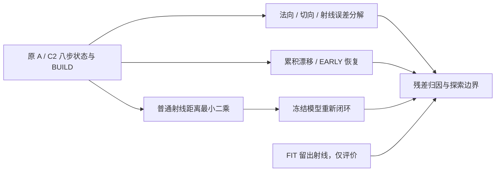

# V74-H2 P1.6：法向误差、累积漂移与普通物理度量控制

2026-09-13；`WS-V74-H2-P16-01 / 20260913__physical-metric-r1`。用户授权的病因诊断；不训练，不扩网络、数据或方法。继承 F08/F09 和 scaling law 第 7/12/13/17/27/28 条。分析前固定下述口径，不按结果调控制预算或阈值。

输入固定为 GPU-P1-01 的 A/C2-dagger12-r1、fit-teacher-r3 的前 3 个各类 FIT 任务，以及 P15 的原始失败转移/同父参考。12 已训练任务、每模型 808 正例射线、0–8 步。薄结构 3 任务/196 正例。BUILD 与 FIT supervision 分开；FIT 已曝光，不叫独立测试。

1. **Normal/tangent**：在父状态法向与同父教师后状态法向各自分解中心位移/误差，记录带符号 normal、tangent 范数、姿态与支撑变化。教师重算沿用原有限候选池和 BUILD+FIT 训练监督；不同拓扑不强行比较新片。法向与切向单独替换只作诊断，不作为方法。
2. **Ray-conditioned error**：保留 signed depth residual、`1/abs(n dot d)`、法向位移除以有符号 incidence，以及旋转对平面根的精确余项。实际硬首面关系与无限平面条件分开；同片解析解释、换面、MISS、新生片分别记分母。比较稳定 HIT→HIT 与 HIT→EARLY，报告毫米物理量，原 14 维混合单位 MSE 仅作历史参考。
3. **Cumulative drift / recovery**：每条正例射线从连续 HIT 段起点跟踪有符号步进和累计深度变化，记录首次失败是单步主导还是多步累积、法向/姿态/换面通道、EARLY 持续长度、返回 HIT 时间和最终残差。8 步结束仍未恢复记右删失，不能说永不恢复；初始 EARLY 与由 HIT 退化的 episode 分开。A/C2 同 ray 描述配对，但不同父状态不构成纯架构因果隔离。
4. **一个普通物理 metric control**：有限片保持普通表面状态，给每片一个沿当前法向的标量中心位移。最小化 BUILD 的正例首次距离平方残差均值，加全部 BUILD 射线提前侵入深度平方均值；正例 MISS 采用原成本 2m 的平方惩罚，原 epsilon=0.2m。每次根据当前真实首面算 `J=1/(n dot d)`，解对角 Gauss–Newton 正规方程；无约束方向为零，标量步长截到原连续更新 0.75m 尺度。固定 8 次迭代，每次最多 8 个二分步长，用普通 Armijo（1e-4）线搜索检查同一整体目标。没有逐射线保护门槛、不改 evaluator、不删面、不生面、不训练。
5. 控制运行两种用途：全部原始 step-1..8 的局部事后修正；从原 initial 起，由冻结原 checkpoint 在**修正后的表面**重算特征、隐藏状态和下一动作的真实八步闭环（每步用相同控制）。原始轨迹作配对参照；局部修正不能冒充闭环成功。保存每次修正前后表面、步长、目标值和全部 FIT 查询。若 BUILD 控制有残差，用同一算法读取 BUILD+FIT 运行一次明确标记的诊断参考，区分信息不足与控制容量/局部优化问题；该参考不是可部署控制。
6. 联合看 HIT/EARLY/MISS/LATE、any-correct、free-space、几何覆盖；报告每任务与宏平均，不能通过缩面、漏失或删除对象换好指标。控制额外计算明确记录，不是等预算新方法胜利。

停止与结论：若普通 BUILD 控制解释并消除当前相关退化，且闭环没有以覆盖/缺失/自由空间退化换取结果，则关闭“需要新 first-hit dynamics 机制来解释这批失败”的探索。只局部有效、换成其他失败或全监督参考才有效时，结论为部分解释/证据不足，不能把普通控制失败直接升级为新机制必要性。先定位未解释残差，再决定下一抽象；本轮不自动新立项。当前 ordered 实现停止、witness-native 总假说开放、用户 3/6 Weak Reject 保持。

前序与迁移：法向残差及 Jacobian 是 [Open3D point-to-plane ICP](https://www.open3d.org/docs/release/tutorial/pipelines/icp_registration.html#point-to-plane-icp) 等成熟几何优化的标准对象；射线距离由本项目平面求交公式直接推导。Gauss–Newton/Armijo 使用 [Ceres 官方求解文档](https://ceres-solver.readthedocs.io/latest/nnls_solving.html#line-search-methods) 的普通套路。这里只迁移残差/Jacobian/线搜索，没有接入 ICP 配准或声称新算法。

完整资产进 runs，轻量表、短 failure 卡、架构图和报告进 Git；每里程碑同步三本总账。收口 push、备份后确认无研究任务或调度器，再沿用用户 shutdown 授权。

执行补充（分析后发现的对照工程差异）：首轮r1前向batch12不同于原8+4；r2仅恢复原批次，其他定义/模型/阈值/预算不变。r1保留，r2为正式结果；不能因修正后结果有变化挑选更好run。
