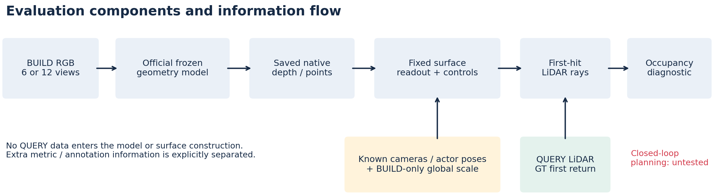

# V7.4：官方几何模型首回波主图实验

task `WS-V74-MAINFIG-01 / 20260915-first-return-r1`。用户授权单卡推理，首批 VGGT、VGGT-Ω、DVGT-1、Pi3X，不训练。36项官方VGGT/DVGT-1/Pi3X推理与同口径评价已完成；Omega按用户指定公开搬运文件改为512原版，正在下载。416 reproduction与512不是同一checkpoint，最终分开标明。

## 冻结范围

旧DEV全部6场景/5日志/75对象。52对象有自有留出首回波，23对象没有，不能当0误差。每方法同一批原始RGB：BUILD sample3六环视；sample3+4十二视图，间隔约0.5s。QUERY sample2/5，11886射线；从未送入官方模型。

四模型仅图像输入，严格加载权重、BF16、seed7403，各自官方分辨率。原生深度/点图永久保存。所有物理表面诊断使用公开标定与目标位姿；这不是各方法发布的端到端LiDAR simulator。原生点坐标和已知K重投影对照；相对VGGT基线尺度与仅BUILD背景LiDAR的单一全局尺度分别报告。后者提供额外信息。图像网格三角化固定断边规则：边长不超过max(0.15m,0.05×最小深度)，目标框外扩1m。置信保留100/90/75/50%，不可调参挑最差读出。

Early阈值0.2m，另报0.1/0.3/0.5m。Hit、Early、Late、MISS互斥完备。覆盖用预测顶点到真实点0.2m邻域统计，与首交Hit分开。BUILD支撑距离≤0.2m的参考和速度≤0.5m/s对象单列，未知速度不伪装静态。日志样本不均衡，必须展示各日志分母。

## 普通控制与工程修正

12图推理同时增加输入证据与输出面数。追加一次发现后的普通控制：固定只读共同前6图的输出，用于隔离预测更新和合并更多表面的影响；不是新的独立确认。尺度依旧按同一BUILD sample3背景规则估计。

源代码复核发现diagnostic_mask仅表示BUILD点的1/5分割，并非背景。正式评价已修正为diagnostic_mask且owner为空；之前的部分CPU评价单独保留但不用于报告。修复了旧分辨率投影到原始像素的中心偏移。所有GPU原生输出可复用，没有重跑推理。解析双平面案例已验证首交与后方正确面；正式窗口检查互斥计数和阈值嵌套。

白车旧0.323m案例属于微调VGGT DPT＋LiDAR融合适配系统，不能以官方VGGT名义发表。主图用真实RGB、真实早交三角形、同一射线的真实与预测距离，以及简单inverse sensor model展示后果。早交之后必须标UNKNOWN；false-safe与闭环事故尚未证明。

## 复现

服务器证据根：`/root/autodl-tmp/runs/worldsim_v74_h2/WS-V74-MAINFIG-01/20260915-first-return-r1`。入口在 `scripts/worldsim_v74_mainfig/`：prepare_inputs只运行一次；infer_official对每方法依次执行，完成结果跳过；evaluate_surfaces生成正式evaluation_bgscale；evaluate_common6生成输出面数控制；summarize_results汇总。

单GPU不能并行启动两个模型；CPU读出可并行。当前无shutdown或自动续跑授权。人工verdict=null。failure_ledger_refs=V73-F03/F09、V74-F06、V74-H2-F12；最终failure_ledger_delta待收口。

来源：[VGGT](https://github.com/facebookresearch/vggt)、[Omega](https://github.com/facebookresearch/vggt-omega)、[DVGT](https://github.com/wzzheng/DVGT)、[Pi3X](https://github.com/yyfz/Pi3)、[用户指定Omega镜像](https://huggingface.co/1kaiser/vggt-omega-jax/blob/main/vggt_omega_1b_512.pt)、[Open3D硬求交接口](https://www.open3d.org/docs/release/python_api/open3d.t.geometry.RaycastingScene.html)。
