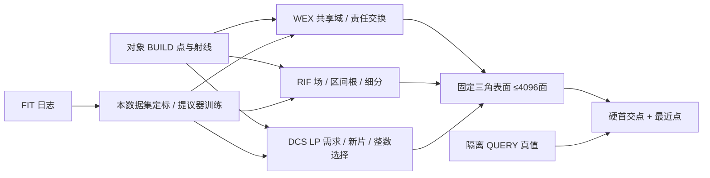

# V74 方法实现记录

当前三候选及必要控制已完成43对象真实重建/66对象合同评价，均未达共同筛选；完整几何机制及外部NKSR参考也已完成，本轮按NO_SURVIVOR冻结。配置在96cef75c实现基础上冻结，结果见RESEARCH_STATUS与autoresearch/worldsim_v74/final/REAL_RESULTS.md。三候选独立，两个数据集各自FIT定标/训练，RGB关闭。

## 实际接入与前序

[OSQP 官方](https://osqp.org/docs/solver/) 的线性约束 QP用于 WEX 子问题，显式正见证松弛只诊断冲突。近似冲突关联不称最小不可行核/精确证书。联合责任搜索与固定/逐射线控制共用子问题。
[SciPy HiGHS MILP](https://docs.scipy.org/doc/scipy/reference/generated/scipy.optimize.milp.html) 是通用混合约束控制；先最大化解释的见证数，再固定责任求同一个域 QP，MILP 线性主目标与域二次代价分开记录。
[HiGHS LP 对偶接口](https://docs.scipy.org/doc/scipy/reference/generated/scipy.optimize.linprog.html) 用于后续 DCS 定价。
[Minimal Neural Atlas](https://arxiv.org/abs/2207.14782) 已有可学习域；A0 是 PU 思想与同射线输入的任务适配软域控制，未复现其完整官方训练模型，不能标成官方 MNA。
[DMTet](https://research.nvidia.com/labs/toronto-ai/DMTet/) 的同场等值面与 [NKSR](https://github.com/nv-tlabs/NKSR) 的局部几何/稀疏重建是 B 的前序与外部控制候选；DMTet未作完整官方复现；NKSR官方原生参考已完成，信息与预算边界见最终报告。

## FIT 定标

`scripts/calibrate_worldsim_v74_fit.py` 只读 FIT BUILD，跨帧局部 PCA 平面的测距残差用于统一数值容差；两数据集独立，不打开 DEV QUERY。nuScenes 326 个≥3点对象、129812有效比较；AV2 719对象、672669比较。epsilon 为90分位并限制 .02–.20m：.174519874/.20m；评价带仍±.2m。超过容差的观测不排除评价。
半宽取 BUILD 近邻间距中位数的四倍并限制 .15–.8m，得到 .156881495/.15m；这不是验证调参。配置 `configs/worldsim_v74/tournament.json` 在 DEV 质量出现前落盘。首次实现中的实际数值/成本问题仅允许 FIT 修正后说明。

WEX 初始64片、4×4顶点；域裁剪共享边交点。空正确候选只允许已有承载片的两轮有限平移，不生成新片。输出仍可存在未解释观测，不能以求解器退出码冒称物理满足。机制首个run只测试80个解析共享域析取子问题，该首次run自身不属于三维证据；后续完整80组三维×14方法已完成。

## RIF 与 DCS 的当前具体实现

RIF 使用 BUILD PCA 定向距离几何先验而未训练编码器；是本轮几何算法原型。7³初始节点，Freudenthal一致四面体；自由段逐单元进入/离开断点完整编译。每轮最多128单元做内部重心四子单元分裂，原共享外面不变；3轮最多727节点。每条根/每个自由端点的显式二次松弛均保存，不能把近似满足当全BUILD物理保证。B0同目标用ROI内8个普通采样；B1同完整断点不细分；B2同新增节点预算按普通场/几何误差细分。边界不加负填充、不封盖、不删浮片。

DCS 初始32片，20轮各8提议，八边形用8个三角扇面精确导出。LP正见证松弛代价100，nu=0可靠自由约束，复杂度/面积成本均为BUILD几何，最终HiGHS整数选择。局部11维点tokens经64/64 PointNet后max+mean与7维全局需求摘要拼接，预测7维连续参数；FULL与NO_DEMAND分别独立同预算训练。事件保存全部影子价格、参数、真实定价、整数差距/拒绝理由与完整表面。

三维机制队列新增4类各20：多前层、共享冲突几何、离散小片缺支持、冗余/薄开口；每例96 BUILD与96不同原点QUERY，真实背景返回与对象身份独立。不是每一例都预设联合交换必需；A3参考实际判定。共同几何误差按三角面积加权采样，不能靠细分面数改变几何平均。合成机制预算/初始化单列，不与真实面成本混报。

RIF数值实现修订：上述显式松弛在保存时仍完整记录，求解时已解析消元成同一凸二次铰链目标，用SciPy L-BFGS-B优化P1系数。B0/B1/B2都用同实现；这是标准数值优化迁移，不是RIF创新。原完整辅助变量QP与新解的FIT目标/时间并列保存，不能拿未收敛的原QP作为较弱数学对照。

## 公式与实际保证的边界

A 的每个候选交点共享三角形顶点域值，m_b=beta_b^T x。自由段候选m_b≤−mu，正返回责任m_b+s_b≥mu；成组改变责任后解同一凸域问题。最终提取m≥0域边界，全部BUILD用字面三角求交复查。s或空正确候选G保留为未解释观测；与普通MILP的区别是搜索规则，不能将成熟QP/可学习域本身作为创新。

B 的P1场在一条射线穿过单个四面体的区间上是a+bt，因此两个区间端点严格为正时整段为正；共享顶点保持单元间连续。实现编译全部端点F与返回位置H。求解使用同一显式松弛目标的消元形式0.5cᵀPc−c0ᵀc+5000(||Hc||²+||max(mu−Fc,0)||²)。返回残差、切触或零集退化都不能自动当可导出交点；实际导出的同一场网格逐束报告hit/miss/early。只有残差与真实交点一致的理想条件才有局部区间性质；当前含噪对象没有普遍可行保证，未知视角更没有保证。B0/B1/B2共享同一个成熟求解器。

C 的LP影子价格用于真实有限八边形的cost−alphaᵀA+betaᵀE+8eta定价。负定价只提出候选；必须经过同一整数主问题，只有实际整数目标改善才加入库。C3去掉的是网络的局部alpha/beta与全局需求特征，保留DCS的alpha锚点排序，隔离需求特征的增量；C2使用普通未覆盖点优先顺序与同一NO_DEMAND网络，进一步去除该锚点策略。二者都不是官方完整PointTriNet；局部PointNet邻域与教师/更新预算匹配。每数据集FULL与NO_DEMAND均14087参数、200轮，nuScenes640教师例/2000更新、AV2544例/1800更新；不能把这个最小学习预算称成充分大规模训练。

扩大字典整数参考按计划仅作机制诊断：合并既有DCS/C1/C2/C3保存的提议，以及每个BUILD正点在既有[-.7,0,.7]对数尺度上的PCA片，再运行同样的HiGHS整数选择。没有新的候选方法，没有QUERY/真表面输入，没有将额外字典与时间伪装成部署预算。逐事件生片价值与首次QUERY退化取证同样属于事后解释，不回流构建器。
