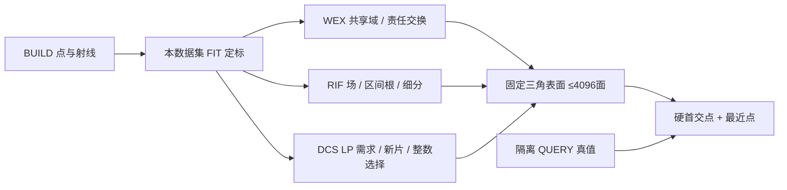

# V74 方法实现记录

当前阶段是首次实现，尚无 DEV 结果或晋级裁决。三候选独立，两个数据集各自 FIT 定标；相机关闭。

## 实际接入与前序

[OSQP 官方](https://osqp.org/docs/solver/) 的线性约束 QP用于 WEX 子问题，显式正见证松弛只诊断冲突。近似冲突关联不称最小不可行核/精确证书。联合责任搜索与固定/逐射线控制共用子问题。
[SciPy HiGHS MILP](https://docs.scipy.org/doc/scipy/reference/generated/scipy.optimize.milp.html) 是通用混合约束控制；先最大化解释的见证数，再固定责任求同一个域 QP，MILP 线性主目标与域二次代价分开记录。
[HiGHS LP 对偶接口](https://docs.scipy.org/doc/scipy/reference/generated/scipy.optimize.linprog.html) 用于后续 DCS 定价。
[Minimal Neural Atlas](https://arxiv.org/abs/2207.14782) 已有可学习域；A0 是 PU 思想与同射线输入的任务适配软域控制，未复现其完整官方训练模型，不能标成官方 MNA。
[DMTet](https://research.nvidia.com/labs/toronto-ai/DMTet/) 的同场等值面与 [NKSR](https://github.com/nv-tlabs/NKSR) 的局部几何/稀疏重建是 B 的前序与外部控制候选；当前没有声称复现。

## FIT 定标

`scripts/calibrate_worldsim_v74_fit.py` 只读 FIT BUILD，跨帧局部 PCA 平面的测距残差用于统一数值容差；两数据集独立，不打开 DEV QUERY。nuScenes 326 个≥3点对象、129812有效比较；AV2 719对象、672669比较。epsilon 为90分位并限制 .02–.20m：.174519874/.20m；评价带仍±.2m。超过容差的观测不排除评价。
半宽取 BUILD 近邻间距中位数的四倍并限制 .15–.8m，得到 .156881495/.15m；这不是验证调参。配置 `configs/worldsim_v74/tournament.json` 在 DEV 质量出现前落盘。首次实现中的实际数值/成本问题仅允许 FIT 修正后说明。

WEX 初始64片、4×4顶点；域裁剪共享边交点。空正确候选只允许已有承载片的两轮有限平移，不生成新片。输出仍可存在未解释观测，不能以求解器退出码冒称物理满足。机制首个run只测试80个解析共享域析取子问题，尚不满足计划要求的80组三维几何机制证据。

## RIF 与 DCS 的当前具体实现

RIF 使用 BUILD PCA 定向距离几何先验而未训练编码器；是本轮几何算法原型。7³初始节点，Freudenthal一致四面体；自由段逐单元进入/离开断点完整编译。每轮最多128单元做内部重心四子单元分裂，原共享外面不变；3轮最多727节点。每条根/每个自由端点的显式二次松弛均保存，不能把近似满足当全BUILD物理保证。B0同目标用ROI内8个普通采样；B1同完整断点不细分；B2同新增节点预算按普通场/几何误差细分。边界不加负填充、不封盖、不删浮片。

DCS 初始32片，20轮各8提议，八边形用8个三角扇面精确导出。LP正见证松弛代价100，nu=0可靠自由约束，复杂度/面积成本均为BUILD几何，最终HiGHS整数选择。局部11维点tokens经64/64 PointNet后max+mean与7维全局需求摘要拼接，预测7维连续参数；FULL与NO_DEMAND分别独立同预算训练。事件保存全部影子价格、参数、真实定价、整数差距/拒绝理由与完整表面。

三维机制队列新增4类各20：多前层、共享冲突几何、离散小片缺支持、冗余/薄开口；每例96 BUILD与96不同原点QUERY，真实背景返回与对象身份独立。不是每一例都预设联合交换必需；A3参考实际判定。共同几何误差按三角面积加权采样，不能靠细分面数改变几何平均。合成机制预算/初始化单列，不与真实面成本混报。
