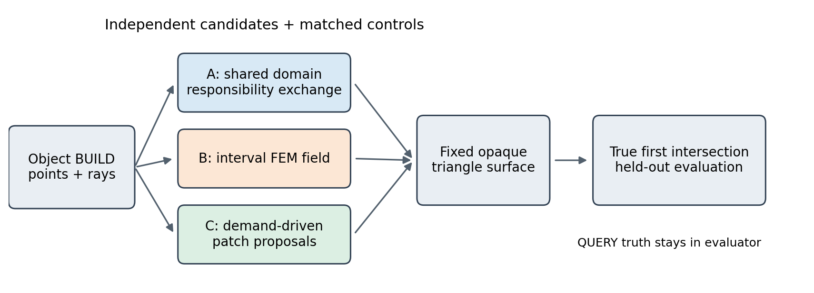
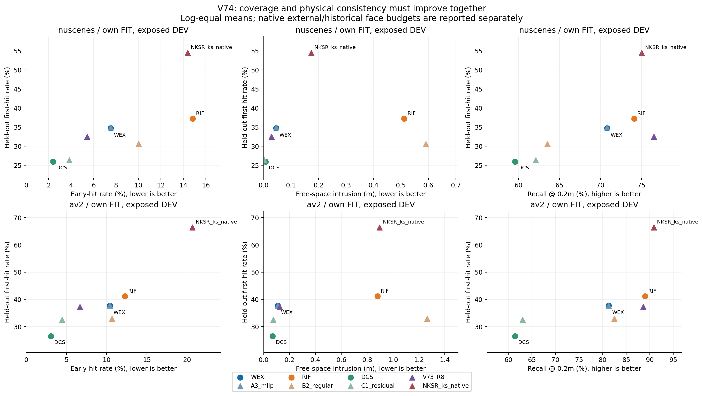
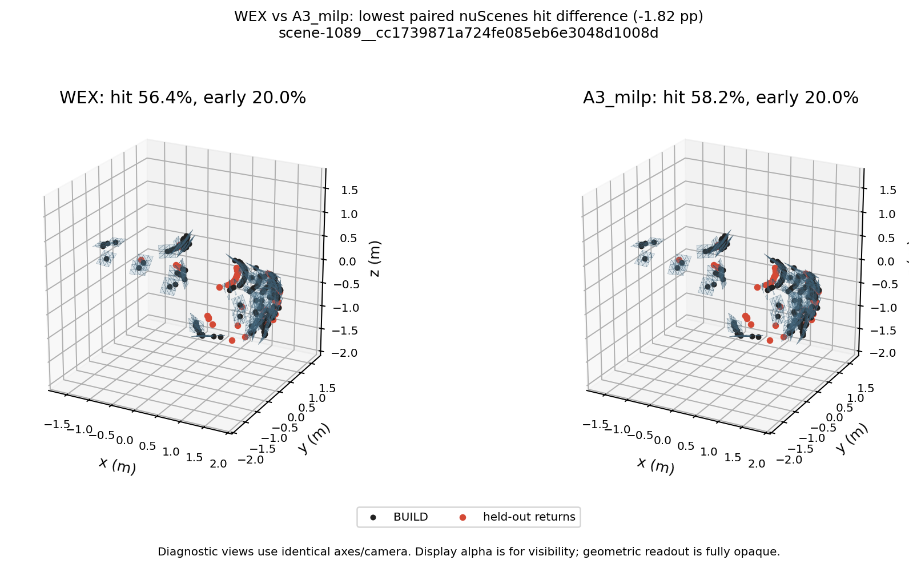
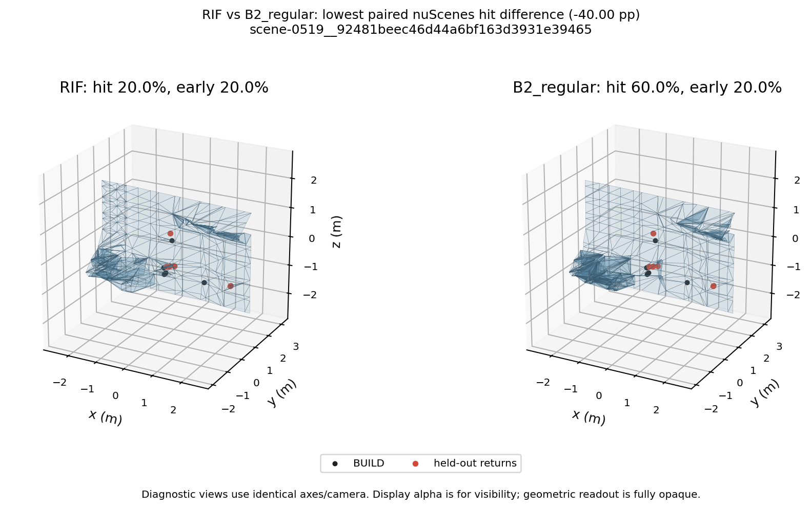
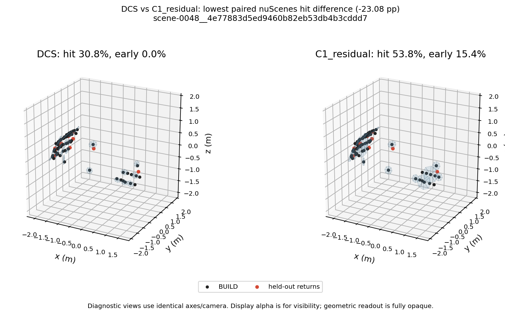

# V74 方法竞争最终报告

2026-09-11。**NO_SURVIVOR：按预定标准冻结本轮 V74。** 三个独立候选均完成最小证据包；WEX 未建立相对成熟同表示控制的必要增量，RIF 与 DCS 未达到真实留出的支撑—物理联合改善。此结论针对本轮实现、信息与预算，不是关于全部责任交换、有限元或需求生成方法的不可能性证明。人工评审 verdict 保持空值。

对象 BUILD 点与测量射线分别送入三个独立重建器，输出冻结的不透明三角表面。查询器只取真实最近三角交点，QUERY 真值仅进入评价器。另一路本数据集 FIT 日志用于定标及 C 的提议器训练，不允许 QUERY 选择表面或修改参数。方法公式、控制区别与数学边界见 [实现记录](WORLDSIM_V7_4_METHODS.md)。

## 范围与冻结合同

nuScenes 使用本数据集 20 个 FIT 日志，DEV 为 5 个已曝光日志、25 个 BUILD-ready 对象；AV2 使用本数据集 17 个 FIT 日志，DEV 为 3 个已曝光日志、18 个 ready 对象。额外 8 个 nuScenes 和 15 个 AV2 缺 BUILD 对象保留在合同队列中，总计 66 对象。ready 中 11 个没有自有 QUERY 返回；相关分母保持未定义，不能填零或视为命中。两个数据集各自训练/定标与留出，未要求跨数据集泛化。

V74 已完成数据集内 FIT/DEV 最小验证，但这些日志先前曝光，不能冒称新的独立确认 test。新 AV2 FINAL 的 10 日志原始窗口已备好，未开展最终质量评价；nuScenes 全新 FINAL 身份仍不足。无候选通过第一轮，因此不启动确认 seed 7402 或 FINAL 扩展，不把数据缺口当成本轮失败的原因。

代码执行基础 96cef75c、首次 DEV 前冻结记录 ab3ca371；主 seed 7401。共同预算 ≤4096 三角形，评价正确带 ±0.2m。FIT 残差定标 epsilon：nuScenes .174519874m、AV2 .2m；残差含曲率、轨迹和归属代理误差，不是纯传感器噪声。超过容差的观测仍参与评价。

共同主筛选要求：命中至少 +3pp 且 early 不超过 +0.5pp、free 不超过 +.005m；或 early 至少 −3pp、hit 不低于 −0.5pp，free 至少减少 max(.01m, 对照的10%)。同时约束 miss、recall、any-correct 与点到表面距离，主要方向需在 5 个 nuScenes 日志中至少 4 个成立。AV2 三日志单列，不捏造 4/3 一致性规则。结果按对象内、日志内、日志等权聚合，全部必要控制和配对日志经验 bootstrap 区间均保存。

## 真实留出结果

以下为 ready 队列日志等权均值。hit、early、miss、recall 单位 %，free 单位 m；所有控制与点到表面距离详见 [完整结果表](autoresearch/worldsim_v74/final/REAL_RESULTS.md)。

### nuscenes

| 方法 | hit↑ | early↓ | miss↓ | recall↑ | free↓ |
|---|---:|---:|---:|---:|---:|
| WEX | 34.732 | 7.522 | 53.680 | 70.826 | 0.046 |
| A3_milp | 34.914 | 7.522 | 53.680 | 70.826 | 0.046 |
| RIF | 37.208 | 14.840 | 20.379 | 74.103 | 0.512 |
| B0_sampled | 37.794 | 9.684 | 20.678 | 67.068 | 0.538 |
| B2_regular | 30.608 | 10.021 | 20.719 | 63.533 | 0.591 |
| DCS | 25.936 | 2.398 | 66.777 | 59.590 | 0.007 |
| C1_residual | 26.342 | 3.837 | 65.830 | 62.118 | 0.003 |
| C3_no_demand | 26.238 | 3.191 | 66.741 | 59.032 | 0.004 |
| surfel_pca_4096 | 39.764 | 9.334 | 47.105 | 73.385 | 0.071 |
| V73_r7 | 47.810 | 24.312 | 9.166 | 84.943 | 0.298 |
| V73_R8 | 32.518 | 5.438 | 57.430 | 76.511 | 0.029 |
| NKSR_ks_native | 54.491 | 14.381 | 26.097 | 75.040 | 0.174 |

### av2

| 方法 | hit↑ | early↓ | miss↓ | recall↑ | free↓ |
|---|---:|---:|---:|---:|---:|
| WEX | 37.752 | 10.424 | 42.892 | 81.307 | 0.109 |
| A3_milp | 37.752 | 10.424 | 42.892 | 81.307 | 0.109 |
| RIF | 41.140 | 12.288 | 15.523 | 88.995 | 0.879 |
| B0_sampled | 38.892 | 12.386 | 14.689 | 85.449 | 0.951 |
| B2_regular | 32.899 | 10.667 | 15.499 | 82.493 | 1.264 |
| DCS | 26.511 | 3.084 | 63.402 | 61.417 | 0.069 |
| C1_residual | 32.550 | 4.474 | 55.022 | 63.044 | 0.076 |
| C3_no_demand | 27.722 | 3.511 | 62.320 | 62.991 | 0.045 |
| surfel_pca_4096 | 46.527 | 15.452 | 31.558 | 86.350 | 0.317 |
| V73_r7 | 47.138 | 29.804 | 7.272 | 91.757 | 1.218 |
| V73_R8 | 37.233 | 6.667 | 44.892 | 88.624 | 0.125 |
| NKSR_ks_native | 66.425 | 20.674 | 5.010 | 90.875 | 0.896 |

图中外部 NKSR 和历史 R8 保留原生面数，仅展示质量/成本边界。图题 own FIT 指本轮候选；NKSR 使用官方预训练先验，V73 在 AV2 上也不宣称重新进行本域训练。它们不参与同表示强控制的创新判定。

## 三候选的判定与正负证据

**A / WEX：FAIL_NOVELTY。** nuScenes WEX、固定责任 A1、逐射线贪心 A2 的 hit 均为34.732%，MILP 为34.914%；AV2 四者均约37.752%。同表示成熟控制解释了真实收益。解析多前段冲突子系统中 WEX20/20、贪心13/20，但 MILP也20/20且累计 .143s 对 WEX .230s；该解析正例证明联合交换能超过特定贪心，未证明它超过成熟约束求解。完整3D机制中同样没有取得不可替代的可行性优势。密 FIT 对象上 WEX45.30/126.40s、MILP .884/2.471s，也没有达到计划允许的2倍吞吐替代路径。

**B / RIF：FAIL_SCIENCE。** 对同预算普通细分 B2，主域 hit +6.599pp、recall +10.571pp，却伴随 early +4.820pp，超过允许 +0.5pp。相对精确区间固定网格 B1，early +5.930pp、free +.125m；相对普通采样 B0，hit −.586pp、early +5.156pp。区间表示的局部数值性质成立：80个固定场算例没有假自由声明，网格/场返回根最大差4.77e−7m；但它不保证未知视角几何。主域 RIF 的100个子问题均报告收敛，末层 scaled stationarity 最大4.45e−5，16/25对象 BUILD 物理可行，故不能将主域负结果归为旧QP未收敛。AV2末层 RIF/B0/B1各1对象、B2两对象触及迭代上限，作为独立数值限制保留。

**C / DCS：FAIL_SCIENCE；新颖性证据不足。** 对主域 C1 普通残差/PCA 生片，hit −.406pp、early −1.439pp、recall −2.528pp、free +.004112m；没有达到物理修复路径，还损失支撑。AV2 对 C1 hit −6.039pp、miss +8.380pp。对同网络去需求 C3，主域 hit −.301pp，AV2 −1.211pp。C 相对不生片 C0 有收益，合成缺支撑组也有正结果，不能概括成“需求永远无用”。但正例不足以替代本轮真实质量合同或15pp有用生片增益要求。

C 的学习预算为每数据集每 FIT 日志一个固定中位对象，nuScenes640 / AV2544 教师例；FULL、NO_DEMAND 每个14087参数、200轮、2000/1800更新，教师只用本域 FIT 信息。同网络去需求 C3 仍保留 alpha 锚点排序，C2 同时改成普通残差排序，分别隔离需求特征与调度增量。C2 属 PointTriNet 思路适配，非官方完整 PointTriNet 复现；不能把此最小训练预算写成充分大规模训练。

## 完整3D机制与新片价值

80 个真实不透明三维机制场景，4类各20例，每例96 BUILD与96不同原点QUERY；14种候选/控制共1120次完成，没有工程错误。它们与解析域子系统、固定场数值实验分开报告。下表为最终 QUERY hit (%)；不能单凭此列宣称物理成立。

| 构型 | WEX | A2贪心 | A3 MILP | RIF | B0采样 | B2普通细分 | DCS | C1普通生片 | C3去需求 |
|---|---:|---:|---:|---:|---:|---:|---:|---:|---:|
| multi_front | 85.33 | 85.33 | 85.33 | 84.27 | 70.83 | 53.63 | 66.37 | 62.04 | 55.29 |
| shared_conflict | 89.18 | 89.18 | 89.18 | 85.55 | 85.99 | 63.98 | 66.40 | 59.17 | 60.96 |
| missing_support | 71.42 | 71.42 | 71.42 | 31.27 | 5.92 | 4.27 | 20.03 | 3.41 | 10.56 |
| redundant_thin | 71.02 | 71.02 | 71.02 | 61.18 | 55.02 | 28.19 | 27.16 | 33.40 | 23.62 |

四构型 WEX 的 BUILD 全物理可行数依次0/6/9/15，A2相同，MILP为1/6/10/15；RIF为1/3/0/0。场景不是人为保证联合交换必需的可行问题，MILP与扩大字典分别提供有限参考。DCS 合成机制使用冻结的 nuScenes FIT 网络，不能冒称合成域独立充分训练。

有用提议定义为修复此前 miss/late 且不增加任何已观测射线的 early；这是单提议诊断，不等于最终整数选面增益。BUILD 与 QUERY 分开统计：

| 队列 | DCS BUILD/QUERY % | C1普通生片 | C2局部网络 | C3去需求 |
|---|---:|---:|---:|---:|
| nuScenes | 13.133 / 9.367 | 17.733 / 14.567 | 12.700 / 9.667 | 12.900 / 9.467 |
| AV2 | 16.920 / 13.680 | 19.040 / 19.160 | 17.240 / 16.080 | 16.800 / 15.200 |
| 合成缺支撑20例 | 4.031 / 11.031 | .531 / 2.094 | 1.406 / 13.656 | 1.375 / 13.813 |

合成缺支撑组 DCS 的 BUILD 有用率只比最强普通控制高约2.625pp，未达15pp；QUERY有用率也未超过两个局部网络控制。全部860个真实DCS定价事件的容量对偶 eta=0：32初始+20×8提议即最多192片/1536三角，先于4096面上限耗尽提议预算。因此本轮验证了 alpha/beta 需求与网络作用，**没有检验容量压力 eta 的贡献**。

按计划补齐扩大字典整数参考：合并已保存的四生片方法候选，加上所有 BUILD 点在固定三个尺度的 PCA 片。80例均HiGHS整数最优、gap=0；库703–889片。缺支撑组仍有平均5.8束 BUILD 未解释、0/20全物理可行，QUERY hit32.523%。这是有限字典的上界参考，不是连续三维几何不可行证书，也不作为第四候选或同部署预算优胜者。

## 外部参考、成本与工程修正

官方 [NKSR](https://github.com/nv-tlabs/NKSR) 使用 ks 预训练、BUILD PCA16朝传感器法向、固定 .1m 体素、MISE1、求解2000次/1e−5；不接入额外 QUERY，不按质量裁剪面数。原生 mesh 没有全射线自由段合同，训练信息也多于本轮几何控制，不能直接宣称同预算胜出。R8 原生中位面数4392/4568，超过4096，同样单列。

NKSR 43对象原始运行有8个缺层 `_grid` 导出错误；第一次空坐标适配仍被官方底层拒绝。最终使用官方 flatten 操作删除被子格覆盖的临时单格，得到有效的零体素层，保留原层序与变换，不改变已学习场或网络。只重跑8受影响对象并复用其余35资产；8例均输出。一个原本空面的6点对象保持空面。最终66对象评价无工程缺输出，空面和缺输入仍记账；原r1/r2错误没有删除。[官方导出源码](https://github.com/nv-tlabs/NKSR/blob/public/package/nksr/fields/base_field.py) 与仓库 `third_party/patches/nksr_empty_meshing_levels.patch` 可追溯适配差异。

| 数据集/方法 | 中位构建秒 | 中位面数 | 超4096对象 | 纯首交点 μs/射线 |
|---|---:|---:|---:|---:|

| nuscenes/WEX | 0.054 | 697 | 0 | 8.18 |
| nuscenes/A3_milp | 0.052 | 697 | 0 | 2.70 |
| nuscenes/RIF | 4.599 | 1376 | 0 | 2.87 |
| nuscenes/B2_regular | 4.140 | 1984 | 0 | 4.52 |
| nuscenes/DCS | 0.397 | 160 | 0 | 2.63 |
| nuscenes/C1_residual | 0.301 | 136 | 0 | 2.62 |
| nuscenes/NKSR_ks_native | 0.172 | 2097 | 10 | 56.97 |
| av2/WEX | 0.076 | 1032 | 0 | 2.59 |
| av2/A3_milp | 0.091 | 1032 | 0 | 2.57 |
| av2/RIF | 4.680 | 1720 | 0 | 2.68 |
| av2/B2_regular | 4.401 | 2023 | 0 | 3.25 |
| av2/DCS | 0.435 | 260 | 0 | 2.55 |
| av2/C1_residual | 0.366 | 216 | 0 | 2.53 |
| av2/NKSR_ks_native | 0.201 | 5431.5 | 10 | 26.76 |

构建时间逐资产计量，不能用稀疏对象占多数的中位数掩盖密对象尾部成本；完整逐对象和总时长均保存。纯首交点计时为GPU驻留输入下固定V73双面三角求交器，256×2048分块、每资产一次；817资产原809项复用，只追加8个修复资产，不包含传输、最近点指标或真值处理，不作为稳定速度排名。它也不是硬件RT加速实现。

GPU为RTX3090 24GiB，CPU14核、cgroup内存90GiB，未发生资源不足。C教师+训练39.2s；完整B真实组墙钟1404.1s、峰值RSS.980GiB/CUDA.074GiB；80组三维组墙钟2975.2s、峰值RSS1.277GiB/CUDA.033GiB。NKSR安装/编译和权重下载成本单列于环境/原日志，不计成推理。P0已释放131.802GiB，收口数据盘约186GiB可用。最终资源回执与任务进程状态另存 `autoresearch/worldsim_v74/final/resource_closeout.json`。

## 保存、失败分类与可复查范围

工程失败 F03/F05/F07/F08/F11 的原始代码、日志、失败资产与修订保留；明确修复受影响实现后才用正式资产判科学结果。详细过程见 [V74失败记录](WORLDSIM_V7_4_FAILURES.md)，总 ID 与历史见 [统一失败账](RESEARCH_FAILURES.md)。A交换、B根/残差/细分、C全部提议和接受/拒绝原因，以及首次 QUERY 退化前后表面和射线ID均保存。事后分析不回流模型。

机器可读 [最终判定](autoresearch/worldsim_v74/final/decision.json) 包含 run 路径清单与 failure_ledger_delta；[配对日志结果](autoresearch/worldsim_v74/final/paired_log_comparisons.json)、[完整机制](autoresearch/worldsim_v74/final/mechanism_summary.json)、[事件汇总](autoresearch/worldsim_v74/final/event_summary.json) 已进入 Git。大型 NPZ、checkpoint、逐束证据驻留 `/root/autodl-tmp/runs/worldsim_v74/`，不能仅凭轻量文档声称它们已远端备份。没有增加哈希、指纹或门控检查。

下列视图固定选取主域相对必要控制 hit 差最差的对象，只作诊断，不能代表全队列平均。每对用完整网格共同边界与同一视角；B最差对象仅5束自有QUERY，解读须结合全队列。图的透明度仅为可视化，不参与读出。

本轮得到可复查的负结果和部分机制正例，尚无通过联合质量与新颖性门槛的论文主方法。依原计划停止三个候选，不自动添加第四方法、不混合失败者、不因有GPU而扩大已淘汰配置的训练。

**NO_SURVIVOR**
