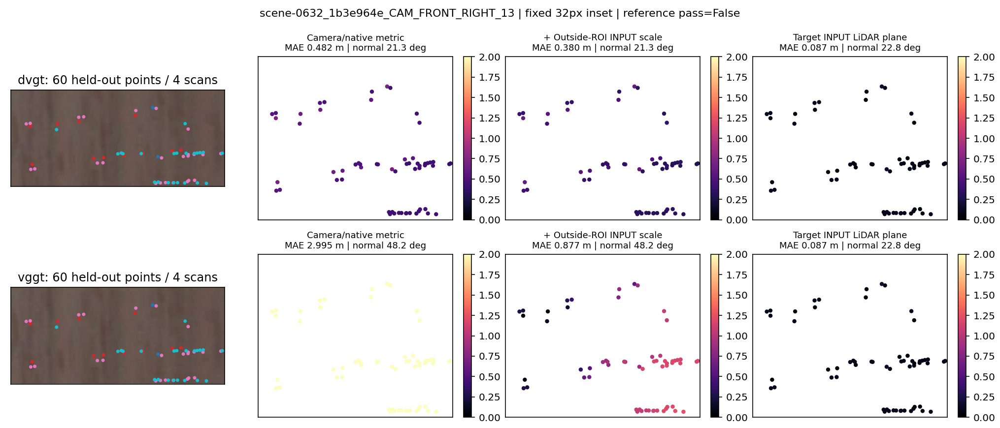
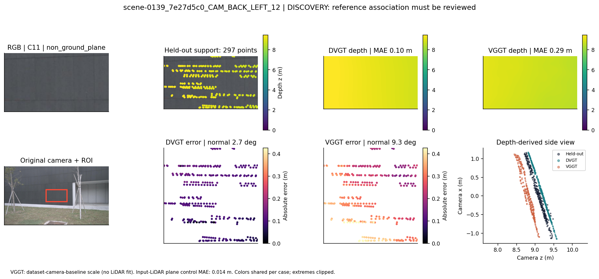
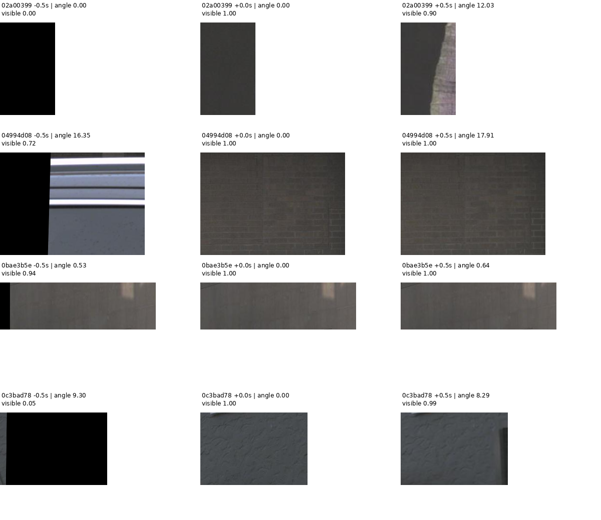
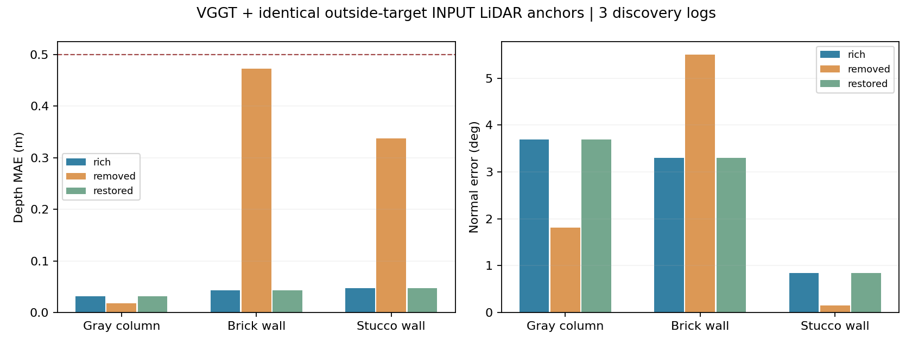
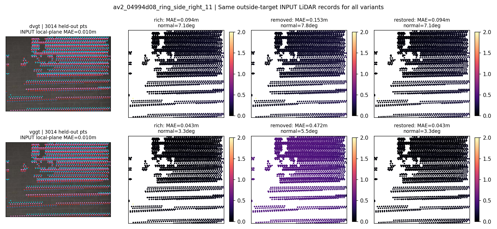

# V8.1 有限补证收口：保留改善候选，降低共同失效立论优先级

`WS-V81-CLOSE-01 / 20260913-bounded-r1`；本轮完成。**V8.2：NO_GO；当前“稀疏视角×低纹理共同失效”子命题降低优先级，停止这轮发现批次。**这不是对整个方向的否定，也不代表 V8.1 方法族实测已完成。DGGT 等直接重建方法仍有方法级证据缺口，已纳入[方法族 badcase report](WORLDSIM_V8_1_METHOD_BADCASE_REPORT.md)，不会用 raw VGGT 替代。

## 本轮增加了什么

复用旧 440 项预测，完成 10 个既有候选的固定内部复核，共 60 条模型/输入配置控制记录；其中 8 个内部参考通过数值稳定性检查，仍需结合可见表面复核。新来源严格限定 8 个 AV2 日志、840 个格子；256 个通过几何筛查，按模型前纹理排序保留 16 个视觉候选。先看 RGB/参考，限定 4 个同一可见面内部，最终 3 个具有可用后一帧的日志做真实观测干预。DVGT/GPU0 与 VGGT/GPU1各 9 项，共 18 项新推理。未训练、未重跑旧 440 项、未追加合成极端条件。

8 个日志都保留在筛查分母中，未换日志补失败；它们是 V8.1 新发现来源，但部分 metadata 曾用于旧研究，因此不是独立确认集。原 10 日志确认 reserve 未读质量、未用于本轮选择。16→4 的内部矩形只依据 RGB 可见面边界，在新模型输出前冻结；完整候选和排除原因一并保存。

## 现有残余复核

固定向内缩 32 像素，报告多扫描点数、逐次去掉一个扫描后的最大法向偏移，以及原输出→区域外 INPUT LiDAR 全局尺度后的 MAE。局部平面只用目标区域当前 INPUT LiDAR 拟合，再在 HELDOUT 上评价；它提供额外信息，不属于纯视觉同预算优势。

| ROI | 内部点数 / 去扫描法向变化 / 参考 | DVGT MAE 原→尺度控制 m | VGGT MAE 原→尺度控制 m | VGGT 控制后法向 | INPUT 局部平面 MAE m |
|---|---|---|---|---|---|
| `scene-0862_9b1a2d20_CAM_BACK_RIGHT_01` | 104 / 0.45° / 通过 | 0.079→0.126 | 9.764→1.688 | 1.7° | 0.018 |
| `scene-0450_023039d6_CAM_FRONT_RIGHT_01` | 57 / 5.51° / 未通过 | 0.495→1.086 | 4.686→6.684 | 6.4° | 0.215 |
| `scene-0139_7e27d5c0_CAM_BACK_LEFT_12` | 206 / 1.63° / 通过 | 0.108→0.057 | 0.281→0.498 | 9.4° | 0.017 |
| `scene-0919_a6711744_CAM_BACK_LEFT_12` | 56 / 1.76° / 通过 | 2.199→1.588 | 12.142→2.685 | 1.6° | 0.094 |
| `scene-0632_1b3e964e_CAM_FRONT_RIGHT_13` | 60 / 23.44° / 未通过 | 0.482→0.380 | 2.995→0.877 | 48.2° | 0.087 |
| `scene-0139_7e27d5c0_CAM_FRONT_LEFT_02` | 124 / 0.44° / 通过 | 0.290→0.110 | 0.055→0.901 | 4.5° | 0.018 |
| `scene-0632_fd5b6a5c_CAM_BACK_RIGHT_01` | 96 / 0.58° / 通过 | 0.516→0.244 | 0.166→0.077 | 2.3° | 0.011 |
| `scene-0632_fd5b6a5c_CAM_FRONT_RIGHT_02` | 178 / 0.25° / 通过 | 0.484→0.121 | 0.621→0.980 | 4.1° | 0.035 |
| `scene-0626_9a9c05fe_CAM_BACK_LEFT_13` | 314 / 2.90° / 通过 | 0.329→0.540 | 13.934→4.001 | 4.6° | 0.067 |
| `scene-0139_7e27d5c0_CAM_FRONT_LEFT_10` | 63 / 0.69° / 通过 | 0.059→0.197 | 0.063→0.955 | 11.4° | 0.007 |

**木板墙 `scene-0632_1b3e964e_CAM_FRONT_RIGHT_13` 不能升格为代表 badcase。**原 ROI 92 点；内部 60 点，去扫描后的法向偏移达 23.44°，未通过参考稳定性检查。不能把它控制后的大法向误差解释成低纹理失效。另一远处墙面也因 5.51° 的变化未过本轮 5° 筛查线。此检查只是参考稳定性，不替代 RGB 与参考同表面的核查。

**灰墙 goodcase 原样保留**：旧完整 ROI 有 297 个参考点、DVGT MAE 0.103m；本次内部子区域 206 点，原输出约 0.108m。收缩窗口不覆盖旧证据，不把 206 点写成原例点数。

控制也会新增误差。例如灰墙 `CAM_FRONT_LEFT_02` 的 VGGT 内部 MAE 约 0.055→0.901m。报告同时保留 `residual_axes` 与 `control_created_axes`，只有控制前后同一轴都超过本轮实用量级筛查线才计残余；控制创造的误差不算模型原有失败。区域外全局尺度不能解释所有局部偏差，场景 0919 的墙/门/设施边界候选仍保留可见性疑问，未宣布共同失效。

## 新日志的真实有效证据与恢复

原双侧 ±0.5s 设计在模型前检查中不成立：部分前帧出画、被车挡，另一墙面视差只有约 0.53°/0.64°。因此在所有新 forward 之前记录一次输入方案修订：保留原日志与目标，使用确实可见的 +0.5s 观测。没有依据模型误差改选帧。三个最终目标的新增视差约 12.03°、17.91°、8.29°；可见比例是稀疏遮挡检查加 RGB 平面投影复核，不能冒充稠密可见性真值。

`rich=[当前,后一帧] → removed=[当前] → restored=[当前,同一后一帧]`。所有变体使用相同当前 LiDAR、相同目标相机、相同区域外点投影集合定尺度；VGGT 的三个目标分别 8795/10155/9178 条投影记录，集合不随变体改变。不是多相机重复点数，也未用 HELDOUT 拟合。单图 raw VGGT 没有可识别米制尺度，控制前绝对 MAE 留空，只报告尺度无关形状/朝向；不能与带 LiDAR 结果混排。

| VGGT＋区域外 INPUT LiDAR | 新增视差 | HELDOUT 点数 | MAE rich / removed / restored（m） | 法向 rich / removed / restored | INPUT 局部平面 MAE（m） |
|---|---|---|---|---|---|
| Gray column / `02a00399` | 12.03° | 212 | 0.031 / 0.018 / 0.031 | 3.69 / 1.81 / 3.69 | 0.015 |
| Brick wall / `04994d08` | 17.91° | 3014 | 0.043 / 0.472 / 0.043 | 3.30 / 5.51 / 3.30 | 0.010 |
| Stucco wall / `0c3bad78` | 8.29° | 279 | 0.047 / 0.337 / 0.047 | 0.84 / 0.15 / 0.84 | 0.014 |

VGGT 在砖墙和灰泥墙上有 **0.429m、0.290m** 的可恢复深度差距；这两条正结果保留，不能写成“加真实观测完全没用”。灰色立柱没有相同退化，单图反而略好。三个单图控制后 MAE 约 0.018/0.472/0.337m，法向 1.81°/5.51°/0.15°；砖墙 AbsRel 约 5.20%，是值得保留的边界候选。恢复输出与 rich 相同，最大差 0；这是相同输入/seed 的确定性恢复，不是额外独立复现。

本轮预设深度残余线为 `max(0.5m, 5%参考深度, 3×参考平面RMS)`，法向为 `max(10°, 3×参考不稳定度)`；观测效应还需 MAE 增量 >0.25m 或法向增量 >5°。这些是有限预算发现的操作标准，**0.472m 接近阈值不等于误差没有研究价值**。当前只有 3 个发现日志，没有纹理因果对照，不能据此声称普遍无失效或稀疏×低纹理交互成立。

DVGT 只有砖墙的这套相机光轴评价合同可比较：rich/removed/restored MAE 为 0.094/0.153/0.094m，法向 7.13°/7.81°/7.13°。两个后向单相机案例在按数据集 ego 系导出时出现非正光轴深度，导致尺度拟合或 ROI 覆盖不可用。原生张量与错误/空缺分母保留，标记 `POINT_FRAME_OR_COVERAGE_CONTRACT_UNRESOLVED`；没有完成单相机点图坐标对应的专门验证，**不把这些数值当作科学 badcase，也不把两个不可评日志当作稳健负例**。完整 18 项 forward 成功不等于 18 项科学评价都成立。

## 一次推进判定

| 四环 | 证据状态 | 本次判定 |
|---|---|---|
| 可靠残余 | 木板墙最强法向候选参考不稳；VGGT 仍有局部可恢复深度候选，但新日志普通锚点后残余低于本轮预设量级线 | 部分证据；没有共同可靠代表失败 |
| 明确因素 | 三日志真实视差变化；两处 VGGT 深度改善、一处不改善；没有低/高纹理干预或匹配 | 支持局部观测改善空间；不支持共同交互归因 |
| 普通控制与恢复空间 | 同 INPUT 点集定尺度、局部 INPUT 平面与真实后一帧均已做，额外信息单列 | 已有强控制；成熟重建参照及完整下游仍缺 |
| 新日志与任务一致 | 8 日志筛查、3 日志发现干预；确认 reserve 未触碰；没有本轮 DGGT/DriveMVS/FocusGS/VGGD 方法级结果 | 未通过 |

**NO_GO / DEPRIORITIZE_CURRENT_JOINT_FAILURE_CLAIM。**停止当前有限批次，不因更极端筛选而续命；没有满足前三环的具体失败触发条件，因此本次不扩展条件下游实验、不消耗独立确认集。DGGT 是对应驾驶重建任务的优先待实测方法，但本次没有新增 core/renderer/diffusion 输出；其他方法的机制、可用性、反例定义与所需图已写入方法族报告。V8.1 的方法族实证范围仍未完成，不能宣布“2026 驾驶重建方法普遍失败”或“这些方法已通过”。

后续若继续，应以可运行直接重建方法的明确任务或新可靠失败定义重新立项，保留本轮好例、边界候选与停止决定；不自动重开当前批次。是否值得研究小于 0.5m 的残余，需要任务需求和新预注册标准，不能对本轮结果事后改线宣称已过准入。

## 执行与证据

新推理18/18结束；DVGT/VGGT峰值分别 9.60/7.00 GiB。2×3090足够；没有训练、控制器、自动恢复或新关机动作。原始输出、尺度点集合、旧/新输入协议、16个模型前视觉评审和所有图保存在 `/root/autodl-tmp/runs/worldsim_v81/WS-V81-CLOSE-01`。`residual_metrics.json`、`residual_reference.json`、`new_intervention_metrics.json`、`new_intervention_pairs.json` 是复查入口。

AV2 LiDAR 已由数据集补偿到 ego 参考时刻，本轮再用各自 LiDAR/相机 pose 转换；使用[官方数据定义](https://argoverse.github.io/user-guide/datasets/sensor.html)和本地官方 AV2 camera API 核对接口，不把 nuScenes 的扫描级补偿声明直接套用。模型沿用上一阶段官方 checkpoint、Torch2.4.1+cu121/BF16，未声称作者整套评测复现。

failure_ledger_refs=V81-F01/F02/F03/F04；failure_ledger_delta=V81-F05。人工 verdict=null。
