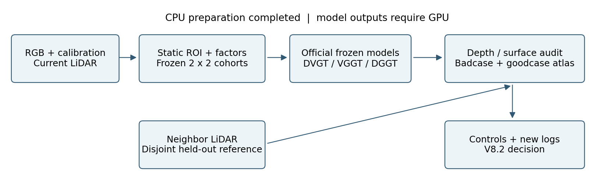
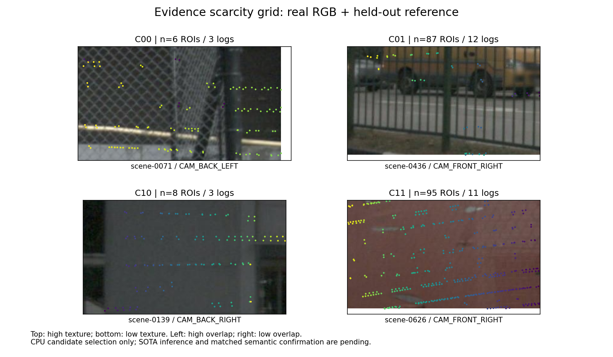

# V8.1 Failure Atlas：当前是 CPU 候选池

入口：[无卡报告](WORLDSIM_V8_1_SCIENTIFIC_REPORT.md)；完整可浏览页面位于 run 的 `index.html`。已有7张真实候选卡，内容依次为 RGB、独立 LiDAR depth、输入/留出覆盖、输入 LiDAR 平面控制误差、参考侧视图。

所有卡片按模型运行前的 cohort 内纹理中位距离选取，同日志不重复计数；保留不干净的候选并标注 confound，不用更漂亮的图偷偷替换。参考初筛后的可视检查见 `spot_checks.json`。本轮 SOTA badcase=0（尚未推理），SOTA goodcase=0（尚未推理）；这两个零都不表示模型表现好或差。

后续必须在原始卡片并排补上实际模型 depth/point/render/error，才能分配 F-TEX-PLANE / F-OVL-DRIFT 等 failure code。几何筛选拒绝项、缺失预测与 goodcase boundary 一并保留。DriveMVS/FocusGS/VGGD 不可运行时，相关方法级面板保持未检验。
