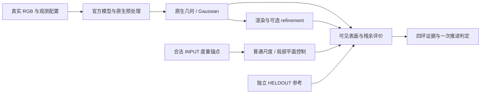

# V8.1 方法族 badcase report：实测边界与待检验机制

2026-09-13；`WS-V81-CLOSE-01`。V8.1 的对象是不同方法如何使用稀缺观测。没有运行的方法只能登记待检验机制；raw VGGT 仅作为几何 prior probe，不能代替 VGGD 或完整驾驶重建。其他方法是否失败，不是进入 V8.2 的数量门槛。

## 方法范围

| 方法 | 本轮证据状态 | 要检验的机制与反例 | 必须保存的对比 / 可证伪结果 |
|---|---|---|---|
| DVGT-1 | 既有 220 项；继续有限残余与真实观测复核 | 弱有效视差下几何是否失真 | 同一表面保留/移除真实有效观测，恢复原观测；保留没有退化和灰墙良好案例。没有一致退化时降低该子命题优先级。 |
| raw VGGT | 既有 220 项；几何 prior probe | 普通定尺度后是否仍有局部几何错误 | 原生相对输出、相机基线定尺度、区域外 INPUT LiDAR 定尺度分列；控制新增误差不能算残余。 |
| DGGT | 官方代码与 nuScenes 权重已落盘，待有限 core→Gaussian→render 接入证据 | core 错误与渲染伪影的关系；额外观测是否恢复几何 | core 深度、Gaussian 渲染深度、RGB 与 refinement 分开。RGB 改善不等于几何修复；refinement 若只改 RGB，不能据此声称修了几何。完整下游结论须实际执行对应环节。 |
| DriveMVS | 官方仓库当前只有 README；没有本轮方法输出 | 相同 LiDAR 点数，不同 ROI 空间覆盖 | inside-spread / outside-spread / dropout / random 同点数；区分点数和覆盖。已有输入控制不等于 DriveMVS 推理。 |
| FocusGS | 项目 Code 为占位链接；没有本轮方法输出 | ambiguity localization 的漏报、误报及其后续 completion | 真实几何错误图、ambiguity 图、新增 Gaussian 区域；错误未被定位与正确区被增生分开。不能从论文示意猜测真实 failure。 |
| VGGD | 已有官方仓库，但只有 README/LICENSE；没有本轮方法输出 | upstream prior 出错后是否被 decoder 纠正 | 同输入 prior 对/最终对、prior 错/最终修对、prior 错/最终同向错三类；共同误差还需排除共同输入不足，才能支持 lock-in。 |
| PointForward | 作者页仍写代码待公开；没有本轮方法输出 | world-space query 在低重叠下聚合到哪个可见表面 | query 投影、遮挡、每视图贡献与最终几何；显式处理 3D boxes 等附加输入。 |
| LGS | 尚未建立可执行官方权重与评测闭环 | 弱证据下 addition / prune 是否错误改变结构 | 输入 LiDAR、addition/prune scores、结构前后与 HELDOUT 几何；噪声/遮挡和真实缺结构分开。其论文是 LiDAR 输入路线，不能当作纯视觉同预算方法。 |
| ReconDrive | 官方仓库已有实现；权重/config/eval 闭环尚未核实 | feed-forward 4DGS 几何与 photometric fidelity 的偏离 | 在明确 failure 存活后作为辅助，逐项核实权重、域与输入合同；README TODO 不足以断言整个仓库没有代码。 |
| P2GS | 不投入主几何实验 | 曝光/HDR/跨相机亮度一致性混杂 | 留在 photometric confound 旁支；没有本轮实测 failure。 |

上表中的机制是拟检验假说，不是作者方法已经失败的结论。不会为不可运行方法自造 proxy 并归因；不会因不符合预期而删除 goodcase。

## 官方来源核查

- [DGGT 官方代码、模型与推理说明](https://github.com/xiaomi-research/dggt)、[权重库](https://huggingface.co/xiaomi-research/dggt)。本地版本 `a3276d2bbe4cbb03bcc117830b1836110a27adeb`。官方入口还需要数据预处理、mask 和扩散/跟踪路径接入；公开不等于本机完整复现。
- [DriveMVS 官方仓库](https://github.com/Akina2001/DriveMVS) 当前仅 README；[FocusGS 作者页](https://focusgs.github.io/) 的 Code 仍指向占位地址。
- [VGGD 官方仓库](https://github.com/JHLin42in/VGGD) 已存在，当前仅 README/LICENSE；[论文](https://arxiv.org/abs/2608.10682)。修正建议中“没有官方仓库”的说法。
- [PointForward 作者页](https://wm-research.github.io/PointForward/)；[LGS 一手论文](https://arxiv.org/html/2608.11077v1)明确多时刻 LiDAR 输入及结构干预。没有确认官方可运行闭环，不能据此断言全网不存在代码。
- [ReconDrive 官方仓库](https://github.com/TuojingAI/ReconDrive)：已有模型代码；当前本机 audit 仍未完成权重/config/数据闭环。

## V8.2 四环证据与有限收口

1. **残余真实**：可靠可见表面、多扫描参考稳定；普通全局尺度后仍有实际量级的深度/朝向/弯曲/跨视图错误。报告控制前后；木板墙是候选，灰墙 297 点、DVGT 约 0.10m 的旧 goodcase 原样保留。
2. **因素明确**：预先指定同一目标的真实有效观测删减与恢复；需要多日志可重复趋势，不要求每条曲线单调。相机数量不等于有效视差；只看低纹理标签不构成归因。
3. **普通控制与可恢复空间**：全局尺度是强控制，但加入 INPUT LiDAR 后属于“视觉＋度量锚点”诊断。目标 INPUT 局部平面、成熟重建或额外真实观测均须披露附加信息。既不能把全局尺度问题包装成新机制，也不能要求不可辨识输入恢复唯一真值。
4. **新日志与任务一致**：冻结失败定义后在新日志确认；若声称驾驶重建方法的缺口，至少有一个直接对应任务的可运行重建方法。无需最初四篇全部失败。仅 core depth 或 raw VGGT 不够支撑完整重建/扩散结论。

本轮仅一次有限补证：10 个既有候选统一内部复核；8 个模型前冻结的 AV2 发现日志、每日志一个中心窗口，最多两个平面内部候选；只对通过参考与可见性检查的目标做真实观测变化。8 个日志不是充分论文样本，旧 10 日志独立确认 reserve 保持封存，发现批次不能改称确认集。

不重跑 440 项旧任务，不训练，不追加极端合成筛选。若普通控制消除有意义残余，或实际有效观测删减仍没有可重复退化，降低/关闭“稀疏视角×低纹理共同失效”子命题。若资料/参考/下游合同不完整，记录缺口；不得把未检验写成通过，也不把数据缺口当作模型稳健证据。

该四环判定替代“必须先凑齐自然完整四格才能做任何推进”的实现门槛。自然四格仍是交互效应估计的一种设计；缺失它不阻止同一目标的预指定真实观测干预，也不允许在没有纹理对照时宣称纹理因果效应。
