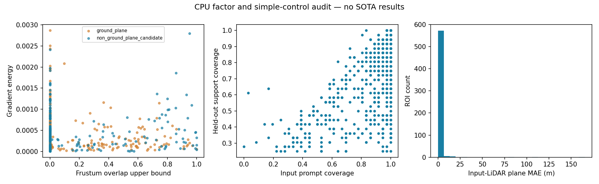
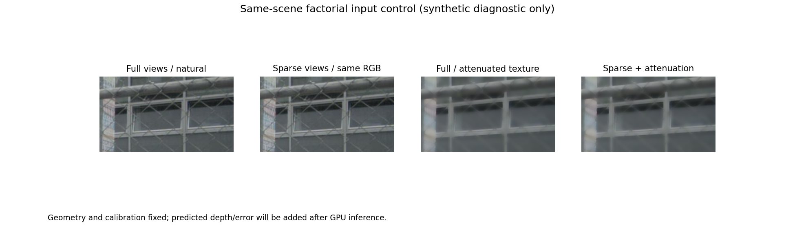
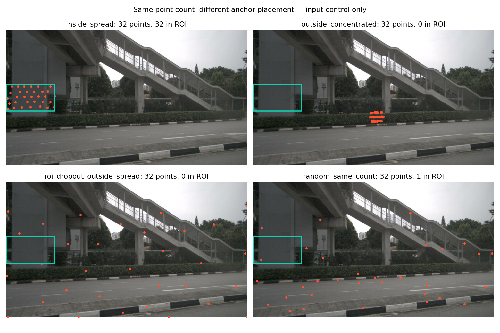

# V8.1 无卡阶段报告：证据图谱已建立，模型失效尚未检验

日期：2026-09-13。Task/run：`WS-V81-CPU-01 / 20260913-cpu-r1`；seed8101。

本阶段完成 P0 公开状态审计、P1 首批真实数据候选图谱、CPU 简单控制与 P2/P3 推理和干预准备。没有运行任何 SOTA 推理，没有发现经过验证的模型 failure，没有进入 V8.2 方法开发。论文准备度不因本报告提高；人工 verdict 为 null。

## 已获得的数据证据

现有落盘数据包含35个六相机完整场景、27个日志；按 metadata 中 log→scene 顺序选12个日志、14个场景、28个窗口，不读取模型结果。一个日志最多两个场景，一个场景两个窗口。全部标为 `DISCOVERY`；既有开发/测试曝光历史不因版本变更被洗掉。

2520个固定320×180 ROI，589个通过几何支撑初筛，564个同时通过极暗/过曝比例筛查。参考只取相邻四个 keyframe 的 LiDAR，当前帧保留为 INPUT_PROMPT；按扫描位姿变换，膨胀剔除标注物体，要求多个扫描在同像素格深度一致，拒绝深度边界和可检测的当前遮挡。没有将输入点重复当作留出 reference。

纹理由梯度能量和32-bin灰度熵的30%/70%分位联合定义；另记录特征密度、可重复匹配密度、LiDAR二维/三维分散度及深度跨度。没有观测不能写成零：raw prior、未运行模型、未定义视差保留 null。低 overlap 要求 frustum 上界≤0.1；高 overlap 要求独立参考可见支撑下界≥0.4且视差≥1°；中间区不强行分格。

| 候选格 | ROI | 日志 | 地面 / 非地面候选 |
|---|---:|---:|---:|
| C00 高纹理×高重叠 | 6 | 3 | 2 / 4 |
| C10 低纹理×高重叠 | 8 | 3 | 4 / 4 |
| C01 高纹理×低重叠 | 87 | 12 | 48 / 39 |
| C11 低纹理×低重叠 | 95 | 11 | 57 / 38 |

这些是筛查候选计数，不能当作已匹配的自然实验。高重叠尾部很小；非地面候选也不等于语义上确认的建筑平面。scene/log 是独立单位，pixel/ray 数量不能补足独立样本。

## 已经能排除的错误解释

图谱 spot-check 发现：高纹理 C00 与 C01 示例中，栅栏/网格前景和后方可见平面会共存。LiDAR 的主平面拟合通过，不代表整张 RGB patch 与这个平面一一对应。`scene-0071...CAM_BACK_LEFT_14`、`scene-0535...CAM_FRONT_RIGHT_04`、`scene-0436...CAM_FRONT_RIGHT_21` 因此前景混杂不适合作为干净平面主证据。它们保留为 reference / sampling confound 示范，不能赋予模型 failure code。

`scene-0919...CAM_BACK_04` 有墙角/深度转折，不宜把整块 patch 当单平面。`scene-0139...CAM_BACK_RIGHT_10` 的浅色墙面和 `scene-0626...CAM_BACK_LEFT_13` 的平面招牌是后续核验候选；`scene-0626...CAM_FRONT_RIGHT_11` 是低梯度砖墙候选，仍需防止纹理衰减来自模糊的混杂。具体观察写入 `spot_checks.json`，不是人工评审 verdict。

这里得到的是一个评测边界：**“held-out LiDAR 有平面”不足以证明低纹理 ROI 的视觉证据对应同一平面。** 这是数据/参考质量发现，不是某个 SOTA 已失效的新知识。

## 简单强控制与干预

589个 ROI 均尝试只用当前 INPUT_PROMPT 的 RANSAC 平面控制；584个能产生有效指标，5个缺乏有效预测。非地面候选232例的中位 depth MAE约0.151m，地面352例约0.402m。失败/无支撑的分母保留。该控制只检查局部几何锚点与 reference 的一致性；不是 DriveMVS，不是成熟多视角重建模型，也不是 novel-view rendering。

已生成7个固定规则候选卡、2组跨视角投影 mask 的局部高频衰减输入、28组同点数 prompt placement 输入。合成干预只做 diagnostic，绝不进入自然 badcase 主表。跨视角 attenuation 使用参考平面定义 mask，属于明示的诊断真值使用；其误差不能被解释为自然分布性能。带栅栏的示范不能用于 texture 因果主结论，应使用下文冻结的干净候选重新构造。

## 尚不能得出的结论

H1 非加性退化、H2 prompt hole、H3 ambiguity localization、H4 prior lock-in、H5 rendering/geometry mismatch 均 `NOT_TESTED`。没有 PSNR/SSIM/LPIPS 或 SOTA geometry 数值；图中的误差只属于 INPUT_LIDAR_RANSAC_PLANE 控制。

没有生成虚假的 geometry-vs-rendering mismatch、独立确认 badcase 或 prior recovery 图。这些图必须等待真实模型和可运行下游方法。当前的控制一致案例不是 SOTA goodcase。

下一步先用 DVGT-1 / VGGT 在相同原图上完成少量 GPU 合同核验，再推进冻结队列；P3 必须保留被评 ROI 所属相机，比较公共被预测视角，不能把删除输入相机误当模型 MISS。按地面/非地面、range、ROI大小分层，log bootstrap 仅作 discovery 关联；不足三个完整四格日志时返回样本不足，不计算虚假的显著性。

AV2 既有10个 `coordinate_ready_quality_sealed` 日志保留为独立确认候选，本轮没有读其质量或用来选模型。等 discovery pattern 明确后，先核实原始 RGB/标定合同再解封；不能用已转换的 actor/LiDAR bundle 冒充全场景相机输入。

## 证据与资源

完整资产：`/root/autodl-tmp/runs/worldsim_v81/WS-V81-CPU-01/20260913-cpu-r1/`。包括两个 registry、parquet、589份参考NPZ、输入合同、控制结果、选择规则、干预与可浏览HTML。

实测 cgroup 是0.5 CPU / 2 GiB，非宿主机标称资源。CPU主 atlas 约629s。几何关键检查5项通过；模型/渲染 kernel 尚未 GPU 验证。大依赖安装曾被 SIGKILL，cgroup 当时未记录 OOM kill，故仅记为安装中断，不确定归因。

failure_ledger_refs：V74-H2-F11/F09/F10、V74-F01；failure_ledger_delta：V81-F01（公开方法边界）、V81-F02（参考/采样混杂与小样本），不记录 SOTA scientific failure。
