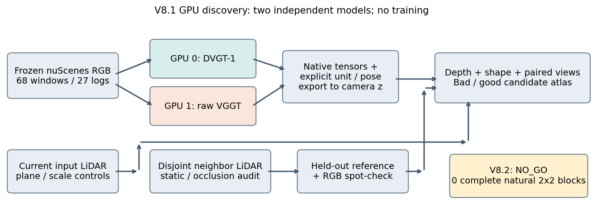
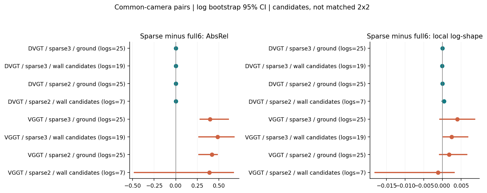
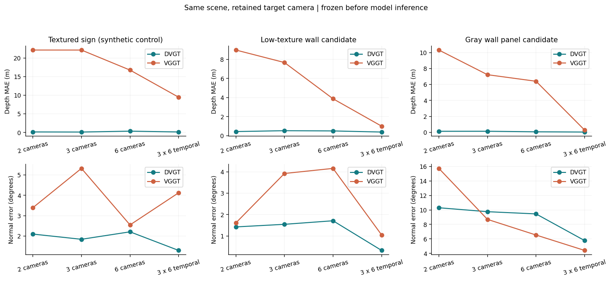
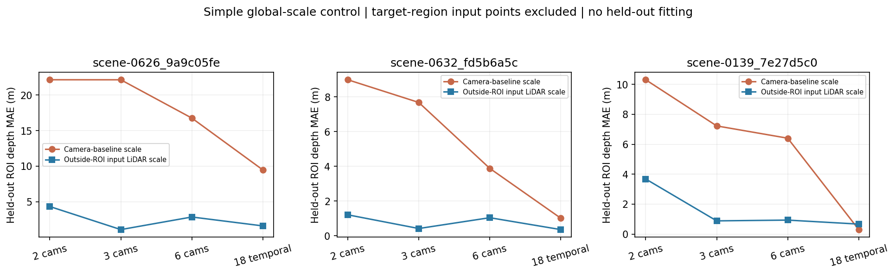
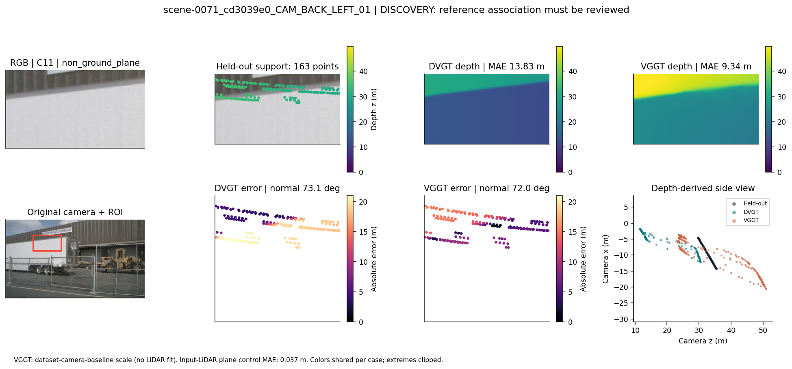
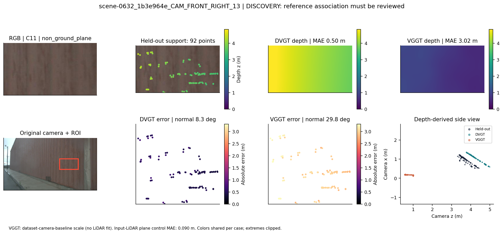
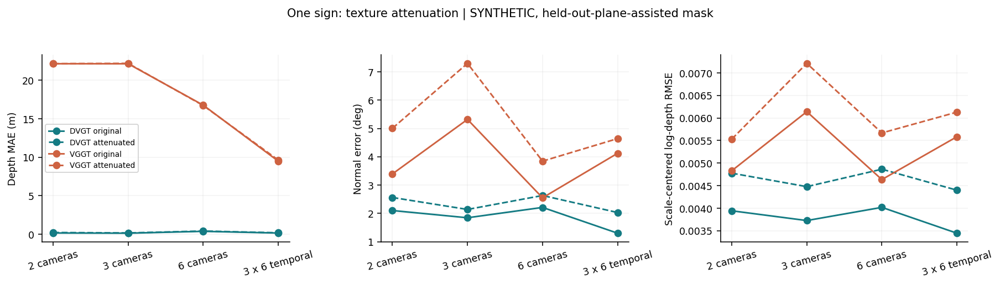

# 当前：V8.1 有限补证收口（2026-09-13）

WS-V81-CLOSE-01完成：10旧候选内部复核；8新AV2日志840格模型前筛查，3日志18项新推理。旧440项未重跑、无训练。木板墙最强法向候选参考不稳；灰墙297点/0.103m好例保留。VGGT两个新日志有0.429/0.290m可恢复差距，单图度量锚点后MAE0.018/0.472/0.337m；DVGT两个后向单相机坐标/覆盖合同未建立，不计科学failure或稳健负例。

四环证据不足，V8.2 NO_GO；当前共同失效子命题降低优先级，停止本批次。其他8方法已纳入方法族badcase report，DGGT等方法级实证仍缺，条件下游扩展未触发；不能宣称整个V8.1已测完。无自动续跑、确认reserve封存、未关机。人工verdict=null；failure_ledger_refs=V81-F01/F02/F03/F04；failure_ledger_delta=V81-F05。

[有限收口报告](WORLDSIM_V8_1_BOUNDED_CLOSEOUT_REPORT.md)；[方法族badcase report](WORLDSIM_V8_1_METHOD_BADCASE_REPORT.md)；[推进判定](WORLDSIM_V8_1_TO_V8_2_DECISION.md)。以下为历史。

# V8.1：双3090推理与失效发现报告

本轮完成 DVGT-1 与 raw VGGT 各220项独立推理，共440项；没有训练或修改模型。当前证据支持：**DVGT在本批公共相机对照中没有出现一致的稀疏化退化；raw VGGT的大深度误差包含显著的尺度不稳定，普通区域外LiDAR定尺度可以解释相当部分。尚未建立“稀疏视角×低纹理导致2026 SOTA共同失效”的结论。** V8.2保持`NO_GO_PENDING_RELIABLE_FAILURE`，方向没有被全面否定。

## 实际执行与分母

task=`WS-V81-GPU-P2-01`，run=`20260913-dual3090-r1`。CPU冻结数据为27日志、34场景、68窗口、6120 ROI，1527通过几何筛查。自然数据全部是DISCOVERY；AV2独立reserve未查看质量。

| 实验 | DVGT / GPU0 | VGGT / GPU1 | 角色 |
|---|---:|---:|---|
| 68窗口×6/3/2相机 | 204 | 204 | full6为DISCOVERY，其余为同场景诊断 |
| 3个冻结目标×6/3/2/18图 | 12 | 12 | 保留目标相机的视角诊断 |
| 1个招牌纹理衰减×4种输入 | 4 | 4 | 合成诊断，mask使用参考平面 |
| 合计 | 220 | 220 | 136自然输出、296视角诊断、8合成输出 |

实际GPU为2×RTX3090 24GB，cgroup为28核/180GiB。峰值分配显存DVGT **12.60GiB**、VGGT **8.20GiB**，18图输入也完成；无需扩容。两模型分别常驻一张卡独立消费队列，没有DDP。前向累计61.54s/63.93s；这不含初始化、文件压缩、导出和评价时间。Torch2.4.1+cu121、BF16 autocast、FP32官方权重；这是实际已跑通环境，不宣称完全复现作者Torch2.8环境及整套论文指标。

评价器输出6324条ROI×模型×输入配置记录，包含无四格标签的几何候选；不能将其当成6324个独立样本。原始缺失和coverage保留。置信区间以日志为单位，先取日志内ROI中位数，再对日志bootstrap；不把像素当独立样本。

## 发现一：稀疏化没有一致地击穿DVGT

以下仅比较两种输入都包含的相机、相同ROI；使用CPU冻结cohort和已知混杂排除，仍含未逐一复核候选。数字为稀疏输入减full6的AbsRel，负数表示改善。

| 输入 / 非地面候选 | ROI / 日志 | DVGT变化及95%日志CI | VGGT变化及95%日志CI |
|---|---|---|---|
| 3相机 | 69 / 19 | +0.00232 [-0.00229, +0.00552] | +0.4851 [+0.2700, +0.6750] |
| 2相机 | 14 / 7 | +0.000096 [-0.00350, +0.00167] | +0.3909 [-0.4769, +0.6679] |

DVGT地面候选同样没有一致退化：3相机变化+0.00155，2相机−0.000287，两者区间均跨零。这是当前样本的边界，不是“稀疏化永远无害”或严格等效性证明。2相机非地面分母较小，因为主队列只保留前/后相机；没有把缺少目标相机记成模型MISS。

冻结的低纹理墙面`scene-0632_fd5b6a5c_CAM_FRONT_RIGHT_02`中，DVGT的6/3/2/18图MAE为0.506/0.531/0.440/0.389m；法向误差1.71/1.55/1.43/0.33度。减少相机没有造成这里的局部坍塌，增加时间信息则有一定改善。

## 发现二：raw VGGT需要先排除全局尺度问题

VGGT原生输出没有本数据集的绝对尺度保证。本实验保存全部原生输出，再用公开标定相机基线做全局定尺度，未用LiDAR拟合主结果。68个full6窗口中，基线尺度比的CV中位数0.664，范围0.210–1.809，说明不同相机对不能稳定地给出相同尺度。两相机只有一个基线比，CV=0不代表可靠。

进一步添加**普通全局尺度控制**：只用当前帧INPUT LiDAR，剔除膨胀标注框，剔除所有投影落在目标ROI及16px边缘内的点，再在输入相机上按8px格取最近回波，以中位深度比例定一个正尺度。held-out邻帧点只由评价器使用。该控制不改VGGT权重，不是DriveMVS，不是同点数prompt实验；跨相机投影记录也不能称为同等数量的独立LiDAR点。

| 冻结目标 / 输入 | 原相机基线尺度MAE | 区域外INPUT LiDAR尺度MAE |
|---|---:|---:|
| 招牌 / 3相机 | 22.130m | 1.105m |
| 低纹理墙面 / 3相机 | 7.678m | 0.413m |
| 灰色墙板 / 6相机 | 6.405m | 0.932m |

这个普通控制解释了所列大误差的明显部分，但没有全部消除误差，也不是每种输入都改善：灰色墙板18图由0.298m变为0.665m。单个全局尺度不可能证明局部形状全部正确；残余还需可靠参考与多日志复核。**不能把这些结果写成VGGD的prior lock-in，尚未运行VGGD下游模型。**

## 发现三：必须把参考混杂与真实模型错误分开

按预先声明的探索规则，在C11非地面候选中分别为每个模型取误差最高/最低的4个不同日志；共16次选择、15个唯一ROI。之后才进行视觉复核，选择清单和全部候选图保留，未改CPU阈值或四格。此轮是POSTHOC DISCOVERY，不能成为独立确认。

DVGT排名最差的4个不同日志候选分别含前景卡车、铁丝网、植被、树枝遮挡。特别是下图白色区域其实是停放卡车，LiDAR参考主要落在后方建筑附近，13.83m大误差不能直接记成“低纹理墙面失败”。同样，低平均误差的网格/植被区域也不能充当科学goodcase。

**goodcase边界**：`scene-0139_7e27d5c0_CAM_BACK_LEFT_12`的灰色墙板有297个held-out支撑点，DVGT MAE0.103m、法向2.73度，VGGT MAE约0.29m。它说明自然C11中也存在几何表现良好的样本；仍属于探索日志，不是确认集。

**raw VGGT局部错误候选**：`scene-0632_1b3e964e_CAM_FRONT_RIGHT_13`为木板墙，有92个held-out支撑点；VGGT MAE约3.02m、法向29.8度，DVGT约0.50m/8.3度。与前述灰墙不同，它显示真实几何误差候选，但不能据单例推广为共同SOTA缺口，或仅归因于纹理。

## 合成纹理对照没有制造出DVGT崩溃

CPU阶段冻结的单个招牌采用参考平面辅助mask做高频衰减，保留模型、标定和视角。DVGT原始→衰减MAE：6图0.368→0.407m，3图0.126→0.160m，2图0.154→0.215m，18图0.146→0.179m。退化有限，不能把这个实验称作自然低纹理因果证明。没有追加更极端衰减来强行得到失败。

## 实现修正、科学限制与下一步

首轮DVGT导出曾遗漏官方训练尺度0.1的还原和RDF→FLU，并误用LiDAR时间戳的ego pose。已按官方代码修复，39个原生forward直接重导出，旧错误深度另存；详见[V81-F03](research_failures/entries/V81-F03.md)。7项几何检查和新增坐标/尺度/首相机时间戳检查通过。错误导出不进入当前指标或badcase清单。

**自然H1完整匹配组仍为0**，因此没有估计Texture×Overlap交互项。H2缺官方可运行DriveMVS，H3缺FocusGS，H4没有VGGD下游对照；H5没有真实渲染输出。DGGT完整4D/渲染及成熟driving reconstruction oracle本轮未进入，PSNR/SSIM/LPIPS保持未知，不能用输入图替代渲染质量。AV2独立reserve保持封存。

当前普通控制和goodcase足以阻止过早立项，但不足以关闭整个研究方向。下一阶段应先建立**与真实可见平面绑定、包含干净高重叠对照的新来源队列**，再冻结可靠残余错误的确认规则；只有出现不能被普通尺度控制解释的多日志失效，才扩展DGGT/可运行下游模型与独立数据域。不要为了完成图表数量伪造rendering或独立确认结果。

本轮GPU作业已结束，无自动恢复器，没有关机操作。人工verdict仍为null。代码、主报告、轻量统计与关键图入库；全部原生输出、每任务result、参考、控制和31张可视化保存在`/root/autodl-tmp/runs/worldsim_v81/WS-V81-GPU-P2-01/`。
