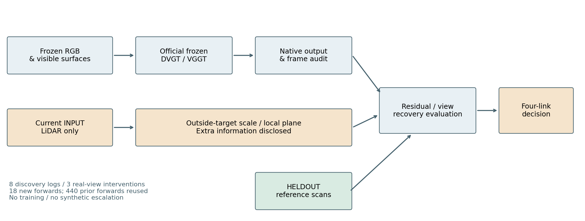

# V8.1 → V8.2：NO_GO，当前共同失效子命题降优先级

WS-V81-CLOSE-01 已完成一次有限补证；没有训练或重复旧440项。准入只保留四环：可靠残余、预指定真实证据变化与恢复、普通控制及可恢复空间、新日志确认及与任务对应的重建方法。自然完整四格不是所有推进的强制先决条件。

10个现有候选内部复核；最强木板墙法向候选参考不稳定（去扫描最大变化23.44°）。灰墙297点、DVGT0.103m的goodcase保留。8个新AV2发现日志筛查后，3日志18项真实观测干预完成；VGGT有两处可恢复深度差距0.429/0.290m，但单图加普通度量锚点后MAE为0.018/0.472/0.337m。保留0.472m、AbsRel5.20%的砖墙边界候选，不以预设0.5m筛查线否定其潜在价值。

当前不足以推进“稀疏视角×低纹理共同失效”方法开发：没有纹理因果证据；DVGT两个后向单相机案例坐标/覆盖评价合同未建立；缺直接重建方法和独立确认。没有把不可评当作稳健，也没有把raw VGGT当VGGD。

停止本批次，状态`BOUNDED_CLOSEOUT_COMPLETE / DEPRIORITIZE_CURRENT_JOINT_FAILURE_CLAIM`。不追加极端合成、不重复本批次、不启动V8.2。条件下游扩展未触发；DGGT、DriveMVS、FocusGS、VGGD等仍按方法族报告保留待实测状态。此为现有子命题收口，不是V8.1整个方法族实测完成或全方向被证伪。

[完整结果与图](WORLDSIM_V8_1_BOUNDED_CLOSEOUT_REPORT.md)；[各方法badcase定义和可执行性](WORLDSIM_V8_1_METHOD_BADCASE_REPORT.md)。确认reserve继续封存。人工verdict=null；failure_ledger_delta=V81-F05。
