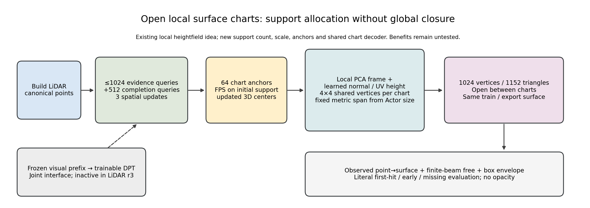
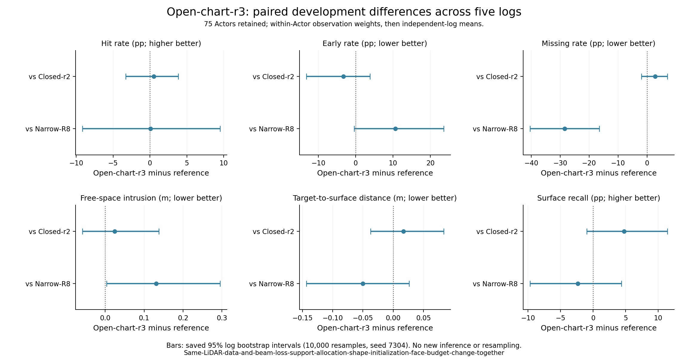
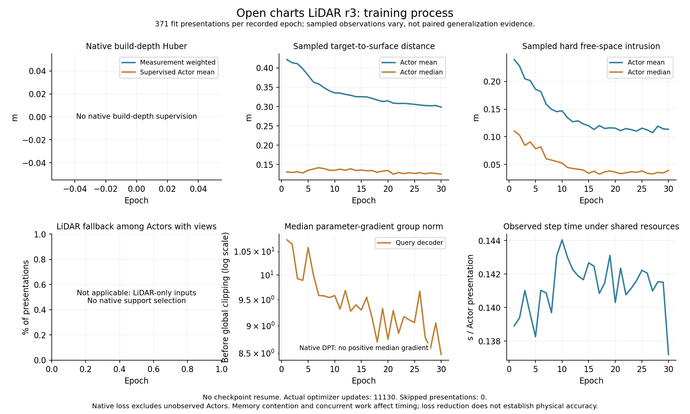

> 历史归档（2026-09-10）：以下为原版本事实与指令快照；当前执行以 docs/RESEARCH_STATUS.md 为准。

# Q-v2开放局部曲面：支持重新分配

**当前（2026-09-09 06:29 UTC）：r3 done，未建立共同物理/覆盖优势。** 相对闭合LiDAR r2，开放chart r3六项区间均跨0，没有建立优势或等效。相对旧窄片R8，miss−28.4589pp（区间[−40.4369,−16.4809]pp），free+.130846m（[+.003899,+.294775]m）；hit+.0734pp、early+10.6289pp、单向distance−.050126m、recall−2.3699pp均跨0。开放支持仍未同时改善覆盖和物理，不能将此前冲突唯一归因闭合，也不能宣称所有开放表示失败。 完整结果在文末；以下running为历史快照。

**当前（2026-09-09 05:42 UTC）：r3正式训练running。** code72607d0c/PID118560，489对象初始评价完成、第2/30轮、596真实更新/0跳步；GPU分配峰值.210188GiB，质量结果pending。文末记录实际执行，以下登记与检查按日期保留。

2026-09-09 05:40 UTC。实现与首轮登记，正式质量结果pending。任务`WS-V73-Q-V2-01`，首轮`20260909T054000Z__open-charts-lidar-full-track-beam-s7304-r3`。基于d11e6788：旧joint没有明确有效增量，固定诊断显示joint主要缺正确沿束支持、局部形变温和；LiDAR闭合网格有48/67非空对象检出非邻接自交。按用户策略二先检验表面支持，不解冻upper或更换基座。

## 实际改变

`ActorOpenChartQueryDecoder`复用原三层192维Actor空间查询及局部视觉读取，最多1024个build LiDAR与512个completion查询继续交互；旧解码器的查询更新原样提取为`encode_queries`，旧patch权重名及计算顺序不变。先在初始支持中FPS分配最多32个LiDAR锚点，其余从completion补足64个；输出中心采用这些查询的更新后位置。分配不读取heldout标签、free结果或最终预测质量。completion仍可来自原生几何、LiDAR fallback或已有可学习coarse位置，允许规范坐标更新，不限制为旧点附近的小残差。

每个chart使用固定4×4 UV网格、16共享顶点/18面；64个chart共1024顶点/1152面。片内通过共享MLP读取查询隐状态和UV，生成法向高度；片间不连接成闭合外壳。初始化局部坐标架为初始支持的16近邻PCA，特征向量只读；支持完全重合时采用径向/z轴fallback。可学习法向为`normalize(n_PCA + .5*tanh(normal_head(h)))`，每步PCA坐标架无梯度，中心、法向残差和高度具有真实梯度。

局部半宽`s=.15*(L*W*H)^(1/3)`米，仅由只读Actor尺寸确定；高度为`.5*s*tanh(height_MLP(h,uv))`，最后一层零初始化，因此初始片是平面。没有可学习radius、opacity/existence或删面后处理；原data/free/box损失与硬查询读取相同三角面。该尺度是本轮明确的参数化选择，不是传感器认证footprint或新占据标签。

固定正交切向坐标和单值高度场限制chart内部切向塌缩/折叠，但不保证多个chart间不相交、没有宽面侵入或真实表面完整。固定尺度也可能过大/过小、PCA可能对应污染，法向残差范围可能妨碍大角度修正；这些都是可失败的假设，不能以拓扑外观替代真实指标。旧3×3窄片已有局部高度图，新增量是支持数量/尺度/分配及共享chart解码，不把“高度图”或“开放patch”本身宣称创新。

## 一手依据与迁移范围

[AtlasNet，CVPR2018作者页](https://imagine.enpc.fr/~groueixt/atlasnet/)及[官方模型](https://raw.githubusercontent.com/ThibaultGROUEIX/AtlasNet/master/model/atlasnet.py)使用多个参数化模板映射成曲面并合并。这里迁移局部曲面元素和模板拓扑，保留当前观测驱动空间查询；没有安装其PyMesh、复制ShapeNet完整形状损失、改变训练/评估UV采样或宣称完整复现。

[Open3D0.19三角相交源码](https://raw.githubusercontent.com/isl-org/Open3D/v0.19.0/cpp/open3d/geometry/TriangleMesh.cpp)及已有固定诊断支持把局部形变与全局错误支持分开，不根据joint负结果盲加Laplacian/ARAP。[SoftRas，ICCV2019](https://openaccess.thecvf.com/content_ICCV_2019/html/Liu_Soft_Rasterizer_A_Differentiable_Renderer_for_Image-Based_3D_Reasoning_ICCV_2019_paper.html)的投影距离与[DRC，CVPR2017](https://shubhtuls.github.io/drc/)的射线一致性供下一项constructive监督设计参考，本轮不新增该loss，不把概率软融合当真实首返回。

## 首轮协议与解释

首轮先做LiDAR-only参数化对照：原371可用FIT/67可用DEV、完整414FIT/75DEV/51不可用对象、5 DEV日志、seed7304、30轮11130预期实际更新。输入只用build，FIT监督仍full_track；coverage、finite-beam free .5/.03m/res32、envelope.05、event0、AdamW1e-5/global clip1保持。原固定PCA基线复用，当前参数化initial和final完整重新评价；不把旧initial冒充新候选。20新日志质量未读。

对照同LiDAR闭合网格r2与旧窄片R8，按原6指标/日志配对；这是支持分配、局部形状、初始化和拓扑的组合改变，不是“只取消闭合”的纯因果消融。先确认这个开放表示本身能否恢复有效表面，再以同一表示独立加入constructive ray吸引，避免与upper/new backbone/new data一起改。当前不启动DINOv3/full FT/upper PEFT或near-boundary free。

可训练DPT和真实图像特征到chart的接口保留，固定推理通过保存config创建同一解码器；本次LiDAR作业不加载DPT或图像前缀，也不声称这一次已经训练视觉通路。未来joint需作为单独对照登记，不能把可用接口或较低LiDAR成本写成联合模型成果。

## 验证与运行入口

先一次真实FIT对象检查`scripts/check_worldsim_v73_open_charts.py`：原full_track测量采样、coverage/beam/box反传，检查normal/height/position有效梯度、一次更新的表面变化，以及固定推理factory按checkpoint恢复。结果pending；它不替代DEV效果，不验证未来视觉通路或Adam状态恢复。不重复旧smoke/回归。

正式入口`scripts/run_worldsim_v73_open_charts_lidar_r3.sh`，运行状态以RESEARCH_STATUS文首为准。训练输出config/manifest/JSONL/每轮checkpoint和完整final，保存真实wall/GPU/RSS。组件图由源码绘制，结果未产生前不预填表格。

failure_ledger_refs=[V73-F01,V73-F02,V73-F03,V73-F04,V73-F05,V73-F06,V73-F09]；failure_ledger_delta=none at registration。F02等均未解除，下一V73-F10；三本台账和计划同步，小步push，30分钟跟进ACTIVE、完成不关机。

## 真实通路检查完成（2026-09-09 05:39 UTC）

一次检查done，code019735d2；元数据首个ready FIT车辆只有3个build点，515个上下文查询、64chart/1024顶点/1152面、半宽.330649m。5个full_track测量点与194条原始束，coverage.006435m、beam.005459m；normal/height/displacement梯度范数.666979/.573098/15.371632，一次更新表面最大变化.007932m，固定推理factory恢复误差0。参数1706413（未调用的视觉模块没有梯度）、1.828437s、GPU.080078GiB、RSS1.421513GiB，保存6865698字节；不代表整个FIT/DEV收益、完整资源或Adam状态恢复。

首次直接调用未将既有runtime bin放入PATH，nvdiffrast加载时找不到Ninja，在优化前失败；核对[PyTorch2.4.1官方扩展源码](https://raw.githubusercontent.com/pytorch/pytorch/v2.4.1/torch/utils/cpp_extension.py)通过`ninja --version`判定可用后，增加与正式训练一致的shell环境入口，未新增安装。保留`autoresearch/worldsim_v73/open_charts/path_check_attempt1.txt`及`path_check_r1.json`，错误已恢复，不新增科学失败ID。正式r3从fresh初始化启动，不复用检查权重。

## r3正式执行

`WS-V73-Q-V2-01/20260909T054000Z__open-charts-lidar-full-track-beam-s7304-r3`已从72607d0c启动，PID118560。05:42:05 UTC快照：完整489对象initial评价done，进入第2/30轮，596次实际更新/596呈现，0跳步；GPU allocated峰值0.210188GiB，运行RSS约1.90GiB，盘余67GiB。状态正常，保持原配置，不把采样训练loss或初始评价当最终收益。检查脚本的一次优化不计入r3，正式作业fresh开始。

64个开放chart、1024顶点/1152面、参数1706413，原full_track/seed7304/coverage+beam.5/.03/res32/env.05、event0、无DPT/图像前缀，30轮预期11130更新。它先隔离表面支持分配；原生可训练几何/局部视觉接口保留，但本LiDAR对照没有训练视觉。20新日志质量未读，upper PEFT/DINOv3/full FT和near-boundary free未启动。

实际证据`docs/autoresearch/worldsim_v73/open_charts/lidar_r3_started{,_manifest}.json`；组件图及定义见OPEN_CHARTS报告。完整final done后仅运行一次`scripts/summarize_worldsim_v73_open_charts_r3.sh`，比较同LiDAR闭合r2与R8窄片，保留75 DEV/5日志、空预测和6项指标；该收口尚未执行。不把支持/初始化/尺度同时改变的结果只归因闭合。随后独立实现/比较constructive ray监督，不重跑已完成诊断。

failure_ledger_refs=[V73-F01,V73-F02,V73-F03,V73-F04,V73-F05,V73-F06,V73-F09]；failure_ledger_delta=none，质量pending。三本台账/计划/报告同步push，30分钟ACTIVE、完成不关机。

---

## r3完整收口（2026-09-09 06:29 UTC）

相对闭合LiDAR r2，开放chart r3六项区间均跨0，没有建立优势或等效。相对旧窄片R8，miss−28.4589pp（区间[−40.4369,−16.4809]pp），free+.130846m（[+.003899,+.294775]m）；hit+.0734pp、early+10.6289pp、单向distance−.050126m、recall−2.3699pp均跨0。开放支持仍未同时改善覆盖和物理，不能将此前冲突唯一归因闭合，也不能宣称所有开放表示失败。

| 方法 | hit | early | miss | free (m) | 单向distance (m) | recall@.2m |
|---|---:|---:|---:|---:|---:|---:|
| 开放chart r3 | 0.310762 | 0.162199 | 0.283747 | 0.165166 | 0.179427 | 0.695753 |
| 闭合LiDAR r2 | 0.305489 | 0.194901 | 0.255388 | 0.140523 | 0.162366 | 0.648249 |
| 旧窄片R8 | 0.310028 | 0.055909 | 0.568336 | 0.034320 | 0.229553 | 0.719452 |
| r3初始 | 0.242116 | 0.505234 | 0.232220 | 0.525832 | 0.185971 | 0.769629 |
| 固定PCA | 0.212448 | 0.043527 | 0.734104 | 0.017708 | 0.304790 | 0.654182 |

WS-V73-Q-V2-01/20260909T054000Z__open-charts-lidar-full-track-beam-s7304-r3，训练code72607d0c，30轮11130实际更新/0跳步/0恢复、完整489初始/最终评价done。DEV75/5日志含23无owned/8空；hit/early/miss/free/distance/recall=.310762/.162199/.283747/.165166/.179427/.695753。r3−r2 hit+.5273pp、early−3.2702pp、miss+2.8359pp、free+.024642m、distance+.017062m、recall+4.7504pp，全部区间跨0。1752.516051s、GPU.210188GiB、RSS1.940502GiB、checkpoint12048622字节。参数1706413，未调用视觉模块无梯度，无DPT/图像前缀，不冒充联合结果。

### 对照：同LiDAR闭合网格

| 指标 | r3−对照 | 95%日志配对区间 | 改善日志 |
|---|---:|---:|---:|
| hit (pp) | +0.527284 | [-3.285156, +3.846581] | 3/5 |
| early (pp) | -3.270218 | [-13.239395, +3.828972] | 2/5 |
| miss (pp) | +2.835890 | [-1.908285, +7.034853] | 2/5 |
| free (m) | +0.024642 | [-0.058180, +0.137663] | 3/5 |
| 测量→表面 (m) | +0.017062 | [-0.037240, +0.083302] | 2/5 |
| recall@.2m (pp) | +4.750397 | [-0.961817, +11.404136] | 4/5 |

### 对照：旧窄片

| 指标 | r3−对照 | 95%日志配对区间 | 改善日志 |
|---|---:|---:|---:|
| hit (pp) | +0.073404 | [-9.137009, +9.497006] | 2/5 |
| early (pp) | +10.628927 | [-0.437239, +23.556999] | 1/5 |
| miss (pp) | -28.458885 | [-40.436851, -16.480919] | 5/5 |
| free (m) | +0.130846 | [+0.003899, +0.294775] | 2/5 |
| 测量→表面 (m) | -0.050126 | [-0.143651, +0.026402] | 2/5 |
| recall@.2m (pp) | -2.369924 | [-9.696969, +4.366069] | 1/5 |

### 对照：本轮初始化

| 指标 | r3−对照 | 95%日志配对区间 | 改善日志 |
|---|---:|---:|---:|
| hit (pp) | +6.864564 | [-5.645924, +17.356851] | 4/5 |
| early (pp) | -34.303550 | [-49.155653, -23.125001] | 5/5 |
| miss (pp) | +5.152741 | [+3.438172, +7.092040] | 0/5 |
| free (m) | -0.360666 | [-0.573365, -0.186264] | 5/5 |
| 测量→表面 (m) | -0.006543 | [-0.064717, +0.036277] | 2/5 |
| recall@.2m (pp) | -7.387589 | [-19.121772, -0.491753] | 1/5 |

相对自身initial，early/free下降，但miss上升、recall下降，四项区间均不跨0；hit与单向distance跨0。训练采样coverage均值.421556→.298424m，hard-free .239535→.113505m，beam目标.242114→.114673m，Query梯度中位数10.760300→8.477972；随机过程量不作为配对泛化证据。完整414 FIT对象最终hit/early/miss/free/distance/recall=.370788/.243993/.158147/.168581/.120806/.825378，371可训练，FIT全轨迹已用作监督，不能当独立测试。

主汇总仅执行一次，配对图长标签遮挡后仅读保存分析重绘短标签，不重算推理/区间。完整各日志、moving与分母见open_charts_lidar_r3_analysis.json，资源/过程见summary/final_manifest/training；原run和归档failure_delta同步。V73-F02补充证据仍active，F03不因coverage有梯度而解除；无新ID，下一V73-F10。

### 下一独立因素

下一步保持r3表示，按已查[SoftRas官方实现](https://raw.githubusercontent.com/ShichenLiu/SoftRas/master/soft_renderer/functional/soft_rasterize.py)的距离梯度与[DRC作者页](https://shubhtuls.github.io/drc/)的射线一致性思路，独立实现射线条件最近面吸引，做一次未命中梯度检查后登记r4。现有coverage已有真实吸引；新候选检验方向信息，不能写成first-hit保证或新物理概率模型，不导入opacity、未知FREE、正占据厚度或删面。upper/DINOv3/full FT与near-boundary free后置；20新日志质量未读，30分钟ACTIVE、完成不关机。
