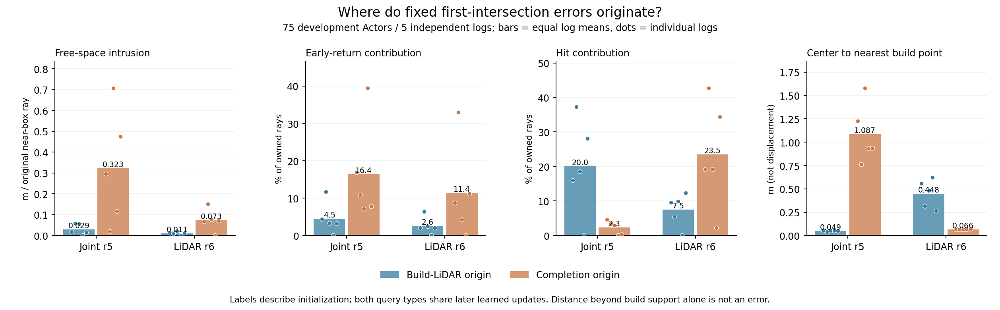

> 历史归档（2026-09-10）：以下为原版本事实与指令快照；当前执行以 docs/RESEARCH_STATUS.md 为准。

# V7.3：固定首交点的查询来源诊断

2026-09-08。任务`WS-V73-M2-QUERY-PROVENANCE-01`，run `20260908T052000Z__development-fixed-joint-lidar-r1`，分析代码05db8db9。全部75旧开发Actor、5独立日志，CPU 0.694秒、RSS峰值0.634GiB、零训练更新。分析r5最终联合模型与同短窗监督的r6 LiDAR-only已存表面。

主要发现：按Actor及独立日志等权的自由空间侵入分解，r5新增补全查询对应91.74%的侵入、78.37%的过早返回；初始化于build LiDAR的查询中心仍接近某个build测量。这不支持把当前问题笼统解释成“可靠观测查询全部被移坏”，也不支持对所有查询加强零位移正则。后续两类查询共享学习更新，来源标签不是纯视觉/纯LiDAR的因果贡献。

## 定义与边界

CPU BVH取实际最近交点及primitive ID，以每query的8个三角面定位保存的source标签。source0初始化于build LiDAR，source1初始化为completion；不移除查询、不重排遮挡、不改透明度或三角片，不重新神经推理。覆盖全部43832近框Actor–ray实例，其中11886为明确归属该Actor的原首回波。近框束可能跨Actor重复，实例数不是独立样本量。

free是已观测原首回波前0.2米之外的提前距离，每个来源先除以该Actor的全部近框束数；early/hit/late分别除以全部归属束数。先在日志内平均Actor，再等权平均5日志。缺失没有命中来源，仍包含在归属束分母中。各来源贡献相加恢复同一指标，不能把每个来源单独改用成功命中的束作分母。

中心到最近build点距离是集合距离，**不是到自身初始化位置的位移**；离开稀疏build支持不自动等于错误，未采样区域也不是已知自由空间。物理错误由原束的实际提前交点确定。本诊断不能证明删除某类查询会改善全局首交点，因为删除后首交点可能落在另一片表面。

## 全部开发Actor

| 模型/初始化来源 | 查询片数 | 中心→最近build均距(m) | 中心在0.2m支持外比例 | free贡献(m) | early贡献(pp) | hit贡献(pp) | late贡献(pp) |
|---|---:|---:|---:|---:|---:|---:|---:|
| r5 / build LiDAR | 10419 | 0.0490 | 0.00% | 0.02905 | 4.538 | 19.990 | 2.021 |
| r5 / completion | 34304 | 1.0874 | 84.60% | 0.32267 | 16.443 | 2.287 | 17.011 |
| r6 / build LiDAR | 10419 | 0.4483 | 78.14% | 0.01055 | 2.595 | 7.457 | 3.733 |
| r6 / completion | 34304 | 0.0665 | 0.00% | 0.07321 | 11.428 | 23.549 | 1.926 |

除查询片总数外，表中均为上述日志等权统计，不是所有点/束直接池化。r5两来源free之和0.351717m，early之和20.9807%，与GPU原评价仅有CPU浮点数值差异。r6对应0.083755m、14.0229%。查询数量和可见机会不同，因此不能把总贡献比例解释成单个补全查询的固有错误概率。

原始计数呈现另一种权重：r5 build来源有622个owned early、4477 hit、486 late；completion有364 early、250 hit、747 late。不能混用这些原始计数与日志等权百分比。r5全部67非空表面的最大顶点—片中心距离0.103816m，与固定0.06m切向间隔及有界法向弯曲一致；未使用可训练opacity或无界片半径来增加命中。

## 全部移动Actor，而非按错误挑例

依据既定build元数据速度>2m/s，保留全部9个对象；其中3个无heldout归属返回，也出现在图中且不作精度判断。移动组有归属返回的独立日志仅2个。

| 模型/初始化来源 | 中心→build均距(m) | free贡献(m) | early贡献(pp) | hit贡献(pp) |
|---|---:|---:|---:|---:|
| r5 / build LiDAR | 0.0615 | 0.02698 | 4.373 | 10.113 |
| r5 / completion | 1.3849 | 0.18812 | 58.396 | 0.598 |
| r6 / build LiDAR | 0.5459 | 0.02348 | 2.625 | 5.944 |
| r6 / completion | 0.0607 | 0.02528 | 5.772 | 12.755 |

极稀疏例必须连同分母解释：scene-0359的c07f236a只有4个build点、1个heldout归属束。r5在这1束上由completion产生提前交点，侵入0.580631m；r6没有返回。这个对象构成该独立日志移动组的全部可观测样本，因此对2日志等权移动统计影响很大，不能据此概括全部动态车辆。

另一方面，scene-0519的c32c9f21有6570个build点、6302个heldout归属束。r5的build来源early/hit/late为166/1720/288，completion为103/115/237；近框free原始距离和分别213.34m与2477.86m。稠密对象也存在新增支持的提前与迟到交点，并非只有单束对象出现问题。

三页图按完整owner排序，展示两模型的相同原始束、相同Actor规范地面投影和成对一致坐标范围。线段连接同一束的真实测量与预测首交点，不是最近邻对应；全部存储束均保留。灰色为build，黑叉为测量，红/绿/蓝为early/hit/late，圆/三角表示build/completion来源。图不显示高度，不能代替三维数值评价。

[全部9个对象的三页PDF](../../../autoresearch/worldsim_v73/m2/global/V73_MOVING_QUERY_INTERSECTIONS.pdf)

## 研究决策

保留R10全轨迹标签联合训练和R11相同标签的原生头强控制；两者运行中，不因旧开发可视化中途改目标。R12继续采用已登记的唯一变化：相对R10将硬单束range free替换为0.03m宽、32分辨率的beam_tube_range，event仍为0，初始化、标签、学习率和轮数保持一致。R12尚未启动，等待训练资源空位。

该迁移已依据[nvdiffrast官方说明（SIGGRAPH Asia 2020）](https://nvlabs.github.io/nvdiffrast/)：点采样覆盖的可见性切换缺少位置梯度，抗锯齿能提供局部边界梯度；它仍不能保证对完全缺乏支持的区域产生几何位置梯度，也不构成全局收敛保证。仅改变free目标不会预先保证成功，最终仍读同一硬表面并同时报告缺失和覆盖。

如果新增支持自由空间问题在这个受控变化后仍未改善，应进一步检查原生支持的米制位置、观测归属和支持生成路径，再决定适配范围或生成机制；不把当前负结果外推为视觉几何路线失败，不改成仅拟合回波概率。点集覆盖、原束首交点以及背景组合必须分别报告。

机器可读证据：`docs/autoresearch/worldsim_v73/m2/global/query_provenance_r1_summary.json`；完整预测/测量NPZ位于上述原run。查询分析与绘图脚本分别为`analyze_worldsim_v73_query_provenance.py`、`plot_worldsim_v73_query_provenance.py`。F02/F04仍未解决；整个V7.3未完成，shutdown=false。
