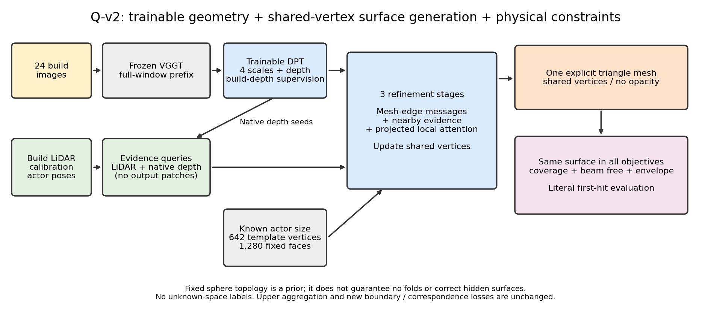
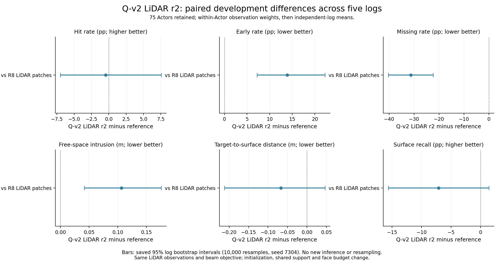
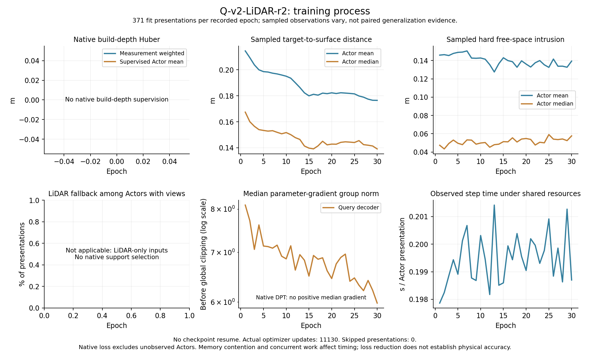
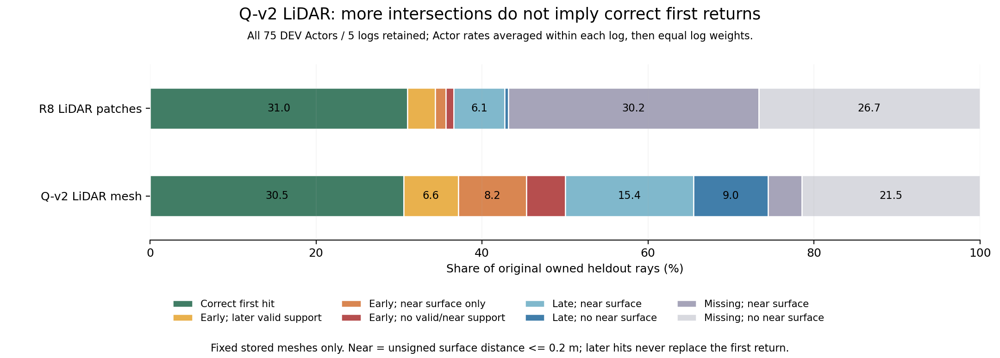
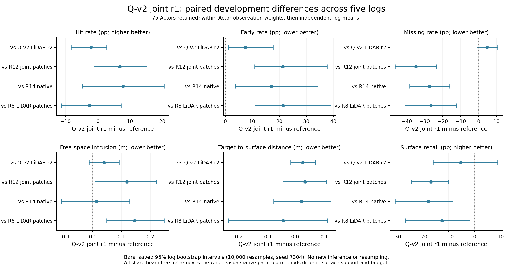
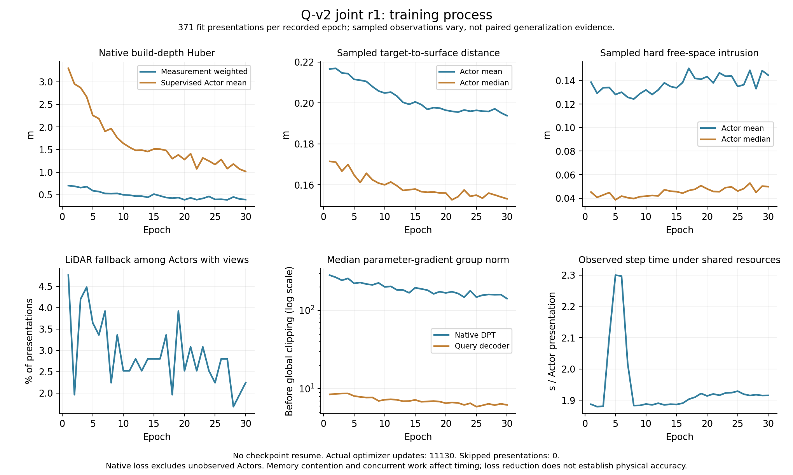
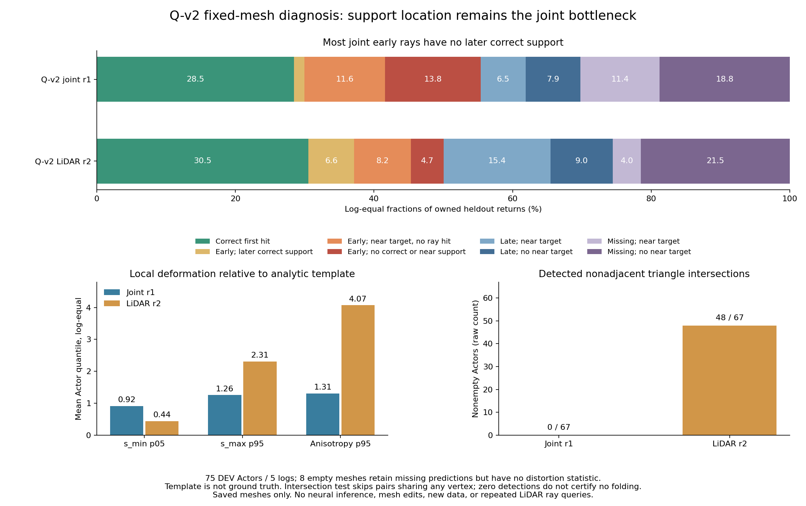

> 历史归档（2026-09-10）：以下为原版本事实与指令快照；当前执行以 docs/RESEARCH_STATUS.md 为准。

# Q-v2：观测查询驱动共享顶点表面

**最新诊断（2026-09-09 04:55 UTC）：** 固定网格诊断支持优先构造正确沿束支持，也修正了局部塌缩的归因：joint early26.9437%中仅1.4956个百分点有后方正确支持，其余25.4481个百分点没有；LiDAR r2该项为6.5867个百分点。joint 67非空网格未检出非邻接三角自交，局部形变温和；LiDAR r2有48/67检出相交且有局部高拉伸。因此不能把joint较差简单归因于collapse/stretch或自交。两支都未同时兑现物理与覆盖，闭合拓扑是否为原因仍需要改变参数化来检验。 下一项为开放局部曲面支持的实现，详见文末。

**当前结论（2026-09-09 04:40 UTC）：** Q-v2联合r1与同网格LiDAR r2均done。r1−r2的early为+7.4536pp，95%日志配对区间[+1.1217,+17.7188]pp；hit−2.0905pp、miss+4.6790pp、free+.038779m、单向distance+.026002m、recall−5.3473pp均值方向均较差，但这五项区间跨0。当前整条联合通路没有显示明确的有效增量，不能把跨0当等效性证明，也不能外推所有视觉基础模型无用。按第18节策略二/不确定性分支，下一轮优先surface representation与constructive ray supervision；upper PEFT、DINOv3、full FT不启动，near-boundary free后置。 完整表格见文末；下方带日期的等待/运行状态仅为历史。

**最新用户决策（2026-09-09 01:47 UTC）：先等Q-v2完整结果。** r1正在第17/30轮；结果前不启动或继续扩展upper LoRA等新候选。joint明确帮助时研究open/structured surface、constructive ray-support与独立upper PEFT；几乎无帮助时优先表面表示与constructive ray supervision，停止向DINOv3/full FT投入。near-boundary free后置；闭合/UNKNOWN与局部collapse/stretch仍是待判别风险。依据与不确定性处理见[计划revision7第18节](WORLDSIM_V7_3_RESEARCH_PLAN.md)，下方准备代码和历史结果不覆盖该决定。

**当前（2026-09-08 23:50 UTC）：LiDAR r2已收口，联合r1继续。** 共享网格LiDAR r2已完成，但未同时改善物理与覆盖：相对同beam R8，miss−31.295pp，early+13.899pp、free+.106203m，三项95%日志配对区间均不跨0；hit−.454pp、单向distance−.067188m、recall−7.120pp区间均跨0。更多束有交点不等于表面更准确；该冲突在无视觉输入时仍存在，不能归咎于背景视觉token或因此拒绝可训练几何基座。联合r1继续，最终r1−r2整通路比较尚pending。 详见文末完整结果与后续判别。以下更早状态作为历史。

2026-09-08 23:10 UTC。联合r1（code bfc181b4、PID96997）与同网格LiDAR r2（code95050522、PID98643）均在正式训练，质量结果pending。r2在23:08快照为第4轮、1459次真实更新；两支资源正常。三角结果见[完整报告](WORLDSIM_V7_3_TRIANGLE_RESULTS.md)：R12显著降低R10的侵入却增加miss，未同时恢复正确命中与覆盖。本轮检验共享几何支持，保持可训练原生DPT和原物理目标，不声称连通即正确。

## 一手依据与迁移边界

[Pixel2Mesh，ECCV2018](https://openaccess.thecvf.com/content_ECCV_2018/html/Nanyang_Wang_Pixel2Mesh_Generating_3D_ECCV_2018_paper.html)通过图网络与图像特征变形椭球。[官方实现](https://github.com/nywang16/Pixel2Mesh)是旧TensorFlow环境；本轮迁移共享顶点和逐阶段几何特征读取思想，不移植旧环境、不宣称复现其完整模型或结果。

[Mesh R-CNN，ICCV2019](https://openaccess.thecvf.com/content_ICCV_2019/html/Gkioxari_Mesh_R-CNN_ICCV_2019_paper.html)结合粗体素拓扑与网格细化；[官方mesh_head](https://raw.githubusercontent.com/facebookresearch/meshrcnn/main/meshrcnn/modeling/roi_heads/mesh_head.py)明确按顶点对齐图像、沿边传递特征并更新顶点，训练使用完整GT网格的采样Chamfer/法向/边损失。这里只借鉴显式顶点细化，不移植体素分类或将稀疏LiDAR当完整表面。

[PyTorch3D解析球面细分源码](https://raw.githubusercontent.com/facebookresearch/pytorch3d/main/pytorch3d/utils/ico_sphere.py)说明共享边细分与单位化的标准构造。本机采用已有SciPy与Torch自主实现解析二十面体细分，不新增依赖。ConvexHull仅用于12个解析顶点建立初始20面，不对LiDAR/预测点取凸包。与之前DMTet/FlexiCubes审计相比，直接网格避免依赖有符号场的活动支持出生；代价是固定genus-zero拓扑，不能生成任意孔洞或断开的车轮等部件，也仍会折叠/自交/塌缩。

## 实际实现

`ActorSharedMeshQueryDecoder`继承现有三层192维Query组件及4层×4局部采样，替换最终表面表示。每Actor仍有最多1024个build LiDAR与512个原生深度支持查询；原生候选不足时沿用LiDAR/coarse fallback，这些查询只提供观测隐状态，不各自产生输出小片。

新增642个具有真实三维位置的表面顶点，以只读Actor尺寸缩放解析球面初始化；1280个三角面的顶点索引共享且固定。每层沿网格边聚合，并独立读取最近16个观测查询，再与精确投影的多尺度局部视觉读取联合更新顶点。观测查询也继续更新；离散近邻选索引不反传，但所选原生坐标、特征与消息保留梯度。两类消息各取平均后等权组合，避免网格顶点挤出稀疏观测。输出同一组顶点/三角面给coverage、beam free、框包络和硬首交点，没有opacity/existence/半径头、筛掉违规面的后处理或训练/导出换三角化。

几何监督仍为稀疏测量→表面单向coverage、原始束beam free与直接build轴向深度Huber；未知表面不惩罚为不存在，UNKNOWN不标FREE。固定闭合拓扑是一项可失败的形状先验，不能作为内部占据真值。原始束只监督有效首返回前；不添加体积正厚度。首轮不叠加ARAP、Laplacian或新loss，以先识别参数化的实际效果。

可训练Query参数1668393（旧1670517），原生DPT32654562不变，早期/跨视图聚合仍冻结。输出面数1280，旧片为8×(512+min(build,1024))，约4104–12288；总隐查询数为642+512+min(build,1024)，最高2178，旧最高1536。面数、连续支持、初始化与邻接同时属于此次参数化迁移，不能说是面密度/初始化/纯拓扑完全匹配的单模块因果实验。同解码器LiDAR控制现已提前安排，便于主候选结束时区分视觉通路与参数化本身；必要的预算/来源判别依据结果再定，不以无止境分辨率网格拖延。

## 正式运行登记

- task：`WS-V73-Q-V2-01`，run：`20260908T221500Z__shared-mesh-full-track-beam-s7304-r1`；状态running（PID96997，初始化评价完成，30轮正式训练继续；逐步状态见run/status.json）。
- 依据提交07e98727；启动manifest记录实际实现commit。M1r3 fresh DPT、Query seed7304，30轮、371 FIT Actor/20日志；489对象完整评价、75 DEV/5日志含51总不可用对象。原窗口24视图与分辨率不变。
- 同R12的full_track FIT标签、native1/free.5/beam width.03m/res32/event0、AdamW1e-5与clip1；不从R12 checkpoint恢复、不改visual-only输入cohort、不加入上层LoRA或新局部对应/near-boundary目标。
- 新网格initial必须实际评价；旧LiDAR PCA baseline复用R10保存结果。最终主要比较Q-v2−R12，再以R8/R14定位物理控制边界。仍按独立日志配对，报告hit/early/miss/free/距离/召回与表面预算；未成功返回也保留。FIT不是泛化证据，移动子集2日志的稀疏限制继续。
- 启动：`scripts/run_worldsim_v73_qv2_shared_mesh_r1.sh`；沿用现有训练器、逐轮checkpoint与状态原子写入。20新日志质量不提前读取。资源依据真实训练峰值判断，不能把下面合成检查当完整DPT资源估计。

## 必要接口验证

一次合成检查验证642顶点/1280面、每条拓扑边归属2个面；轴向首交点[2,2,1.2]m符合解析边界。使用相同最近面算子反传后，四尺度视觉梯度范数为[1.45348e-5,8.12089e-6,5.26674e-6,1.04275e-5]，原生种子梯度1.73559e-6，说明新顶点确实可接收两类几何信息。此为可微接口证据，不是真实数据质量，也不是禁止未来无有效视图/零梯度的门控。

初次合成数据使用4×4最粗特征图，既有约3.05特征像素初始offset使候选全部越界，因此“所有尺度都必须正梯度”断言失败；核对现有valid mask及[PyTorch grid_sample边界说明](https://docs.pytorch.org/docs/stable/generated/torch.nn.functional.grid_sample.html)后，改用12/24/48/96合成图重试通过。模型mask/offset未修改，没有放宽真实数据输入条件；记录为检查输入修复，无新增科学失败ID。只重试这一失败检查，未扩展smoke/回归。

代码：`motion_proj/worldsim_v73/shared_mesh_queries.py`；证据：`autoresearch/worldsim_v73/qv2/shared_mesh_path_check.jsonl`、组件图及源码。failure_ledger_refs=[V73-F01,V73-F02,V73-F03,V73-F04,V73-F06,V73-F09]；failure_ledger_delta=none（候选结果pending，F02未解决），下一V73-F10。

## 后续判别

如果连通表面减少missing却增加early，检查实际网格位置/折叠与certified-free边界梯度，而非以闭合性当真值；如果训练几何仍难恢复，区分上下游支持与视觉对应，按已准备的边界独立适配VGGT上层。若物理/覆盖同时改善，继续同信息控制、完整输入与背景合成，再选择新日志确认。用户提出的near-surface certified-free与calibration-guided consistency可行性已写计划16节，均保持独立机制，不混入首轮。

## 同共享网格的 LiDAR-only 控制（2026-09-08 23:00 UTC）

主联合Q-v2 r1已到第3轮，物理/覆盖结果仍pending。为防止把椭球初始支持或共享网格本身的收益误归于视觉，补齐同一`ActorSharedMeshQueryDecoder`的LiDAR-only r2；这是计划中的同解码器控制，提前并行训练以在主候选结束时取得可解释比较。旧R8采用独立patch，不能代替此项。

task `WS-V73-Q-V2-01` / run `20260908T230000Z__shared-mesh-lidar-full-track-beam-s7304-r2`，已从95050522启动，PID98643；23:08 UTC第4轮1459次更新，allocated峰值0.252920GiB。仍用原371 FIT/67 DEV可用输入、完整489对象、seed7304、30轮/full_track/AdamW1e-5/clip1、642顶点1280面、相同尺寸椭球与共享边。build LiDAR的最多1024证据查询+512支持查询输入不变；512支持来自同build LiDAR，关闭图像/DPT/视觉特征读取，native-data-weight=0。coverage、beam free .5/.03m/res32、envelope .05、event0保留。

此对照同时移除DPT适配、原生深度支持、视觉读取和native深度辅助监督，是视觉几何整通路控制，不是仅一个attention token的消融。相同seed不意味着不同分支消耗的逐步CUDA随机数相同，故不称逐步采样完全匹配。两支具有相同网格输出与Query参数定义；LiDAR模式未调用的视觉模块虽仍存于state_dict，不会接收梯度或Adam更新。其summary的requires_grad参数数不能冒充每个参数都参与训练，依据实际梯度路径解释。

新initial必须实际评价，不能复用joint初始网格预测（观测隐状态不同），固定LiDAR PCA复用R10保存结果。先汇总r2−R8判断LiDAR参数化变化，再在两者都完成后汇总r1−r2，比较hit/early/miss/free/测量距离/召回；完整分母与独立日志配对保持。R12/R14已保存的基线继续作为外部通路锚点。分析脚本只新增保存真实surface_vertices/faces/parameterization字段及对照路径元数据；不改变任何指标、聚合、bootstrap或旧结果，不回算历史。

前述“不等主候选结果做完整矩阵”的取舍仍成立：当前仅增加这一必要控制，不启动其他拓扑/密度/损失网格。可训练视觉几何r1主线继续，LiDAR控制不替代它。23:00前资源为GPU14412/24576MiB，主allocated11.591GiB、RSS34.08GiB、cgroup无OOM、磁盘68GiB可用；LiDAR路径不加载DPT/744前缀，沿用已完成R7/R8的低显存执行方式，实际新增峰值在启动后记录。两个现有6线程进程在14CPU配额内；耗时均披露并行竞争。

证据和启动入口`scripts/run_worldsim_v73_qv2_lidar_mesh_r2.sh`，源机制复用本页已核实Pixel2Mesh/Mesh R-CNN与原项目LiDAR路径，无新卡点、无新依赖/单独smoke/回归。failure_ledger_refs=[V73-F01,V73-F02,V73-F03,V73-F04,V73-F05,V73-F06,V73-F09]；failure_ledger_delta=none，正式结果pending，下一V73-F10。20新日志未读、30分钟ACTIVE、完成不关机。

## 固定推理与收口边界（2026-09-08 23:10 UTC）

`evaluate_worldsim_v73_fixed_actors.py`现按checkpoint配置选择共享网格或旧patch，保持相同build-only输入、无梯度、真实三角面硬读出与全部不可用对象分母。新网格保留642顶点/1280面原输出，不能重解释为642个独立patch，也不重网格化。已仅在CPU成功加载r2真实完成轮次checkpoint（全部keys匹配）；完整固定推理尚未执行，20新日志质量未读。checkpoint类加载只是接口证据，不能替代正式模型效果。

收口命令为`bash scripts/summarize_worldsim_v73_qv2.sh lidar_r2`与`... joint_r1`；分别在相应最终489对象评价完成后各执行一次，后者须等两支都完成。前者比较r2−R8；后者比较r1−r2/R12/R14/R8。原指标与统计脚本复用，不回算历史比较；保存训练曲线、配对图、原summary及最终manifest。

旧`analyze_worldsim_v73_query_provenance.py`与`analyze_worldsim_v73_surface_failures.py`按每patch8面/9顶点归属来源，不能用于本表示。Q-v2的source=2只说明输出来自共享网格顶点，不能给混合观测状态硬分LiDAR/视觉因果来源。`analyze_worldsim_v73_surface_support.py`仅依赖顶点/面，可按final失败模式使用，但闭合表面常有正常入/出两个交点；深度层数不是自交证明。主评价仍报告真实early/hit/miss/free与测量覆盖。

23:08运行证据归档`autoresearch/worldsim_v73/qv2/shared_mesh_lidar_r2_training_start.json`，r2完成初始化489对象，1459/1459更新，非零Query梯度、DPT梯度0；原views字段仅元数据，不代表LiDAR分支读取图像。总GPU15163/24576MiB、无OOM，两支继续。failure_ledger_delta=none，F02等待最终对照，不新增失败ID、不额外做smoke/回归。

## LiDAR控制r2正式收口（2026-09-08 23:50 UTC）

共享网格LiDAR r2已完成，但未同时改善物理与覆盖：相对同beam R8，miss−31.295pp，early+13.899pp、free+.106203m，三项95%日志配对区间均不跨0；hit−.454pp、单向distance−.067188m、recall−7.120pp区间均跨0。更多束有交点不等于表面更准确；该冲突在无视觉输入时仍存在，不能归咎于背景视觉token或因此拒绝可训练几何基座。联合r1继续，最终r1−r2整通路比较尚pending。

30轮、11130呈现/11130实际更新、0跳步/0恢复，完整489对象initial/final均done；训练code95050522，分析基于a587bd6b，原371 FIT/67 DEV可用输入和51不可用对象保留。Query requires_grad总1668393，但未调用的视觉模块无梯度；DPT/冻结图像前缀均未加载。642共享顶点/1280面，无opacity与导出重网格化；原full_track、beam.5/.03/res32、coverage/envelope保持。耗时2505.097482s（41.75min，含初始化及最终评价，受r1并行影响）、GPU allocated峰值0.252920GiB、RSS1.876888GiB、checkpoint11658264字节。该资源是LiDAR控制，不能用来估算联合视觉模型成本。

### 完整DEV与同信息参数化比较

| 方法 | hit | early | miss | free (m) | 单向distance (m) | recall@.2m |
|---|---:|---:|---:|---:|---:|---:|
| Q-v2 LiDAR r2 | 0.305489 | 0.194901 | 0.255388 | 0.140523 | 0.162366 | 0.648249 |
| R8 LiDAR patches | 0.310028 | 0.055909 | 0.568336 | 0.034320 | 0.229553 | 0.719452 |
| r2初始网格 | 0.252626 | 0.168260 | 0.346400 | 0.250007 | 0.212455 | 0.535783 |
| 固定LiDAR PCA | 0.212448 | 0.043527 | 0.734104 | 0.017708 | 0.304790 | 0.654182 |

比例列0–1，75 Actor/5独立日志，23无owned首返回、8空预测，完整分母不变。先Actor内按真实束/点计数加权，再日志内Actor平均、日志等权。free保留全部原始near-box首返回束；测量→表面是单向观测覆盖量，不是完整表面精度或对称Chamfer。hit/early/miss未覆盖的其余返回是late，不能把miss减少都记作正确命中。

| 指标 | r2−对照 | 95%日志配对区间 | 改善日志 |
|---|---:|---:|---:|
| hit (pp) | -0.453880 | [-6.970048, +7.550361] | 2/5 |
| early (pp) | +13.899145 | [+7.212093, +22.236059] | 0/5 |
| miss (pp) | -31.294775 | [-40.343859, -22.373624] | 5/5 |
| free (m) | +0.106203 | [+0.041433, +0.175709] | 0/5 |
| 测量→表面 (m) | -0.067188 | [-0.212329, +0.046267] | 3/5 |
| recall@.2m (pp) | -7.120321 | [-15.656573, +1.415930] | 2/5 |

miss在5日志都减少，early/free在5日志都增加。hit仅2/5日志增加，区间跨0；distance平均下降而recall平均下降，二者均跨0，不宣称覆盖强或显著退化。该对照还包含椭球初始化、连续面支持与面数预算变化，不是仅共享边的单因素因果实验。当前首候选的LiDAR路径未满足F02解除条件，等待联合r1后再作下一轮方案选择。

### 相对初始化与训练过程

| 指标 | r2−对照 | 95%日志配对区间 | 改善日志 |
|---|---:|---:|---:|
| hit (pp) | +5.286296 | [-1.907705, +11.223395] | 4/5 |
| early (pp) | +2.664065 | [-3.922498, +8.351865] | 2/5 |
| miss (pp) | -9.101176 | [-18.638966, -0.986893] | 4/5 |
| free (m) | -0.109484 | [-0.267725, +0.004845] | 4/5 |
| 测量→表面 (m) | -0.050090 | [-0.083915, -0.001377] | 4/5 |
| recall@.2m (pp) | +11.246540 | [-9.795123, +27.862341] | 4/5 |

训练相对自身初始化减少miss与单向距离，两项区间不跨0；hit/early/free/recall区间跨0。相对固定PCA，hit+9.304pp与miss−47.872pp有可靠变化，但early+15.137pp/free+.122816m亦增加，不能靠更弱PCA对照掩盖同信息R8结果。

| 训练采样量 | 第1轮 | 第30轮 |
|---|---:|---:|
| 测量→表面 (m) | 0.214501 | 0.176469 |
| hard free (m) | 0.145944 | 0.139383 |
| beam目标 (m) | 0.146296 | 0.139979 |
| Query梯度中位数 | 8.099575 | 5.979684 |

过程量是每轮重新采样训练数据，不代替固定DEV；LiDAR模式没有native监督或native支持选择，图中该项为不适用。FIT最终hit/early/miss/free/distance/recall=.343442/.252846/.185162/.110072/.166360/.704862；full_track含FIT评价时刻标签，不是泛化。移动DEV仍9 Actor/2日志、3无owned/1空表面，hit.129493/miss.097081/recall.359051，其中一日志仅1条owned束，不能作稳健动态优势结论。

### 新卡点的一手检索与迁移决定

本轮实测是“闭合共享支持减少missing，却新增错误首返回”，不能从总指标直接诊断成自交。重新检索[Mesh R-CNN，ICCV2019](https://openaccess.thecvf.com/content_ICCV_2019/html/Gkioxari_Mesh_R-CNN_ICCV_2019_paper.html)及[官方mesh_head](https://raw.githubusercontent.com/facebookresearch/meshrcnn/main/meshrcnn/modeling/roi_heads/mesh_head.py)：其完整GT网格采样Chamfer/法向配合边长正则，说明顶点连通本身不足以保证几何质量；我们的稀疏target不支持直接照搬双向完整表面损失，边长惩罚也不是正确首返回保证。

[Point2Mesh，SIGGRAPH2020](https://ranahanocka.github.io/point2mesh/)的[官方训练入口](https://raw.githubusercontent.com/ranahanocka/point2mesh/master/main.py)优化单对象网格，使用点/法向匹配、可选BeamGap与局部非均匀项，并在中途调用Manifold重建/细分。它支持研究局部形状先验的价值，但不是本任务同稀疏传感器、全日志共享训练的直接对照；不默认将其BeamGap称为原始传感器free，也不在导出时重网格化来修饰当前结果。其闭合初始网格/双向点损失不提供未知区域的占据真值。

首选执行已有固定表面BVH判别，依据[Open3D官方接口](https://www.open3d.org/docs/release/python_api/open3d.t.geometry.RaycastingScene.html)分别读取最近点、字面首交点和全部交点：`cast_rays`是首事件，`list_intersections`的后方命中仅作诊断。不用signed distance/occupancy推断内部真值，闭合网格正常入/出也会产生两个交点。

登记`WS-V73-M2-SURFACE-SUPPORT-01/20260908T235000Z__qv2-lidar-r2-vs-r8-support-r3`，状态pending；75个原DEV Actor全部保留，比较已完成r2/R8的固定输出，不重推理、不改模型、无新日志。分解early且后方有正确支持、只有邻近测量支持、early且缺正确支持、late与missing。若主要有后方有效表面，则优先处理错误前表面；若主要没有正确沿束支持，则继续定位几何位置/形状，而不把新增free排斥当单独解决方案。此判别不是新损失对照，联合r1的DPT与Query训练配置保持。

证据`autoresearch/worldsim_v73/qv2/shared_mesh_lidar_r2_{summary,final_manifest,analysis,training}.json`与两图；完整train/checkpoint/表面仍在原run。收口脚本执行一次；后续绘图仅重读保存统计纠正LiDAR不适用标签，不重复bootstrap/神经推理。failure_ledger_delta=update V73-F02 evidence; no new failure ID，下一V73-F10。r1在23:42快照第7轮正常；20新日志质量未读、30分钟ACTIVE、完成不关机。

### r2/R8固定表面判别已完成（2026-09-08 23:55 UTC）

登记support-r3已done，75 DEV全部、23无owned与8空表面保留，11886条原始owned heldout束，CPU .612499s/RSS.631134GiB，无神经推理/优化器更新。几何表面只读，主统计与旧对照不重算；此处报告八类边际频率，不声称是逐束状态转移。

| 所有owned束的互斥分类 | R8 (%) | Q-v2 LiDAR r2 (%) |
|---|---:|---:|
| 正确首交点 | 31.0028 | 30.5489 |
| early，后方有容差内交点 | 3.3768 | 6.5867 |
| early，仅表面邻近测量 | 1.2435 | 8.2102 |
| early，无正确交点/邻近表面 | 0.9706 | 4.6932 |
| late，表面邻近测量 | 6.1436 | 15.4293 |
| late，无邻近表面 | 0.4291 | 8.9929 |
| missing，表面邻近测量 | 30.1786 | 4.0498 |
| missing，无邻近表面 | 26.6551 | 21.4890 |

Q-v2 early的19.4901%中，只有6.5867个百分点在后方还存在容差内正确交点；另12.9034个百分点缺乏正确沿束支持，其中8.2102个百分点虽有近测量表面但仍是错误交点。late增至24.4222%（R8为6.5727%）。因此，仅去掉早表面或强化排斥不能保证恢复正确首返回；位置、方向与局部形状仍需学习。missing且有近测量表面的比例由30.1786%降至4.0498%，说明新支持改变了原有“近但不相交”的频率，但不能把这一下降全部算作正确hit增量。

池化原始计数给出另一权重视角：r2有2092条early，其中290条有后方正确交点，1802条没有；R8为666/191/475。不能拿大量束数替代5个独立日志，也不混用原始比例与日志等权百分比。r2的74.4612%多深度层频率可能包含正常入/出，不是自交率；本轮没有计算网格自交或把signed distance当占据真值。

这份诊断只涉及Actor-owned返回，不能直接归因全部背景自由空间侵入，F04仍未解除。下一步继续r1正式训练并完成r1−r2整通路比较：若联合模型同样大量缺少正确沿束表面，优先研究几何位置/局部形状及有效视觉表示适配；near-boundary只能覆盖经过认证的局部自由段，不代替缺失支持的吸引。若确有早面遮挡后方有效支持，再有针对性地加入认证边界或首事件目标。当前不因LiDAR对照提前改变联合模型或新开loss网格。

证据`autoresearch/worldsim_v73/qv2/support_r3/{summary,manifest}.json`，入口`scripts/run_worldsim_v73_qv2_lidar_support_r3.sh`；新增图只绘保存统计。failure_ledger_delta=update V73-F02 evidence; no new failure ID，下一V73-F10。

## 联合r1完整收口与策略选择（2026-09-09 04:40 UTC）

Q-v2联合r1与同网格LiDAR r2均done。r1−r2的early为+7.4536pp，95%日志配对区间[+1.1217,+17.7188]pp；hit−2.0905pp、miss+4.6790pp、free+.038779m、单向distance+.026002m、recall−5.3473pp均值方向均较差，但这五项区间跨0。当前整条联合通路没有显示明确的有效增量，不能把跨0当等效性证明，也不能外推所有视觉基础模型无用。按第18节策略二/不确定性分支，下一轮优先surface representation与constructive ray supervision；upper PEFT、DINOv3、full FT不启动，near-boundary free后置。

### 实际预算与评价分母

task `WS-V73-Q-V2-01` / run `20260908T221500Z__shared-mesh-full-track-beam-s7304-r1`；训练code bfc181b4，收口分析在50222d3e上执行一次。30轮、11130呈现/11130实际更新、0跳步/0恢复；initial/final完整489对象均done，04:28 UTC完成，训练及最终评估进程已退出。371 FIT/67 DEV可用输入；完整414 FIT/75 DEV、51无可用输入对象保持。642共享顶点/1280固定面，Query1668393和原生DPT32654562参数；744冻结前缀视图，不适配upper aggregation。full_track、seed7304、native1、finite-beam free.5/.03m/res32、event0、envelope.05、AdamW1e-5/global clip1保持；不是新loss组合或新视觉基座试验。

耗时22410.642356s（6.225h，含初始化/最终评价）、GPU allocated峰值11.591165GiB、RSS34.133816GiB、checkpoint412177558字节。第一层native投影权重最大变化.005181607，DPT/Query每轮实际梯度非零；仅说明训练确实发生，不证明泛化收益。LiDAR r2的41.75min/.253GiB不代表联合模型预算。

| 方法 | hit | early | miss | free (m) | 单向distance (m) | recall@.2m |
|---|---:|---:|---:|---:|---:|---:|
| Q-v2 joint r1 | 0.284584 | 0.269437 | 0.302179 | 0.179303 | 0.188367 | 0.594776 |
| Q-v2 LiDAR r2 | 0.305489 | 0.194901 | 0.255388 | 0.140523 | 0.162366 | 0.648249 |
| R12 joint patches | 0.215934 | 0.056423 | 0.651456 | 0.060573 | 0.154347 | 0.762202 |
| R14 native | 0.205563 | 0.099932 | 0.575200 | 0.166419 | 0.166946 | 0.771985 |
| R8 LiDAR patches | 0.310028 | 0.055909 | 0.568336 | 0.034320 | 0.229553 | 0.719452 |
| r1初始输出 | 0.256447 | 0.169219 | 0.344101 | 0.258662 | 0.213514 | 0.542408 |

比例列0–1。75 DEV/5日志保留23无owned首回波与8空预测；9个对象的native支持回退。先Actor内实际测量加权，再日志内Actor平均、日志等权。free使用全部原始near-box首返回；distance为测量→表面单向覆盖，不是完整表面精度或对称Chamfer。余下返回是late；miss降低不能自动解释成正确hit。20新日志质量未读，无DEV优化。

### 关键同网格通路比较：joint r1−LiDAR r2

| 指标 | r1−对照 | 95%日志配对区间 | 改善日志 |
|---|---:|---:|---:|
| hit (pp) | -2.090504 | [-8.273275, +2.764983] | 3/5 |
| early (pp) | +7.453601 | [+1.121726, +17.718750] | 1/5 |
| miss (pp) | +4.679029 | [-0.928100, +10.580005] | 1/5 |
| free (m) | +0.038779 | [-0.012601, +0.091251] | 2/5 |
| 测量→表面 (m) | +0.026002 | [-0.015585, +0.069346] | 1/5 |
| recall@.2m (pp) | -5.347336 | [-15.836984, +8.785088] | 1/5 |

early在4/5日志更差；其余区间仍宽，不宣称六项都显著退化或视觉效应严格为零。r1−r2同时改变视觉特征读取、原生几何支持与DPT辅助监督，属于整个联合路径的实际增量，不是单一视觉表示的因果试验。已存在的DPT/Query梯度不等于被有效利用；也不能由全局clip前的梯度范数差直接推出优化冲突根因。

### 相对R12 joint patches

| 指标 | r1−对照 | 95%日志配对区间 | 改善日志 |
|---|---:|---:|---:|
| hit (pp) | +6.865030 | [-1.165147, +15.222035] | 4/5 |
| early (pp) | +21.301394 | [+10.919367, +37.711663] | 0/5 |
| miss (pp) | -34.927734 | [-46.487365, -23.465387] | 5/5 |
| free (m) | +0.118729 | [+0.007788, +0.220809] | 1/5 |
| 测量→表面 (m) | +0.034021 | [-0.041505, +0.107103] | 1/5 |
| recall@.2m (pp) | -16.742639 | [-24.091225, -10.025828] | 0/5 |

相对R12，miss减少而early/free增加、观测recall降低，四项区间不跨0；hit与distance跨0。共享闭合支持没有解决物理—覆盖冲突，且不是仅边共享一项变化的纯消融。

### 相对R14 native与R8 LiDAR patches

R14：

| 指标 | r1−对照 | 95%日志配对区间 | 改善日志 |
|---|---:|---:|---:|
| hit (pp) | +7.902109 | [-4.768348, +20.572565] | 3/5 |
| early (pp) | +16.950538 | [+3.739791, +34.204997] | 1/5 |
| miss (pp) | -27.302131 | [-38.384347, -16.219915] | 5/5 |
| free (m) | +0.012884 | [-0.108108, +0.127679] | 2/5 |
| 测量→表面 (m) | +0.021421 | [-0.073540, +0.122369] | 2/5 |
| recall@.2m (pp) | -17.720973 | [-30.348367, -8.302696] | 0/5 |

R8：

| 指标 | r1−对照 | 95%日志配对区间 | 改善日志 |
|---|---:|---:|---:|
| hit (pp) | -2.544384 | [-11.262240, +7.249724] | 1/5 |
| early (pp) | +21.352746 | [+10.998406, +39.072464] | 0/5 |
| miss (pp) | -26.615746 | [-40.939739, -12.291752] | 5/5 |
| free (m) | +0.144983 | [+0.048469, +0.247323] | 1/5 |
| 测量→表面 (m) | -0.041186 | [-0.228971, +0.110215] | 2/5 |
| recall@.2m (pp) | -12.467657 | [-26.455272, -1.794372] | 1/5 |

R14比较early增加、miss减少、recall降低的区间不跨0；R8比较还包括free增加。没有凭弱PCA宣布成功，也不因此退回native-only。

### 训练是否只改善了代理目标

| 指标 | r1−对照 | 95%日志配对区间 | 改善日志 |
|---|---:|---:|---:|
| hit (pp) | +2.813677 | [-4.046632, +9.508370] | 3/5 |
| early (pp) | +10.021741 | [+6.473814, +14.768272] | 0/5 |
| miss (pp) | -4.192269 | [-8.686034, -0.331480] | 4/5 |
| free (m) | -0.079359 | [-0.216630, +0.017353] | 3/5 |
| 测量→表面 (m) | -0.025146 | [-0.057404, +0.007570] | 3/5 |
| recall@.2m (pp) | +5.236753 | [-7.057005, +17.530511] | 3/5 |

相对自身初始输出，early+10.0217pp、miss−4.1923pp区间不跨0，其余四项跨0。第1→30轮，native测量加权Huber .702628→.393007m，监督Actor平均3.295604→1.015549m；coverage .216529→.193775m，hard free .138622→.144580m，beam目标.140257→.144870m。每轮346个native监督对象/173972测量、357有视图/14无相机；DPT梯度中位数282.070→141.469，Query8.439→6.196；原生支持回退17→8。训练采样随epoch改变，不能替代固定DEV配对结果。

FIT完整414对象的hit/early/miss/free/distance/recall=.343530/.256705/.203256/.119893/.202376/.626248；full_track含FIT时刻标签，不是泛化。移动DEV9对象/2日志、3无owned/1空；hit.165184、early.148070、miss.117200、free.019435m、distance.338689m、recall.315691。一日志仅1条owned束，不能支持稳健动态优势。

### 下一步与失败结论

优先分析已保存r1/r2固定网格的局部变形和r1沿束支持。前者以只读尺寸缩放的解析模板为参考，测量面内奇异值/边长/面积变化及非邻接三角形相交，不把模板当GT，也不凭两层交点判断自交；后者复用已有八类支持分解，r2既有support-r3统计直接复用，不重推理或重复所有旧评价。随后选择open/structured surface与constructive ray-support的可辨别实现，UNKNOWN和遮挡后方仍未知。

先核对[PyTorch3D官方变形示例](https://pytorch3d.org/tutorials/deform_source_mesh_to_target_mesh)和[Open3D0.19源码](https://raw.githubusercontent.com/isl-org/Open3D/v0.19.0/cpp/open3d/geometry/TriangleMesh.cpp)：Chamfer拟合本身不保证平滑；显式三角相交判定和局部变形量可在不重新训练下读取。前者完整目标采样与边长缩短正则不直接移植到稀疏观测，诊断也不是新增质量门槛。[AtlasNet，CVPR2018](https://imagine.enpc.fr/~groueixt/atlasnet/)提供多参数曲面片的参考；这里尚未选择或实现新的参数化，不能宣称已复现或具有本任务收益。

failure_ledger_delta=update V73-F02 evidence; no new failure ID，下一V73-F10；F03/F04/F05/F06/F09未解除。结果、训练统计和两图位于`autoresearch/worldsim_v73/qv2/shared_mesh_joint_r1_*`及`V73_QV2_joint_r1_*`，原始checkpoint/逐步日志/表面保留原run。三本台账、计划与AGENTS同步，30分钟ACTIVE、完成不关机。

## 固定网格与joint沿束支持诊断收口（2026-09-09 04:55 UTC）

固定网格诊断支持优先构造正确沿束支持，也修正了局部塌缩的归因：joint early26.9437%中仅1.4956个百分点有后方正确支持，其余25.4481个百分点没有；LiDAR r2该项为6.5867个百分点。joint 67非空网格未检出非邻接三角自交，局部形变温和；LiDAR r2有48/67检出相交且有局部高拉伸。因此不能把joint较差简单归因于collapse/stretch或自交。两支都未同时兑现物理与覆盖，闭合拓扑是否为原因仍需要改变参数化来检验。

task/run：`WS-V73-M2-SURFACE-SUPPORT-01/20260909T045000Z__qv2-joint-r1-support-r4`与`WS-V73-Q-V2-MESH-DIAGNOSTIC-01/20260909T045000Z__fixed-dev-mesh-deformation-r1`，code61016ca5。两项done，CPU耗时.367797s/.628716GiB RSS和3.196148s/1.008175GiB RSS。仅读保存网格，0优化/0神经推理；原75 DEV/5日志、11886条owned heldout束、23无owned/8空保留，r2 support-r3直接复用。

| 沿束支持类别 | joint r1 (%) | LiDAR r2 (%) |
|---|---:|---:|
| first_hit | 28.458401 | 30.548905 |
| early_with_later_hit | 1.495569 | 6.586693 |
| early_without_hit_but_near | 11.636394 | 8.210222 |
| early_without_hit_or_near | 13.811725 | 4.693173 |
| late_but_near | 6.478596 | 15.429253 |
| late_without_near | 7.901459 | 8.992928 |
| missing_but_near | 11.408593 | 4.049818 |
| missing_without_near | 18.809263 | 21.489009 |

joint共2131条raw early，其中仅133条后方有正确支持、1998条无正确支持；这不是日志等权分母。near目标不等于与该束相交；例如joint missing-but-near11.4086%，支持接近测量但仍缺字面首交点。后方正确支持只是诊断，不替代真实first，不据此过滤面或修改推理。

| 局部形变量 | joint r1 | LiDAR r2 |
|---|---:|---:|
| smin_p05 | 0.915794 | 0.437277 |
| smax_p95 | 1.257043 | 2.308692 |
| anisotropy_p95 | 1.310224 | 4.070739 |
| edge_ratio_p05 | 0.981374 | 0.741590 |
| edge_ratio_p95 | 1.183438 | 1.815729 |
| smin_below_01_fraction | 0.000000 | 0.003962 |
| smax_above_3_fraction | 0.000000 | 0.033473 |
| total_area_ratio | 1.104821 | 1.182624 |
| intersected_face_fraction | 0.000000 | 0.062230 |

分位数先按单Actor面/边统计，再在日志内平均、日志等权；不是把所有面合并后的分位数。fraction行用0–1。67非空对象之外8个空输出记形变不可用、物理missing保留。解析模板通过原checkpoint的template_vertices乘只读尺寸/2得到，不是GT、也不是网络initial输出；3×2局部映射奇异值对整体刚体旋转不变。joint这些指标没有显示严重局部压缩/拉伸，但不测量整体错误平移或表面是否贴合真实车辆。LiDAR的smin<.1占.3962%、smax>3占3.3473%，仅为描述性量，不设训练门控。

Open3D0.19的get_self_intersecting_triangles检出joint0/67、LiDAR48/67有非邻接相交；它跳过共享任意顶点的配对，不能证明无相邻折叠或没有其他问题。LiDAR涉及相交的面比例日志等权6.2230%。这些结果不能建立相交与某条early的因果关系；不重跑大规模归因来拖延参数化实验。

### 下一候选的实现方向

先实施**开放局部结构化曲面支持**，保留现有Actor内空间交互、可训练DPT接口和统一显式三角面读出。首选把大量窄小逐点片重新组织为有限数量、具有更大局部覆盖的共享顶点chart，依build/native观测初始化查询并允许规范坐标更新；chart内使用局部UV高度图限制切向折叠，不强行连接UNKNOWN区域为全局闭合外壳。旧3×3小片本来已有局部高度图结构，因此“高度图”本身不是新增贡献；实际待检验的是支持分配/尺度与避免全局闭合连接。chart间仍可能重叠/错位，固定局部尺度也可能产生错误宽面，必须接受原硬物理评价。

[AtlasNet官方模型](https://raw.githubusercontent.com/ThibaultGROUEIX/AtlasNet/master/model/atlasnet.py)按多个参数化模板映射并合并网格，提供开放局部曲面的实现参考；其ShapeNet完整形状与训练随机采样/评估规则网格不直接迁移。这里训练、导出和硬评价使用同一固定UV三角化，不新增PyMesh依赖或改变评价表面。候选仍pending，当前没有其训练结果。

constructive ray监督作为随后可单独判别的因素：对真实owned首返回，研究以射线方向分解横向支持距离与沿束距离的几何吸引，使尚未相交的面也接收位置梯度；不把目标后的空间判free、不把概率opacity当物理表面。[SoftRas，ICCV2019](https://openaccess.thecvf.com/content_ICCV_2019/html/Liu_Soft_Rasterizer_A_Differentiable_Renderer_for_Image-Based_3D_Reasoning_ICCV_2019_paper.html)说明屏幕空间软距离能把梯度传给未覆盖像素的三角面；我们只借鉴投影距离对缺交点仍可导的思想，不迁移其全三角概率融合为真实首事件。[DRC，CVPR2017作者页](https://shubhtuls.github.io/drc/)证明多视图depth/ray consistency已有先例，不能把沿束监督本身当新颖性。精确loss与运行预算在实现时登记；先保持表面参数化和新增监督的归因分开，不同时解冻上层、换基座或扫loss网格。

failure_ledger_delta=update V73-F02 evidence; no new failure ID。F02补充joint缺正确沿束支持、LiDAR局部变形/自交与joint未见严重局部问题的差异；F03/F04等未解除。原始逐面数组在mesh diagnostic run的各模型npz，summary/manifest归档`qv2/support_r4/`与`qv2/mesh_diagnostic_r1/`。20新日志未读、30分钟ACTIVE、完成不关机。
