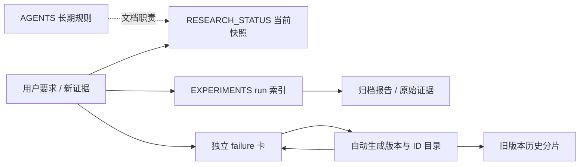

# V7.4 文档整理记录

2026-09-20；task/run：`WS-V74-DOCS-CLEANUP-01 / 20260920`。承接用户已完成的归档移动，不改变实验结论，不新增推理或训练。

## 问题与修改

之前将同一进展重复追加到 AGENTS、状态、实验和失败入口，导致多处过期“当前”互相矛盾。失败目录停在旧阶段，F17–F22 缺 metadata，查询器遇到这些卡会报错。用户移动32份报告和8份资产索引后，链接仍按原位置解析。

现在只由 RESEARCH_STATUS 表达当前状态；AGENTS 保存规则，README 导航，EXPERIMENTS 按实验索引，RESEARCH_FAILURES 按版本和 ID 导航。旧状态/实验过程分别进入 [STATUS_HISTORY](STATUS_HISTORY.md) 和 [EXPERIMENT_HISTORY](EXPERIMENT_HISTORY.md)。用户的归档目录保留；`auto-research_scaling_law.md` 用户改动未改写。

## 旧 failure 完整性

- Git 迁移前原文：14,485行；按1084条原始记录重建后逐行相同，80个历史分片和原行号索引不改写。
- 33张独立卡全部可查：H1 11张、H2 22张，F12–F22 补入生成目录。
- 26个版本/历史分组；586个明确标题定义 ID，329个历史索引仅记为正文引用的 ID。后者可能是表格条目，不能说成正文丢失，也不伪造新的科学失败。
- 查询器增加缺 metadata 回退，补齐已有卡 metadata；目录由同一记录源生成，后续新增卡无需重复手写版本列表。
- [逐条核对记录](FAILURE_AUDIT.json)和[原路径映射](PATH_MAP.json)。
- 从 `abbd431c` 原样恢复 H1 的小型 `decision.json`（6910字节）；旧 OccGS 报告/计划依据 Git 原文确认归档目标，修复更早版本间的跳转。

## 防止再次堆叠状态

移除4支历史里程碑打包脚本向全局账本重复写状态的逻辑。固定 SparseDrive 控制器只发布本 run 的终态证据，不能再改 AGENTS、全局状态或失败总入口。其计算与电源逻辑未执行，也未在本次启动。

## 验证范围

- 核对全部历史记录文本与范围；全部915个 ID 可通过查询器找到记录。
- 实际运行旧版本、新 failure 卡、关键词与翻页查询；生成目录可重复生成。
- 全部 Markdown 文件目标检查（冻结 failure 分片和原始 source_snapshot 除外）；共修复337处路径引用，详见[链接修改清单](LINK_REPAIRS.json)。冻结分片保留原文链接语义，不声称其旧相对链接都已改写。
- Python维护脚本语法检查；远端 `git diff --cached --check`。不跑模型或无关回归。

用户归档移动作为移动提交，原始输入、checkpoint、运行证据和共享 Git 历史均保留。备份放在仓库外，仓库不堆 `.codexbak`。
