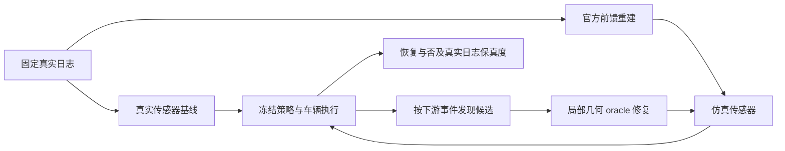

# 以仿真退化为起点的发现协议

> 历史报告 / 计划：保留当时观察与结论；当前状态见 [RESEARCH_STATUS](../../../RESEARCH_STATUS.md)，归档导航见 [README](README.md)。

研究准入改为：**自然重建错误使仿真相对真实日志变差，局部几何 oracle 修复能使下游恢复。** 单独的 Early、Miss、Chamfer、深度误差或点云密度不能支持立项。仿真输出发生变化也不自动等于仿真价值下降。

## 当前案例判级

| 案例 | 用途 | 当前决定 |
|---|---|---|
| scene-0520 四模型 Early | 几何诊断资产 | 无下游退化证明，不围绕它扩实验 |
| 公交车 82/84 Early | 反例 | 轨迹改变但 ADE 改善，不能作为危害动机 |
| scene-0061 路锥总体接触 | 覆盖与评测边界对照 | 大部分可由观测范围解释，不推动局部重建方法 |
| 两个 Pi3X 全缺失恢复后残余 | 有限因果审计已完成 | 六图右区传感器恢复不在十二图重复；实际路面网格修复均未消除接触，不晋级主方法动机 |

## 有限的下一步

从已冻结日志的下游结果发现事件，保留全分母，不按几何误差排序。第一版用离散事件：新增接触；最小间距减少超过 0.5 m；执行终点相对真实传感器基线移动超过 1 m；明显新增制动或停止。终点变化须同时报告相对真实行驶轨迹的误差是否变差。TTC、感知翻转和占用翻转只有在相应真实模块和可靠参考接通后才计入，不能用点云代理冒充。

目标是找到 3–5 个可解释的强案例，而不是必须凑够 3–5 个。每个案例都要回答：下游错在哪里、几何错在哪里、局部修复是否恢复，以及能否在另一场景或模型复现。

两个 Pi3X 残余已完成一次 23 项的 CPU 定位批次。固定前方车道、左右相邻区域、近后方四个空间区域，以及区域外的非局部对照。分别做局部恢复和仅保留该区域误差，全部先补回缺失回波。区域规则在运行前登记，批次内没有根据结果反复细切。

这一步只修改模拟 LiDAR 回波，属于**传感器层定位**。随后对六图右区恢复信号追加了 7 项真实网格干预：有实测支撑的普通路面平面修复、同面删除和基线。两种输入均未恢复。当前关闭这个受支持路面子命题，不再细切残余；该控制没有修复所有演员和非平面结构，不能外推为全部右区几何均无因果影响。完整结果见 [Pi3X 因果审计](WORLDSIM_SIMULATION_PI3X_CAUSAL_AUDIT.md)。

## 晋级与停止

- 同时报告原资产、局部几何修复、无关区域修复和真实传感器基线；其他传感器、标定、策略、控制器和输入覆盖保持相同。
- 恢复应体现在真实日志保真度、可靠的间距或行为上。距路锥只有约 1.6 cm 的名义安全基线，即使发生接触翻转，也不能据此声称严重安全危害。
- 新来源确认使用冻结后的失败定义。已曝光日志的补证不改名为独立确认。
- 若普通尺度、覆盖、读出或标定控制解释差距，就关闭相应重建立论。若局部几何修复不恢复下游，就不为该候选训练新方法。
- 真正留下的错误族可以是可行驶空间被侵占、演员范围或距离偏差、遮挡关系、道路/路缘几何或缺少支撑；不预设必须是 first-return。

SplatAD 原生 RGB＋LiDAR 已完成两次实际 4 秒反馈闭环及模态对照，完整拟合版本仍在推进，见 [原生闭环试跑](WORLDSIM_SIMULATION_NATIVE_CLOSED_LOOP_PILOT.md)。目前只替换 RGB 可重现主要退化，LiDAR 单独替换影响小；RGB 通道仍可能包含几何、外观和时刻差异，不能直接给机制定性。整体目标保持 active；尚未确认可支持主方法的因果坏例。
