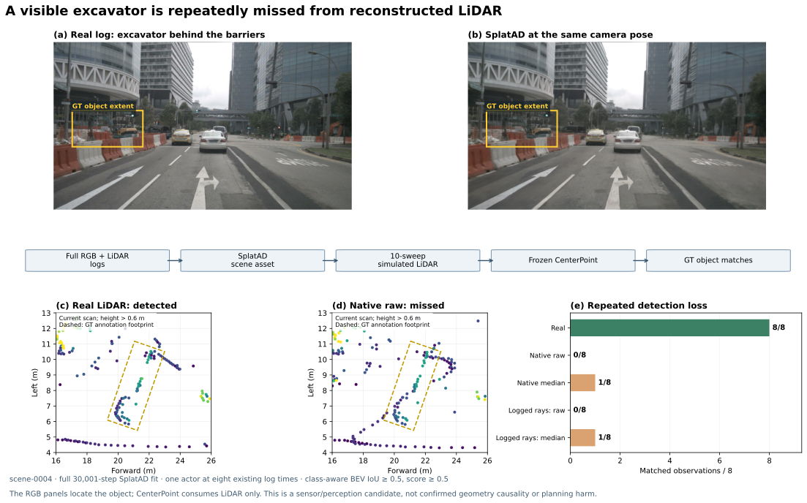
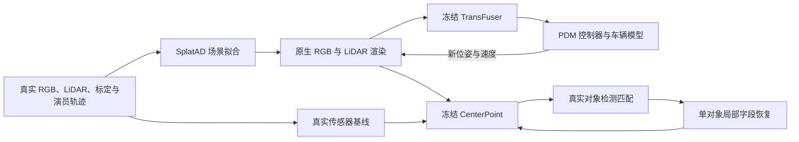
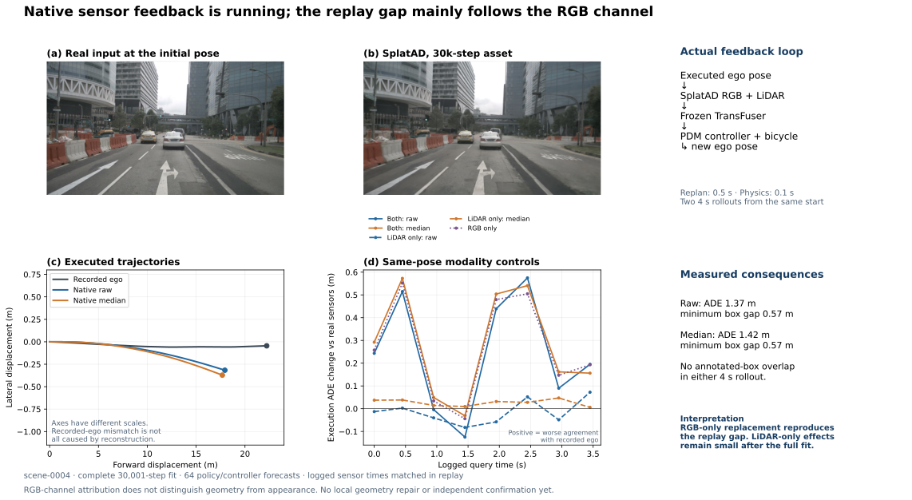
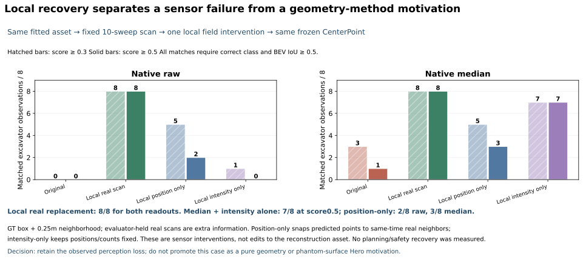
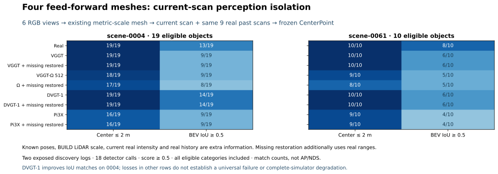

# 完整仿真与局部恢复：感知退化已确认，几何主因尚未成立

> 历史报告 / 计划：保留当时观察与结论；当前状态见 [RESEARCH_STATUS](../../../RESEARCH_STATUS.md)，归档导航见 [README](README.md)。

本轮找到一个稳定的**仿真传感器→感知退化**案例：路侧挖掘机在真实 LiDAR 下连续 8 次检出，在完整拟合的 SplatAD raw／median 扫描下仅为 0／8、1／8。替换它附近的真实扫描后，两者都恢复为 8／8。但 median **只恢复反射强度、不移动点**，也能达到 7／8，因此目前不能将它晋级为几何修复方法的主要动机。

另一方面，完整预算的 RGB＋LiDAR 反馈闭环再次显示：当前场景的 LiDAR 单独替换影响小，两次闭环均无新增标注框交叠。四个前馈模型的两日志检测对照也出现正、负结果，**不支持“VGGT 及升级 SOTA 普遍因 phantom 导致严重仿真问题”**。保留实测反例，继续按下游事件发现、局部资产修复和独立确认来推进。

## 实际运行了什么

SplatAD 使用官方实现，已完成 **30,001 次优化迭代（第 0–30,000 步）**，最终资产约 500 万个高斯。完整场景 RGB、LiDAR、度量标定和演员轨迹都参与该参照；它是额外信息的场景拟合，不是前馈重建的同预算优势，也不是新 Hero 模型训练。[官方实现](https://github.com/georghess/neurad-studio)

本轮完成：

| 执行项 | 完成量 | 用途 |
|---|---:|---|
| 完整预算留出评价 | 194 帧 LiDAR、678 张相机图像 | 原生传感器质量与输入接口 |
| 同位姿模态对照 | 8 时刻 × 6 输入组合 | 区分 RGB／LiDAR 通道 |
| 新位姿反馈闭环 | raw、median 各 4 秒 | 0.5 秒重规划、0.1 秒物理步长 |
| 上述策略／PDM 预测 | 64 组 | 同位姿 48 组＋反馈中 16 组 |
| 原生检测及传感器控制 | 64 次 CenterPoint | 真实、原生、统一强度、真实射线排列 |
| 工程车局部恢复 | 48 次 CenterPoint | 两读出 × 三操作 × 八时刻 |
| 四前馈模型有限对照 | 18 次 CenterPoint | 两日志，固定九帧真实历史 |

本轮共 **130 次 CenterPoint 前向**，与策略次数分开计数。检测扫描生成分别使用固定初始排列和逐次日志排列，各实际渲染 78 个不同 LiDAR 时刻。没有重跑已完成的 72 次四模型几何前向。

## 完整预算闭环：仍不能把轨迹差距归为几何危害

同位姿比较现在匹配每个真实传感器自己的采样时间和位姿；真实 LiDAR 转换到前相机时刻的 ego 坐标。实际反馈分支仍按车辆执行状态同步查询传感器，不读取未来真实距离或有效返回掩码。与 8k 试跑相比，拟合预算和 replay 时序处理同时改变，不能将两轮差值单独归于拟合。

| 输入替换 | 平均执行 ADE 增量（m） | 最大执行终点变化（m） |
|---|---:|---:|
| 仅 LiDAR，raw | −0.014 | 0.250 |
| 仅 LiDAR，median | +0.026 | 0.241 |
| 仅 RGB | +0.265 | 1.738 |
| RGB＋LiDAR，raw | +0.241 | 1.745 |
| RGB＋LiDAR，median | +0.281 | 1.807 |

正的 ADE 增量表示与真实行驶轨迹的偏差增加。主要平均差距仍通过 RGB 通道传递；这不区分视觉几何、外观或其他图像因素。策略非线性，不能相减后声称各通道贡献可加。

| 实际反馈闭环 | ADE（m） | 终点误差（m） | 最小标注框间距（m） | 41 个状态中框交叠 |
|---|---:|---:|---:|---|
| Raw | 1.369 | 4.292 | +0.565 | 无 |
| Median | 1.423 | 4.555 | +0.570 | 无 |

真实输入的初始策略／车辆预测本身已有约 3.067 m 终点误差，不能把闭环的全部 4–5 m 偏差算作重建危害。评价采用日志演员框、非反应式交通参与者；尚未评价完整静态碰撞、at-fault 或闭环 PDM 总分。

全留出图像逐帧平均 PSNR 为 26.70 dB。raw／median 的逐帧距离绝对误差中位数再平均为 0.071／0.113 m，而逐帧 MAE 再平均为 0.793／0.819 m，仍存在长尾；这些不是合并全部点后的分位数。592 万个官方有效射线位置中，真实返回 492 万、预测返回 498 万；误丢弃 193,860、误返回 253,871。它们是传感器诊断，不能单独表示仿真危害。

## 原生数据集检测：稳定漏检，不靠弱跨域基线

前一轮 TransFuser 自带车辆头在真实 nuScenes 输入下仅匹配 5／31，因此这轮增加一个**冻结的、在 nuScenes 上训练的 CenterPoint**。采用 MMDetection3D v1.4.0 的 voxel0.1、circle-NMS 实现及 OpenMMLab 发布权重，所有 checkpoint 键和张量尺寸匹配；没有训练检测器，也没有把它称为新的几何 SOTA。[发布配置与权重](https://github.com/open-mmlab/mmdetection3d/blob/main/configs/centerpoint/metafile.yml)

输入为当前扫描加九帧因果历史，使用共同度量坐标、原始反射强度单位和以秒计的时间差。原生 voxelizer、范围过滤、网络和后处理保留。几何框转换使用官方 `output_to_nusc_box` 约定。所有真值仅用于评价／明确标记的 oracle 干预。

评价范围固定为前方 0–32 m、左右 16 m、至少 5 个当前真实 LiDAR 点；同时报告类别正确且中心误差 ≤2 m、BEV IoU ≥0.5 两种匹配，置信度 0.3／0.5 都保留。**153 次对象观测包含 32 次机动车观测，来自 5 个不同机动车实例**，主要其余对象为路障；这些不是 AP／NDS，也不是 32 个独立车辆案例。

| 输入（置信度 ≥0.5） | 机动车中心匹配／32 | 解释 |
|---|---:|---|
| 真实扫描 | 32 | 本发现窗口的基线可用 |
| 原生 raw | 16 | 存在明显感知退化 |
| 原生 median | 20 | 普通读出改变有所改善 |
| 逐次真实射线排列，raw | 17 | 排列变化没有消除差距 |
| 逐次真实射线排列，median | 21 | 排列变化没有消除差距 |
| 统一强度 13，真实扫描 | 19 | 该控制也会损伤基线 |
| 统一强度 13，raw／median | 10／10 | 不能由此证明几何主因 |

SplatAD 输出强度乘以 255，匹配官方解析器的反射强度归一化约定。全局量级检查未发现单位错误；当前点云最近邻距离中位数约 0.08–0.15 m，未见整体坐标错位，但不能据此排除局部形状偏差。逐次日志射线方向／有效性属于额外观测诊断，不是可以在偏离日志后继续读取的真实传感器模式。

`scene-0004` 属于 nuScenes **train**，这些结果仅作发现；没有把训练日志冒称独立泛化确认。CenterPoint 十帧 LiDAR与 TransFuser 单帧 LiDAR＋RGB 输入预算不同，二者不排名。

## 工程车局部恢复：强度提供了重要的替代解释

候选是图中路侧护栏后的挖掘机，实例 `acb7920a70b44a84b1a61ce6460483cb`。八个既有时刻中，真实扫描 8／8 匹配、raw 0／8、median 1／8；逐次真实射线排列仍为 0／8、1／8。它是真实的重复感知退化，不能仅由图像框和点云误差替代。

只进行一轮预先固定的局部操作：GT 定向框向各方向扩张 0.25 m，包含该对象附近区域；保留其他点，八时刻、两读出全部报告，不扫框大小。对象点数量并未消失：初始真实框内当前回波为 59 个，raw 为 55、median 为 67；第六时刻为 218、220、237。

| 工程车匹配（类别正确、IoU ≥0.5、分数 ≥0.5） | Raw／8 | Median／8 |
|---|---:|---:|
| 原生扫描 | 0 | 1 |
| 局部完整真实扫描替换 | 8 | 8 |
| 只恢复局部点位置 | 2 | 3 |
| 只恢复局部反射强度 | 0 | 7 |

完整替换共同改变位置、强度、点数与点顺序。位置恢复将预测点吸附到同一扫描时刻的真实近邻，保留预测强度和数量，允许多对一对应；它不是完整真实表面的精确恢复。强度恢复保留点位置、数量、时序和顺序，只拷贝同一扫描时刻的真实近邻强度。所有操作使用额外真值，均不属于同预算方法改进。

因此，**检测问题已经定位到工程车邻域的传感器输出，但尚未定位为纯几何错误**。median 下强度恢复足以解释七次恢复；raw 的位置／强度交互仍未完整解释。有限位置操作失败也不证明所有几何修复都无效。此轮不再通过更小区域或更多阈值追最后一次残余，不把它转写为 first-return／phantom 动机。

这些是**传感器数组干预**，尚未修改重建资产并重新渲染，也没有测得规划或安全恢复。即便局部检测 8／8 恢复，仍不满足用户要求的完整几何因果链。

## 四个前馈模型：保留跨日志正、负结果

复用已完成的 VGGT、VGGT-Ω 原始 512 checkpoint、DVGT-1、Pi3X 六视图资产，仅选择已有完整历史数据的两个已曝光日志 0004／0061，各一个初始查询。保持九帧真实历史、当前真实强度和普通 BUILD 全局尺度；替换当前帧的网格首交扫描，并另报告缺失回波恢复。已有真实扫描到原始 LiDAR 坐标的逐点最大差低于 `3e-13 m`，确认射线顺序对应后才附加强度。

这是一轮 **18 次检测的当前帧隔离测试**，会被真实历史缓冲；不等于完整前馈仿真系统，也不能用未观察到漏检推断模型在全部重建历史下无问题。两日志均为 train／已曝光发现资料。

| 完整重建当前扫描，置信度 ≥0.5 | 0004：中心／IoU 匹配（分母19） | 0061：中心／IoU 匹配（分母10） |
|---|---:|---:|
| 真实 | 19／13 | 10／8 |
| VGGT | 19／9 | 10／6 |
| VGGT-Ω 512 | 18／9 | 9／5 |
| DVGT-1 | 19／14 | 10／6 |
| Pi3X | 16／9 | 9／4 |

DVGT-1 在 0004 的 IoU 匹配超过真实基线，不删掉。恢复缺失束并不自动恢复框匹配；Ω 有的匹配反而下降，说明传感器—检测器作用非线性。低至 0.3 的固定阈值下，0004 的 Ω 车辆和 Pi3X 行人仍有真实基线存在、重建输入缺失的中心匹配，作为后续有针对性的候选；它们尚非时间重复或独立场景确认。

## 当前决定与复现入口

本轮完成一项有意义的发现和一次必要的否定：**仿真外观可用、局部点数接近真实时，感知仍可重复退化；但真实强度恢复能解释主要恢复，所以不应预先把原因写成几何。** 不继续扩工程车诊断，不启动第二个 SplatAD 场景拟合。下一步只保留四模型检测中明确的车辆／行人候选，先复核真实支持和测量边界，再判断是否值得做实际局部资产修复。

论文仍缺：可重复的前馈几何错误、局部重建资产修改后的下游恢复，以及新日志的独立确认。当前四张图是可复审的发现／控制图，不是已通过准入的 Hero 主结果。Early、Miss、Chamfer 等继续仅作机制诊断。

任务为 `WS-SIM-NATIVE-CLOSEDLOOP-01`、`WS-SIM-NATIVE-DETECTOR-01`、`WS-SIM-NATIVE-DETECTOR-LOCAL-01`、`WS-SIM-FF-PERCEPTION-01`；统一种子 `20260915`。完整预算运行 `scene0004-step030000-full1`；检测与局部控制的逐帧输出、实际脚本副本、配置、权重来源和原始失败日志均保存。

- [数值汇总](../../../autoresearch/worldsim_simimpact/milestone6/aggregate.json)。四张图均提供同名 PNG／PDF／SVG。
- 远端完整预算：`/root/autodl-tmp/runs/worldsim_simimpact/WS-SIM-NATIVE-LIDAR-01/20260915-r1`。
- 远端检测和局部恢复：`/root/autodl-tmp/runs/worldsim_simimpact/WS-SIM-NATIVE-DETECTOR-01/20260915-r1`。
- 远端前馈对照：`/root/autodl-tmp/runs/worldsim_simimpact/WS-SIM-FF-PERCEPTION-01/20260915-r1`。
- 官方代码版本：SplatAD/NeuRAD Studio `8ba9b511`，SplatAD CUDA `6e31ad76`，NAVSIM `ca0ca7e4`，MMDetection3D v1.4.0 `fe25f7a5`。

单 RTX 3090，cgroup 配额 14 CPU、90 GiB RAM。未训练新的重建／策略／检测器；完成的是已授权的 SplatAD 场景拟合。累计 18 次 HUGSIM/LTF 闭环＋4 次 SplatAD 实际反馈闭环、72 次几何前向、802 次策略／PDM 预测，另有 130 次 CenterPoint。`failure_ledger_delta=V74-H2-F19`，人工 verdict 为 null，整体目标 active。
