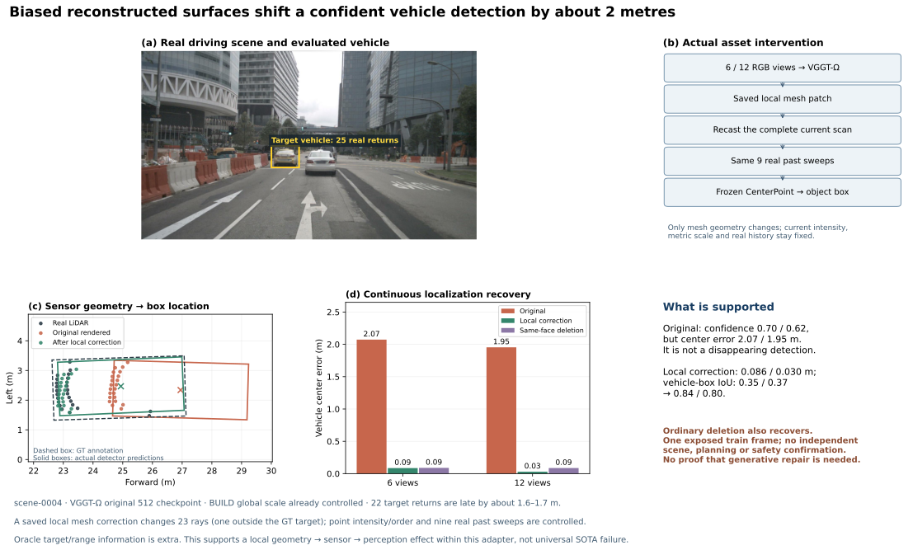
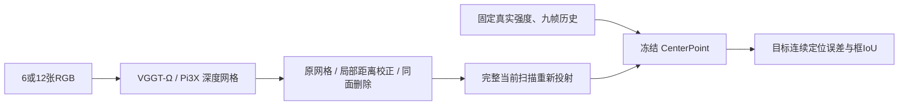

# 局部网格→仿真 LiDAR→车辆定位：有限因果证据与删除对照

> 历史报告 / 计划：保留当时观察与结论；当前状态见 [RESEARCH_STATUS](../../../RESEARCH_STATUS.md)，归档导航见 [README](README.md)。

**这次实际修改了前馈模型的网格资产，再重新投射完整当前扫描。** VGGT-Ω 的车辆定位误差从六／十二图条件下的 **2.073／1.954 m** 降到 **0.086／0.030 m**。车辆框 IoU 从 0.347／0.370 提升到 0.836／0.804；输入强度、时间、九帧真实历史及网格全局尺度保持不变。

这支持一个明确但有限的结论：在当前传感器适配与冻结检测器中，**车辆邻域的重建几何偏差确实造成了定位退化**。不过，同区域表面删除也能恢复；它没有通过预先规定的“超出删除控制”主方法准入条件。当前不是普遍 SOTA 失败、独立泛化或闭环危害的证明。

## 因果链与输入范围

只检查上一轮预先选出的两个下游候选：0004 的 Ω 车辆、Pi3X 行人。选择依据是它们在置信度 0.3 的中心匹配中，真实输入存在匹配、六图重建及缺失恢复条件均失配；先固定候选，再检查几何。两种输入预算评价的是**同一日志、同一时刻**，不是独立重复。

所有资产此前已做普通 BUILD LiDAR 全局尺度控制，并使用已知标定。当前扫描使用真实测量射线方向；九帧真实历史与当前真实强度在条件间共享。原本缺失的当前回波在所有条件中同样用真实返回补齐，编辑后新产生的缺失不补回。该设置隔离当前几何作用，也允许真实历史在删除错误当前点后接管检测，不是完整前馈传感器闭环或同信息预算优势。

## 实际资产编辑

对落入 GT 对象框的真实回波，先取原网格的首交位置。选择距这些首交点不超过 **0.35 m** 的网格顶点，以目标有效返回的 `median(GT距离−预测距离)` 作为一个径向修正量，修改并保存完整顶点数组，保留三角形连接。另保存删除所有接触相同顶点的三角面的控制资产。随后对完整当前扫描重新 raycast，检测器从未直接读取目标真值距离。

局部选择和偏差求解使用额外评价真值，这是普通 oracle 控制，不是新学习方法。没有扫半径、挑射线误差尾部或训练新的模型。

| Ω 车辆 | 六图 | 十二图 |
|---|---:|---:|
| 真实对象回波／原网格有效返回 | 25／22 | 25／22 |
| 原目标返回距离 MAE | 1.735 m | 1.628 m |
| 修改的顶点／接触三角面 | 834／1,792 | 845／1,821 |
| 局部径向修正量 | −1.743 m | −1.604 m |
| 校正后的目标距离 MAE | 0.116 m | 0.092 m |
| 改变的完整扫描回波 | 23 | 23 |
| 其中 GT 目标框外的回波 | 1 | 1 |

校正保留全部 22 个目标有效返回，没有新增缺失；删除则去掉这 22 个目标返回及一个框外返回。四个校正输入均核对了强度／时间数组和历史扫描**逐元素相同**，当前射线顺序保持一致。Omega 每个条件只改变 23 个当前点位置；Pi3X 为 50／48 个，包含 23／22 个目标框外回波，因此只能归因为所选局部网格邻域，不宣称每个改变都来自对象本体。

第一份输入准备曾把有效点和恢复点分组排列；在任何检测推理前修正为原始射线顺序，仅 r2 输入实际参与本轮检测。几何协议没有改变，两份准备结果均保留。

## Ω：高置信度车辆被放错位置，局部几何修改能恢复

此前的“漏检”是**中心匹配阈值失配**，不能理解为检测器完全没有输出车辆。六图／十二图原预测置信度仍为 0.696／0.624，中心误差分别在 2 m 匹配阈值的两侧；连续误差和框 IoU 更准确地描述问题。

| 资产条件 | 六图中心误差／IoU | 十二图中心误差／IoU |
|---|---:|---:|
| 原网格 | 2.073 m／0.347 | 1.954 m／0.370 |
| 局部径向校正 | 0.086 m／0.836 | 0.030 m／0.804 |
| 相同三角面删除 | 0.089 m／0.874 | 0.086 m／0.814 |

两个预算下，局部校正和删除均恢复置信度 ≥0.5、类别正确且 IoU ≥0.5 的匹配。原网格把真实车辆返回系统性放在约 1.6–1.7 m 之后，使检测器以较高置信度把车辆框放远；校正或去掉这些错误几何后，真实历史支持了正确定位。

**几何造成局部感知退化的因果解释获得支持，但“必须生成／补全几何才能恢复”没有获得支持。** 删除控制不是失败结果；它解释了普通方法可以做到什么，也限制了新方法的必要性。本例是 late surface／actor distance bias，不能改名为 phantom 或 early-return 危害。

## Pi3X：距离改善仍不保证检测恢复

行人有 31 个真实回波，覆盖约 1.54 m 身高范围，均投影到左前相机。六／十二图原有效返回中位偏前约 0.664／0.708 m。局部校正后目标距离 MAE 从 0.642／0.673 m 降到 0.245／0.203 m。

- 六图：校正和删除都没有恢复该行人的中心匹配，0.3／0.5 阈值均如此。
- 十二图：原本已有中心匹配，中心误差 0.838 m、置信度 0.642，但 IoU 为 0；校正后中心误差减至 0.314 m，置信度却降至 0.328，IoU 仅 0.270；0.5 阈值下匹配丢失。
- 十二图删除：该目标中心匹配也丢失。

因此关闭“这一局部径向偏差校正可稳定恢复 Pi3X 行人感知”的子命题，不再细调该区域。它不否定所有几何操作，但再次说明几何指标改善不自动等于下游改善。

## 推进判定

新增 **10 次 CenterPoint**：复用六图基线，新增两个十二图基线以及两目标 × 两预算 × 两种资产编辑。没有新增几何模型前向、策略或闭环执行。累计 CenterPoint 为 **140 次**；其他累计保持为 72 次几何前向、802 次策略／PDM、18 次 HUGSIM/LTF＋4 次 SplatAD 反馈闭环。

Ω 保留为一个**局部几何→传感器→感知定位**的因果发现，且普通删除即可恢复；Pi3X 的这次局部偏差修复路线收口。两者都未通过预注册的主方法准入，不继续在同一时刻扫参。要形成论文主结果，仍需新日志或新时刻确认、原生完整传感器条件，以及实际规划／仿真价值的增量；不能从一帧车辆定位推导 collision 或 false-safe。

任务 `WS-SIM-FF-LOCAL-ASSET-01`，输入与检测运行均为 r2；种子 `20260915`。证据位于远端 `/root/autodl-tmp/runs/worldsim_simimpact/WS-SIM-FF-PERCEPTION-01/20260915-r1/local_asset_evidence_r2`，完整修改资产保存在 `local_asset_inputs_r2`。人工 verdict 为 null；`failure_ledger_delta=V74-H2-F20`；整体目标 active。

[目标数值](../../../autoresearch/worldsim_simimpact/milestone7/evidence/target_results.json) · [上一轮完整预算与传感器控制](WORLDSIM_SIMULATION_FULL_BUDGET_PERCEPTION.md)
